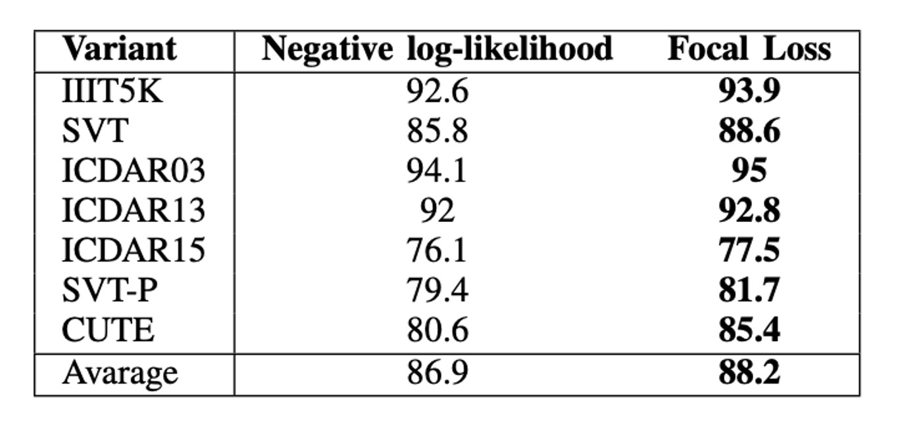

## 來點 Focal Loss 吧！

[**SAFL: A Self-Attention Scene Text Recognizer with Focal Loss**](https://arxiv.org/abs/2201.00132)

---

最近愈來愈多 Transformer 的架構出現在 STR 的領域。

做研究總是得找點樂子，這次作者把 Focal Loss 拿來試試看，看看能不能提升模型的效果。

## 定義問題

最常見的訓練方式大致上分兩種。

第一種是 CTC Loss，這種方式是直接將模型的輸出與標籤進行比對，並計算兩者之間的差異。它可以讓我們不需要對標籤進行對齊，直接給定輸出序列，讓模型自己去學習如何對齊，最後得到結果。

第二種是 CrossEntropy Loss，要使用這種損失函數，通常是使用一個解碼器的架構來對齊輸出與標籤。解碼器的選擇可以是一個 LSTM，或是一個 Transformer。

既然有了 CrossEntropy Loss，嘗試其他的損失函數就是一個很自然的想法。我們可以看一下隔壁的物件偵測領域，Focus Loss 好像蠻流行的，不妨就拿來試試看吧！

於是作者提出了 SAFL，一個使用 Focal Loss 作為損失函數的 STR 模型。

## 解決問題

### 模型架構

<figure style={{"width": "85%"}}>

</figure>

這次的架構很簡單，大部分的內容我們之前都看過了。

首先是一個校正網路，這個部分請參考：

- [**[16.03] RARE: 全自動校正**](../1603-rare/index.md)。

接著是一個特徵提取網路，再搭配一個 Transformer 架構，這個部分可以參考：

- [**[19.10] SATRN: Transformer 抵達戰場**](../1910-satrn/index.md)。

作者在最後把 CrossEntropy Loss 換成了 Focal Loss。

為什麼要換成 Focal Loss 呢？

### Focal Loss

<figure style={{"width": "85%"}}>

</figure>

作者針對訓練資料的詞彙分佈進行了分析，發現有些詞彙出現的頻率非常高，而有些詞彙出現的頻率非常低。這樣的分佈會導致 CrossEntropy Loss 的效果不佳，因為它會對高頻詞彙的預測結果更加敏感，低頻詞彙的預測結果則會被忽略。

而 Focal Loss 則是一種可以減緩這個問題的損失函數，其公式如下：

$$
\text{FL}(p_t) = -(1 - p_t)^\gamma \log(p_t)
$$

其中 $p_t$ 是模型預測的機率，$\gamma$ 是一個超參數，通常設定為 2。這個公式的意義是，當 $p_t$ 越接近 1 時，損失函數的值會越小。這樣一來，模型就會更加專注於那些預測錯誤的樣本，而不是那些預測正確的樣本。

這篇論文我們之前也讀過了，可以參考這篇：

- [**[17.08] RetinaNet: Focal Loss 才是本體**](../../object-detection/1708-retinanet/index.md)。

## 討論

### Focus Loss 效果好嗎？

<figure style={{"width": "80%"}}>

</figure>

如上表，使用 Focal Loss 的模型在所有數據集上都優於使用 CrossEntropy Loss 的模型。

在平均值上，Focal Loss 將準確率提高了 2.3%。在最好的情況下，即 CUTE 數據集上，兩種變體之間的性能差距為 4.8%。

## 結論

在這篇論文中，作者利用自注意機制和 Focal Loss 的場景文本辨識深度學習模型。

實驗結果表明，SAFL 在常規數據集和不規則數據集上均取得了最高的平均準確率。

:::tip
如果你也在做 STR 的研究，不妨試試看 Focal Loss，或許會有意想不到的效果！
:::
