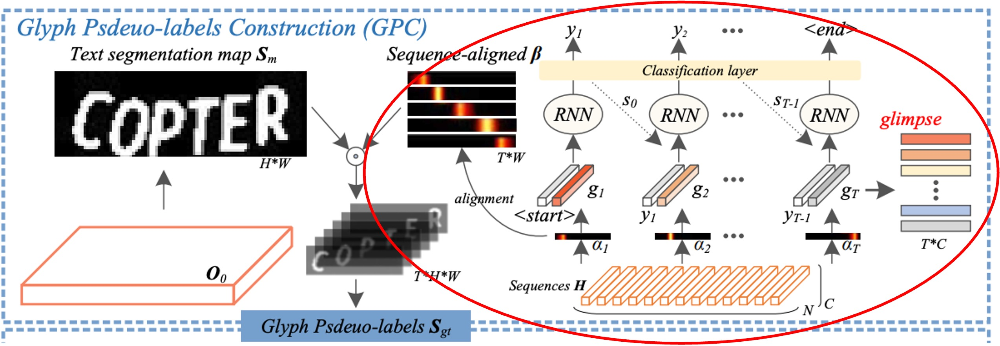
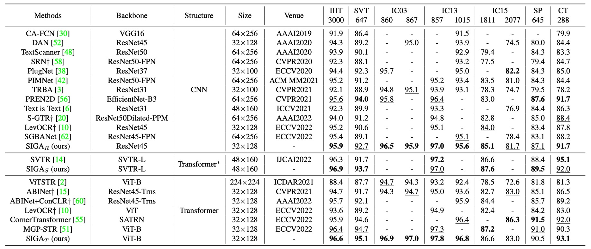
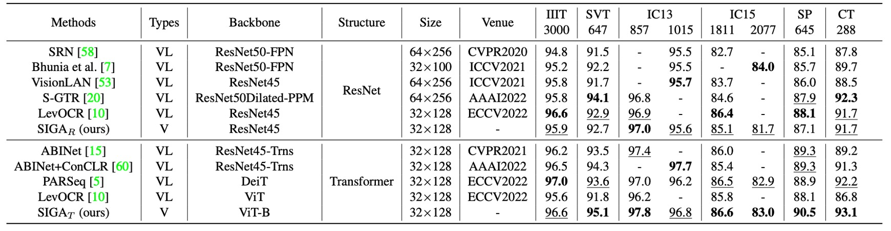

# [22.03] SIGA

## 字形注意力機制

[**Self-supervised Implicit Glyph Attention for Text Recognition**](https://arxiv.org/abs/2203.03382)

---

儘管引入語言模型已經是這個領域的主流手法，但還是有人願意另闢蹊徑來改善 STR 的問題。

在這篇論文中，作者嘗試對「字形」進行一系列的研究，並得到相當不錯的結果。

## 定義問題

關於 STR 的論文，我們也看過好幾篇了。

過去的研究中，注意力的方法大致上分為兩類：

1. **隱式注意力 (Implicit Attention)**：指透過序列層級的文字標注，對一維或二維空間的所有位置進行注意力權重計算。這種方法的缺點是可能會出現對齊漂移的問題。
2. **監督式注意力 (Supervised Attention)**：利用字元邊框標注來生成字元分割圖。這種方法的缺點是需要大量字元層級的標注資料，且在面對大型字元類別時較耗記憶體。

怎麼好像都不太好？

於是作者決定從「字形」的角度來思考這個問題。每個字元都有自己的字形，而字形之間的關係也是有規律可循的。如果能夠利用這些規律，或許能夠更好地找到文字的特徵。

基於這個想法，作者提出了「自我監督的隱式字形注意力 (Self-Supervised Implicit Glyph Attention, SIGA)」。這種方法可以透過自我監督的文本分割與隱式注意力對齊，生成字形結構，並在訓練過程中提升注意力的準確性。

意思就是在上面兩個解題方向中，作者選了第一個，也就是隱式注意力，並且在這個基礎上加入了一些自我監督的機制。

具體是怎麼做的呢？我們接著看下去。

## 解決問題

### 模型架構

上圖就是 SIGA 的模型架構。

整個架構圖有點複雜，我們把它拆解成幾個部分來看。

### Backbone

這大概是最沒有問題的部分了，這裡可以使用了 ResNet 或 ViT 作為特徵提取器。

輸入影像經過特徵提取器後，會得到一個特徵圖，這個特徵圖會分別送入後續的分支中。

### 字形虛擬標籤構建

<figure style={{"width": "80%"}}>

</figure>

原文為 Glyph Pseudo-label Construction (GPC)，這個部分是 SIGA 的核心。

這邊首先做的是自我監督的文字分割，我們用紅框標示的部分。

作者直接從文本影像的內部結構進行 K-means 聚類，直接得到文字遮罩的虛擬標籤，這樣做的好處是可以跳過耗時的像素級標注。

:::tip
**不會有精度不足的問題嗎？**

作者提到，字形的形態結構並不會受到輕微結構變化影響，所以不準確也沒關係，不礙事。
:::

聚類算法可以直接設定分兩類，分為前景和背景。根據作者實驗顯示，大多數的文本影像中都可以良好地聚類出字形的形態結構。

隨後，作者透過文字分割網絡，從自我監督的分割結果中提取文字前景特徵。

在上圖沒有畫清楚，這裡作者直接寫在論文中，具體做法是將 ResNet 模型中 Conv 0、Block 0 和 Block 1 的輸出分別定義為 $P_0$、$P_1$ 和 $P_2$，並應用自上而下的金字塔結構來整合特徵：

$$
\begin{cases}
O_2 = \phi(P_2), \\
O_1 = \phi([T(O_2, s_1), P_1]), \\
O_0 = \phi([T(O_1, s_0), P_0]),
\end{cases}
$$

其中 $\phi(\cdot)$ 表示包含批量正則化（BatchNorm）和 ReLU 激活函數的兩層卷積，$T(\cdot)$ 表示一個對 $O_k$ 進行 2 倍上采樣的操作，$s_k$ 為其分辨率（即$H_k \times W_k$），而 $[\cdot]$ 表示沿通道軸的串接操作。

:::tip
根據這段敘述，可以推斷這是個 U-Net like 的結構，透過上採樣和特徵串接來整合特徵。
:::

最後，利用二元分類卷積層將 $O_0$ 生成文字分割遮罩 $S_m$。

作者通過二元交叉熵損失 $L_{ins}$ 將 $S_m$ 與虛擬標籤 $S_{pl}$ 匹配，以優化文字分割網絡，使其在具挑戰性的文本影像中能夠辨識字形的形態結構。

這裡的結果做起來像這樣：

<figure style={{"width": "80%"}}>

</figure>

其中 (a) 是原圖，(b) 是聚類得到的虛擬標籤，(c) 是文字分割網絡的預測結果。

我們可以看到有些地方的分割網路的預測結果比虛擬標籤還要好！

### 隱式注意力對齊

<figure style={{"width": "80%"}}>

</figure>

還是同一張圖，但這次是另外一個部分：注意力對齊，我們同樣用紅框標示。

在解碼單元中，隱式注意力權重 $\alpha = \{\alpha_t\}_{t=1,...,T}$ 用於捕捉編碼序列中重要的字元依賴關係。

但解碼器的時間信息在後續解碼步驟中容易被「其他信息所干擾」，導致對齊漂移的問題。

為了解決這一問題，作者施加了一種「正交約束」，確保隱式注意力的每個權重向量能對應並專注於某一個字元的位置，且不同字元的注意力權重彼此不干擾，從而提高字元位置對齊的準確性。

該方法的步驟如下：

1. **計算相關係數 $S_{cor}$**：

   作者計算了每個字元注意力向量 $\alpha_t$ 之間的相關係數。透過讓不同字元的注意力向量保持正交（即彼此垂直，相關係數為零），來確保每個注意力向量 $\alpha_t$ 專注於當前步驟對應的字元，而不會被其他步驟的字元位置影響。

   舉例來說，假設我們有一個包含 3 個字元的影像，則會有 3 個注意力向量 $\alpha_1, \alpha_2, \alpha_3$。正交約束會讓 $\alpha_1$ 只專注於第 1 個字元，$\alpha_2$ 專注於第 2 個字元，而兩者的相關係數趨於零，避免 $\alpha_1$ 與 $\alpha_2$ 的影響範圍重疊。

2. **生成字元顯著性圖 $S_{sal}$**：

   接下來，作者從每個注意力向量 $\alpha_t$ 生成對應的字元顯著性圖。透過一維線性插值（$\xi$函數）將每個 $\alpha_t$ 的分佈映射到更適合影像的寬度 $W$ 上，得到 $\beta_t$，並使用一個非線性激活函數 $\sigma$ 將其映射到 $[0,1]$ 的範圍內。這樣處理後，$\beta_t$ 變成一個更精準的注意力分佈，對應於字元的位置。

   假設我們有一個寬度為 10 的影像，注意力向量 $\alpha_t$ 經過插值轉換為 $\beta_t$ 後，會在影像上產生對應字元的位置權重，例如對應於影像寬度上第 3 到第 5 個像素的區域，表示模型認為該字元位於此範圍。

3. **優化損失函數 $L_{seq}$**：

   - **$L_{cor}$**：這項損失反映了相關係數 $S_{cor}$，通過最小化 $L_{cor}$，使得不同字元之間的注意力向量保持正交，避免對齊漂移。
   - **$L_{dif}$**：這項損失度量了 $S_m$（真實字元遮罩）和 $S_{sal}$（生成的字元顯著性圖）之間的差異。$L_{dif}$ 的最小化使得模型生成的字元位置顯著性更接近真實字元的位置，達到對齊效果。

   比方說，如果第 2 個字元的真實遮罩位於影像寬度的第 5 到第 8 像素之間，$S_{sal}$的對應位置也應該重疊在這個範圍上。透過最小化$L_{dif}$，模型會自動調整注意力，使其生成的字元位置更精確地對應到真實位置。

### 字形虛擬標籤構建

<figure style={{"width": "80%"}}>

</figure>

如上圖展示，將對齊後的注意力權重 $\beta_t$ 與文字分割遮罩 $S_m$ 進行內積運算，以生成對應字元的字形特徵。此運算的目的在於根據每個字元的注意力位置，將分割遮罩中的前景區域（即字元的形狀）映射到字形虛擬標籤 $S_{gt}$ 中。

假設 $S_{gt}$ 為字形虛擬標籤，透過下述串接操作構建 $S_{gt}$：

$$
S_{gt} = [1 - S_m, 1[\beta_1 > \delta] \cdot S_m, ..., 1[\beta_T > \delta] \cdot S_m]
$$

其中：

- $1 - S_m$ 表示將 $S_m$ 中的背景區域標示出來。
- $1[\beta_t > \delta] \cdot S_m$ 用來選取出字元的前景區域，並根據每個注意力權重 $\beta_t$（只保留大於閾值 $\delta$ 的部分）來確定字元的位置。
- $[ \cdot ]$ 表示沿通道軸進行串接操作，因此 $S_{gt}$ 包含了多個通道，每個通道對應於文本中的不同字元位置。

:::tip
在論文中這部分的數學式是：`\mathbb{1}`，如下圖，但是我們用的這個套件不支援，就算改用 `\mathbbm{1}` 也沒辦法。所以最後只好用 `1` 來表示。

<figure style={{"width": "70%"}}>

</figure>

:::

在實驗中，閾值 $\delta$ 設為 0.05。這表示當 $\beta_t$ 中元素的值超過 0.05 時，該字元位置被視為前景並保留到 $S_{gt}$ 中。這樣的設計有助於濾除低置信度的像素，保留高置信度的字元區域，從而提升虛擬標籤的準確性。

在測試階段，該字形虛擬標籤構建模組會被移除，表示在測試時，模型將不依賴字形虛擬標籤的生成，而是直接根據已訓練的權重進行預測。

### 字形注意力網路

<figure style={{"width": "80%"}}>

</figure>

原文為 Glyph Attention Network (GLAN)。

還記得剛才上面提到的數學式的部分嗎？

複習一下，這一段：

:::info
將 ResNet 模型中 Conv 0、Block 0 和 Block 1 的輸出分別定義為 $P_0$、$P_1$ 和 $P_2$，並應用自上而下的金字塔結構來整合特徵：

$$
\begin{cases}
O_2 = \phi(P_2), \\
O_1 = \phi([T(O_2, s_1), P_1]), \\
O_0 = \phi([T(O_1, s_0), P_0]),
\end{cases}
$$

:::

$O_0$ 的部分在上一節被拿去做「字形虛擬標籤」了。

現在要使用 $O_1$ 和 $O_2$ 來做「字形注意力網路（GLAN）」。

GLAN 生成的字形注意力圖是固定長度且與字元類別無關的通道，每個特定通道對應於特定順序的字形注意力。

這裡的做法是：透過數層卷積層的處理，將特徵 $O_k$ 被用來預測字形注意力圖 $S_{gam}$，其通道數設定為 $N_s = 1 + M$，而非字元類別數。其中 1 代表背景類別，$M$ 則代表文字影像中的最大字元數（例如設為 26）。

:::tip
以辨識包含 6763 字元的 GB2312 中文字元集為例子：

如果這裡使用相同的卷積層且特徵通道數為 256，監督式注意力方法的參數大小為 1.7M (256×6763)，而本篇論文的方法僅需 6.9K (256×27)。
:::

接著，透過構建的字形虛擬標籤 $S_{gt}$ 作為監督訊號，這裡採用多類 Dice 損失（multi-class Dice loss）和交叉熵損失的聯合損失函數來提升字形注意力網路的分割性能。

公式如下：

$$
\begin{cases}
L_{dice} = \frac{1}{L} \sum_{j=2}^{L+1} \left( 1 - \frac{2 \sum_{i=1}^n (\omega_{j,i} \omega^*_{j,i})}{\sum_{i=1}^n \omega_{j,i} + \sum_{i=1}^n \omega^*_{j,i}} \right), \\
L_{cel} = -\frac{1}{n} \sum_{i=1}^n \left( \rho_i \log\left(\sum_{j=2}^{M+1} \omega^*_{j,i}\right) + (1 - \rho_i) \log\left(1 - \sum_{j=2}^{M+1} \omega^*_{j,i}\right) \right), \\
L_{seg} = L_{dice} + L_{cel},
\end{cases}
$$

其中，$\omega_{j,i}$ 和 $\omega^*_{j,i}$ 分別為字形虛擬標籤 $S_{gt}$ 與字形注意力圖 $S_{gam}$ 中第 $j$ 通道對應的第 $i$ 像素 $p_i$ 的置信分數，而 $\rho_i$ 為 $S_m$ 中像素$p_i$ 的置信分數。$L$ 表示文本影像中的字元數。

### 基於注意力的字元融合模組

<figure style={{"width": "60%"}}>

</figure>

原文為 Attention-based Character Fusion Module，如上圖紅框所示。

如前所述，在解碼步驟 $t$ 中，視覺對齊的「glimpse」 $g_t$ 與字形特徵 $I_{k,t}$ 代表了兩種不同的字元特徵表現。

考量到它們在不同的文本影像中對場景文字辨識 (STR) 的貢獻可能有所不同，作者在此設計動態地融合序列特徵 $I_{k,t}$ 與 $g_t$，以豐富字元辨識的語義信息。根據當前影像中的不同字元特徵權重來自適應地調整 $I_{k,t}$ 和 $g_t$ 的比例，使模型能夠從兩種特徵來源中提取更多有效的信息。

這樣的設計確保模型在進行字元辨識時，能夠更靈活地結合視覺和字形特徵，實現更為精確的辨識效果。

## 討論

### 與其他方法的比較

<figure style={{"width": "100%"}}>

</figure>

語言無關的文字辨識方法主要依賴視覺信息來辨識文本。

:::info

- SIGAR: SIGA with ResNet backbone
- SIGAS: SIGA with SVTR backbone
- SIGAT: SIGA with ViT backbone
  :::

上表展示 SIGAR 與現有語言無關模型的比較結果，並根據不同的骨幹網絡類型進行比較，以公平評估其在標準上下文基準數據集上的效果。

- **CNN 方法**

  SIGAR 在七個上下文基準數據集上取得了領先的表現。

  與監督式注意力方法（如 CAFCN 和 TextScanner）相比，SIGAR 不需要額外的字元層級標注，並且在這些基準數據集上帶來了顯著的性能提升，提升幅度在 2.0% 到 11.8% 之間。

  與隱式注意力方法相比，SIGAR 也展現出更優越的表現，並在以下基準數據集上超越了第二好的結果：IIIT（0.3%）、IC03-860（0.7%）、IC03-867（0.8%）、IC13-857（0.6%）、IC13-1015（0.5%）和 IC15-1811（1.1%）。

  作者還部署了 SVTR 作為骨幹網絡來實現 STR，結果顯示 SIGAS 在其報告的六個標準基準數據集中有四個基準的準確率更高，平均準確率提高了 0.63%。

- **Transformer 方法**

  SIGAT 展現出顯著的優勢，在 IIIT、SVT、IC03-860、IC03-867、IC13-857、IC13-1015 和 CT 基準數據集上取得了最新的最佳結果。

  這些結果表明，通過引入字形注意力，SIGA 能夠成功提取出更具區分性的視覺特徵，從而在上下文基準數據集上展現出色的表現。

---

語言模型的語義推理任務可以根據語境修正視覺輸出，從而減少預測錯誤，提升上下文基準數據集上的整體辨識準確性。

如上表所示，在與這些語言相關模型進一步比較後，SIGAR 在大多數標準基準數據集上取得了有競爭力的結果。而即便不使用語義推理任務，SIGAT 在八個基準數據集中的六個基準上取得了最佳準確率。

SIGAT 在 SVT、IC13-857、SP 和 CT 基準數據集上的表現分別提升了 1.5%、0.4%、1.2% 和 0.9%。這意味著即便是單純基於視覺模型，仍然可以在上下文基準數據集上表現良好。

### 可視化分析

<figure style={{"width": "90%"}}>

</figure>

上圖中，(a) 和 (b) 中的圖分別由代表性的隱式注意力方法 ABINet 和 SIGA 生成。

SIGA 的方法能感知字形的細緻結構信息，特別是當文本影像中字形非常模糊時（如第五組），SIGA 方法仍能退化為與其他 STR 模型相同的注意力形式。

:::tip
ABINet 我們之前有看過了，沒看過的讀者可以參考我們之前的文章：

- [**[21.03] ABINet: 要不再想想？**](../2103-abinet/index.md)
  :::

## 結論

這篇論文是在 STR 領域中首次在 STR 領域中深入探索字形結構對文字辨識的影響，為基於注意力的文字辨識模型帶來了全新的視角。

透過結合自我監督的文字分割與隱式注意力對齊，SIGA 自動生成字形虛擬標籤作為模型的注意力監督，從而克服了傳統模型對字元層級標注的依賴，顯著提高了字形結構的對齊與聚焦精度。這將促使後續研究考慮更多文字的視覺細節特徵來提升模型辨識能力。

:::tip
這個架構比較局限的地方在於：超參數好多呀！

這邊論文其實有一大段的章節在介紹如何找到最佳的超參數，但我們認為它最大的貢獻在於「探索字形」這個概念，所以其他比較偏向實驗性質的部分，就沒有放在這裡了。

有興趣的讀者可以去翻翻原文，裡面有很多有趣的實驗結果。
:::
