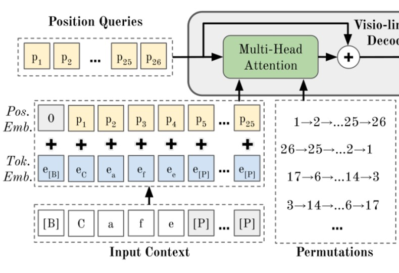
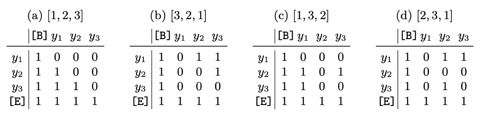
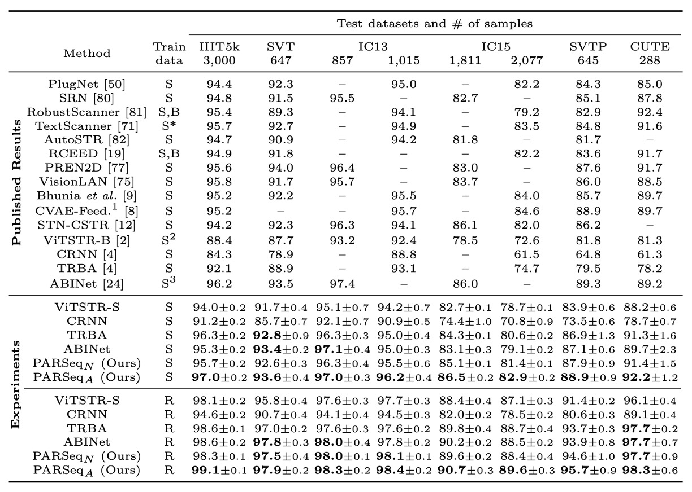

## 文字的序順不影閱響讀

[**Scene Text Recognition with Permuted Autoregressive Sequence Models**](https://arxiv.org/abs/2207.06966)

---

你可能有注意到，副標題的文字是錯位的。

恩？或者其實根本沒有注意到。

## 定義問題

對於文字排列的探索，在近幾年也是多有研究。

比較著名的研究是 XLNet，他的雙流注意力機制，就是透過打亂文字的順序來訓練模型。

這雖然是比較早期的研究，但後續有幾篇 STR 的論文也是採用了類似的方法，例如 ABINet 的解碼器在訓練過程中就是用亂序的 Mask 來訓練語言模型的分支。

:::tip
沒看過這些論文的讀者，可以去翻翻我們之前的文章：

- [**[19.06] XLNet: 雙流注意力機制**](../../transformers/1906-xlnet/index.md)
- [**[21.03] ABINet: 要不再想想？**](../2103-abinet/index.md)
  :::

如果你懶得看，那我們簡單複習一下：

所謂雙流注意力機制，其核心概念有幾個，第一就是「把自己蓋起來」，這個部分跟 MLM 一樣，就是把自己遮住，然後預測自己。不一樣的地方是 MLM 會用一個特殊的 Token 來表示「遮住」，而雙流注意力機制則是保留自己的位置資訊，遮蓋語意資訊，讓模型去預測最後的結果。

第二個概念就是「亂序」，這個部分就是把文字打亂，因為模型可能會偷懶，直接記憶文字的位置而不是文字的語意，所以打亂文字的順序，讓模型無法直接記憶位置，只能透過語意來預測。

這篇論文的作者也是基於這個概念，重新設計了一個 STR 的模型，所謂的 PAR 是 Permuted Autoregressive，也就是「亂序自回歸」的意思。透過引入「亂序」的概念，來提升模型的性能。

如果你能看得懂上面的複習內容，那現在這篇論文我們就看完了。

## 解決問題

### 模型架構

<figure style={{"width": "85%"}}>

</figure>

這個架構看起來有點複雜，我們同樣拆解一下：

### 編碼器設計

<figure style={{"width": "60%"}}>

</figure>

如果你已經讀過 ViT 的論文，那這裡就沒問題了。

首先看到上圖中「ViT Encoder」，這個部分就是把圖片轉換成 tokens，然後透過 Transformer 的 Encoder 來提取特徵。

圖像 $x \in \mathbb{R}^{W \times H \times C}$（寬度 $W$，高度 $H$，通道數 $C$）透過分割成 $p_w \times p_h$ 的小塊後，再展開並以嵌入矩陣轉為 $d_{model}$ 維度的 tokens。最後，位置嵌入會被加到這些 tokens 上。

ViT 的所有輸出都會作為解碼器的輸入，即 $\mathbf{z} = Enc(\mathbf{x}) \in \mathbb{R}^{\frac{WH}{p_w p_h} \times d_{model}}$。

圖像特徵經過 Encoder 之後，就會進入到下一個階段，也就是「Cross-Attention」的 Decoder，就是上圖中的綠色部分。

經過輸出層 MLP 之後，就會得到最後的預測結果。

:::info
在這個架構中，Encoder 的層數為 12 層，Decoder 的層數為 1 層。

根據作者實驗，只需要 1 層 Decoder 就可以達到最佳效果。
:::

:::tip
沒看過 ViT？

歡迎參考這裡：[**[20.10] ViT: 新世界拓荒者**](../../vision-transformers/2010-vit/index.md)
:::

### 解碼器設計

<figure style={{"width": "85%"}}>

</figure>

如上圖，一般來說，要透過 Decoder 進行輸出查詢，一開始會有一組特殊的 Token，這些 Token 代表了「位置」，也就是 Decoder 的輸出位置。

我們先把一些地方蓋起來，就可以看到最樸素的 Decoder 結構。到這邊，我們可以發現這個模型架構平淡無奇，沒有什麼特別的地方，跟之前我們看過的 STR 模型一模一樣。

那我們該如何在這個架構中融入語言模型呢？

### 回顧一下

<figure style={{"width": "85%"}}>

</figure>

參考上圖，在 ABINet 中，從視覺分支輸出的結果，會送往語言模型進行「校正」，得到語言分支的輸出。最後再合併兩個分支的特徵，就可以得到最後的結果。

在這篇文章中，作者改了這個架構，在 PARSeq 的方法中，把語言模型的部分塞進了 Decoder 的初始化階段。

### 排列語言建模

<figure style={{"width": "80%"}}>

</figure>

這個部分就是 PARSeq 的核心概念，也就是「排列語言建模」。

在「Positional Tokens」真正去查詢圖像資訊之前，會先經過一個「排列語言建模」的過程，這個過程就是把文字的順序打亂，然後透過 Transformer 的 Decoder 來預測。

PLM 的核心概念在於透過所有可能的排列來訓練模型，對於 $T$ 個元素的排列組合來說有 $T!$ 種排列，因此 PLM 的目標函數為：

$$
\log p(\mathbf{y} | \mathbf{x}) = \mathbb{E}_{\mathbf{z} \sim \mathcal{Z}_T} \left [ \sum_{t=1}^T{\log p_{\theta} (y_{z_t} | \mathbf{y}_{\mathbf{z}_{<t}}, \mathbf{x})} \right ]
$$

在 Transformer 中實現 PLM 並不需要實際改變文本標籤 $y$ 的順序，而是通過調整注意力遮罩來實現，如下表所示：

<figure style={{"width": "85%"}}>

</figure>

此外，為了避免計算量隨 $T!$ 增長，PLM 只選取 $K$ 個排列，包含左到右的排列 $[1, 2, \dots, T]$ 和 $K/2 - 1$ 個隨機排列。

:::tip
在這個設計中，你會發現標準的自回歸訓練只是 PLM 的特例，即只有一種排列順序 $[1, 2, \dots, T]$。

這是典型的「把別人的想法變成我的特例，我就變得更強了！」的設計思路。
:::

### 解碼方法

PLM 訓練搭配適當的參數設定，使得 PARSeq 支援多種解碼方式。

作者在此主要探討兩種對比解碼方式：自回歸（AR）解碼與非自回歸（NAR）解碼，以及一種稱為**迭代精煉**（iterative refinement）的技術。

<figure style={{"width": "85%"}}>

</figure>

1. **上表(a)，自回歸（Autoregressive, AR）解碼**

   - AR 解碼每次迭代僅生成一個新 token。
   - 使用從左至右的注意力遮罩。
   - 在第一次迭代中，設定上下文為起始 token $[B]$，並僅使用第一個位置查詢 token $p_1$。
   - 後續的第 $i$ 次迭代中，使用位置查詢 $[p_1, \dots, p_i]$，並將上一輪的輸出（取 argmax 值）加上起始 token $[B]$ 作為上下文。

2. **上表(b)，非自回歸（Non-autoregressive, NAR）解碼**

   - NAR 解碼一次性生成所有輸出 tokens。
   - 使用所有位置查詢 $[p_1, \dots, p_{T+1}]$，且不使用注意力遮罩。
   - 上下文始終為起始 token $[B]$。

3. **上表(c)，迭代精煉（Iterative Refinement）**
   - 無論初始解碼方式為 AR 或 NAR，均可執行迭代精煉。每次迭代將前一次的輸出（截斷至終止 token $[E]$）作為當前迭代的上下文，類似於 AR 解碼。
   - 始終使用所有位置查詢 $[p_1, \dots, p_{T+1}]$，並採用填字式遮罩。
   - 填字遮罩是先以全 1 遮罩開始，然後遮蔽匹配的 token 位置，以便在後續迭代中專注於未正確生成的 token。

### 損失函數

這裡只對最後的輸出結果進行損失計算，也就是最後的預測結果。使用 $K$ 個排列時，損失函數是每個排列的交叉熵損失的平均值，計算：

$$
\mathcal{L} = \frac{1}{K} \sum_{k=1}^K{\mathcal{L}_{ce}(\mathbf{y}_k, \hat{\mathbf{y}})}
$$

監督時，會忽略填充 tokens。雖然排列的文字不同，但是最後都必須要輸出相同的預測結果。

### 實驗配置

所有模型在 PyTorch DDP 設置下的雙 GPU 混合精度環境中訓練，共進行 169,680 次迭代，批次大小為 384。

學習率依模型而異。使用 Adam 優化器和 1-cycle 學習率調度器，在第 127,260 次迭代（即總迭代的 75%）開始使用隨機權重平均（SWA），並替換為 SWA 調度器。每 1,000 步進行一次驗證，最終的權重平均選取最後一個檢查點。

- **模型設定**：對於 PARSeq，使用了 $K = 6$ 個排列。對於 PARSeq 和 ViTSTR，圖像補丁大小設定為 8×4。
- **標籤預處理**：依據前人研究的方法進行標籤預處理，將標籤的最大長度設定為 $T = 25$，字元集大小 $S = 94$，包括大小寫字母、數字和標點符號。
- **圖像預處理**：圖像首先進行增強、調整大小，再歸一化至 $[-1, 1]$ 範圍。增強操作主要包括 RandAugment 操作（不含銳化），並加入反轉（Invert）以提高對房屋號碼數據的識別效果，以及 GaussianBlur 和 PoissonNoise 用於 STR 數據增強。增強策略使用 3 層操作，幅度設為 5。所有圖像均調整大小為 128×32 像素。

## 討論

### 訓練排列數量影響分析

<figure style={{"width": "80%"}}>

</figure>

由於計算需求隨排列數量指數級增長，在實際操作中無法對所有可能的排列進行訓練。

作者改為從所有可能的排列中隨機選取部分排列。上表展示了不同訓練排列數量 $K$ 對各種解碼方式測試準確度的影響。

- **單一排列訓練（$K = 1$）**：

  在 $K = 1$ 的情況下，僅使用從左至右的排列順序，訓練過程簡化為標準自回歸（AR）建模。在這種設定下，非自回歸（NAR）解碼完全無法運作，而自回歸解碼則如預期表現良好。

  此時，精煉（或填字式）解碼的準確度僅為 71.14%，相當低（考慮到使用真實標籤作為初始預測）。

- **多排列訓練（$K \geq 6$）**：

  當 $K \geq 6$ 時，各種解碼方式的表現才達到滿意的水準，此結果顯示 PLM 的確是實現統一的 STR 模型所必需的。

  直觀上來看，NAR 解碼在僅使用單一或雙重（正向及反向）排列的情況下（$K \leq 2$）無法正常運作，原因在於訓練上下文的多樣性不足。NAR 解碼依賴於每個字符的先驗知識，若字元集中的所有字符無法自然地出現在序列的開頭，則無法充分學習這些先驗知識。

- **最佳平衡（$K = 6$）**：

  使用 $K = 6$ 時，解碼準確度和訓練時間達到最佳平衡。

  內部語言模型的極高填字準確度（約 94%）顯示了圖像特徵與語言上下文聯合使用進行預測精煉的優勢。畢竟 STR 的主要輸入信號來自圖像，而非語言上下文。

### 與現有方法的比較

<figure style={{"width": "85%"}}>

</figure>

作者將 PARSeq 與現有的知名和近期 SOTA 方法進行比較，並重現了部分方法以進行更公平的比較。

就重現結果來看，大部分重現的方法比原始報告的準確率更高。例外的是 ABINet，重現結果的準確率下降約 1.4%，原因在於 ABINet 使用了更長的訓練計劃（分別預訓練 80 和 8 個 epoch 給語言模型和視覺模型）以及額外的數據集（WikiText-103）。

準確率比較的部分，使用合成數據和真實數據進行訓練時，PARSeqA 在字詞準確率上表現最佳，PARSeqN 則穩居第二或第三。當使用真實數據時，所有重現模型的準確率明顯高於原始結果，而 PARSeqA 則創下新的 SOTA 成果。

---

字元集準確度的部分如下表：

<figure style={{"width": "80%"}}>

</figure>

不同字元集的平均準確率。當使用合成數據訓練時，從 36 字元集轉為 62 字元集和 94 字元集時準確度急劇下降，顯示合成數據集中缺乏大小寫字符的多樣性。PARSeqA 在所有字元集大小上均達到最高準確率。

## 結論

PARSeq 透過引入 PLM 的概念，將語言模型的部分融入到 STR 的模型中，並且通過多排列訓練的方式，提升了模型的性能。這項嘗試在 STR 的各大指標上都取得了 SoTA 的成績，並且在字元集大小的變化上也有最優秀的表現。

語言模型的魅力無法阻擋，我們可以跟著最新的 NLP 技術，把語言模型的概念融入到其他領域，這樣的嘗試也許會帶來更多的驚喜。
