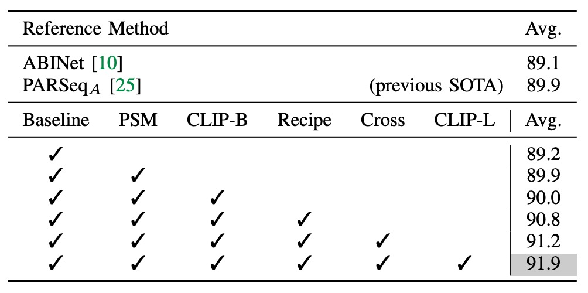

## 多模態的祝福

[**CLIP4STR: A Simple Baseline for Scene Text Recognition with Pre-trained Vision-Language Model**](https://arxiv.org/abs/2305.14014)

---

對比學習的風，吹得到處都是。

在對比學習之後的多模態學習，更是近年來的熱點，進而衍生出一個全新的名詞：

- **VLM，Vision-Language Models。**

在業界，不論男女老少，都能開口吼上一句：VLM！

既然如此，文字辨識的領域的研究者們，怎麼樣也得來湊個熱鬧，是不是？

## 定義問題

場景文字辨識 (Scene Text Recognition, STR) 在面對旋轉、彎曲、模糊或遮蔽的文字，STR 的表現總是不盡人意。

同樣的問題，一晃數十年。這次，我們來點新花樣。

CLIP 在 2021 年提出，隨後便以其強大的跨模態學習能力，成為了熱門話題。CLIP 能夠在自然圖片中感知並理解多樣文字變體，這種能力，對 STR 來說，是一種潛在的解決方案。

等一下！什麼是 CLIP？

這個畫風怎麼變得這麼快？

:::tip
我們已經讀過了 CLIP，還沒接觸過的讀者可以參考我們之前的文章：

- [**[21.03] CLIP: 打碎次元的屏障**](../../multimodality/2103-clip/index.md)
  :::

## CLIP

我們知道你懶得看，所以這裡簡單介紹一下 CLIP。

下圖就是 CLIP 架構：

假設我們有一組圖像-文字對，其中一對可能是一張狗的圖片和文字「一隻可愛的小狗」。

在一個訓練批次中，CLIP 會接收到多個這樣的對。圖像編碼器可能透過 ResNet 或 ViT 來處理圖像，獲取圖像特徵，而文本編碼器可能透過 Transformer 來處理文本，獲取文字特徵。

然後，模型會比較這些特徵，以確保正確配對的圖像和文字（例如：狗的圖像和「一隻可愛的小狗」的文字）之間的餘弦相似度最大，而錯誤配對的圖像和文字（ 例如：狗的圖像和「一個蘋果」的文字）之間的餘弦相似度最小。

非常簡單的架構！

最後，堆上 4 億組圖像文本對，開始訓練！

### 所以呢？

這代表什麼？

這代表完成訓練後，我們可以直接以自然語言進行圖片搜索，或是反過來，給圖片讓模型產生對應的敘述。如果在這訓練的過程中，存在像是 STR 任務中的文字圖像，那文字的樣子在 CLIP 的架構中，就會和文字的意義有所關聯。

- **文字圖像和文字本身有所關聯？這不就是 STR 要解決的問題嗎！**

而且 CLIP 的訓練資料來自於真實世界所存在的各種樣態，表示其中所產出的特徵可以從更高的維度來理解這個世界，不再受限於原本 STR 任務中的訓練資料，進而提升 STR 的表現。

最明顯的就是歪斜扭曲或是嚴重遮蔽的文字，由於 CLIP 的訓練資料中存在我們「難以想像」樣態，因此 CLIP 有機會可以找出這些文字的特徵。

:::tip
**什麼叫做難以想像？**

你可能對「4 億」筆圖像文本對沒有感覺，我們舉個例子：早年的 STR 資料集，最大的就是 SynthText，有 80 萬筆圖像文本對。而最近提出來的 Union14M 是近年來最大的 STR 資料集，有 1400 萬筆圖像文本對，其規模是 SynthText 的 17 倍。

CLIP 的訓練資料是 Union14M 的 30 倍，是 SynthText 的 500 倍。

如果你一秒檢視 1 張圖片，那你大概需要連續觀看 12 年才能看完整個資料集。

:::

### 零樣本測試

為了驗證這個想法，首先作者在 CLIP 上進行了零樣本測試。

看看 CLIP 對於「文字」到底有多少理解，最左邊是輸入的文字，中間是注意力可視化結果，最右邊的是文字輸出：

<figure style={{"width": "60%"}}>

</figure>

我們驚訝的發現：CLIP 會認字啊！

而且當遇到遮蔽的文字時，如上圖中的 `+occluded`，CLIP 會自動考量文字和背景的關係，最後得到 `cat` 和 `horse` 各半的輸出機率！

## 解決問題

所以，既然 CLIP 已經存在了部分的文字理解能力，我們現在要做的就是「引導」它，讓它專注在 STR 這個任務上。

:::tip
除非算力足夠，或資料規模足夠，不然我們不會去微調 CLIP 的參數，因為這樣會破壞 CLIP 在多模態學習上的能力。

一般來說，我們會凍結 CLIP 的參數，然後在其上面再堆上一個小小的網路，這個網路專門用來解決我們想解決的問題。
:::

### 模型架構

我們假設你已經很熟悉 CLIP 了，所以我們直接開始介紹這個架構。

---

CLIP 有兩個分支，文字分支和影像分支。

在 CLIP4STR 的架構中，首先將影像輸入「CLIP 影像分支」，獲取影像特徵。接著把這個特徵輸入自定義的「image decoder」，解析特徵，輸出預測文字。

如上圖，輸入一張圖，讓模型首先會輸出「briiad」，這個輸出可能不正確，因此接著把這個輸出文字再輸入「CLIP 文字分支」，獲取文字特徵。

最後把文字特徵和影像特徵拼接，輸入一個自定義的「cross-model decoder」，進行最終的文字預測。

其中 「CLIP 文字分支」 凍結參數，不進行訓練。還有在拼接文字和影像特徵時，倒傳遞的梯度不會傳到影像分支上，這樣可以保證影像分支不會受到文字分支的影響。

你可以發現，在這裡「CLIP 文字分支」的主要功能視為「錯字校正」，而不是文字的生成。

:::tip
這個錯字校正的概念，沿用了 ABINet 的想法，有興趣的讀者可以參考：

- [**[21.03] ABINet: 要不再想想？**](../2103-abinet/index.md)
  :::

### 文字解碼器

還記得我們剛提到的「cross-model decoder」模組吧！

這個模組的設計就直接引用了 PARSeq 的解碼器架構，差別在於原本在 PARSeq 中，第二層跨注意力的目標是來自於影像的輸出特徵，而在 CLIP4STR 中，這個目標是來自於「CLIP 文字分支」和「CLIP 影像分支」所拼接起來的輸出特徵。

:::tip
如果你沒看過 PARSeq，可以參考我們之前的文章：

- [**[22.07] PARSeq: 文字的序順不影閱響讀**](../2207-parseq/index.md)
  :::

## 討論

### 與其他方法的比較

上表顯示了 CLIP4STR 在 11 個 STR 基準數據集上的性能，與其他 SOTA 方法相比，CLIP4STR 在 9 個基準數據集上達到最新的 SOTA 性能。

### 基礎消融實驗

<figure style={{"width": "70%"}}>

</figure>

實驗開始以僅包含視覺分支的 ViT-S 編碼器作為基線，此編碼器無預訓練。

1. 引入 PSM 技術，並遵循 PARSeq 的訓練配方，帶來 0.7% 的準確度提升。
2. 將編碼器替換為 CLIP 的圖像編碼器 ViT-B/16，卻未帶來顯著提升，顯示需要進一步適應。
3. 修改訓練參數，將 patch 大小調整至 16×16，設置較小的學習率給編碼器，解碼器則使用較大學習率，並將訓練輪數減少至 16 輪。

調整到這裡，模型即已超越先前 SOTA 性能。

4. 增加跨模態分支使平均準確率在 9 個基準數據集上提升 0.4%，顯示其有效性。
5. 引入較大模型 ViT-L/14 後，準確率再增 0.7%。

CLIP-ViT-L/14 在 STR 上的收斂速度比 CLIP-ViT-B/16 更快，僅需 10 輪訓練即可。

### CLIP 該怎麼凍結？

<figure style={{"width": "80%"}}>

<figurecaption>#Params 表示可訓練參數，`token` 表示僅使用預訓練 token embedding。 上半部是凍結文字分支，下半部是凍結影像分支。</figurecaption>
</figure>

---

常見的凍結策略有兩種：

1. **凍結 CLIP 文字分支**：凍結一半層數，這是將大型語言模型遷移至新任務的常見做法。
2. **凍結 CLIP 影像分支**：這樣會使得影像分支無法進行訓練，可能會影響最終的表現。

作者在這裡進行了一系列的實驗，結果表明凍結語言模型對性能的影響較小，而凍結圖像模型則對性能有顯著影響。

儘管 CLIP 文字編碼器的預訓練詞嵌入已固定，系統仍能達到良好性能，顯示 STR 的語義理解相對簡單，文字內容以詞彙和短語為主，與一般語言理解相比難度較低。

凍結圖像模型對性能影響較大，可能由於 STR 數據與 CLIP 圖像編碼器的預訓練數據之間的域（domain）差距所致。

CLIP 預訓練使用的主要為自然圖片，而 STR 數據則為裁剪後的詞語圖片，因此 CLIP4STR 中需要「完全可訓練」的圖像編碼器來縮小這一差距。

### 多模態真的有用嗎？

<figure style={{"width": "80%"}}>

</figure>

為了驗證多模態的預訓練是否真的有用，作者把「影像分支」重新訓練。

實驗嘗試了三種不同的影像編碼器：

- **隨機初始化的 ViT**：沒有預訓練。
- **ImageNet-1K 預訓練的 ViT**：使用 ImageNet-1K 預訓練。
- **ImageNet-21K 預訓練的 ViT**：使用 ImageNet-21K 預訓練。

從上表中可以看到，使用影像文字對的預訓練模型效果最好，其次是從頭訓練的模型。

:::tip
這裡和 PARSeq 的實驗結果一致，即在 STR 任務中，使用預訓練的模型效果並不好！
:::

### 能不能來點 PEFT？

<figure style={{"width": "40%"}}>

</figure>

除了全面微調的方式，針對大型預訓練模型的參數高效微調方法 (Parameter-Efficient Fine-Tuning, PEFT) 也逐漸流行，例如 CoOp 僅訓練可學習的前綴提示 (prefix prompts)，而 CLIP-Adapter 則在凍結的 VLM 模型之上加入可調整的線性層。

考慮到這些 PEFT 方法在一些任務中表現良好，作者也在本文嘗試將其應用於 STR，設計了兩種 PEFT 方法：

1. **CLIP-Adapter**：在凍結的 CLIP 頂層添加兩個線性層，設置殘差相加比例 $\lambda = 0.2$。
2. **LST**：在凍結的 CLIP 上使用一個梯式側向網路，將特徵先降採樣，再上採樣以配合原特徵維度。

實驗結果顯示，CLIP-Adapter 的性能優於僅凍結模型的版本，但未達到完全微調模型的性能。而 LST 的表現相對更佳，顯著提升了模型準確率，但仍低於完全微調模型。

如果在訓練資源有限的情況下，LST 可以作為一個較佳的選擇。

:::tip
針對 LLM tuning 的部分，我們之前有讀過幾篇論文，有興趣的讀者可以參考：

- [**[19.02] Adapter: 參數節省九成六**](../../model-tuning/1902-adapter/index.md)
- [**[21.01] Prefix-Tuning: 是他？不是他？**](../../model-tuning/2101-prefix-tuning/index.md)
  :::

## 結論

多模態的模型架構已經在近幾年的各個不同領域的任務中取得了巨大的成功，這篇研究也展示了 CLIP 在 STR 任務中的應用，並取得了 SOTA 的性能。

路不是走到了盡頭，而是該轉彎了。
