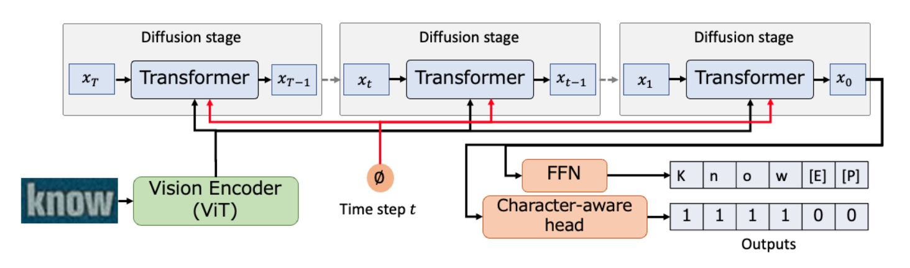

## 噪聲中的文字訊號

[**DiffusionSTR: Diffusion Model for Scene Text Recognition**](https://arxiv.org/abs/2306.16707)

---

做研究的邏輯有時候很簡單：

看到別的領域有什麼好東西，拿過來試試看，或許就是一篇論文。

## 定義問題

擴散模型已經流行好幾年了，主要的應用還是集中在圖像生成領域上。

這麼新鮮的東西，不如...

拿來做文字辨識吧！

## 解決問題

### 模型架構

擴散模型的概念可以講個三天三夜，這裡就不多說了，我們假設你已經是擴散模型的高手。

作者這裡引入擴散模型，用來作為文字辨識的基底。

整個架構的設計非常簡單，首先將一個圖像使用 ViT 進行編碼，得到圖像的特徵表示。

接著，以噪聲填充的序列$x_T$作為輸入，透過 Transformer 在視覺特徵的條件下，生成逐步精煉的序列$x_{T-1}$，此過程重複$T$次，最終輸出序列$x_0$。

最後，$x_0$經由 FFN 轉換為辨識的文字序列，並且字元感知頭部負責預測字元的位置。

擴散模型包含前向和逆向過程：

- **前向過程**：將數據點 $x_0$ 逐步加入噪聲至高斯噪聲 $x_T$
- **逆向過程**：通過逐步去噪重建原始數據 $x_0$。

作者使用了多項擴散模型來處理字元這類離散變量，並引入了特殊標記，如[EOS]（文字結束）、[PAD]（填充）、[MASK]（噪聲）等。

訓練時使用簡化的損失函數$L_{\text{simple}}$，並採用均方誤差損失進行穩定訓練。

除此之外，沒有使用任何語言模型。因為作者認為語言模型的分支會讓模型架構更為複雜，這樣難以直觀的看出擴散模型的效果。

### Transformer 架構

這裡作者使用帶有時間位置編碼的 Transformer 解碼器來轉換擴散模型中的序列。

與傳統 Transformer 相比，有以下幾個不同點：

1.  引入視覺特徵 $z$ 來進行文字序列的條件化處理，通過交叉注意力機制實現。
2.  同時輸出所有字元的概率，而不是一次只預測一個字元。（不使用自回歸機制）
3.  輸出結果有兩種用途：一是透過 FFN 轉換為文字序列，二是輸入字元感知頭部來預測字元區域是否為真實字元。

在訓練過程中，隨機抽取一個時間步 $t$，使用噪聲排程 $\alpha_t, \alpha_{\bar{t}}$ 計算輸出後，生成一個帶有噪聲的序列 $x_t$。然後執行 $x_{t-1} = \text{Dec}(x_t, z, t)$ 以計算損失。

在推理過程從填充有噪聲標記（[MASK]）的序列 $x_T$ 開始，並在視覺編碼器生成的視覺特徵 $z$ 的條件下進行 $T$ 次迭代，最終獲得 $x_0$，最後，將$x_0$經由 FFN 轉換為辨識的文字序列。

最後作者提出了一個字元感知頭部來進行文字辨識，其主要解決固定長度序列中的字元分類問題。預測頭進行二元分類，判斷一個位置是否對應於一個字元（1）或非字元（0），損失函數採用二元交叉熵。

## 討論

### 與其他方法的比較

上表顯示了 DiffusionSTR 與其他最新方法在 MJ 和 ST 數據集上的比較。

DiffusionSTR 在多個數據集上表現優異，且與最新的強力方法相較具競爭力。

ABINet 和 PARSeq 使用了強大的語言模型，而 TRBA 則採用了圖像校正模組作為前處理。儘管 DiffusionSTR 結構較簡單，沒有使用這些技術，但仍能達到相似的準確度。

### 擴散模型的優勢

<figure style={{"width": "70%"}}>

</figure>

通過實驗，作者發現 DiffusionSTR 的優勢在於：

1. **對噪聲敏感度低**：擅長處理噪聲圖像。
2. **對模糊圖像的穩健性**：擅長解析模糊圖像。

### 字元感知頭部影響

實驗顯示了字元感知頭部的效果，如果不預測字元位置，準確度會顯著下降。

### 擴散步驟影響

上表顯示了總步驟數對準確度的影響，結果確認當步驟數增加時，準確度也隨之提升。

在超過 1000 步驟後，準確度的提升達到飽和。

## 結論

本文提出的方法是利用視覺訊息有條件地細化噪音文字序列，這和現有的方法截然不同。在驗證集上，DiffusionSTR 和最先進的方法相比也毫不遜色，證明了該方法的有效性。

這個新穎的思考方式，讓研究者們看到了擴散模型在文字辨識上的潛力。

:::tip
在這篇文章中，作者隻字未提推論時間。

由於擴散模型必須反覆迭代，我們猜這個模型應該蠻慢的。
:::
