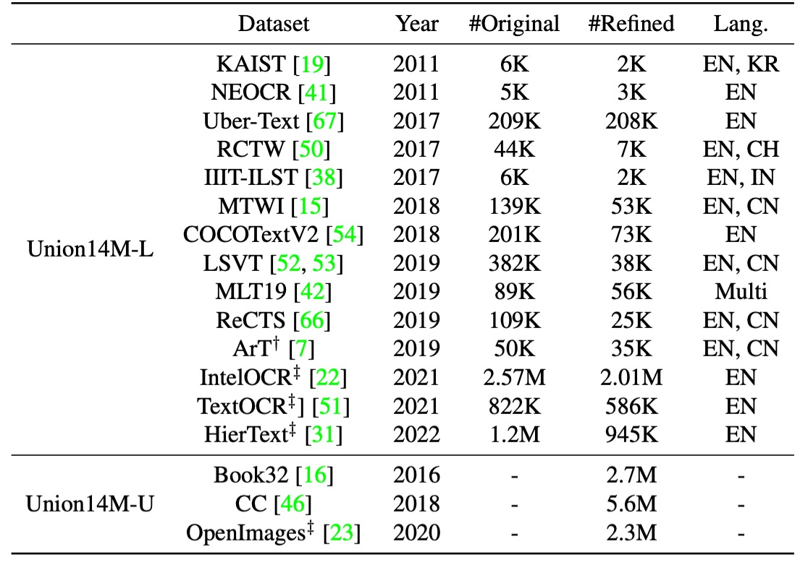
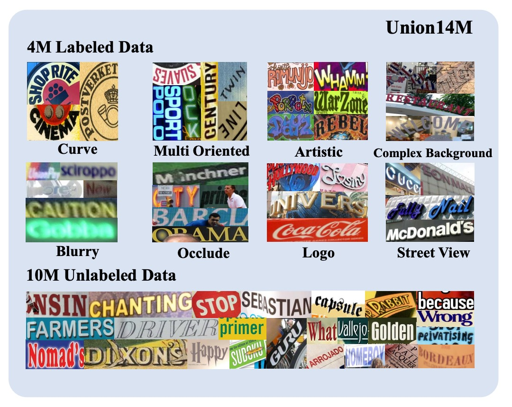
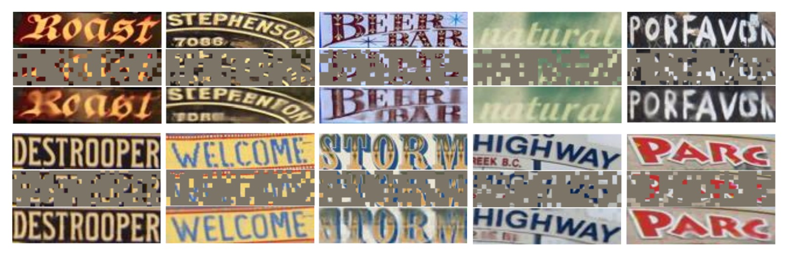
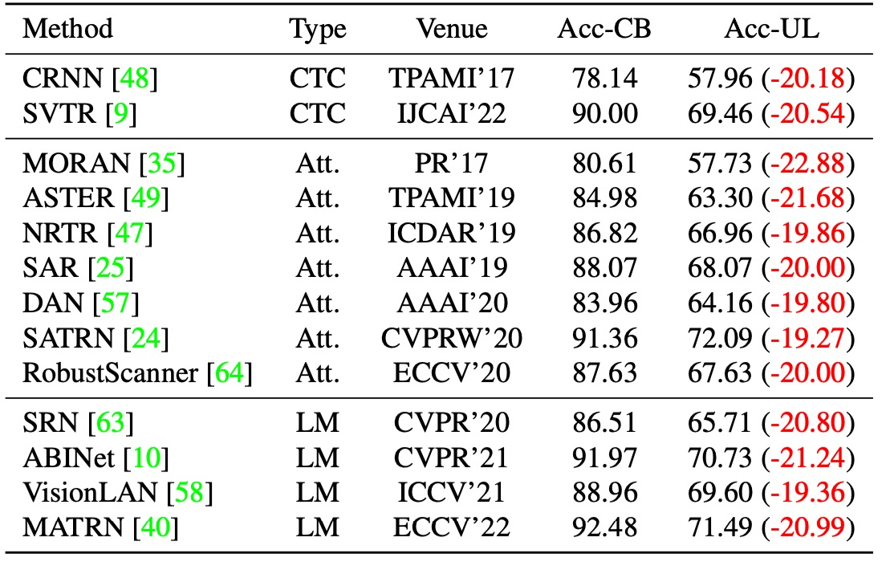
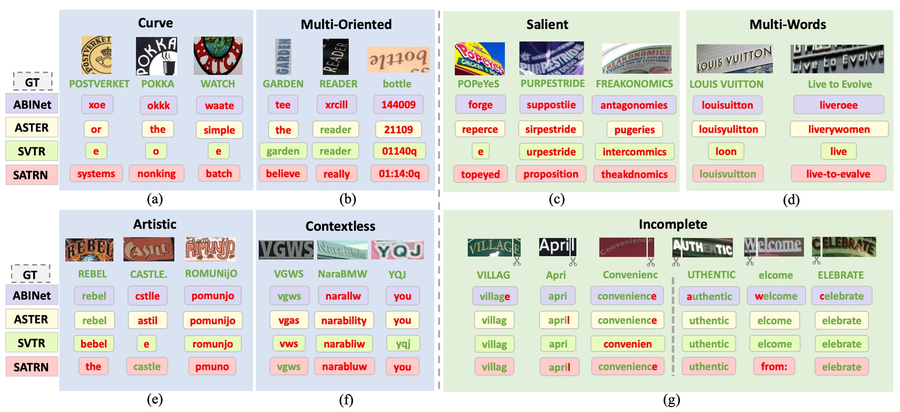
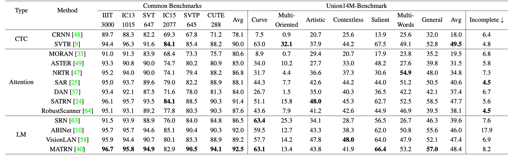
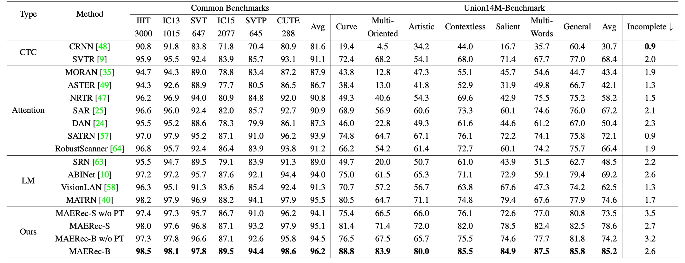

## 棋子如繁星墜落

[**Revisiting Scene Text Recognition: A Data Perspective**](https://arxiv.org/abs/2307.08723)

---

我們看文字辨識的論文也看了數十篇，大家使用的驗證資料集翻來覆去也就是那幾個：ICDAR、IIIT5K、SVT、SVTP、CUTE80 等。

說實在的，這些資料集的表現也大多接近飽和了。

## 定義問題

如上圖，這是六個常見的資料集表現平均值。

從我們熟悉的 CRNN 開始，到後來的 SAR、SATRN、ABINet。在 2022 年後，整體的表現已經達到了 92% 以上，再往上已經沒有什麼提升的空間。

那這是不是表示 STR 已經可以標定為一個「已解決」的問題呢？或者說，有沒有一種可能是我們所採用的驗證資料集的表達能力不足，導致我們無法看到更多的可能性？

既然不行，那我們能不能就不要了？

只見作者心一橫，決定把現在的棋盤掀了，重新來過。

## 解決問題

既然現有的資料集無法反映現實世界中場景文字辨識（STR）所面臨的真實挑戰，作者們決定整合一個全新的大規模真實資料集 —— Union14M。

Union14M 包含了 400 萬張標記圖像（Union14M-L） 和 1000 萬張未標記圖像（Union14M-U），從 17 個公開可用的資料集中獲取，如下表所列：

<figure style={{"width": "80%"}}>

</figure>

這個資料集整合目前大多數的資料集，歸納不同類別的挑戰項目，目標是更全面地代表現實世界中的文字分佈。

透過這個龐大的資料集，作者們希望能夠深入分析 STR 模型在更複雜、多變的真實場景中的效能，找出現有模型的不足之處，進而推動該領域的進一步發展。

### Union14M-L

共 400 萬筆標記影像，作者採用資料收集策略以涵蓋多元真實場景為目標，從 **14 個公開資料集** 中收集標記影像以構建 Union14M-L。

這些資料集具備多樣化的特性，如：

- **ArT**：專注於曲線文字的影像。
- **ReCTS、RCTW、LSVT、KAIST、NEOCR 和 IIIT-ILST**：涵蓋不同國家街景的資料。
- **MTWI**：從網頁擷取場景文字影像。
- **COCOTextV2**：包含大量低解析度與垂直文字的影像。
- **IntelOCR、TextOCR 和 HierText**：來自 OpenImages，該資料集包含約 900 萬張影像，涵蓋各類真實場景。

透過整合這些資料集，作者希望以更廣泛的真實場景進行映射，進而支持深入的分析。

然而，簡單地將這些資料集直接串接並非最優解，因為它們存在標註格式不一致、重複樣本以及非拉丁字元或損毀的影像。為了解決這些問題，作者採用了以下策略進行優化：

- **裁剪文字實例**：大多數資料集使用多邊形標註文字區域，但作者在這裡改用「最小旋轉矩形」進行裁剪。這種裁剪方式可能導入更多背景噪點，使模型在學習過程中面臨更多挑戰，增強其對背景噪音的穩健性。這也減少了模型對偵測器準確性的依賴，有助於分析辨識器的效能。

- **去除重複樣本**：首先排除 Union14M-L 與常見基準間的重複樣本，並進一步剔除 14 個資料集間的重複資料。例如，**HierText、TextOCR 和 IntelOCR** 的部分內容重複，因為它們皆源自 OpenImages。作者選擇以 HierText 為主要參考，剔除其餘兩個資料集中的重複部分。

- **排除非拉丁字元和忽略樣本**：為了聚焦於主要使用的拉丁字母，我們只保留了包含字母、數字與符號的樣本，同時移除那些被標註為「忽略」的影像。

### Union14M-U

共有 1000 萬筆未標記影像，由於自我監督學習在近年已推動電腦視覺領域取得許多進展，並且在 STR 領域中也逐漸受到重視。可是手動標註文字影像需要耗費大量時間與專業語言知識，因此作者探索如何利用未標記資料提升 STR 模型效能。

為此，作者從 **Book32**、**OpenImages** 和 **Conceptual Captions (CC)** 三個大型資料集中收集了 **1000 萬筆未標記影像**。

與以往的研究不同，作者使用了三個文字偵測器並採用 IoU 投票機制來挑選高品質的文字實例。此外，做者們還剔除了 OpenImages 中的重複資料，以避免與 Union14M-L 的標記資料重複。

### 多樣化的文字風格

<figure style={{"width": "80%"}}>

</figure>

如上圖所示，Union14M 涵蓋了多元真實場景中的文字影像，這些文字展現出多種佈局，例如**曲線文字、傾斜文字與垂直文字**，並且包含許多挑戰性元素，如**模糊、複雜背景、遮擋**等。此外，它還涵蓋了各種真實應用場景中的文字，如**街景招牌與商標**。

還有一個需要注意的地方，即 Union14M 包含了大量的垂直文字，這在真實世界中相當常見，但在合成資料集中則相對稀少。

### 豐富的詞彙量

<figure style={{"width": "80%"}}>

</figure>

在合成資料集中使用的文字主要來自常見語料庫，但真實場景中的文字變化多端，可能包含不在語料庫中的組合，例如**車牌號碼**或**中英文拼音的混合**。如上表所示，Union14M-L 的詞彙量幾乎是合成資料集的兩倍，顯示它能夠更廣泛地涵蓋真實場景中的多樣情境，為我們的分析提供豐富的資料支援。

### 模型架構

<figure style={{"width": "80%"}}>

</figure>

在完成 Union14M 資料集後，作者提出了一個基於自我監督學習的解決方案：MAERec。

該模型透過自我監督預訓練，充分利用 Union14M-U 中的 1000 萬張未標記影像。

MAERec 的核心基於 ViT，其優勢在於能輕鬆應用於遮罩影像建模。

- [**[21.11] MAE: 四分之一的線索**](../../vision-transformers/2111-mae/index.md)

輸入影像首先被劃分為 4 × 4 的影像補丁，然後送入 ViT 骨幹網路。模型的輸出序列會通過一個 自回歸解碼器（採用 SATRN 中的 Transformer 解碼器），來生成最終的文字預測結果。

- [**[19.10] SATRN: Transformer 抵達戰場**](../1910-satrn/index.md)

在進行公平比較時，我們僅將 字元類別數統一為 91 類（包括數字、大寫與小寫字母、符號及空格），其他超參數則與原始模型設置保持一致。

### 預訓練與微調

<figure style={{"width": "85%"}}>

</figure>

為了利用 Union14M-U 中的大量未標記影像，作者採用了 MAE 框架進行預訓練，並進行了適度調整。

如上圖所示，在遮罩比例高達 75% 的情況下，ViT 骨幹網路仍能生成高品質的重建文字影像。這表明，MAERec 能夠有效學習文字的結構與語義表示，即使在高度不完整的影像中也能捕捉有用的特徵。

在完成預訓練後，作者使用預訓練好的 ViT 權重來初始化 MAERec，並在 Union14M-L 上進行微調。

## 討論

### 殘酷的現實

<figure style={{"width": "80%"}}>

</figure>

作者首先選擇了 13 個代表性的 STR 模型，這些模型皆以合成資料進行訓練，並在 Union14M-L 上進行測試。如上表所示，

這些模型在 Union14M-L 上的表現有明顯退步，平均準確率下降了...

- **20.50%**！

:::tip
誰還敢說 STR 是個已解決的問題？
:::

### 挑戰挖掘

為了找出 13 個模型共同失誤的類型，作者為 Union14M-L 中的每個樣本分配了一個難度分數，並專注於大多數模型無法正確辨識的困難樣本，從中總結出四個尚未被充分解決的挑戰，以及三個現實世界中常見但先前研究較少關注的挑戰。

- **曲線文字 (Curve Text)**

  如上圖 (a)，曲線文字辨識在近年來引起了許多關注，主要有兩種主流方法：

  1. **基於文字校正的模型**
  2. **使用 2D 注意力機制的模型**

  雖然這些方法在 CUTE 基準資料集上展現了良好效能，但該資料集中曲線文字的比例有限，且曲率程度較低。當遇到高度彎曲的文字時，現有模型的表現仍然不理想。

  ***

- **多方向文字 (Multi-Oriented Text)**

  如上圖 (b)，文字可能以「垂直、傾斜或鏡像」等任意方向出現在不同物體表面，如廣告牌上的垂直文字或相機拍攝角度造成的傾斜文字。然而，現有的 STR 模型大多假設文字是接近水平排列的，因此忽略了多方向文字的問題。

  這些模型通常會將影像的高度縮小至固定尺寸（如 32 像素），並保持寬高比例不變。然而，這種縮放方式可能導致「垂直或傾斜的影像高度塌縮」，進一步阻礙了辨識能力。

  ***

- **藝術文字 (Artistic Text)**

  如上圖 (e)，藝術文字由設計師以各種字體、效果與排版設計而成，背景也可能非常複雜。每個藝術文字實例都可能是獨一無二的，使其成為「零樣本或單樣本辨識問題」，需要特別設計的網路來處理。然而，由於合成資料集中缺乏藝術文字樣本，目前的模型在處理藝術文字時穩健性仍然不足。

  ***

- **無上下文文字 (Contextless Text)**

  如上圖 (f)，無上下文文字指的是「不具有語義」或不在字典中的文字，如縮寫或隨機的字母、數字和符號組合。即使背景清晰且變形程度低，模型也可能無法正確辨識這些文字。這是由於模型的語料庫中過度引入了語義資訊，導致模型依賴詞彙進行預測。

  例如，模型可能將「YQJ」錯誤辨識為「you」，這在某些應用（如車牌辨識、發票辨識及身份證辨識）中特別危險，因為錯誤辨識可能導致嚴重的安全風險或財產損失。

  ***

- **顯著文字 (Salient Text)**

  如上圖 (c)，顯著文字指的是文字影像中「存在多餘的干擾字元」，與主要文字共存。當不同尺寸的文字相鄰或重疊時，這些干擾文字可能會被意外包含在內，進而影響辨識效果。在偵測階段，Liao 等人提出了**ROI 掩膜策略**來去除這些干擾字元。然而，當偵測模型的性能不佳，無法準確偵測文字區域時，辨識模型的快速辨識關鍵區域的能力變得至關重要。

  ***

- **多詞文字 (Multi-Words Text)**

  如上圖 (d)，某些場合中，單一詞語不足以傳達完整語義，需要同時辨識多個詞組，如「商標或短語」。然而，大多數 STR 模型僅在合成資料集中接受單詞級別的訓練，因此常常無法辨識「單詞間的空格」。

  作者觀察到，模型往往會將多個詞語拼接為一個單詞，甚至忽略或更改部分可見字元來符合語法規則。例如，「Live to Evolve」可能被錯誤辨識為「liveroee」，因為模型傾向於將其當作單一單詞來解讀。

  ***

- **不完整文字 (Incomplete Text)**

  如上圖 (g)，文字影像可能因「遮擋或偵測框不準確」而缺失部分字元。當影像裁剪掉首尾字元時，模型可能會自動進行填補，產生完整的預測結果，即使缺失的字元並不可見。

  此行為在依賴語言模型的系統中尤為明顯，因為模型大量使用語言上的先驗知識進行預測。然而，這種「自動補全」特性在某些應用中可能降低模型的可靠性。例如，若影像僅顯示「ight」，模型可能將其補全為「might」或「light」，但最理想的情況是模型直接輸出「ight」，讓後續系統進行異常檢測。

  因此，我們需要全面評估自動補全功能的性能，並仔細考量其對下游應用的潛在影響。

### 基準資料集的構建

<figure style={{"width": "80%"}}>

</figure>

為了更全面地評估 STR 模型在真實場景中的表現，並支持對前述「七大挑戰」的進一步研究，作者們構建了一個挑戰導向的基準資料集：

- **Union14M-Benchmark**。

該基準包含八個子集，共 **409,393 張影像**，覆蓋了不同的文字複雜性和多樣性。

### 實驗結果

作者為了綜合比較各個模型，首先展示訓練在合成數據集（MJ+ST）上的結果：

接著把所有模型用 Union14M 重新訓練：

---

與常見基準資料集相比，當模型訓練於合成資料時，其在 **Union14M-Benchmark** 上的平均準確率下降了 **48.5%**，而在使用 **Union14M-L** 訓練時，準確率下降了 **33.0%**。這表明，真實世界場景中的文字影像遠比六個常見基準更為複雜。

模型若在 **Union14M-L** 上訓練，其在常見基準和 **Union14M-Benchmark** 上分別提升了 **3.9%** 和 **19.6%** 的準確率。這顯示，合成資料訓練難以應對複雜的真實世界需求，而使用真實資料進行訓練能顯著提升模型的泛化能力。

:::tip
常見基準上相對較小的提升幅度也說明了其已趨於飽和。
:::

當僅使用 **Union14M-L** 進行訓練時，我們觀察到 **Union14M-Benchmark** 上的最高平均準確率僅為 **74.6%**。這表明，STR 問題還遠未被解決。雖然大規模真實資料可以帶來性能上的一定提升，但未來仍需要更多的努力來解決這些挑戰。

當使用合成資料訓練時，所有模型在不完整文字子集上的表現都有顯著下降。特別是語言模型的表現下降更為明顯：

- **語言模型**：下降 10.2%
- **CTC 模型**：下降 5.6%
- **注意力模型**：下降 5.9%

作者推測，語言模型的性能下降與其錯誤修正行為有關，即模型試圖「自動補全被視為字元缺失」的錯誤。這一問題在使用 Union14M-L 訓練時有所緩解，這可能是因為該資料集中較大的詞彙量使模型不易過度擬合訓練語料。然而，該問題依然存在，並需要進一步研究。

## 結論

這篇論文的內容非常豐富，其中提到許多目前模型的問題、資料集的問題等。Union14M 的建立是一個非常大的工程，為我們提供了一個更全面的真實世界文字辨識資料集，讓我們能夠更好地、更全面地評估模型的性能。

:::tip
我們推薦大家閱讀原文以及到他們的 github 上逛逛。

專案連結：[**Union14M Github**](https://github.com/Mountchicken/Union14M)
:::
