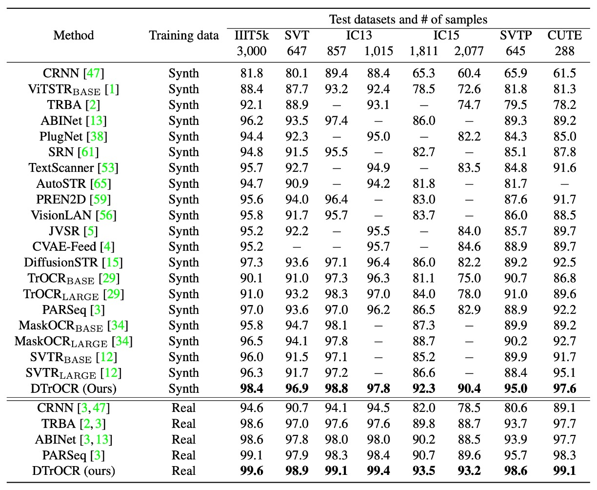
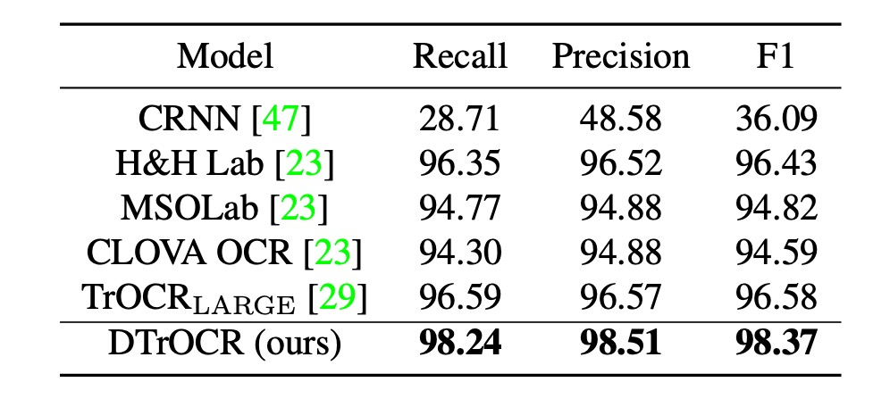

## 解碼器就好

[**DTrOCR: Decoder-only Transformer for Optical Character Recognition**](https://arxiv.org/abs/2308.15996)

---

發表這篇論文的機構是日本的 OCR 公司，算是比較少見的作者群。

這個模型的讀法是 D-TrOCR，Decoder-only 的意思。

我們第一次看到的時候，會忍不住想讀成 Doctor。（？）

## 定義問題

我們之前已經看完了 TrOCR，相信你應該還是有點印象。

:::tip
如果沒有，可以參考我們之前讀過的文章：

- [**[21.09] TrOCR: 預訓練就是正義**](../2109-trocr/index.md)
  :::

TrOCR 廣泛採用預訓練架構，使用編碼器模型和解碼器模型，組成一個文字辨識的處理流程。

而這篇論文的作者對 TrOCR 的架構提出了一些質疑，認為編碼器模型在 OCR 任務上並不是必要的：

- **或許我們只需要解碼器就可以完成 OCR 任務！**

怎麼覺得好像有種似曾相似的感覺？

答對了！OpenAI 在發佈 GPT 的時候也是這樣講的：我們只需要解碼器！

所以寫論文嘛，大家互相致敬一下，把一些開創性的想法，應用在不同的領域上，說不定就是一篇不錯的論文了。

## 解決問題

### 模型架構

<figure style={{"width": "80%"}}>

</figure>

簡單來說，就是把編碼器的部分拿掉，把影像輸入直接串給解碼器。

輸入影像會經過 Patch Embedding 模組，將輸入影像切割成小區塊並轉成向量。把輸入向量加上位置編碼後，傳給解碼器進行文字生成，這個部分跟 ViT 的做法是一樣的。

解碼器收到這些向量後會在最後加上一個特殊的 token `[SEP]`，接著從 `[SEP]` 開始生成文字，直到遇到 `[EOS]` 表示結束。

預測階段使用 word piece tokenization，並使用 Beam Search 獲得最終的文字輸出。

解碼器架構直接採用經過預訓練的 GPT-2，不需從頭訓練，節省了許多時間。

### 合成數據預訓練

原本的語言模型是基於大量的文本數據集進行訓練，但這樣的模型並不適合處理 OCR 任務。因為模型不認識影像特徵，無法將影像與文字聯結。

作者在這裡使用人工合成的數據集對模型進行進一步的預訓練，數據集包含了場景文字、手寫文字與印刷文字等多種形式。

之前在 TrOCR 的論文中所使用的訓練資料是透過 PDF 檔案和商用 OCR 進行數據標註，但這樣的數據準備耗時且費力。作者這裡不打算這樣做，而是改用文本語料庫進行人工生成，以提升資料的再現性，相關的語料庫有 PILE、CC100 和 Chinese NLP Corpus。

合成數據的生成過程如下：

- 利用三個開源庫生成合成數據，將語料隨機分為場景、印刷、及手寫文字辨識三種類別，比例分配為 60%、20%、20%。
- 為場景文字辨識生成 40 億張水平文本影像及 20 億張垂直文本影像，使用 SynthTIGER，並採用默認字體 (英文) 與 64 種常用字體 (中文)。
- 使用 MJSynth 和 SynthText 生成 1 億張多行英文字母的影像，設置單行詞數為 5。
- 為印刷文字辨識生成 20 億張影像，採用 TextRender 的默認設定。
- 手寫文字辨識則使用 TRDG 生成 20 億張影像，使用 5,427 種英文與四種中文手寫字體。

:::tip
一些相關的合成工具，我們有在另外一個地方彙整，有興趣的話可以參考：

- [**文本合成工具相關資源**](https://docsaid.org/docs/wordcanvas/tools)
  :::

### 真實數據預訓練

為提升模型在真實環境中的適應性，還是得找一些真實數據來微調。

作者在論文中所使用真實數據集為：COCO-Text、RCTW、Uber-Text、ArT、LSVT、MLT19 和 ReCTS。

:::tip
如果你也想做這個實驗，真實數據的部分，我們建議直接去找 [**Union14M**](https://github.com/Mountchicken/Union14M) 來用就好，不要浪費時間在下載這些資料上。
:::

### 實作細節

1. **模型設置**

   - **解碼器模型**：

     - 使用英文 GPT-2 和中文 GPT-2 模型。
     - 模型配置：
       - 12 層 Transformer
       - 每層 768 維隱藏層
       - 多頭注意力機制使用 12 個頭
     - 採用 Byte Pair Encoding (BPE) 字彙表。

   - **影像 Patch Embedding**：
     - 遵循先前研究，使用 8 × 4 的影像區塊大小，。
     - 使用相對位置編碼。
     - 最大 token 長度設定為 512。

---

2. **訓練設定**

   - **預訓練**：
     - 英文模型：使用英文數據集。
     - 中文模型：結合中英文數據集。
     - 訓練參數：
       - 1 個 epoch，批量大小為 32。
       - 使用 AdamW 優化器，學習率設為 $10^{-4}$。
   - **微調**：
     - 使用預訓練權重進行初始化。
     - 微調至目標數據集：
       - 大部分數據集訓練 1 個 epoch，學習率設為 $5 \times 10^{-6}$。
       - SROIE 資料集訓練 4 個 epoch。
     - 使用與預訓練相同的優化器與批量大小。

---

3. **資料增強**

   - 應用 RandAugment（不包括 Sharpness）。
   - 添加以下增強方法：
     - 反轉 (Invert)
     - 高斯模糊 (Gaussian Blur)
     - 泊松噪聲 (Poisson Noise)
   - RandAugment 配置：
     - 三層策略
     - 增強幅度設為 5
   - 將所有影像調整為 128 × 32 像素。
   - 保留影像原始方向，並隨機進行以下旋轉：
     - 保持原方向 (95%)
     - 順時針旋轉 90 度 (2.5%)
     - 逆時針旋轉 90 度 (2.5%)
   - 將影像標準化至範圍 $[-1, 1]$。

## 討論

### STR 性能比較

<figure style={{"width": "85%"}}>

</figure>

訓練條件分為合成數據集與真實數據集兩類，在所有基準測試中，無論是合成數據集還是真實數據集，DTrOCR 均顯著優於現有方法。

現有方法（如 TrOCR、ABINet、PARSeq、MaskOCR）使用編碼器並結合語言模型 (LM) 提升準確率，但 DTrOCR 在無需使用編碼器的情況下仍達到更高的準確率。

如下圖所示，即使面對遮擋和不規則布局，DTrOCR 在真實數據集上仍能有效進行文字辨識，且能正確辨識多行文字，這是許多現有方法無法達到的。

<figure style={{"width": "80%"}}>

</figure>

### SROIE 性能比較

<figure style={{"width": "60%"}}>

</figure>

現有方法依賴 CNN 特徵提取器或 ViT 家族結構，而 DTrOCR 在無需上述結構的情況下超越現有方法。

### 手寫文字辨識性能

<figure style={{"width": "60%"}}>

</figure>

這裡採用的資料集是 IAM Handwriting Database，這個分支的研究比較少。過去最好的方式是訓練於 Diaz 的內部註解數據集並使用外部 LM 及基於 Transformers 的 TrOCR。

而 DTrOCR 在僅使用合成數據與基準數據集的條件下，即超越上述方法的準確率。

### 中文辨識性能

<figure style={{"width": "60%"}}>

</figure>

中文基準測試包含四個子集：場景、網頁、文檔與手寫。

:::tip
中文基準測試的部分，參考過去的研究制定的標準：

- [**[21.12] Benchmarking chinese text recognition: Datasets, baselines, and an empirical study**](https://arxiv.org/abs/2112.15093)
  :::

DTrOCR 在所有子集中的準確率均大幅超越現有方法。

其中， TrOCR 和 MaskOCR 使用基於掩碼語言模型 (MLM) 的預訓練方法，而本文方法基於生成式預訓練 (生成下一個文字 token)。

實驗顯示出在處理如中文的複雜文本序列時，生成式的解碼器能更靈活建模序列模式。

## 結論

作者在這篇論文中展示了非常簡單的文字辨識模型結構，僅使用解碼器模型就能完成 OCR 任務，並證實了這種方法的有效性。

在多個基準測試中，DTrOCR 在準確率上均超越了現有最先進方法，而且也有不錯泛化能力。再往後可能就是踏上 LLM 的演化之路，看看能不能把這個模型做得更快更好。

:::tip
生成式的模型大多都有一個共同的缺點：就是速度較慢。

想像一下你現在在使用市面上的 LLM 的畫面，那一個字一個字依序出現的樣子，如果一張圖像中存在上百個字，我們要等多久才能看到結果？

- 或者換個問題：**你能夠忍受多久的等待時間？**

現在的 OCR 應用，使用者的耐心大概只能維持 10 秒內，超過這個時間，使用者就會放棄使用。所以整體的表現已經非常好的情況下，該怎麼提升速度，可能是下一個作者要傷腦筋的問題。
:::
