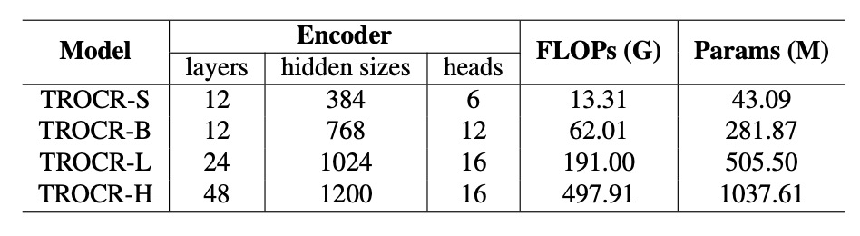
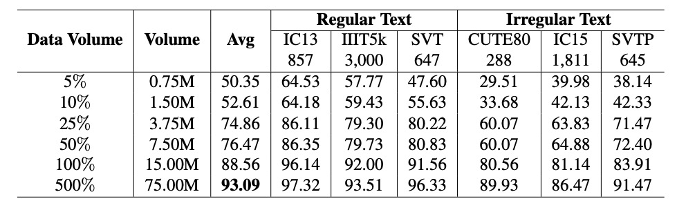

## OCR 的模型縮放律

[**An Empirical Study of Scaling Law for OCR**](https://arxiv.org/abs/2401.00028)

---

早在幾年前，NLP 領域就有研究者嘗試在總結模型的縮放率，並整理了幾個簡單的公式。

時至今日，都已經 2024 年了，怎麼就沒有一篇論文在 OCR 領域提到這個問題呢？

於是華為的諾亞方舟實驗室接下了這個問題。

## 定義問題

我們首先得確認模型愈大愈好，後續的投入才有價值，畢竟沒有意義的事情不會得到投資人的青睞。

在 NLP 領域早在幾年前就已經初步探索了這個問題，而且後來又有更多更深入的研究，像是這幾篇：

- [**[20.01] Scaling Laws: 模型的縮放律**](../../transformers/2001-scaling_laws/index.md)
- [**[22.03] Chinchilla’s Law**](https://arxiv.org/abs/2203.15556)

這些研究都是基於 NLP 領域的，而 OCR 領域的研究者似乎對這個問題沒有太多的關注。

人們想投入資源，又擔心投資的風險，所以這裡需要一個研究來解決這個問題。

## 解決問題

這篇論文中沒有新的模型架構，作者制定實驗框架，分別從以下幾個角度來檢視模型的縮放率：

1. **模型大小**：指模型的參數量，範圍從 5000 萬到 10 億。
2. **數據集大小**：指訓練數據集的大小，範圍從 100 萬到 10 億樣本。
3. **計算時間**：指訓練模型所需的時間，範圍從 100 小時到 1000 小時。

除此之外，作者引入一個新的數據集：**REBU-Syn**。這是本篇論文提出的數據集，其中結合真實數據和合成數據，資料從現有的公開數據集中整理而成。

### 模型規模化

首先要探討模型尺寸的問題。

這裡作者引用過去兩篇有名的研究：**TrOCR** 和 **PARSeq**。

:::tip
如果你不認識他們，可以參考我們之前的文章：

- [**[21.09] TrOCR: 預訓練就是正義**](../2109-trocr/index.md)
- [**[22.07] PARSeq: 文字的序順不影閱響讀**](../2207-parseq/index.md)
  :::

TrOCR 是基於純 Transformer 架構的文字辨識模型，首次將影像 Transformer 與文本 Transformer 結合，用於 OCR 任務。

為了分析不同模型大小對性能的影響，作者擴展 TrOCR 的模型尺寸，從 TrOCR-S 到 TrOCR-H，模型參數範圍從 43.09 百萬到 10.37 億。

- **TrOCR-S**：Encoder 使用 DeiT$_\text{SMALL}$，Decoder 使用 MiniLM。
- **TrOCR-B**：Encoder 使用 BEIT$_\text{BASE}$，Decoder 使用 RoBERTa$_\text{LARGE}$。
- **TrOCR-L 與 TrOCR-H**：Encoder 使用 BEIT$_\text{LARGE}$，Decoder 使用 RoBERTa$_\text{LARGE}$。

<figure style={{"width": "80%"}}>

</figure>

---

PARSeq 使用基於 Transformer 的 Encoder-Decoder 架構。

Encoder 採用 ViT 模型進行影像特徵提取，移除 `[CLS]` token，將所有輸出 token 傳入 Decoder。Decoder 採用與 preLayerNorm 類似的 Transformer 解碼器，注意力頭數 $nhead = \frac{d_{model}}{32}$。

擴展 PARSeq 模型至四種尺寸以探討 OCR 領域的大規模模型規律：

- **PARSeq-S**：基礎版本。
- **PARSeq-B、PARSeq-L 與 PARSeq-H**：逐步擴展模型規模，模型參數範圍從 22.51 百萬至 6.82 億，詳細配置如下表。

<figure style={{"width": "80%"}}>

</figure>

### 資料規模化

早期的模型訓練主要依賴合成資料，但隨著真實資料的增加，使用真實資料進行模型訓練的效率更高。為了擴大訓練數據的規模，作者製作了一個新的數據集：**REBU-Syn**。其中包含約 600 萬筆真實資料樣本與 1800 萬筆公開合成資料樣本，比例為 3:1。

:::tip
**比例為 3:1？**

這不是一個隨便的比例，後面章節中，作者做了許多實驗，證明這個比例是最好的。
:::

真實資料集包括以下幾個部分：

- **R 組**：包含常用真實資料來源，如 COCO-Text、RCTW17、UberText、ArT、LSVT、MLT19、ReCTS、TextOCR 和 OpenVINO。
- **E 組**：來自常用於文字檢測任務的兩個真實資料集，Total Text 和 CTW1500，大幅擴展了真實數據的範圍。
- **B 組**：包含基準數據來源的訓練資料，例如 IIIT 5k-word、Street View Text、ICDAR13 和 ICDAR15。
- **U 組**：包含來自 14 個數據集的 400 萬張標註圖像，統稱為 Union14ML。

---

公開合成資料集包括以下幾個部分：

- 常用資料集：
  - **MJSynth (MJ)**：890 萬筆資料。
  - **SynthText (ST)**：550 萬筆資料。
- 額外合成資料：
  - **Curved SyntheText (CST)**：針對彎曲文字檢測的資料。
  - **SyntheAdd (SA)**：生成包含稀有字符（如標點符號）的資料。

除了公開的合成資料集之外，作者使用兩種工具：**TextRecognitionDataGenerator** 與 **SynthText** 製作了更多的合成資料。

語料來源是從全球使用最廣泛的英語語料網站中取得的 70 萬筆語料，合成資料的背景選擇了 SynthText 提供的自然場景圖片。

:::tip
一些相關的合成工具，我們有在另外一個地方彙整，有興趣的話可以參考：

- [**文本合成工具相關資源**](https://docsaid.org/docs/wordcanvas/tools)
  :::

### 實驗設定

根據不同的模型架構，作者設定了不同的超參數：

- **TrOCR** 模型：
  - **TrOCR-S**：批次大小 $1024$，學習率 $4 \times 10^{-4}$。
  - **TrOCR-B**：批次大小 $256$，學習率 $1 \times 10^{-4}$。
  - **TrOCR-L**：批次大小 $128$，學習率 $4 \times 10^{-5}$。
- **PARSeq** 模型：
  - 使用一致的學習率 $7 \times 10^{-4}$，批次大小儘可能接近 $1024$。

文字分詞工具採用 **BPE (Byte Pair Encoding)** [68] 與 **SentencePiece** [37] 將文本行切分為子詞單元。

- [**[15.08] Neural Machine Translation of Rare Words with Subword Units**](https://arxiv.org/abs/1508.07909)
- [**[18.08] SentencePiece**](https://arxiv.org/abs/1808.06226)

主要評估指標為**單詞準確率**。並統一將最終輸出字符串標準化為常用的 $36$ 字符集（小寫字母與數字），以確保不同模型與數據集間的公平比較。

## 討論

模型性能 $E$ 主要受以下三個變數影響：

- **模型參數數量 $N$**：模型的複雜度與容量。
- **訓練數據量 $D$**：可用於訓練的數據規模。
- **模型計算量 $C$**：模型的計算資源需求，包括 FLOPs 或 GPU 訓練時間。

實驗目標是為了描述並驗證模型性能 $E$ 與 $N$、$D$、$C$ 的冪律關係，並確定是否存在平滑的可擴展模式，使得模型性能能有效隨資源投入提升。

### 模型大小的冪律關係

- **TrOCR 模型**：

  

  <figure style={{"width": "80%"}}>
  
  </figure>
  

  參數數量 $N$ 與模型性能 $E$ 呈冪律關係，公式如下：

  $$
  E(N) = \frac{1.97 \times 10^4}{N^{0.223}}
  $$

  基於前三個模型（TrOCR-S、TrOCR-B 和 TrOCR-L）擬合冪律公式。最後一個模型（TrOCR-H）與擬合直線高度吻合，證明冪律的有效性。

- **PARSeq 模型**：

  

  <figure style={{"width": "80%"}}>
  
  </figure>
  

  與 TrOCR 相似，PARSeq 的參數數量 $N$ 與性能 $E$ 呈冪律關係：

  $$
  E(N) = \frac{6.316 \times 10^{-74}}{N^{0.018}}
  $$

### 資料量的冪律關係

- **TrOCR 模型**：

  

  <figure style={{"width": "80%"}}>
  
  </figure>
  

  資料量 $D$ 與模型性能 $E$ 呈冪律關係，公式如下：

  $$
  E(D) = \frac{1.84 \times 10^5}{D^{-0.3271}}
  $$

  結果顯示，資料量的變化（藍色實線）與冪律公式（灰色實線）吻合，驗證了資料量對性能的顯著影響。

- **PARSeq 模型**：

  

  <figure style={{"width": "80%"}}>
  
  </figure>
  

  隨著資料量的增加，性能明顯提升，數據顯示於上表。

### 計算資源的冪律關係

<figure style={{"width": "80%"}}>

</figure>

計算資源 $C$ 與模型性能 $E$ 呈冪律關係，公式如下：

$$
E(C) = \frac{4.45 \times 10^4}{C^{-0.3271}}
$$

結果顯示，錯誤率與計算資源之間可以用冪律公式描述，詳細數據見上圖的灰色實線。

### 合成與真實數據比例

<figure style={{"width": "50%"}}>

</figure>

真實數據在訓練效率上通常優於合成數據，但由於成本高昂且數量有限，合成數據仍不可或缺。

為此，作者固定真實數據量，逐步增加合成數據比例（從 0.5 至 5 倍），觀察模型精度的變化，如上表。

結果顯示，當合成數據與真實數據比例為 1:3 時，模型精度達到最高值 96.85%。當比例超過 1:3 時，精度開始下降，可能由於數據分佈過於偏向合成數據，影響模型性能。

### 預訓練之必要性

<figure style={{"width": "80%"}}>

</figure>

對於預訓練模型到底能不能提升 OCR 的性能，過去的研究結果並不一致。

作者在論文中對比了使用 ImageNet-21k 預訓練的模型與從零開始訓練的模型在 OCR 任務中的性能。

在實驗中，使用 ImageNet-21k 預訓練的模型在 PARSeq 和 CLIP4STR 中的表現均不如從零開始訓練的模型。這表示預訓練在非 OCR 特定任務上的模型對 OCR 性能可能無益，甚至有害。

如果是使用基於 OCR 任務的預訓練模型，則可以有效提升性能。例如，使用 REBU-Syn 數據集訓練的 PARSeq-S 模型，精度達 96.85%，高於僅使用真實數據 REBU 訓練的結果。進一步用真實數據 REBU 微調上述模型，精度提升至 97.01%。

基於實驗結果，作者建議最佳實踐是：

1. 先在包含合成與真實數據的完整數據集上訓練模型
2. 再以真實數據進行微調，進一步提升精度。

### 與其他模型的比較

<figure style={{"width": "85%"}}>

</figure>

最後作者重新訓練了 CLIP4STR，採用 **3:1 合成與真實數據比例** 訓練模型，並使用任務相關的預訓練模型進行微調。

實驗結果顯示：CLIP4STR-B 的精度從 **96.54%** 提升至 **97.25%**，增幅為 **0.65%**，創下文本辨識任務的新高。CLIP4STR-L 模型進一步提升，在 **6 個常用測試基準** 上取得 **97.42%** 的 Top-1 平均精度。

:::tip
我們回去翻閱 CLIP4STR 的論文，發現實驗數據和這篇論文不一致，這裡的數據可能是作者自己訓練的結果，不是原論文中的數據。

另外，如果你沒看過 CLIP4STR，可以參考我們之前的文章：

- [**[23.05] CLIP4STR: 多模態的祝福**](../2305-clip4str/index.md)
  :::

## 結論

本研究確認了「模型規模」、「數據量」和「計算資源」與模型性能之間的冪律關係，隨著這三個要素的增加，模型性能可預測性地提升。

在訓練階段，作者建議使用真實數據與合成數據比例為 3:1，以獲得最佳性能。此外，作者證實了使用「與任務相關」的預訓練模型，能有效提升模型性能。

:::tip
最近流行的 VLM 的預訓練模型，對於 OCR 任務是否有幫助？除非這些預訓練模型是針對 OCR 任務進行訓練的，否則基於這篇論文的結論，可能是沒有。

但一些經典的 VLM，例如 CLIP 的訓練量級比起這篇論文來說還要大 20 倍左右，這篇論文的結果真的能代表這些大型的 VLM 下結論嗎？

所以到底預訓練能不能提升 OCR 的性能？我們認為還能再吵上一陣子。
:::
