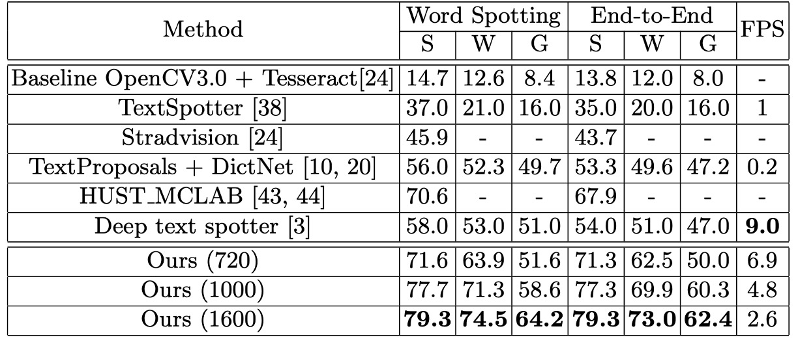
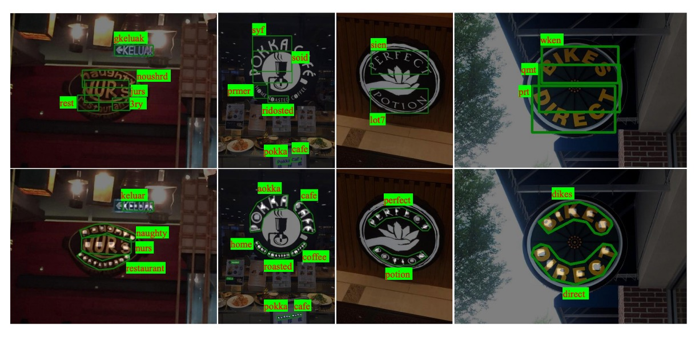
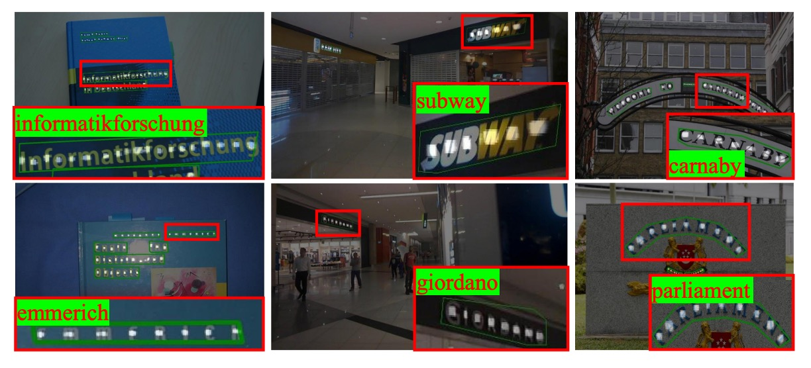

## 定位即辨識

[**Mask TextSpotter: An End-to-End Trainable Neural Network for Spotting Text with Arbitrary Shapes**](https://arxiv.org/abs/1807.02242)

---

初次看到這篇論文的時候，不論是模型設計理念還是製圖方式，都讓我們有種似曾相識的感覺。於是回去翻看一下作者團隊，原來隸屬於 Face++，和 CA-FCN 一樣的作者群啊！

- [**[18.09] CA-FCN: 引入新的維度**](../../text-recognition/1809-cafcn/index.md)

---

回到這篇論文，作者受到 Mask R-CNN 的啟發，用像素級的預測方式，將文字的位置和類別直接預測出來。

為了致敬 Mask R-CNN，作者將這個模型稱為 Mask TextSpotter。

## 定義問題

現實場景中的文字形狀可能有很大的差異，有水平的，垂直的，彎的，斜的......

各種你可以想到或想不到的形狀。

---

文字檢測方法通常來自於物件偵測的設計理念，但物件偵測的方法對於多變的文字形狀適應不良，效果不佳。

另外，文字辨識的方法在這個時期還是流行使用 CTC 的方法，但這個方法比較適合用在水平的文字上，對於彎曲文字的辨識效果也不好。

我們能不能找個可以同時檢測文字位置，又同時可以做文字辨識的方法呢？

魚與熊掌，我都想要啊！

## 解決問題

### 模型架構

這個模型架構畫得比較簡略，我們搭配論文內容跟著看過一遍。

此架構包含四個主要部分，如上圖所示：

1. **特徵金字塔網路 (Feature Pyramid Network, FPN)** 作為骨幹網路。
2. **區域提案網路 (Region Proposal Network, RPN)** 用於生成文本提案。
3. **Fast R-CNN** 負責邊界框回歸。
4. **遮罩分支 (Mask Branch)** 用於文本實例分割與字元分割。

---

### Backbone & Neck

為了建立針對不同尺度的高階語義特徵圖，作者使用 ResNet-50 作為 Backbone，結合特徵金字塔結構 (FPN)。金字塔結構採用自上而下的方式融合不同解析度的特徵，提升準確率的同時僅增加少量的計算成本。

### 區域提案網路

區域提案網路（RPN）負責為 Fast R-CNN 和遮罩分支生成文本提案。

在每個階段根據不同大小的 anchor 進行設置，anchor 的面積分別為：

- $32^2, 64^2, 128^2, 256^2, 512^2$ 像素，對應於五個階段：$\{P_2, P_3, P_4, P_5, P_6\}$。

每個階段採用三種不同的長寬比 $\{0.5, 1, 2\}$ 進行訓練。

區域特徵提取的方式採用 **RoI Align**，這比 **RoI Pooling** 更能保留準確的位置信息，對遮罩分支的分割任務非常有幫助。

### Fast R-CNN 分支

在訓練階段，RPN 會首先生成大量文本提案，然後將提案的區域特徵（RoI features）輸入 Fast R-CNN 分支與遮罩分支，Fast R-CNN 分支包含**分類任務**與**回歸任務**。

分類指的是將文本提案分類為**文本**或**非文本**，回歸指的是調整文本提案的邊界框。

此分支的主要功能是生成更準確的邊界框，輸入由 RPN 所生成的提案經 **RoI Align** 提取而來，調整為 $7 \times 7$ 的解析度。

### 遮罩分支

遮罩分支（Mask Branch）包含**文本實例分割**與**字元分割**兩個任務，如上圖所示。

對於每個輸入的 RoI（尺寸固定為 $16 \times 64$），經由四層卷積層與一層反卷積層處理後，遮罩分支會生成 38 個輸出圖，包括：

- **文本實例圖**：如上圖中的 `Global word map`，目標是定位文本區域。
- **36 個字元圖**：如上圖中的 `Character map`，對應 26 個英文字母與 10 個阿拉伯數字。
- **字元背景圖**：如上圖中的 `Background map`，標註非字元區域，用於後處理。

:::tip
這裡的設計是不區分大小寫的，所以只有 26 個英文字母。
:::

### 標籤生成

- **RPN 與 Fast R-CNN 的目標生成**

  首先將**多邊形**標註資料轉換為能覆蓋該多邊形的**最小水平矩形**。接著按照 [8, 40, 32] 的方式為 **RPN** 與 **Fast R-CNN** 生成目標。

- **遮罩分支的標籤生成**

  根據 RPN 生成的提案及標註資料 $P$ 和 $C$（若存在），需生成兩種類型的遮罩圖：

  1. **全域文本實例分割圖**（Global Map）：定位文本區域。
  2. **字元語義分割圖**（Character Map）：標註字元類別。

- **生成全域實例分割圖**

  將多邊形繪製在初始為 0 的遮罩圖上，並將多邊形內的區域填滿為 1。

- **生成字元分割圖**

  

  如上圖，將字元框的**中心點固定**，並將每條邊縮短至原長度的四分之一。在縮小後的字元框內，像素值設為對應字元的類別索引。在字元框之外的區域，像素值設為 0；若無字元框標註資料，則將所有像素值設為 $-1$。

### 損失函數

你也看到了，上面有好幾個分支。

因此這裡採用**多任務損失函數**來進行優化，公式如下：

$$
L = L_{\text{rpn}} + \alpha_1 L_{\text{rcnn}} + \alpha_2 L_{\text{mask}}
$$

- $L_{\text{rpn}}$ 和 $L_{\text{rcnn}}$ 分別是 RPN 和 Fast R-CNN 的損失函數。
- $L_{\text{mask}}$ 是遮罩分支的損失函數，包括

  - 全域文本實例分割損失：$L_{\text{global}}$
  - 字元分割損失 $L_{\text{char}}$：

    $$
    L_{\text{mask}} = L_{\text{global}} + \beta L_{\text{char}}
    $$

在此工作中，超參數 $\alpha_1, \alpha_2, \beta$ 均經實驗設置為 1.0。

- **文本實例分割損失**

  文本實例分割的輸出為一張全域遮罩圖。設 $N$ 為遮罩圖中的像素數量，$y_n \in \{0, 1\}$ 為像素標籤，$x_n$ 為模型輸出的像素值，則 $L_{\text{global}}$。

  定義如下：

  $$
  L_{\text{global}} = -\frac{1}{N} \sum_{n=1}^{N} \left[ y_n \cdot \log(S(x_n)) + (1 - y_n) \cdot \log(1 - S(x_n)) \right]
  $$

  其中 $S(x)$ 是 **sigmoid 函數**，用於將輸出映射為 0 到 1 之間的概率。

- **字元分割損失**

  字元分割的輸出包含 37 張遮罩圖（對應 36 個字元類別和一個背景類別）。將輸出的遮罩圖 $X$ 視為 $N \times T$ 的矩陣，其中 $T$ 為類別數量，$N$ 為每張圖中的像素數。

  加權空間 soft-max 損失定義如下：

  $$
  L_{\text{char}} = -\frac{1}{N} \sum_{n=1}^{N} W_n \sum_{t=0}^{T-1} Y_{n,t} \log\left( \frac{e^{X_{n,t}}}{\sum_{k=0}^{T-1} e^{X_{n,k}}} \right)
  $$

  其中 $Y$ 是對應的標註資料；**$W$** 是權重，用於平衡正樣本與背景類別的損失。

  設背景像素的數量為 $N_{\text{neg}}$，背景類別的索引為 0。

  權重 $W_i$ 計算如下：

  $$
  W_i =
  \begin{cases}
  1 & \text{if} \quad Y_{i,0} = 1, \\
  \frac{N_{\text{neg}}}{N - N_{\text{neg}}} & \text{otherwise}
  \end{cases}
  $$

### 推論階段

在推論階段，sigmoid 函數用於生成全域遮罩圖。soft-max 函數用於生成字元分割圖。

與訓練過程不同的是，遮罩分支的輸入不再來自 RPN，而是使用 Fast R-CNN 的輸出作為提案，因為 Fast R-CNN 的結果更加準確。

推論過程的詳細步驟如下：

1. **輸入測試影像**：首先，將測試影像輸入模型，使用 Fast R-CNN 獲得候選框。
2. **去除冗餘框**：使用非極大值抑制 (NMS) 濾除冗餘的候選框。
3. **生成遮罩圖**：將保留的候選框輸入遮罩分支，生成**全域遮罩圖**和**字元遮罩圖**。
4. **文本輪廓擷取**：透過計算全域遮罩圖中的文本區域輪廓，生成預測的多邊形。
5. **字元序列生成**：使用我們提出的**像素投票演算法**從字元遮罩圖中生成字元序列。

### 像素投票演算法

像素投票演算法（Pixel Voting）將預測的字元遮罩圖解碼為字元序列，具體步驟如下：

1. **二值化背景圖**：將背景圖的像素值（範圍為 0 到 255）以閾值 192 進行二值化處理。
2. **連通區域檢測**：根據二值化後的圖像擷取所有連通區域。
3. **計算平均值**：對每個字元遮罩圖中的每個區域，計算所有像素的平均值，作為該區域屬於該字元類別的機率。
4. **字元類別分配**：將平均值最高的字元類別分配給該區域。
5. **字元排序**：根據英文書寫習慣，將所有字元從左到右排列，生成字元序列。

## 討論

### 水平文本辨識

作者使用 **ICDAR2013** 資料集評估模型在水平文本檢測與辨識上的效能。將所有輸入影像的短邊調整至 1000，並進行線上評估。

結果顯示即使只在單一尺度下進行評估，模型在 F-Measure 上達到 **91.7%**，優於多尺度評估的部分先前方法。在文字檢索 (Word Spotting) 任務上，模型表現與之前的最佳方法相當。在端到端辨識 (End-to-End Recognition) 任務上，模型提升了 **1.1% − 1.9%**。

### 傾斜文本辨識

在 **ICDAR2015** 資料集上進行實驗，以驗證模型在檢測與辨識傾斜文本上的優越性。考量到 ICDAR2015 資料集中包含大量小型文本，作者使用了三種不同尺度的輸入影像進行測試：

- **原始尺寸**：720 × 1280
- **兩種放大尺寸**：輸入影像的短邊為 1000 和 1600

結果顯示在原始尺寸下，模型的 F-Measure 達到 **84%**，比多尺度評估的最佳方法高出 **3.0%**。在放大尺寸下，F-Measure 提升至 **86.0%**，比其他競爭者至少高出 **5.0%**。

在文字檢索及端到端辨識的評估中，該論文的方法在這兩項任務中表現突出，相比於最先進的方法，整體效能提升了 **13.2% − 25.3%**。

### 曲線文本辨識

為了驗證其在曲線文本上的穩健性，作者使用 **Total-Text** 資料集進行測試，並將測試影像的短邊調整為 1000。這裡遵循 ICDAR2015 的協議，但將四邊形的標記方式更改為支持**任意頂點數量**，以處理多邊形文本區域。

結果顯示 Mask TextSpotter 檢測上超越過去文獻達 **8.8** 個百分點。在端到端辨識上，模型至少提升了 **16.6%**。

穩定性差異如下圖展示，上排是 TextBoxes 的結果，下排是 Mask TextSpotter 的結果。

- [**[16.11] TextBoxes: A Fast Text Detector with a Single Deep Neural Network**](https://arxiv.org/abs/1611.06779)

:::tip
作者分析模型在檢測效能上的顯著提升，主要來自於**更準確的定位輸出**，使用**多邊形**包圍文本區域，而非水平矩形。此外，Mask TextSpotter 的方法能更有效處理**二維空間中的字元序列**（如曲線），而傳統的序列辨識網路則僅適用於**一維序列**。
:::

### 可視化結果

## 結論

Mask TextSpotter 展示了對水平文本（ICDAR2013）、傾斜文本（ICDAR2015）以及曲線文本（Total-Text）的強大處理能力。在文本辨識領域中，針對不規則文本形狀的處理，填補了傳統方法在曲線文本辨識上的不足。

其端到端架構不僅提升了效率，還使得模型在檢測、文字檢索及端到端辨識的多個任務中表現出色。對於之後的學術研究與實務應用，都有很大的參考價值。

:::tip
由於預測頭的數量取決於分類字元，如果今天要分類的字元數量很多，例如常用中文的八千字，這樣的設計方式可能會讓模型變得非常龐大，不適合實際應用。

這個議題之後還有許多後續研究，我們有時間再來深入探討。
:::
