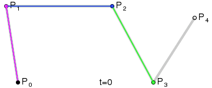
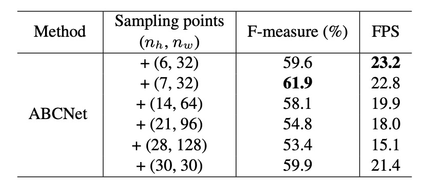
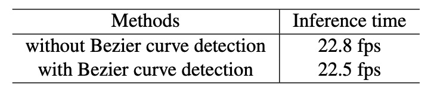

## 貝茲曲線的問候

[**ABCNet: Real-time Scene Text Spotting with Adaptive Bezier-Curve Network**](https://arxiv.org/abs/2002.10200)

---

OCR 已經發展好些年了，但文字偵測和辨識任務仍然是個有挑戰性的問題。

## 定義問題

文字偵測和辨識是 OCR 兩個主要任務。

文字偵測是在圖像中找的文字的位置，這個任務的許多方法都來自自「物件偵測」的和「物件分割」的方法。但文字常常都以歪斜、變形、或曲線排列的樣子出現，這些特性使得文字偵測變得更加困難。

文字辨識是在找到文字的位置後，將文字轉換成可辨識的字元。但受限於文字偵測的誤差，文字辨識的準確率也會受到影響。因此有許多方法基於「不規則文字」為前提，直接假設輸入的文字是不規則的，並且直接對不規則的文字進行辨識，後續衍生出許多像是基於 STN 或是二維注意力機制的方法。

回顧過去的方法，如下圖：

作者認為這些多階段的複雜設計，讓整個系統變得複雜又很慢，實際應用中難以維護且不實用。為了解決文字變形的問題，作者從外觀上的形狀出發，引入了「貝茲曲線」來擬合文字的形狀，並且提出了貝茲校正網路，同時解決文字偵測和辨識的問題。

等等，什麼貝茲曲線？那是什麼？

## 貝茲曲線

- [**Bézier curve-Wikipedia**](https://en.wikipedia.org/wiki/B%C3%A9zier_curve)

貝茲曲線是一種**數學曲線**，用來描述**平滑曲線**的形狀。 它在**電腦圖形設計、字體製作、動畫、UI 設計**等領域中非常常見，幫助創作各種曲線效果。其曲線是透過一組**控制點**來生成的。曲線的起點和終點是控制點的頭尾，而中間的控制點決定曲線如何彎曲。這些控制點不一定在曲線上，但會影響曲線的形狀。

由於貝茲曲線在不同大小的縮放下依然保持平滑。因此它可以用來描述各種形狀，從直線到曲線，甚至是復雜的幾何形狀。

最後我們可以來感覺一下不同階的貝茲曲線，以及它們的形狀：

- **一次（線性）貝茲曲線**：兩個控制點之間的直線。

  - $B(t) = (1 - t) P_0 + t P_1, \quad 0 \leq t \leq 1$

    

- **二次（拋物線）貝茲曲線**：有三個控制點。

  - $B(t) = (1 - t)^2 P_0 + 2(1 - t)t P_1 + t^2 P_2, \quad 0 \leq t \leq 1$

    

- **三次貝茲曲線**（最常用）：四個控制點，用於字體、動畫、UI 設計等。

  - $B(t) = (1 - t)^3 P_0 + 3(1 - t)^2 t P_1 + 3(1 - t) t^2 P_2 + t^3 P_3$

    

- **四次貝茲曲線**：五個控制點。

  - $B(t) = (1 - t)^4 P_0 + 4(1 - t)^3 t P_1 + 6(1 - t)^2 t^2 P_2 + 4(1 - t) t^3 P_3 + t^4 P_4$

    

- **五次貝茲曲線**：六個控制點。

  - $B(t) = (1 - t)^5 P_0 + 5(1 - t)^4 t P_1 + 10(1 - t)^3 t^2 P_2 + 10(1 - t)^2 t^3 P_3 + 5(1 - t) t^4 P_4 + t^5 P_5$

    

:::info
以上的 GIF 圖片都是來自於維基百科的貝茲曲線介紹頁面。
:::

## 解決問題

看完貝茲曲線，好像就讀完這篇論文了。（~並沒有~）

### 模型架構

作者移除了過去的「錨框」（anchor box）和「多階段」的設計，使用貝茲曲線來描述文字的形狀，並且提出了一個**端到端**的訓練框架，用於偵測任意形狀的文字。

貝茲曲線的部分我們剛剛在上面有提到，經過分析，作者認為**三次貝茲曲線**可以有效表示大多數彎曲文字形狀。因此，他們使用 **8 個控制點**來描述邊界框中的文字形狀。

<figure style={{"width": "80%"}}>

</figure>

控制點的回歸學習是透過**相對距離**的方式進行的，這樣可以簡化模型的設計，並且提高模型的準確性，其數學式如下：

$$
\Delta x = b_i^x - x_{\text{min}}, \quad \Delta y = b_i^y - y_{\text{min}}
$$

其中 $x_{\text{min}}$ 和 $y_{\text{min}}$ 是四個頂點的最小 $x$ 和 $y$ 值。

預測頭只需要一層卷積層，輸出 16 個通道以學習 $\Delta x$ 和 $\Delta y$，成本極低且結果準確。

:::tip
文字區域分為上層曲線和下層曲線，才能把文字區域包覆，所以一條三次貝茲曲線需要 4 個控制點，而兩條曲線共需要 8 個控制點。

每個點的座標是 $(x, y)$，所以 8 個控制點共有 16 個座標。
:::

### 貝茲曲線資料生成

目前的訓練資料集中，沒有貝茲曲線的標註資料。

因此，作者提出了一種基於現有標註資料生成貝茲曲線的 Ground Truth 的方法。

這個方法是利用**Total-Text** 和 **CTW1500** 等資料集中的多邊形標註點，透過**最小平方法**，找到三次貝茲曲線的最佳參數：

$$
\begin{bmatrix}
B_{0,3}(t_0) & \cdots & B_{3,3}(t_0) \\
B_{0,3}(t_1) & \cdots & B_{3,3}(t_1) \\
\vdots & \ddots & \vdots \\
B_{0,3}(t_m) & \cdots & B_{3,3}(t_m)
\end{bmatrix}
\begin{bmatrix}
b_{x0} & b_{y0} \\
b_{x1} & b_{y1}\\
b_{x2} & b_{y2}\\
b_{x3} & b_{y3}\\
\end{bmatrix}
=
\begin{bmatrix}
p_{x0} & p_{y0} \\
p_{x1} & p_{y1} \\
\vdots & \vdots \\
p_{xm} & p_{ym}
\end{bmatrix}
$$

其中 $m$ 表示多邊形的標註點數，$t$ 根據折線的累積長度與周長比例計算，範例如下圖：

### 訓練資料合成

為了訓練端到端場景文字偵測模型，需要大量合成的免費資料來進行模型訓練。然而，現有的 SynText 資料集 (共 80 萬張圖像) 僅為大部分直文字提供了四邊形邊界框，難以涵蓋任意形狀的場景文字需求。因此，作者進一步擴充資料集，合成 15 萬張多樣化的圖像，以提升模型對於彎曲文字的偵測能力。

新資料集的構成如下：

- **94,723 張圖像**：包含大多為**直文字**。
- **54,327 張圖像**：包含大多為**彎曲文字**。

資料來源如下：

- 使用 **VGG 合成方法** 來生成這些合成圖像。
- 選取 **4 萬張無文字背景圖像**來自 **COCO-Text** 資料集。

在從 COCO-Text 中取得的背景圖像上為每個背景準備分割遮罩。同時準備每張背景的場景深度資訊，以提升文字與背景之間的融合效果。為了增加文字形狀的多樣性，作者對 VGG 合成方法進行了改進，加入了不同風格的藝術字體和豐富的文字語料庫，並對生成的文字進行曲線變形和多樣化排版，模擬各種場景中的文字樣式。每一組文字實例都會自動生成多邊形標註，描述其外型。

此外，作者會將多邊形標註轉換為三次貝茲曲線的 Ground Truth，確保模型能精準擬合各種彎曲文字的外型，提升偵測效果。這些處理簡化了資料的生成流程，且能有效增強模型對任意形狀場景文字的偵測能力，滿足真實場景應用的需求。

合成資料結果如下：

### 貝茲校正法

傳統取樣方法如下：

- [**RoI Pooling**](https://arxiv.org/abs/1707.03985)
- [**RoI Rotate**](https://arxiv.org/abs/1801.01671)
- [**Text-Align-Sampling**](https://arxiv.org/abs/1803.03474)
- [**RoI Transform**](https://arxiv.org/abs/1812.09900)

BezierAlign 是基於 RoIAlign 的延伸，但與 RoIAlign 不同，它使用「非矩形的取樣網格」來對齊特徵。特徵對齊網格的每一列均與貝茲曲線的邊界垂直，保證了對齊效果的準確性。取樣點在寬度和高度上均等距分布，並使用雙線性插值（bilinear interpolation）來計算取樣結果。

給定特徵圖與貝茲曲線的控制點後，就可以計算出矩形輸出特徵圖的每一像素位置。

假設輸出特徵圖的大小為 $h_{\text{out}} \times w_{\text{out}}$，計算過程如下：

- 將第 $i$ 個像素 $g_i$ 的水平位置記為 $(g_{iw}, g_{ih})$。
- 透過以下公式計算參數 $t$：

  $$
  t = \frac{g_{iw}}{w_{\text{out}}}
  $$

- 使用 $t$ 和貝茲曲線方程，計算上邊界點 $t_p$ 與下邊界點 $b_p$。

- 根據 $t_p$ 和 $b_p$，透過以下公式計算取樣點 $o_p$ 的位置：

  $$
  op = bp \cdot \frac{g_{ih}}{h_{\text{out}}} + tp \cdot \left(1 - \frac{g_{ih}}{h_{\text{out}}}\right)
  $$

- 有了 $o_p$ 的位置後，即可進行**雙線性插值**來計算最終結果。

BezierAlign 能處理任意形狀的文字區域，不受矩形網格的限制，特別適用於彎曲文字的偵測和辨識。高效率且無需片段化處理，簡化了計算過程。與傳統方法相比，BezierAlign 在特徵對齊的精準度和效率上有明顯提升，詳細比較如下：

### 文字預測頭

<figure style={{"width": "80%"}}>

</figure>

基於與偵測分支共用的骨幹網路特徵以及 BezierAlign，作者設計了一個**輕量級的文字辨識分支**，如上表。

- **卷積層**：共 6 層，前 4 層的步幅為 1，後 2 層的垂直步幅為 2、水平步幅為 1。
- **Average Pooling**：在高度方向進行平均池化，將輸出尺寸壓縮為 $(n, 256, 1, w)$。
- **通道排列**：調整張量形狀，輸入至 **BLSTM**。
- **BLSTM**：輸出大小為 $(w, n, 512)$，有助於捕捉文字的雙向序列資訊。
- **全連接層**：最終輸出為 $(w, n, n_{\text{class}})$，其中 $n_{\text{class}} = 97$，涵蓋**大小寫字母、數字、符號、其他特殊符號**以及代表結束符號的 EOF。

訓練階段，辨識分支直接從貝茲曲線的 GT 中提取 RoI 特徵，使得偵測分支和辨識分支互不影響。文字對齊使用「CTC Loss」進行輸出分類結果與文字對齊，保證模型的訓練穩定性。

推論階段，RoI 區域由偵測分支中得到的貝茲曲線結果替代，確保文字能準確對齊於彎曲區域。

### 訓練配置

- 使用 ResNet-50 搭配特徵金字塔網路（FPN）。
- 在 5 個不同解析度的特徵圖上使用 **RoIAlign**：
  - 特徵圖解析度為輸入圖像的 $1/8, 1/16, 1/32, 1/64, 1/128$。
- 在 3 個不同大小的特徵圖上應用 **BezierAlign**：
  - 特徵圖大小為輸入圖像的 $1/4, 1/8, 1/16$。
- 使用公開的**英文單詞級資料集**進行預訓練，包括：
  - 15 萬張合成數據。
  - 從 COCO-Text 資料集中篩選出的 1.5 萬張圖像。
  - ICDAR-MLT 資料集中的 7,000 張圖像。
- 預訓練後，在目標資料集的訓練集中進行微調。

---

資料增強策略如下：

- **隨機縮放訓練**：
  - 短邊尺寸隨機選擇在 560 到 800 之間。
  - 長邊尺寸限制為不超過 1333。
- **隨機裁切（Random Crop）**：
  - 確保裁切後的區域至少為原圖的一半，且不會切斷文字。
  - 若遇到特殊情況無法滿足條件，則不進行裁切。

---

硬體環境如下：

- 使用 **4 塊 Tesla V100 GPU** 進行訓練。
- 每批次的影像數量為 32。

---

訓練參數如下：

- **最大迭代次數**：150,000 次。
- **初始學習率**：0.01。
- 學習率調整：
  - 在第 70,000 次迭代時降至 0.001。
  - 在第 120,000 次迭代時進一步降至 0.0001。

整個訓練過程約 3 天完成。

## 討論

作者基於 Total-Text 資料集進行比較和消融實驗，結果如下：

### BezierAlign 效能分析

<figure style={{"width": "80%"}}>

</figure>

為了驗證 BezierAlign 的效果，作者在 Total-Text 上進行消融實驗，探討取樣點數量對結果的影響，如上表所示：

實驗結果顯示：取樣點數量顯著影響最終的效能和運算速度。

當取樣點為 **(7,32)** 時，F-measure 和每秒畫面數（FPS）達到最佳平衡，因此作者在後續實驗中使用此配置。此外，將 BezierAlign 與先前的取樣方法進行比較（如下表），顯示 BezierAlign 能顯著提升端到端的偵測效果：

<figure style={{"width": "80%"}}>

</figure>

### 貝茲曲線效能分析

<figure style={{"width": "80%"}}>

</figure>

分析結果如上，貝茲曲線偵測與標準的邊界框偵測相比，並未引入額外的運算成本。

### Total-Text 上的實驗結果

作者將 **ABCNet** 與其他方法進行比較，如上表所示：

- **單尺度推論**：ABCNet 在維持高效能的同時，達到了接近即時的推論速度，實現了速度和準確度的最佳平衡。
- **多尺度推論**：進一步提升了準確度，ABCNet 在多尺度推論下取得了**最新技術的表現**，尤其在運行時間上顯著超越其他方法。
- ABCNet 的加速版本在準確度相當的情況下，推論速度比先前最佳方法 **快 11 倍以上**。

## 結論

ABCNet 延續了過去 ROI Proposal 的設計，先是引入了貝茲曲線，並且提出了 BezierAlign 層，用於對齊特徵圖與貝茲曲線的邊界，提升了文字偵測與辨識的準確度。此外，作者還提出了一種新的資料合成方法，用於生成多樣化的文字圖像，進一步提升了模型的泛化能力。

這篇論文的設計理念對於未來的文字偵測和辨識任務提供了新的視角和發展方向，值得進一步研究和探討。
