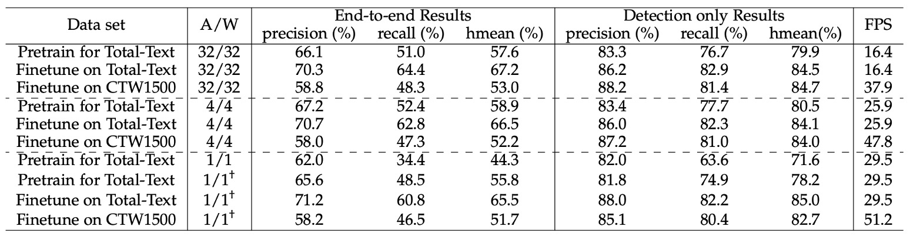

## 一位元爭鋒

[**ABCNet v2: Adaptive Bezier-Curve Network for Real-time End-to-end Text Spotting**](https://arxiv.org/abs/2105.03620)

---

第一版論文投稿後，得到了一些審查意見。

作者對其進行部分修改和新增一些章節，為了與第一版區分，於是將這個版本稱為 ABCNet v2。

由於大部分的內容，甚至訓練方式都一樣，我們將在這裡只討論新增的部分。想要了解 ABCNet 的基本概念，可以參考我們之前讀過的文章：

- [**[20.02] ABCNet: 貝茲曲線的問候**](../2002-abcnet/index.md)

## 定義問題

受到其他作品的啟發，作者決定升級 ABCNet。

主要參考目標為：

1. [**[19.11] Efficientdet: Scalable and efficient object detection**](https://arxiv.org/abs/1911.09070)
   - 這篇論文中提出 BiFPN，優化 FPN 的方法，作者將這個方法應用到 ABCNet 上。
2. [**[18.07] An intriguing failing of convolutional neural networks and the coordconv solution**](https://arxiv.org/abs/1807.03247)
   - 這篇論文提出 CoordConv，探討座標信息對於 CNN 的重要性。
3. [**[20.03] Solov2: Dynamic and fast instance segmentation**](https://arxiv.org/abs/2003.10152)
   - 這篇論文採用 CoordConv，應用在實例分割上，作者也將這個方法應用到 ABCNet 上。

---

改進後的 ABCNet v2 有以下幾個貢獻點：

- 提出了貝茲曲線文字表示方法。（這個跟第一版一樣。）
- 提出了 BezierAlign 特徵對齊方法。（這個跟第一版一樣。）
- 使用 BiFPN，雙向多尺度金字塔全局文本特徵。（新增的部分。）
- 提出自適應端到端訓練策略。（新增的部分。）
- 新增中文辨識數據集，支援中文辨識。（新增的部分。）
- 量化模型，提高推理速度。（新增的部分。）

## 解決問題

我們講講新增的部分。

### 模型架構

### 座標卷積模組

這個就是我們剛提到的 CoordConv，根據過去的研究，傳統卷積在對應 (x, y) 座標和像素空間座標時有其限制。

為解決此問題，作者在這個版本上，將相對座標與特徵圖拼接，形成帶有座標信息的新特徵 $f_{coord}$，並通過三層卷積層（核大小 3，stride 為 1，padding 為 1）輸入後續網路，增強場景文字檢測效果。

### 基於注意力的辨識分支

辨識分支包含六層卷積層、一層雙向 LSTM 和一個注意力模組。辨識過程中，利用先前的隱藏狀態及加權和，逐步進行字元預測。類別數為 96（僅英文字母）或 5462（中英雙語），注意力權重計算如下：

$$
e_{t,s} = K^\top \tanh(W h_{t-1} + U h_s + b)
$$

加權和：

$$
c_t = \sum_{s=1}^n a_{t,s} h_s
$$

隱藏狀態更新：

$$
h_t = \text{GRU}((\text{embed}_{t-1}, c_t), h_{t-1})
$$

### 自適應端到端訓練

原文是 Adaptive End-to-End Training，論文中簡稱為 AET。

在 ABCNet 第一版中，訓練階段僅使用真實標註的 Bezier 曲線對齊作為文字辨識分支的輸入，而測試階段則採用檢測結果進行特徵裁剪。

作者觀察到當檢測結果不如真實標註的 Bezier 曲線邊界精確時，可能會產生錯誤。

:::tip
典型的誤差傳播問題，因為我們在訓練過程中的輸入都是正確無誤的，導致下游任務中無法應對錯誤的情況。
:::

為了解決此問題，作者提出了一種簡單而有效的策略，稱為自適應端到端訓練（Adaptive End-to-End Training, AET），其主要流程如下：

1. **檢測結果篩選**：檢測結果首先通過信心門檻進行篩選，並使用非極大值抑制（NMS）消除冗餘的檢測結果。
2. **辨識標註分配**：根據控制點坐標的距離總和最小化，為每個檢測結果分配相應的辨識標註，公式如下：

   $$
   \text{rec} = \arg \min_{\text{rec}^* \in cp^*} \sum_{i=1}^n |cp^*_{x_i, y_i} - cp_{x_i, y_i}|
   $$

   其中，$cp^*$ 表示控制點的真實標註，$n$ 是控制點的數量。這樣可以確保每個檢測結果與最接近的標註相匹配。

3. **標註集更新**：將新的目標與原始真實標註集進行拼接，並用於後續的辨識訓練。

### 模型量化

作者使用模型量化的技術，探討在不同精度下的模型表現和推論速度，這是目前文字偵測領域中比較少見的工作。

:::tip
考慮到模型量化是個很大的主題，往下可以細分為動態量化、靜態量化和混合量化等，在這個章節中，作者把整套量化的公式理論都寫了出來，但是我們認為「理解模型量化理論」這部分偏離主題，有興趣的讀者建議可以去找模型量化理論來看。
:::

## 討論

### 消融實驗

為評估各元件的效果，作者在 Total-Text 和 SCUT-CTW1500 兩個數據集上進行消融研究。

根據上表，我們可以看到幾個主要的實驗結果：

1. **注意力辨識模組**：加入注意力辨識模組後，Total-Text 數據集的準確率提升 2.7%，而 SCUT-CTW1500 提升 7.9%。
2. **BiFPN 架構**：使用 BiFPN 架構可額外提升 1.9%（Total-Text）與 1.6%（SCUT-CTW1500）的效果，而推理速度僅降低 1 FPS，實現了速度與準確度間的良好平衡。
3. **座標卷積 (CoordConv)**：使用座標卷積後，兩個數據集的效果分別提升了 2.8% 與 2.9%，且幾乎不增加額外計算量。
4. **自適應端到端訓練 (AET)**：採用 AET 策略後，效果在兩數據集上分別提升 1.2% 與 1.7%。
5. **Bezier 曲線階數**：作者探討 Bezier 曲線階數設定對結果的影響，發現使用 4 階 Bezier 曲線重新生成標註，並訓練 ABCNet v2 回歸控制點，結果顯示增加階數有助於提升效果，尤其是對使用文字行標註的 SCUT-CTW1500 數據集。然而，在 Total-Text 數據集上使用 5 階 Bezier 曲線時，相較於基線模型，其效果由 66.2% 下降至 65.5%。作者在這裡推測過高的階數可能導致控制點變動劇烈，增加回歸難度。

### 文字偵測方法比較

偵測任務的實驗在四個數據集上進行，包括兩個任意形狀數據集（Total-Text 和 SCUT-CTW1500）、兩個多方向數據集（MSRA-TD500 和 ICDAR 2015），以及一個雙語數據集 ReCTS。

實驗結果如上表，ABCNet v2 的方法在所有數據集上均達到最新技術的最佳性能，超越了現有的最佳方法。

### 文字辨識方法比較

在端到端場景文字偵測任務中，ABCNet v2 在 SCUT-CTW1500 和 ICDAR 2015 數據集上取得最佳表現，顯著超越先前方法。

### 量化模型效果

<figure>

<figurecaption>"A/W" 分別表示激活和權重的位寬配置，"†"表示採用漸進式訓練策略。</figurecaption>
</figure>

---

作者針對量化模型進行許多探討。

首先，在合成數據集上對低位元模型進行預訓練，接著在 TotalText 和 CTW1500 進行微調以提升性能。

預訓練階段進行 260K 次迭代，批次大小為 8，初始學習率設為 0.01，在 160K 和 220K 次迭代時減少至原來的十分之一。

在 TotalText 上微調時，批次大小保持 8，初始學習率設為 0.001，進行 5K 次迭代。CTW1500 的微調設置相同，但總迭代次數為 120K，並在 80K 時將學習率減少十倍。除了輸入和輸出層外，網路中的所有卷積層均進行量化。

實驗結果如上表，可以看到：

- **4 位元模型**：其性能幾乎能與全精度模型相當。

  - 在合成數據集上預訓練的 4 位元模型的端到端 Hmean 分數（57.6%）甚至優於全精度模型（58.9%）。
  - 在 TotalText 和 CTW1500 微調後，4 位元模型的端到端 Hmean 僅比全精度模型分別低 0.7%和 0.8% 。

  這些結果顯示全精度模型在場景文字偵測任務中具有相當大的冗餘，並且幾乎無性能損失的 4 位元模型在圖像分類和物體檢測任務中也有類似觀察結果。

- **1 位元模型 (Binary Network, BNN)**：

  在端到端 Hmean 僅有 44.3%，性能有明顯下降。

  為彌補這一點，作者提出漸進式訓練策略（以 † 標示），逐步降低量化位元數（如 4 位元 → 2 位元 → 1 位元），顯著提升 BNN 的性能。

  經過新訓練策略後，BNN 在合成數據集上訓練的端到端 Hmean 僅比全精度版本低 1.8%（57.6% 對比 55.8%）。

## 結論

這篇論文中測試了幾個新元件，包含注意力辨識模組、BiFPN 結構、座標卷積和新的自適應端到端訓練策略。

作者展示了許多訓練技巧和策略，我們認為這篇論文有很多值得學習的地方，在實務上都可以派上用場。
