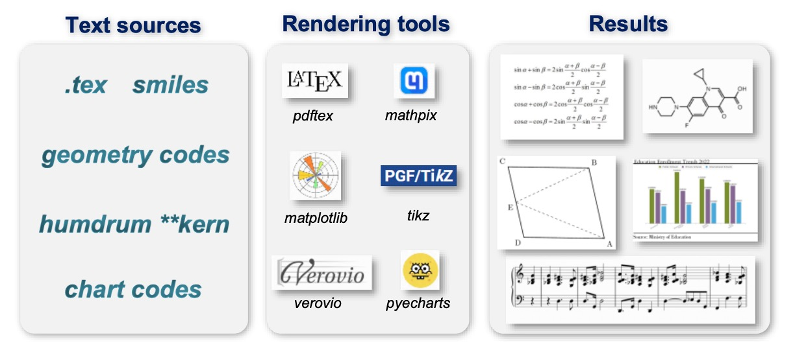
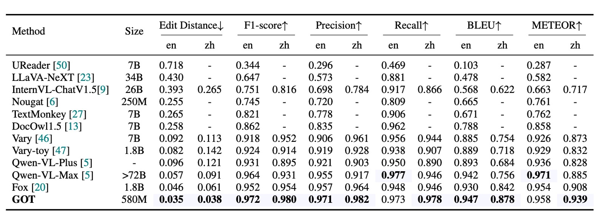
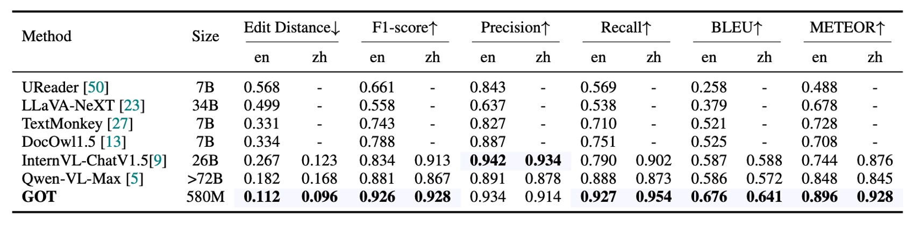
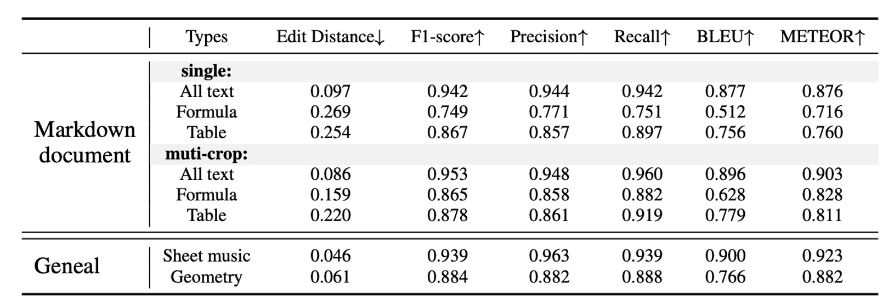
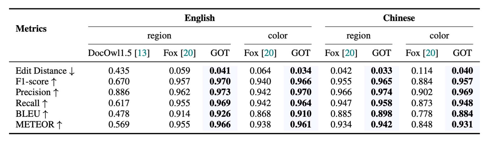
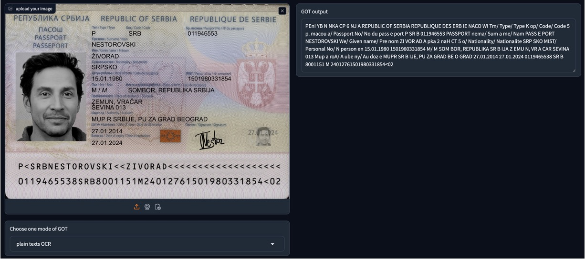

## 包山包海 OCR

[**General OCR Theory: Towards OCR-2.0 via a Unified End-to-end Model**](https://arxiv.org/abs/2409.01704)

---

這是篇由中國曠視科技提出的 End-to-End OCR 論文。

## 定義問題

OCR 是個廣泛使用的技術，典型的系統主要基於多模組的管線設計，包含偵測，裁切，辨識。每個模組各司其職，通常會針對特定任務開發不同的模型，整體來說容易陷入局部最優，維護不方便。

因此，本篇論文的作者認為過去的這些基於管線式系統設計的模型，屬於是「OCR 1.0 模型」，而此時此刻他們現在要提出一個 All-In-One 的模型，這個模型有幾個特點：

1. 它是一個統一的端到端模型
2. 它能夠解決傳統和 LVLM 模型在 OCR 任務上的瓶頸
3. 它可以應對多種廣義的 OCR 任務

而這個模型被命名為： **GOT-OCR2.0！**

:::tip
我們基於論文的原話：

---

`Typical OCR systems in the OCR-1.0 era are mainly designed based on a multi-modular pipeline style, commonly including element detection, region cropping, and character recognition parts.`

---

`Accordingly, we propose the general OCR theory, i.e., OCR-2.0, to break the bottlenecks of both traditional and LVLM manners on OCR tasks.`

---

以上兩段，作者以管線式的 OCR 系統架構作為分界，劃分為 OCR 1.0 時代的模型和 2.0 時代的模型。
:::

## 解決問題

### 模型架構

上圖除了展示模型架構之後，同時也展示了訓練過程。

模型架構分為三個部分：

- **Vision Encoder**：這是影像編碼層，負責影像特徵提取。
- **Linear**：這是線性變換層，用來橋接編碼層和解碼層的特徵維度。
- **Text Decoder**：這是文本解碼層，輸入影像資訊，並負責文本生成。

訓練過程也分為三個階段：

### 第一階段訓練

作者採用 ViTDet 的編碼器架構，由於其局部注意力機制可大幅降低高解析度圖像的計算成本，參數量大約為 80M，並使用 5M 的圖像文字對來進行訓練。

- [**[22.03] Exploring Plain Vision Transformer Backbones for Object Detection**](https://arxiv.org/abs/2203.16527)

架構設計遵循 **Vary** 的設定來設計編碼器的最後兩層，將 1024×1024×3 輸入圖像轉換為 256×1024 的圖像 tokens。這些圖像 tokens 隨後通過 1024×768 的線性層投射到語言模型（OPT-125M）的維度中。

- [**[23.12] Vary: Scaling up the vision vocabulary for large vision-language models**](https://arxiv.org/abs/2312.06109)

在預處理階段，將不同形狀的圖像直接調整為 1024×1024 的方形，這樣可以平衡不同縱橫比的圖像需求。

---

訓練數據的部分分成兩種：

- **自然場景數據**

  英文圖像從 Laion-2B 數據集中抽樣，中文圖像則從 Wukong 數據集中獲取。這些場景中的文字使用 PaddleOCR 工具獲得偽標註。在這個步驟中，作者獲取了 200 萬筆數據，英文和中文各佔一半。

  :::tip
  直接以 PaddleOCR 的輸出結果作為訓練標籤。
  :::

- **文件級數據**

  作者從 Common Crawl 中收集開源的 PDF 類型文件，並使用 Fitz Python 程式包提取對應的密集文字內容。這裡共獲得 120 萬對全頁 PDF 類型的圖像-文本對應數據，並通過解析的邊界框裁切 PDF 圖像，獲得 80 萬筆行與段落級的圖像片段數據。

最後，文字標註處理分為兩種方式：

- 移除邊界框，並從上到下、從左到右依序將文字內容組合。
- 根據邊界框從原始圖像中裁切文字區域，並以圖像片段的形式儲存，此方式獲得 100 萬筆片段類型的圖像-文本對應數據。

### 第二階段訓練

在視覺編碼器的預訓練階段結束後，接著是透過「多任務聯合訓練」來擴展模型知識量。

在這個階段，會捨棄第一階段使用的 OPT-125M 模型，並改用 Qwen-0.5B 模型，這個模型具有 500M 的參數量，並且具備多語言的先驗知識。線性嵌入層的維度調整為 1024×1024，以符合 Qwen-0.5B 的輸入通道，最終 GOT 採用了編碼器-解碼器範式，總參數量約為 580M。

在 GOT 的流程中，輸入影像為 1024 x 1024 像素，然後會壓縮成 256 個 tokens。解碼器會參考這些 tokens 來預測 OCR 結果，最大長度可達 8K。

---

訓練數據的部分必須重新考慮，因為在這個階段作者希望可以注入更多 OCR 的知識。

因此，作者探索了多種數據生成方法與引擎：

- **純 OCR 數據**

  80% 的 3.2.2 節中的數據作為純 OCR 數據，並增加手寫文字辨識子任務，包含來自不同語言的多種手寫風格。數據集包括中文 CASIA-HWDB2、英文 IAM 及挪威語 NorHand-v3。

- **Mathpix-markdown 格式數據**

  為了保持輸出結果的高可讀性，尤其對數學公式和表格，作者使用不同方法收集大量格式化數據：

  - **數學公式**：從 Arxiv 上抓取 .tex 源文件，提取約 100 萬個公式片段，並轉換為 Mathpix 格式，最終渲染為 PNG 圖像。
  - **分子公式**：從 ChEMBL_25 文件中獲取 200 萬個 smiles 源，使用 Mathpix 和 rdkit.Chem 工具生成約 100 萬個分子公式圖像-文本對應數據。
  - **表格**：從 .tex 文件中提取 30 萬個表格源，使用 LATEX 渲染成圖像。
  - **全頁數據**：使用 Nougat 方法獲取 50 萬對英文 Markdown PDF-文本數據，以及 50 萬對中文 Markdown 數據。此外，作者使用 Mathpix 直接標記了 20 萬筆內部數據，包括書籍、論文和財務報告。

- **更廣泛的 OCR 數據**

  為了讓 GOT 能處理更通用的光學人工字元，作者收集了三個相關的挑戰任務數據：

  - **樂譜**：使用 GrandStaff 數據集進行渲染，獲得約 50 萬筆單系統樂譜數據。
  - **幾何圖形**：使用 TikZ 構建基本幾何圖形，如圓形、矩形、三角形及簡單的函數曲線，最終獲得約 100 萬筆幾何 TikZ 數據。
  - **圖表**：參考 OneChart，使用 Matplotlib 和 Pyecharts 渲染圖表數據，最終獲得 200 萬筆圖表數據，其中一半來自 Matplotlib，另一半來自 Pyecharts。

### 第三階段訓練

完成第二階段後，其實模型已經可以應對多種 OCR 任務了，最後作者希望可以讓模型提供更多功能，所以在這個階段，作者提出了三個新功能：

- **細粒度互動式 OCR 的數據引擎**

  細粒度 OCR 是一種高互動性的功能，由空間坐標或顏色控制的區域級視覺感知。使用者可在問題提示中添加框坐標（框引導 OCR）或顏色文本（顏色引導 OCR），來辨識感興趣區域（RoI）內的文字，避免輸出無關字元。

  自然場景的細粒度 OCR 數據來自開源數據集，包括 RCTW、ReCTS、ShopSign 和 COCO-Text。這些數據集提供文本邊界框，用於直接生成細粒度 OCR 數據。文件級別的細粒度是透過過濾掉掃描格式的 PDF 文件，並使用 Python 套件 Fitz/PDFminer 解析其餘部分。記錄頁面圖像、每行/段落的邊界框及對應的文本，產生框引導 OCR 的標註數據。

- **超大圖像 OCR 的多裁剪數據引擎**

  GOT 支援 1024×1024 的輸入解析度，這足夠應對大多數常用 OCR 任務，如場景 OCR 或 A4 頁面 PDF OCR。對於一些需要處理極大圖像的場景（如兩頁 PDF 的橫向拼接），GOT 使用大滑動窗口來實現動態解析度。

- **多頁 PDF 文件批量 OCR 的數據引擎**

  在常規的 OCR 任務中，可以使用 「for 迴圈」 進行多頁處理，但對於一些難以逐頁分解的格式化 PDF 文件（如 Arxiv 上的 .tex 文件），這樣做並不適用。GOT 的多頁 OCR 功能可直接對多頁 PDF 進行批量處理，無需 「for 迴圈」。這使得研究人員無需擔心 PDF 分頁造成的真實標註斷裂問題。

  為實現該功能，作者從 Mathpix 格式的 PDF 數據中隨機抽取 2-8 頁，將它們合併為單輪 OCR 任務。每頁選擇少於 650 個 tokens 的文本，以確保整體長度不超過 8K。最終生成約 20 萬筆多頁 OCR 數據，大部分數據包含交錯的中英文頁面。

### 訓練策略

作者使用 8×8 L40s GPU 進行訓練，搭配剛才提到的三階段訓練：

- **預訓練階段**：全模型參數使用 AdamW 優化器，批次大小為 128，訓練 3 個 epoch，起始學習率為 1e-4，最大 token 長度設置為 4096。
- **聯合訓練階段**：最大 token 長度提升至 6000，使用與預訓練相同的優化器設置，訓練 1 個 epoch。
- **後訓練階段**：最大 token 長度擴展至 8192，起始學習率為 2e-5，訓練 1 個 epoch，以支援多區塊/頁面 OCR 功能。

## 討論

### 純文本文件 OCR 性能

如上表，主要的評估指標為編輯距離、F1 分數、精度、召回率、BLEU 和 METEOR，並採用詞級分割來計算。GOT(580M) 在文件純文本 OCR 任務中表現卓越，證明其出色的 PDF 文本感知和辨識能力。

### 場景文本 OCR 性能

作者在這裡收集了 400 張自然圖像，分別來自中文和英文，作為場景文本 OCR 的基準測試。因為場景圖像中的文本相對較短，所以使用字元級分割來計算各項指標。

GOT 在自然圖像中的表現也相當出色，證明了該模型在大多數基礎 OCR 任務上的優秀表現。

### 格式化文件 OCR 性能

資料來源是作者準備的 90 頁樣本，經 Mathpix 生成偽標籤並手動校正錯誤。單一解析度（1024×1024）的 GOT 能夠提供令人滿意的結果，而動態解析度策略則進一步提升了在小文本公式和表格中的表現。

### 細粒度 OCR 性能

GOT 在細粒度 OCR（包括框引導和顏色引導的 OCR 任務）中表現卓越，優於 Fox，表明該模型具備出色的互動式 OCR 能力。

## 結論

GOT 在結構上相對簡單，並且更加專注於純粹的 OCR 任務，從而在多個任務上展示出卓越的性能。其中最大亮點在於其能夠整合多種 OCR 任務，包括文件級別的文本辨識、場景文本辨識、細粒度的互動式 OCR、格式化文件辨識以及更多通用的字元辨識。這一能力使得該模型不僅能夠處理傳統的 OCR 任務，還具備面向未來發展的彈性。

相關模型開放在 Hugging Face 上: [**GOT-OCR2.0**](https://huggingface.co/stepfun-ai/GOT-OCR2_0)

測試功能可以直接到網頁 Demo 上進行：[**Online Demo**](https://huggingface.co/spaces/stepfun-ai/GOT_official_online_demo)

:::tip
我們自己測試了一下，如果是輸入 PDF 論文，GOT-OCR2.0 可以幫你直接提取出文字內容，並且支援多語言，效果相當不錯！

但是如果是模型沒有見過的格式，可能會有一些問題，例如我們輸入 MIDV-2020 的護照圖像，GOT-OCR2.0 無法理解護照的格式，所以只能提取出一些零散的文字內容。

若要使用必須自己準備微調數據，或者直接使用作者提供的數據引擎來進行微調。

:::
