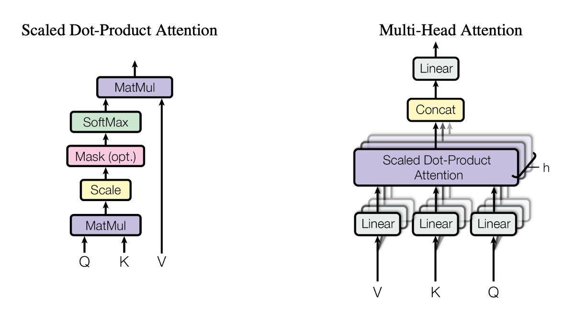

## 新世界的起點

[**Attention Is All You Need**](https://arxiv.org/abs/1706.03762)

---

有別於過去的時序列模型，Transformer 模型的提出，開啟了自注意力機制的新紀元。

這個模型不再依賴序列的遞歸計算，而是通過注意力機制來實現序列建模，使得模型的訓練和推理過程更加高效。

## 定義問題

在過去的序列建模任務中，RNN 和 LSTM 模型是主流。

然而，這些模型在訓練和推理過程中存在著一些問題：

- **遞歸計算的限制**：RNN 和 LSTM 模型在訓練過程中需要逐步計算序列中的每個元素，這導致模型難以進行高效的並行計算。
- **長距離依賴問題**：由於 RNN 和 LSTM 模型的遞歸計算方式，導致了模型在處理長序列時，難以捕捉到序列中較遠位置的依賴關係。

## 解決問題

### 模型設計

<div align="center">
<figure style={{"width": "50%"}}>

</figure>
</div>

這是原始論文提供的 Transformer 模型架構示意圖。

雖然這個架構圖畫得非常簡潔（？？？），但大多數的人通常不會第一次就能理解它。

你別不信，這真的很簡潔了！

我們直接寫個簡單的程式碼，來看看這個模型的實際運作：

### 輸入層

這裡的輸入是一個時序列資料，為一個張量（Tensor）。

- 第一個維度：批次大小（Batch Size），以下簡稱 `B`。
- 第二個維度：序列長度（Sequence Length），以下簡稱 `T`。
- 第三個維度：特徵維度（Feature Dimension），以下簡稱 `D`。

首先來個簡單的例子：

```python
input_text = ['你', '好', '啊', '。']
input_text_mapping = {
    '你': 0,
    '好': 1,
    '啊': 2,
    '。': 3
}
```

在這個例子中，輸入內容為：「你好啊。」，總共有 4 個字元。

:::info
這裡我們對整個訓練過程進行大量地簡化，僅僅是為了讓你更容易理解。
:::

接著把這個輸入轉換成張量：

```python
import torch
import torch.nn as nn

input_tensor = torch.tensor([
    input_text_mapping[token]
    for token in input_text]
)
print(input_tensor)
# >>> tensor([0, 1, 2, 3])
```

接著，我們把每個元素進行 Embedding。

```python
embedding = nn.Embedding(num_embeddings=4, embedding_dim=512)
embedded_input = embedding(input_tensor)
print(embedded_input)
# >>> tensor([[ 0.1,  0.2,  0.3,  ...,  0.4],
#             [ 0.5,  0.6,  0.7,  ...,  0.8],
#             [ 0.9,  1.0,  1.1,  ...,  1.2],
#             [ 1.3,  1.4,  1.5,  ...,  1.6]])
print(embedded_input.shape)
# >>> torch.Size([4, 512])
```

:::tip
Embedding 不是什麼高深的技術，就是把每個元素投影到一個更高維度的空間，裡面只包含一個線性轉換層而已。
:::

最後，別忘記我們需要的輸入是一個 3D 張量，所以我們需要再增加一個批次數量的維度，在這個例子中，批次數量為 1。

```python
embedded_input = embedded_input.unsqueeze(0)
print(embedded_input.shape)
# >>> torch.Size([1, 4, 512])
```

### 位置編碼

在原始的 RNN 和 LSTM 模型中，模型可以通過序列中元素的位置來捕捉序列中的依賴關係。

所以我們不需要特別設計位置編碼，模型在每個 For-Loop 迭代中都隱含了位置信息。

但是在 Transformer 架構內並不具備這種隱含的位置信息，這裡有的只有線性轉換層。在線性轉換層中，每個元素都是獨立的，沒有任何關聯性，內部不帶有任何關聯資訊。因此，我們需要額外的位置編碼來幫助模型捕捉序列中的位置信息。

在本論文中，作者提出了一種簡單的位置編碼方式，就是使用正弦和餘弦函數來生成位置編碼，對於給定的序列位置 $pos$ 和編碼維度 $i$：

$$
PE_{(pos, 2i)} = \sin\left(\frac{pos}{10000^{\frac{2i}{d_{model}}}}\right)
$$

$$
PE_{(pos, 2i+1)} = \cos\left(\frac{pos}{10000^{\frac{2i}{d_{model}}}}\right)
$$

其中：

- $pos$ 是序列中元素的位置（從 0 開始）。
- $i$ 是特徵維度中的索引（從 0 開始）。
- $d_{model}$ 是位置編碼的維度（通常與模型輸入的特徵維度相同）。

我們根據上面的公式，來實現一個位置編碼的函數：

```python
import math
import torch

def sinusoidal_positional_encoding(length, dim):
    """ Sinusoidal positional encoding for non-recurrent neural networks.
        REFERENCES: Attention Is All You Need
        URL: https://arxiv.org/abs/1706.03762
    """
    if dim % 2 != 0:
        raise ValueError(
            'Cannot use sin/cos positional encoding with '
            f'odd dim (got dim={dim})')

    # position embedding
    pe = torch.zeros(length, dim)
    position = torch.arange(0, length).unsqueeze(1)
    div_term = torch.exp(
        (torch.arange(0, dim, 2, dtype=torch.float) * -(math.log(10000.0) / dim)))
    pe[:, 0::2] = torch.sin(position.float() * div_term)
    pe[:, 1::2] = torch.cos(position.float() * div_term)

    return pe
```

這個函數同時考慮了序列的長度和特徵維度，給予每個位置一個固定的位置編碼。

我們把位置編碼可視化一下，假設序列長度為 256，特徵維度為 512：

```python
import cv2
import numpy as np

pos_mask = sinusoidal_positional_encoding(256, 512)
pos_mask = pos_mask.numpy()
pos_mask = (pos_mask-pos_mask.max()) / (pos_mask.max()-pos_mask.min())
pos_mask = np.array(pos_mask * 255).astype(np.uint8)
pos_mask = cv2.applyColorMap(pos_mask, cv2.COLORMAP_JET)
```


:::tip
**那個數學式中的 10000 是什麼？**

這個 10000 的物理意義可以被解釋為位置編碼的尺度。我們將位置編碼的尺度限制在一個合適的範圍內，以便它能夠有效地捕捉到不同位置之間的關係，同時避免了太高或太低的頻率造成的不良影響。

如果將位置編碼中的 10000 改為 100，將會改變正弦和餘弦函數的頻率，正弦和餘弦函數的頻率將增加，每個位置的位置編碼將在更短的距離內週期性地重複。這可能會導致模型對於較遠位置之間的關係感知能力下降，因為它們的位置編碼會顯示出更大的相似性。
:::

得到位置編碼後，我們需要將它加到輸入的 Embedding 張量上：

```python
pos_emb = sinusoidal_positional_encoding(4, 512)
embedded_input = embedded_input + pos_emb
```

### 自注意力機制

取得輸入編碼後，我們就可以進入 Transformer 模型的核心部分：自注意力機制。

這裡需要準備三個轉換矩陣：

1. **Query 矩陣 `W_q`。**

   先宣告一組權重 `W_q`，然後把輸入的 Embedding 張量乘上 Query 矩陣，得到 Query 張量。

   ```python
   W_q = nn.Linear(512, 512)
   query = W_q(embedded_input)
   print(query.shape)
    # >>> torch.Size([1, 4, 512])
   ```

2. **Key 矩陣 `W_k`。**

   同樣地，宣告一組權重 `W_k`，然後把輸入的 Embedding 張量乘上 Key 矩陣，得到 Key 張量。

   ```python
   W_k = nn.Linear(512, 512)
   key = W_k(embedded_input)
   print(key.shape)
   # >>> torch.Size([1, 4, 512])
   ```

3. **Value 矩陣 `W_v`。**

   最後，宣告一組權重 `W_v`，然後把輸入的 Embedding 張量乘上 Value 矩陣，得到 Value 張量。

   ```python
   W_v = nn.Linear(512, 512)
   value = W_v(embedded_input)
   print(value.shape)
   # >>> torch.Size([1, 4, 512])
   ```

所以這到底是在 QKV 個什麼玩意兒？

你可以想像轉換矩陣就是：投影。

所謂的投影，也就是「換個角度」看的意思。

剛才提到的 QKV 就是先把輸入進行三種不同的投影，然後再進行自注意力機制的運算。

---

自注意力機制的第二步：計算關聯分數。

$$
\text{Attention}(Q, K, V) = \text{softmax}\left(\frac{QK^\top}{\sqrt{d_k}}\right)V
$$

在這一步中，將 Query 張量和 Key 張量進行點積運算。

```python
attn_maps = torch.matmul(query, key.transpose(-2, -1))
print(attn_maps.shape)
# >>> torch.Size([1, 4, 4])
```

這樣我們就得到了一個注意力分數矩陣，大小為 4x4。

在這個例子中，就是要探討 [你, 好, 啊, 。] 這四個字元之間的關聯性。

你在公式中還會看到 `1/sqrt(d_k)`，這是為了對注意力分數進行縮放，以避免分數過大或過小。

```python
attn_maps = attn_maps / math.sqrt(512)
```

接著是 Softmax 操作：

```python
attn_maps = F.softmax(attn_maps, dim=-1)
```

:::tip
**為什麼用 Softmax？用 Sigmoid 也可以啊？**

這是因為 Softmax 函數可以將所有的注意力分數轉換為一個概率分佈，這樣可以保證所有的注意力分數總和為 1，這樣可以更好地對每個位置進行加權。此外，Softmax 函數中有競爭機制，可以讓模型更好地對不同位置進行區分。
:::

算完注意力圖之後，我們就可以進行 Value 張量的加權求和：

```python
attn_output = torch.matmul(attn_maps, value)
print(attn_output.shape)
# >>> torch.Size([1, 4, 512])
```

最後進行殘差連接：

```python
attn_output = embedded_input + attn_output
```

### 多頭注意力機制

看完上面的章節，你下個問題可能就是：「這樣算出來每個位置的注意力只是一個，那如果我們想要多個注意力分數怎麼辦？」

這個問題作者也想到了，所以他們提出了**多頭注意力機制**。

在多頭注意力機制中，我們需要準備多組 QKV 矩陣，然後對每一組 QKV 矩陣進行自注意力機制的運算。

<div align="center">
<figure style={{"width": "70%"}}>

</figure>
</div>

雖然多頭的概念上是這樣，但是在真正的實作中，我們不會真的準備多組 QKV 矩陣，而是把原本 QKV 矩陣拆成多個子矩陣，然後對每個子矩陣進行自注意力機制的運算，像是這樣：

```python
# Split into multiple heads
Q = Q.view(Q.size(0), Q.size(1), self.num_heads, self.head_dim).transpose(1, 2)
K = K.view(K.size(0), K.size(1), self.num_heads, self.head_dim).transpose(1, 2)
V = V.view(V.size(0), V.size(1), self.num_heads, self.head_dim).transpose(1, 2)
```

不過這個太工程了，也沒有新的概念，我們就不在這邊深入了。

### 跨注意力機制

在 Transformer 架構中，Encoder 和 Decoder 之間的注意力機制類似，但有些地方不同。

在 Encoder 中，我們需要對序列中的每個位置進行自注意力機制的運算；在 Decoder 中，我們除了需要對序列中的每個位置進行自注意力機制的運算之外，同時還需要對 Encoder 的輸出進行注意力機制的運算，也就是所謂的**跨注意力機制（Cross-Attention）**。

所以 Decoder 包含了兩個部分：第一個部分是對於自己序列的自注意力機制，第二個部分是對 Encoder 輸出的跨注意力機制。自注意力剛才講過了，現在講一下跨注意力機制的計算。

這裡同樣需要準備三個轉換矩陣：

1. **Query 矩陣 `W_q`。**

   先宣告一組權重 `W_q`，把 Decoder 的輸入 Embedding 張量乘上 Query 矩陣，得到 Query 張量。其中 `decoder_input` 的長度，可以和 `encoder_output` 的長度不同，假設我們遇到的是翻譯的問題，這個長度可能為 10。

   ```python
    W_q = nn.Linear(512, 512)
    decoder_query = W_q(decoder_input)
    print(decoder_query.shape)
    # >>> torch.Size([1, 10, 512])
   ```

   :::tip
   這裡輸入為： `decoder_input`。
   :::

2. **Key 矩陣 `W_k`。**

   同樣地，宣告一組權重 `W_k`，把 Encoder 的輸出 Embedding 張量乘上 Key 矩陣，得到 Key 張量。

   ```python
    W_k = nn.Linear(512, 512)
    encoder_key = W_k(encoder_output)
    print(encoder_key.shape)
    # >>> torch.Size([1, 4, 512])
   ```

   :::tip
   這裡輸入為： `encoder_input`。
   :::

3. **Value 矩陣 `W_v`。**

   最後，宣告一組權重 `W_v`，把 Encoder 的輸出 Embedding 張量乘上 Value 矩陣，得到 Value 張量。

   ```python
    W_v = nn.Linear(512, 512)
    encoder_value = W_v(encoder_output)
    print(encoder_value.shape)
    # >>> torch.Size([1, 4, 512])
   ```

   :::tip
   這裡輸入為： `encoder_input`。
   :::

後面的步驟和自注意力機制是一樣的，先算注意力圖：

```python
attn_maps = torch.matmul(decoder_query, encoder_key.transpose(-2, -1))
print(attn_maps.shape)
# >>> torch.Size([1, 10, 4])
```

然後進行縮放和 Softmax：

```python
attn_maps = attn_maps / math.sqrt(512)
attn_maps = F.softmax(attn_maps, dim=-1)
```

最後進行 Value 張量的加權求和：

```python
attn_output = torch.matmul(attn_maps, encoder_value)
print(attn_maps.shape)
# >>> torch.Size([1, 10, 4])
print(encoder_value.shape)
# >>> torch.Size([1, 4, 512])
print(attn_output.shape)
# >>> torch.Size([1, 10, 512])
```

:::info
在 Decoder 的自注意力階段，通常會加入遮罩操作，確保在解碼的過程中，不能看到未來的資訊。這個遮罩通常是一個上三角矩陣，這樣可以確保 Decoder 在解碼的過程中，只能看到已經生成的部分。

```python
def _generate_square_subsequent_mask(
    sz: int,
    device: torch.device = torch.device(torch._C._get_default_device()),  # torch.device('cpu'),
    dtype: torch.dtype = torch.get_default_dtype(),
) -> Tensor:
    r"""Generate a square causal mask for the sequence.

    The masked positions are filled with float('-inf'). Unmasked positions are filled with float(0.0).
    """
    return torch.triu(
        torch.full((sz, sz), float('-inf'), dtype=dtype, device=device),
        diagonal=1,
    )
```

:::

### Feed-Forward 網路

在經過自注意力機制之後，我們還需要經過一個簡單的 Feed-Forward 網路，來進行特徵的提取。

```python
ffn = nn.Sequential(
    nn.Linear(512, 2048),
    nn.ReLU(),
    nn.Linear(2048, 512)
)
ffn_output = ffn(attn_output)
output = attn_output + ffn_output
print(output.shape)
# >>> torch.Size([1, 4, 512])
```

這個 Feed-Forward 網路就是一個典型的全連接網路，這裡我們使用了兩層全連接層，中間加了一個 ReLU 啟動函數。

此外，模組中間有一個 Expand-Dim 操作，通常這個膨脹係數為 4，這個操作和之後 MobileNet-V2 所提出的 Inverted Residual Bottleneck Block 是類似的概念，主要目的都是透過膨脹維度再壓縮的方式，來提高模型的非線性表達能力。

### Layer Normalization

我們剛才都沒有提到 `LayerNorm`。

因為這個操作沒有太難的地方，在你了解了上面的所有操作之後，這裡就是幾句話的事情。

在剛才的每個步驟中，我們應該對每個輸出進行 `LayerNorm`。這裡其實還可以區分 Norm-First 和 Norm-Last，這個取決於你的模型架構，之後遇到其他論文的時候，我們再來討論這個問題。

```python
norm1 = nn.LayerNorm(512)
attn_output = norm1(embedded_input + attn_output)

# ...

norm2 = nn.LayerNorm(512)
output = norm2(attn_output + ffn_output)
```

:::tip
**為什麼不用 Batch Normalization？**

序列資料更多會依賴於本身的特性，而不是來自於批次資料的特性。因此在這裡使用 LayerNorm 會比 BatchNorm 更加適合。
:::

## 討論

### 為什麼要用自注意力機制？

<div align="center">
<figure style={{"width": "80%"}}>

</figure>
</div>

簡單來說，就是快。

---

作者彙整 RNN、CNN 和 Self-Attention 的計算複雜度，如上圖所示。

1. **自注意力層（無限制）**：

   - **每層複雜度：** $\mathcal{O}(n^2 \cdot d)$：在自注意力機制中，每個輸入的 Token（序列長度為 $n$）都需要與其他所有的 Token 進行注意力計算，形成一個 $n \times n$ 的完整注意力矩陣。每個矩陣元素都需要進行基於 $d$ 維嵌入的計算，因此整個注意力矩陣的計算複雜度為 $\mathcal{O}(n^2 \cdot d)$。
   - **順序運算：** $\mathcal{O}(1)$：完整的注意力矩陣可以並行計算，所有的比較可以同時進行。
   - **最大路徑長度：** $\mathcal{O}(1)$：由於每個 Token 都可以通過注意力機制直接與其他任何 Token 互相聯繫，因此最大路徑長度僅為一步。

2. **RNN**：

   - **每層複雜度：** $\mathcal{O}(n \cdot d^2)$：循環層需要按順序處理每個 Token。每個 Token 的計算需要結合目前的 Token 嵌入（$d$ 維）和隱藏狀態（同樣是 $d$ 維），因此操作成本為 $\mathcal{O}(d^2)$。由於需要處理 $n$ 個 Token，總體複雜度為 $\mathcal{O}(n \cdot d^2)$。
   - **順序運算：** $\mathcal{O}(n)$：由於 RNN 的順序特性，每個 Token 需要等待前一個 Token 的計算完成才能處理下一個。
   - **最大路徑長度：** $\mathcal{O}(n)$：在 RNN 中，兩個 Token 之間的路徑長度需要通過所有位於它們之間的中間 Token。

3. **CNN**：

   - **每層複雜度：** $\mathcal{O}(k \cdot n \cdot d^2)$：在卷積層中，寬度為 $k$ 的卷積核會在整個序列上滑動以計算局部特徵。每 $n$ 個 Token 都需要在 $d$ 維嵌入上進行計算，每次卷積操作的成本與 $d^2$ 成正比。因此，總體複雜度為 $\mathcal{O}(k \cdot n \cdot d^2)$。
   - **順序運算：** $\mathcal{O}(1)$：每個卷積濾波器可以同時應用於整個序列。
   - **最大路徑長度：** $\mathcal{O}(\log_k(n))$：透過堆疊具有膨脹效果的卷積層，網路可以按 $k$ 的對數方式連接較遠的 Token。

4. **限制型自注意力層**：

   - **每層複雜度：** $\mathcal{O}(r \cdot n \cdot d)$：在這種情況下，每個 Token 只能關注一個大小為 $r$ 的鄰域。注意力矩陣的大小變為 $n \times r$，但每個矩陣元素依然需要進行基於 $d$ 維嵌入的計算，總體複雜度為 $\mathcal{O}(r \cdot n \cdot d)$。
   - **順序運算：** $\mathcal{O}(1)$：與無限制的自注意力層相似，所有比較可以同時進行。
   - **最大路徑長度：** $\mathcal{O}(\frac{n}{r})$：由於每個 Token 只能關注到較小的鄰域，因此兩個距離較遠的 Token 之間的路徑長度增加至 $\mathcal{O}(\frac{n}{r})$。

### 實驗結果：機器翻譯

<div align="center">
<figure style={{"width": "80%"}}>

</figure>
</div>

在 WMT 2014 英德翻譯任務中，Transformer (big) 相比於先前最佳的模型（包括集成模型）提高了 2.0 以上的 BLEU 分數，創造了新的 28.4 分的 BLEU 記錄。此模型訓練耗時 3.5 天，使用 8 塊 P100 GPU。即便是基礎模型，也在訓練成本遠低於其他競爭對手的前提下超越了所有先前發表的模型及集成模型。

在 WMT 2014 英法翻譯任務中，Transformer (big) 取得了 41.0 的 BLEU 分數，在訓練成本僅為先前最佳模型的四分之一的情況下，仍然優於所有已發表的單一模型。

## 結論

Transformer 是個跨時代的架構，它的提出不僅解決了 RNN 和 LSTM 模型的一些問題，同時也提高了模型的訓練和推理效率。

這個架構在一開始被提出時，其實沒有造成太大的波瀾。

雖然 Transformer 在學術圈內持續不斷而且熱烈地討論了好幾年，從自然語言到電腦視覺領域內人盡皆知。反觀工業界的人們可能只有工程師和研究員會關心這個議題。

---

但是，當 OpenAI 的 ChatGPT 問世之後，這個世界就不一樣了。

對。

一切都不一樣了。
