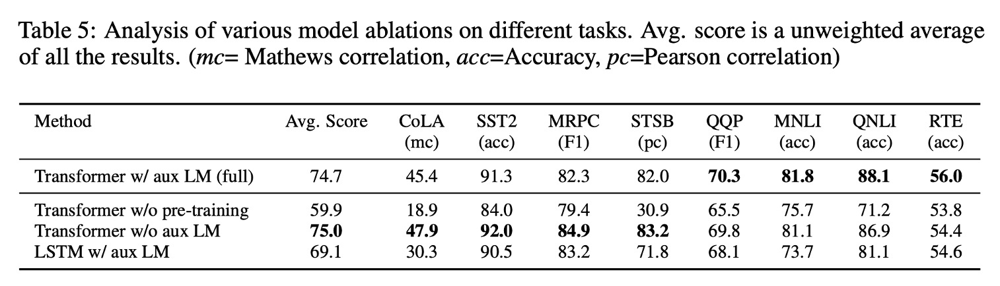

## 十二層解碼器

[**Improving language understanding by generative pre-training**](https://cdn.openai.com/research-covers/language-unsupervised/language_understanding_paper.pdf)

---

原始的 Transformer 架構由兩個部分組成：一個編碼器（encoder）和一個解碼器（decoder）。

而 OpenAI 則是基於這個架構，選了不一樣的技術路線：**全解碼器（decoder-only）**。

## 定義問題

作者對於目前的 NLP 模型提出了幾個問題：

### 1. 缺乏標註資料

在 NLP 領域中，資料是不缺的，缺的是標註。

特別是當你想要做一些特定任務時，例如專門領域的問答（QA）或機器翻譯（MT）等，會因為缺乏對應的標註資料而難以進行。

為了解決這個問題，有許多方法都直接採用無監督學習（unsupervised learning）的方式，後來又被稱為自監督學習（self-supervised learning）。

最常見的方法就是讓模型去做「文字接龍」的任務，也就是：下一個字預測。

這樣你完全不需要任何標註資料，只需要持續地搜集大量的文本資料，就可以讓模型自己學習。

但這種方法也衍生出了另外下一個問題：任務不一致。

### 2. 任務不一致

在 NLP 模型中，通常會有兩個階段：預訓練（pre-training）和微調（fine-tuning）。

預訓練是指在大量的文本資料上，讓模型自己學習，而微調則是指在特定任務上，對模型進行進一步的訓練。但這兩個階段之間存在的不一致性，卻是個難以忽略的問題。

也就是說，當你在預訓練時，模型學習的是「下一個字是什麼」這樣的任務，但當你在微調時，模型學習的可能是「回答問題」或「翻譯句子」這樣的任務。

在過去的研究中，在微調模型去適應目標任務時，會引入大量的參數，以提高模型的性能。

不同的任務，就需要不同的參數，過程繁瑣且不好管理。

作者因此提出使用全解碼器的架構，希望能用最小的參數量來適應不同的任務。

## 解決問題

### 模型架構

這是作者提出的模型架構，總共有 12 層解碼器。

相關的配置如下：

- 共 12 層解碼器，每層解碼器都是 Transformer 的基本結構。
- 每層解碼器有 768 維特徵和 12 個注意力頭。
- 在 FFN 的隱藏層中，使用了 3072 個神經元。
- 序列長度為 512。
- Dropout 機率為 0.1。
- 採用 L2 正則化。
- 採用 Gelu 啟動函數。
- 位置編碼採用可學習式的位置嵌入。
- 使用 [**spaCy tokenizer**](https://spacy.io/api/tokenizer**) 進行分詞。

訓練方式上，作者使用：

- Adam 優化器。
- 最大學習率為 2.5e-4，在前 2000 步中線性增加，然後使用餘弦退火法直到 0。

### 預訓練策略

模型的訓練由兩個階段組成，第一階段是在大量的文本資料上進行自監督學習，第二階段是在目標任務上進行微調。

本文採用資料集：

1. [**BooksCorpus**](https://arxiv.org/abs/1506.06724):

   它包含 7,000 多本獨特的未出版書籍，涵蓋冒險、奇幻和浪漫等多種類型。它包含長段的連續文本，這使得生成模型能夠學習以遠端資訊為條件。

2. [**1B Word Benchmark**](https://www.statmt.org/lm-benchmark/):

   由類似的方法 [ELMo](https://arxiv.org/abs/1802.05365) 使用，其大小大致相同，但在句子層級進行了重組（目的是破壞了遠端結構）。

### 微調策略

作者沒有特別想著要在微調上做什麼特別的事情，只是簡單地使用了一些標準的微調方法。

除非有特別說明，否則大多數情況下，作者都重複使用無監督預訓練中的超參數設定。在分類器上，使用 0.1 的 dropout 機率。對於大多數任務，使用 6.25e-5 的學習率和 32 的批量大小。

## 討論

整體而言，本文提出的方法在評估的 12 個資料集中的 9 個資料集中取得了 SOTA 的結果。

這表明了全解碼器的架構在 NLP 任務上的有效性。

作者針對 Zero-shot 的議題上，進行了更深入的探討。

### 為什麼 Transformer 有效？

在圖 2（左）中，作者探討隨折模型深度增加，在任務遷移的過程中，模型的性能如何提升。

根據實驗結果表明，預訓練的模型中，每一層都包含用於解決目標任務的有效信息。

---

作者在圖 2（右）中視覺化了模型架構在預訓練過程中的有效性。

也就是說，隨著預訓練的進行，模型的性能逐漸提升，這表明預訓練產生的支持學習各種任務相關功能。

### 哪一個部分有效？

為了確認模型哪一個環節有最大的貢獻，作者進行了三種不同的消融實驗。

結果如論文內表 5 所示：

1. **輔助語言模型目標的影響：**

   - 在微調階段取消輔助語言模型目標，結果顯示其對自然語言推理（NLI）任務和問答任務（QQP）有所幫助。
   - 整體趨勢表明，較大的資料集從輔助目標中獲益更多，而較小的資料集則不明顯。

2. **Transformer 與 LSTM 的比較：**

   - 將 Transformer 與單層 2048 單元的 LSTM 進行比較，結果顯示在相同框架下使用 LSTM 平均得分下降 5.6 分。
   - LSTM 僅在 MRPC 資料集上優於 Transformer。

3. **預訓練的重要性：**
   - 比較直接在目標任務上訓練的 Transformer 與預先訓練的 Transformer。
   - **結果顯示缺乏預訓練會對所有任務的表現造成影響，與完整模型相比表現下降 14.8%。**

## 結論

這是 OpenAI 提出的首個基於 Transformer 架構的大規模預訓練模型，標誌著自然語言處理領域的重要進步。它透過在大量未標記文字上進行預訓練，再在特定任務上進行微調，實現了顯著的效能提升。

GPT-1 的成功證明了預訓練-微調的半監督學習範式在多樣化的自然語言理解任務中具有潛力，開啟了將通用表示學習應用於廣泛 NLP 任務的新時代，為後續更大規模、更強性能的 GPT-2 和 GPT-3 等模型奠定了基礎。
