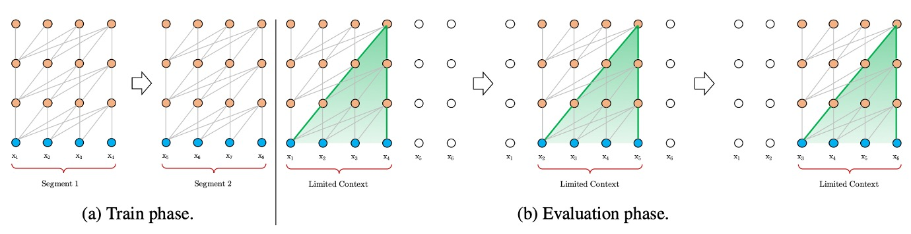
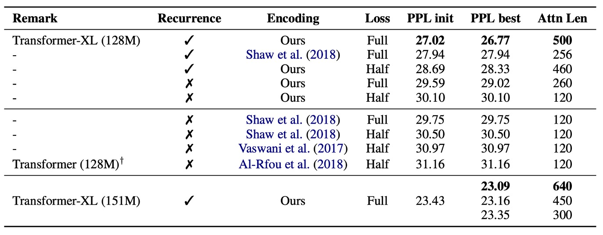
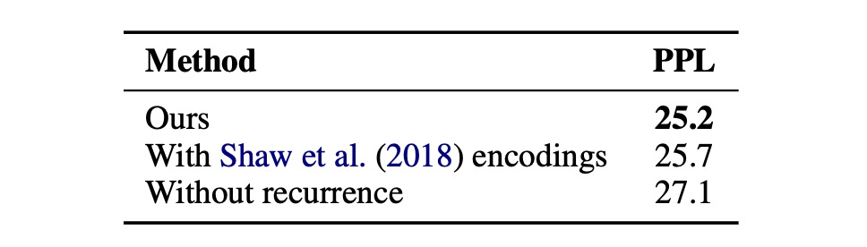

## 更長的上下文

[**Transformer-XL: Attentive Language Models Beyond a Fixed-Length Context**](https://arxiv.org/abs/1901.02860)

---

[**BERT**](../1810-bert/index.md) 在應用 Transformer 時，有一個參數叫做「序列長度」。

意思是 BERT 在訓練和預測時，每次接受的輸入是固定長度的。

那仔細想想，我們在輸入文本進行訓練時，怎樣的方式最理想的呢？

- **當然是將一個完整的文本一次性輸入，有多長就輸入多長！簡直完美！**

## 定義問題

但是不行。

現實是殘酷的，算力有限，記憶體有限，我們無法一次輸入所有文本。

作者首先引出了以下幾個具體問題：

### 計算資源限制

訓練大型模型需要大量的計算資源，包括高性能的 GPU 或 TPU。記憶體容量限制了能夠一次處理的文本長度，過長的文本會導致記憶體溢出或計算時間過長。特別是 Transformer 的注意力機制，其記憶體使用量會隨著上下文長度成二次方增長，這使得模型難以處理長文本。

### 上下文碎片問題

如上圖，為了適應計算資源的限制，文本通常被切割成固定長度的片段進行處理。固定長度片段的處理方式會導致上下文信息的丟失，使模型在預測時缺乏必要的上下文支持。固定長度上下文限制了模型的預測能力，導致性能較差。缺乏跨片段的上下文信息會降低模型的優化效率，無法充分學習文本中的長期依賴性。

:::info
例如 BERT 模型上下文長度只有 512 個 token，因此在處理長文本時，BERT 會將文本切割成多個片段進行處理。
:::

## 解決問題

### 模型架構

作者首先試著解決上下文碎片的問題。

這裡的解題思路就是直接借鑒過去的 RNN 模型，引入遞歸機制。簡單來說，就是在訓練模型的過程中，將前一段計算得到的隱藏狀態保存起來，並在處理下一段時重新使用。這樣，模型在每次處理新的段落時，都能利用之前段落的信息，從而能夠對長期依賴性進行建模並避免上下文碎片。

舉個例子，假設我們有兩個連續的段落，段落 A 和段落 B。在傳統的方法中，模型處理段落 B 時，只會考慮段落 B 的內容，完全不知道段落 A 的信息。而使用遞歸機制後，模型在處理段落 B 時，可以參考段落 A 的隱藏狀態，這樣段落 B 就能夠獲取更多的上下文信息。此外，如果你有足夠的算力，你可以在考慮段落 B 的時候引入更多的上下文，比如段落 C、D 等等。

也因為模型可以重複使用之前段落的計算結果，而不需要每次都從頭計算。在評估階段中，作者發現 Transformer-XL 的速度比普通模型快了 1,800 倍。

### 新的問題

在標準 Transformer 模型中，序列的順序資訊由位置編碼提供，這些位置編碼告訴模型每個單詞在序列中的位置，這些編碼與單詞嵌入一起輸入模型。

如果我們簡單地在遞歸機制中使用相同的位置編碼，模型將無法區分不同段落中的相同位置，這樣會導致性能下降。

舉個例子好了：假設我們有一個句子：**"The cat sat on the mat."** 我們將這個句子分成兩個段落來處理：

- 段落 A: "The cat sat"
- 段落 B: "on the mat."

在標準的 Transformer 中，每個單詞的位置由其在句子中的絕對位置決定。例如：

- "The" 的位置是 1
- "cat" 的位置是 2
- "sat" 的位置是 3
- "on" 的位置是 4
- "the" 的位置是 5
- "mat" 的位置是 6

這些位置編碼與單詞嵌入一起輸入到模型中。但是，如果我們在處理段落 B 時，使用與段落 A 相同的位置編碼，模型將無法區分這些單詞的相對位置，因為 "on" 和 "The" 都會被編碼為位置 1，"the" 和 "cat" 都會被編碼為位置 2，等等。這樣會導致模型無法正確理解序列中的位置關係。

而相對位置編碼只關心單詞之間的相對距離。例如：

- "cat" 相對於 "The" 的距離是 +1
- "sat" 相對於 "The" 的距離是 +2
- "sat" 相對於 "cat" 的距離是 +1
- "on" 相對於 "sat" 的距離是 +1
- "on" 相對於 "The" 的距離是 +3

在相對位置編碼中，我們不再直接使用單詞的絕對位置，而是使用它們之間的相對距離來進行編碼。這樣，即使在處理不同的段落，模型也能夠根據相對位置正確理解單詞之間的關係。

### 相對位置編碼

在本篇論文中，對自注意力機制中的 $QK^T$ 展開：

- $Q_i=(x_i+pos_i)W_Q$
- $K_j=(x_j+pos_j)W_K$
- $Q_iK_j^T=(x_i+pos_i)W_QW_K^T(x_j+pos_j)^T$

最後，得到了下式：

- $Q_iK_j^T=x_iW_QW_K^Tx_j^T+x_iW_QW_K^Tpos_j^T+pos_iW_QW_K^Tx_j^T+pos_iW_QW_K^Tpos_j^T$

接著，將 $pos_j$ 替換成相對位置向量 $R_{i-j}$；將 $pos_i$ 替換成可學習的向量 $u$, $v$，得到：

- $Q_iK_j^T=x_iW_QW_K^Tx_j^T+x_iW_QW_K^T{\color{red}{R_{i-j}^T}}+{\color{green}{u}}W_QW_K^Tx_j^T+{\color{green}{v}}W_QW_K^T{\color{red}{R_{i-j}^T}}$

然後 $uW_Q$ 和 $vW_Q$ 都是可學習的參數，可以合併成一個，得到：

- $Q_iK_j^T=x_iW_QW_K^Tx_j^T+x_iW_QW_K^T{\color{red}{R_{i-j}^T}}+{\color{green}{u}}W_K^Tx_j^T+{\color{green}{v}}W_K^T{\color{red}{R_{i-j}^T}}$

考慮到 ${\color{red}{R_{i-j}^T}}$ 的編碼空間和原本 $pos_j$ 的編碼空間不同，因此把 $W_K^T$ 換成 $W_{K, R}^T$，得到：

- $Q_iK_j^T=x_iW_QW_K^Tx_j^T+x_iW_QW_{K, R}^T{\color{red}{R_{i-j}^T}}+{\color{green}{u}}W_K^Tx_j^T+{\color{green}{v}}W_{K, R}^T{\color{red}{R_{i-j}^T}}$

最後，在這篇論文中，沒有在 QKV 的 V 矩陣中添加位置編碼，之後的研究也都只在 QK 矩陣（也就是注意力矩陣）中添加位置編碼。

## 討論

### 模型表現

Transformer-XL 應用於單字級和字元級語言建模。

資料集包括 WikiText-103、enwik8、text8、十億字語料庫和 Penn Treebank。

- **Table 1: WikiText-103**：

  - 是最大的字級語言建模基準。
  - 包含 1.03M 個訓練 token，來自 28K 篇文章。
  - 注意力長度在訓練期間為 384，評估期間為 1600。
  - 採用自適應 softmax 和輸入表示技術。
  - Transformer-XL 將 SOTA 困惑度從 20.5 降至 18.3。

3. **Table 2: enwik8**：

   - 包含 100M 位元組的未處理維基百科文字。
   - Transformer-XL 比基於 RNN 的模型有顯著優勢。
   - 12 層架構達到了與 64 層網路相同的效果，但只用了 17% 的參數預算。
   - 增加模型大小至 18 層和 24 層，達到了新的 SOTA 結果。

4. **Table 3: text8**：

   - 包含 100M 已處理的維基百科字元，只有 26 個字母和空格。
   - 使用與 enwik8 相同的模型和超參數，無需進一步調整。

5. **Table 4: Billon Word**：

   - 測試短期依賴性建模能力，因為句子已被打亂。
   - Transformer-XL 顯著優於使用普通 Transformer 的方法。

:::tip
混淆度（Perplexity, 簡稱 PPL）是自然語言處理（NLP）中的一個衡量語言模型性能的重要指標。它主要用來評估語言模型在預測一組文本數據的效果。

混淆度是一個概率模型在給定測試數據上對於該數據的不確定性的度量，是語言模型分配給測試數據集的平均概率的倒數的指數形式。

- **計算公式**

  假設我們有一個語言模型，該模型對測試語料庫中的一個句子 $W = w_1, w_2, ..., w_N$ 的概率為 $P(W)$，則混淆度的計算公式為：

  $\text{PPL}(W) = P(W)^{-\frac{1}{N}} = \left( \prod_{i=1}^N P(w_i | w_1, w_2, ..., w_{i-1}) \right)^{-\frac{1}{N}}$

  更一般地，對於整個測試集 $D$，混淆度為：

  $\text{PPL}(D) = 2^{-\frac{1}{N} \sum_{i=1}^N \log_2 P(w_i | w_1, w_2, ..., w_{i-1})}$

  其中，$N$ 是測試集中詞語的總數，$P(w_i | w_1, w_2, ..., w_{i-1})$ 是模型對詞語 $w_i$ 的條件概率。混淆度的值越低，說明語言模型對於測試數據集的預測越好，因為它意味著模型分配給正確詞語序列的概率越高。

:::

### 消融實驗

這裡作者針對遞歸機制和新的位置編碼方案進行有效性的研究：

1. **相對位置編碼的有效性**：

   

   在需要對長期依賴性進行建模的 WikiText-103 資料集上進行。

   結果如上表，研究人員使用相對位置編碼和絕對位置編碼進行比較，並區分了「全部」損失和「一半」損失的情況，這些損失指的是交叉熵損失應用的位置。

   他們發現，絕對位置編碼僅適用於半損失，因為半損失排除了訓練期間注意力長度非常短的位置，從而實現了更好的泛化能力。

   結果顯示，遞歸機制和新的編碼方案對於實現最佳性能以及在評估期間推廣到更長的注意力序列都是必要的。儘管訓練期間的反向傳播長度僅為 128，但通過這兩種技術，測試時的注意力長度可以增加到 640。在 151M 參數的標準設定中，隨著注意力長度的增加，困惑度降低。

   :::tip
   在上面的段落中，提到了“全損失”（Full losses）和“半損失”（half losses），這是指在訓練神經網路時如何計算損失，也就是模型預測錯誤的程度。

   1. **全損失（Full losses）**：

      - 在這種情況下，模型在計算損失時會考慮輸入段落中所有的位置。也就是說，不管是段落的開頭還是結尾，每個字或者詞的預測錯誤都會被考慮進去。
      - 這種方法要求模型對整個段落有很好的理解，包括那些長時間依賴的信息（比如文章開頭提到的內容可能會影響到結尾的理解）。

   2. **半損失（Half losses）**：
      - 在這種情況下，模型在計算損失時只考慮輸入段落中最近一半的位置。例如，如果段落有 100 個字，模型只會考慮後 50 個字的預測錯誤。
      - 這樣做的目的是減少對於遠端信息的依賴，使模型更專注於近期的內容，這有助於模型在某些情況下更好地泛化，尤其是當遠端信息的關聯性不那麼強時。

   在這個研究中，作者發現使用絕對位置編碼（absolute encodings）的時候，半損失表現得更好。這可能是因為絕對位置編碼在處理長距離的依賴關係時不如相對位置編碼（relative encodings）有效，所以減少對遠端信息的依賴（即只使用半損失）能夠改善模型的表現。
   :::

2. **遞歸機制的有效性**：

   

   作者為了將解決上下文碎片問題的影響與捕獲較長上下文長度的好處分開，選擇使用一個不需要長期依賴的資料集：Billon Word 資料集。這樣建立遞歸的任何改進都可以歸因於解決上下文碎片。

   他們訓練了一個 20 層的 Transformer-XL，參數約為 0.3B，並進行了 400K 步驟。結果如上表所示，即使不需要長期依賴，使用段級遞歸也能顯著提高效能，這與先前討論的遞歸機制解決了上下文碎片問題是一致的。

## 結論

Transformer-XL 在語言建模領域展現了強大的實力。它不僅在困惑度上取得了優異的成績，還能比 RNNs 和傳統 Transformer 更有效地處理長期依賴。

此外，Transformer-XL 在評估期間顯著加速，並且能夠生成連貫的文本文章。這些優勢使其在文本生成、無監督特徵學習、圖像和語音建模等領域展現出廣闊的應用前景。無論是在改進現有技術還是開發新應用方面，Transformer-XL 都有潛力成為一個重要的工具。
