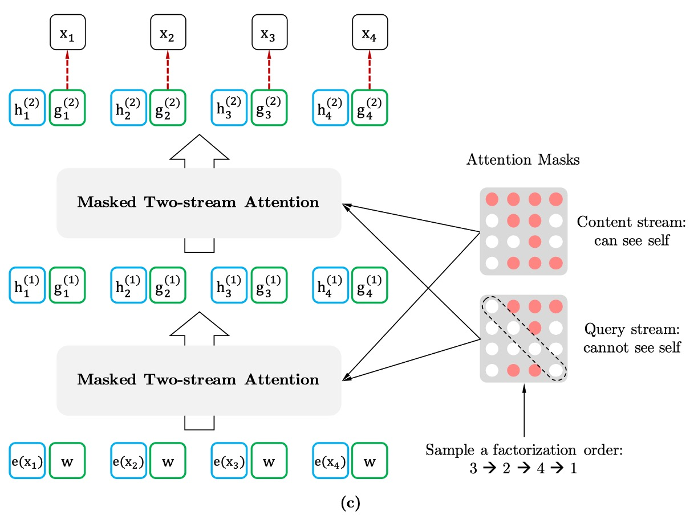
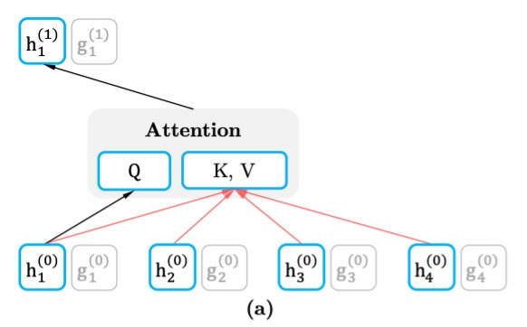
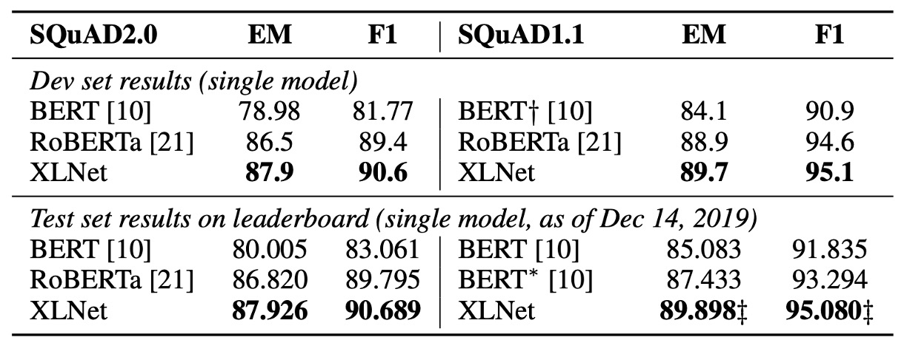

## 雙流注意力機制

[**XLNet: Generalized Autoregressive Pretraining for Language Understanding**](https://arxiv.org/abs/1906.08237)

---

BERT 的成功帶給後續研究人員大量的研究空間。

在早些時日，這篇論文的作者群已經發表了 **Transformer-XL** 這篇論文，提出了一種新的 Transformer 架構，能夠捕捉長距離依賴關係。

- [**[19.01] Transformer-XL: 更長的上下文**](../1901-transformer-xl/index.md)

但顯然地，作者覺得這還不夠，因為 Transformer-XL 無法同時考慮到所有的上下文。

## 定義問題

在語言模型中有兩大主流方法：自回歸（autoregressive）和自編碼（autoencoding）。

自編碼的代表作就是 BERT，而自回歸的代表作則是 GPT，各有各的優缺點。

- **自回歸模型**

  自回歸的自監督的訓練方式就是預測序列中的下一個詞，也就是我們常講的文字接龍。

  給定一個文字序列 $x = [x_1, \dots, x_T]$，自回歸語言模型透過前向自回歸分解來最大化似然函數：

  $$
  \max_{\theta} \log p_{\theta}(x) =
  $$

  $$
  \sum_{t=1}^{T} \log p_{\theta}(x_t | x_{<t}) =
  $$

  $$
  \sum_{t=1}^{T} \log \frac{\exp(h_{\theta}(x_{1:t-1})^T e(x_t))}{\sum_{x'} \exp(h_{\theta}(x_{1:t-1})^T e(x'))}
  $$

  其中，$h_{\theta}(x_{1:t-1})$ 是由神經網路生成的上下文表示，而 $e(x)$ 表示字詞的嵌入。

  這樣的訓練方式有一個缺點：無法同時考慮到所有的上下文。如果遇到「語言理解」的任務，效果就會打折扣。因為在理解任務中，我們需要同時考慮到所有的上下文，才能做出正確的判斷。

- **自編碼模型**

  自編碼的自監督訓練方式則是遮蔽語言模型（Masked Language Model, MLM），這是 BERT 提出來的最著名的方法，在訓練中隨機使用 `[MASK]` 標記來預測被遮蔽的詞彙。並根據這個被遮蔽的序列 $\hat{x}$ 來重建被遮蔽的文字 $\bar{x}$，其目標函數為：

  $$
  \max_{\theta} \log p_{\theta}(\bar{x}|\hat{x}) \approx \sum_{t=1}^{T} m_t \log p_{\theta}(x_t | \hat{x}) =
  $$

  $$
  \sum_{t=1}^{T} m_t \log \frac{\exp(H_{\theta}(\hat{x})^T_t e(x_t))}{\sum_{x'} \exp(H_{\theta}(\hat{x})^T_t e(x'))}
  $$

  其中，$m_t = 1$ 表示 $x_t$ 被遮蔽，$H_{\theta}$ 是 Transformer 網路產生的隱藏向量序列 $H_{\theta}(x) = [H_{\theta}(x)_1, H_{\theta}(x)_2, \dots, H_{\theta}(x)_T]$。

  這樣的訓練方式可以同時考慮到所有的上下文，但是會帶來一個問題：模型在預測時不存在 `[MASK]` 標記，這樣的訓練方式會導致模型在訓練和預測時的不一致。不僅如此，也因為 BERT 的設計方式，模型無法像是 AR 模型這樣，使用乘積規則對聯合機率進行建模。

所以作者希望可以做一個「自回歸」的語言模型，但又要同時可以考慮到所有的上下文：

**這個方法就是 XLNet！**

## 解決問題

### 置換語言建模

置換語言建模，Permutation Language Modeling，是作者所提出的一種新的訓練目標。

目的是同時保留自回歸模型的優勢（依賴於序列上下文進行詞語預測），但又能像 BERT 那樣捕捉到雙向上下文（可以從任意方向理解文本）。

舉例來說，對於一個長度為 $T$ 的序列（例如 "The cat sat on the mat" 有 6 個詞），有 $T!$ 種不同的排列方式可以進行自回歸分解。

```
排列1: "sat the on mat cat The"
排列2: "on The mat the cat sat"
排列3: ...
```

在這個過程中，我們為模型引入一個排列 $z$，這個排列代表模型在訓練時所選擇的排列順序。模型會在每次訓練中隨機選擇一個排列，然後依照這個排列預測下一個詞。

假設 $Z_T$ 是所有可能的長度為 $T$ 的索引序列的置換集合，則置換語言建模目標可以表達為：

$$
\max_{\theta} \mathbb{E}_{z \sim Z_T} \left[ \sum_{t=1}^{T} \log p_{\theta}(x_{z_t} | x_{z\_{<t}}) \right]
$$

### 雙流自注意機制



為了有效實現置換語言建模，作者在論文特別指出，**我們只排列「分解順序」而不是「句子中的詞語順序」**。這意味著，在訓練過程中，句子的自然順序保持不變，而是通過「掩蔽機制」來重新排列這些詞語在訓練中出現的順序。

在模型訓練時，會隨機選擇一種分解的順序。例如，對於一個序列 $x = [x_1, x_2, x_3, x_4]$，可能選擇的順序是 $x_3 → x_2 → x_4 → x_1$。

模型會根據這個順序，逐步預測每個字詞的機率，並最大化該序列的似然函數。

要實現這種置換模型，需要用到「雙流自注意力（Two-Stream Self-Attention）」機制。

這裡的「雙流」指的是兩種不同的隱藏表示：

- **內容流（Content Stream）**

    <div align="center">
    <figure style={{"width": "60%"}}>
  
  </figure>
  </div>

  內容流的表示 $h_{\theta}(x_{z \leq t})$ 包含了整個上下文信息，並且包含了目標詞 $x_{z_t}$ 的信息。這意味著，它在預測某個詞時，已經能看到整個序列（包括當前預測位置的詞），因此可以形成完整的上下文表示。

  每層的內容流表示更新方式與標準的 Transformer 自注意力機制相同，即查詢 ($Q$)、鍵 ($K$) 和值 ($V$) 的計算使用的是序列中所有詞語的信息。這使得模型能夠基於整個序列上下文進行信息聚合和預測。

  如果我們要預測「A, B, C, D」中的「C」，那麼內容流能看到完整的句子並獲取到所有其他詞語的表示，包括「C」這個詞自己。

- **查詢流（Query Stream）**

    <div align="center">
    <figure style={{"width": "60%"}}>
  
  </figure>
  </div>

  查詢流的主要目的是生成**與目標位置相關的表示**，但它不能直接看到目標位置的內容。也就是說，它只能基於上下文來進行推理，不能直接依賴目標詞的位置來「作弊」。這是為了避免模型在預測過程中提前得到目標詞的信息，從而強制模型依賴上下文來進行預測。

  查詢流的表示 $g_{\theta}(x_{z < t}, z_t)$ 只考慮上下文 $x_{z<t}$ 和目標位置 $z_t$，**但不包括目標位置的詞語 $x_{z_t}$**。這樣，查詢流強調的是位置依賴的信息，並且需要依賴於上下文來推測出目標詞。

在實際訓練中，直接對每個排列進行完整的預測可能會導致模型收斂緩慢。因此，作者使用**部分預測策略**，讓模型不需要每次預測整個排列中的所有詞，而是只對部分詞進行預測，通常是排列中的「最後幾個詞」，這樣模型能夠利用最長的上下文信息來做預測。

:::tip
BERT 也同樣使用了部分預測策略，只預測 15% 的詞語。
:::

### 再訪部分預測機制

部分預測是指模型在訓練時只預測句子中的一部分詞語，而不是對整個句子的每一個詞進行預測。

這對於 BERT 來說是必要的，因為如果句子中的所有詞語都被掩蔽，模型將沒有足夠的上下文來進行有意義的預測。而 XLNet 也使用了部分預測，主要是為了減少優化難度，即讓模型只預測那些有足夠上下文的詞語。

舉例來說，假設我們有一句話「New York is a city」，我們只選擇句子中的部分詞進行預測，如「New」和「York」。

- **BERT 的問題：獨立假設**

  BERT 在進行預測時基於「獨立假設」，即它預測每個目標詞語時，認為這些詞語之間是獨立的，沒有直接的依賴關係。

  比如在這個例子中，BERT 會把「New」和「York」當作彼此獨立的詞來預測，其目標是：

  $$
      \mathcal{J}_{\text{BERT}} = \log p(\text{New} | \text{is a city}) + \log p(\text{York} | \text{is a city})
  $$

  這表示 BERT 預測「New」和「York」時，依賴的上下文僅僅是「is a city」，它沒有考慮「New」和「York」之間的依賴關係。

- **XLNet 的優勢：捕捉依賴關係**

  相比之下，XLNet 則能夠捕捉詞語之間的依賴關係。這是因為 XLNet 基於自回歸的方式進行排列順序的預測，並且能夠利用之前已經預測的詞作為上下文。

  在這個例子中，XLNet 可能會選擇排列順序 「is → a → city → New → York」，這樣在預測 「York」 時，模型已經知道 「New」，因此它能夠考慮 「New」 和 「York」 之間的依賴關係。

  XLNet 的目標可以表示為：

  $$
  \mathcal{J}_{\text{XLNet}} = \log p(\text{New} | \text{is a city}) + \log p(\text{York} | \text{New, is a city})
  $$

  這表示 XLNet 在預測「York」時，不僅依賴於「is a city」，還依賴於已經預測的「New」。因此，XLNet 能夠學習到「New」和「York」之間的依賴關係，這是 BERT 所忽略的。

XLNet 能夠學到更多的詞之間的依賴關係，從而產生「更密集」的訓練信號。

換句話說，XLNet 在訓練過程中，能夠從每個詞中提取出更多有用的信息，而不僅僅是像 BERT 那樣單獨學習每個詞與上下文的關係。這使得 XLNet 在相同的目標詞下，能夠比 BERT 學到更多的依賴關係和語義信息。

## 討論

### 和 BERT 的公平比較


在這裡，作者首先在公平的環境下比較 BERT 和 XLNet 的效能，以解耦使用更多數據與從 BERT 到 XLNet 改進所帶來的影響。

在上表中，比較了三個不同變體的 BERT 的最佳效能，以及使用相同數據和超參數訓練的 XLNet。在相同的數據和幾乎相同的訓練設定下，XLNet 在所有數據集上都顯著超越了 BERT。

### 和 RoBERTa 比較

<figure>

<figcaption align="center">閱讀理解與文件排序</figcaption>
</figure>

<figure>

<figcaption align="center">問答系統</figcaption>
</figure>

<figure>

<figcaption align="center">文本分類</figcaption>
</figure>

<figure>

<figcaption align="center">自然語言理解</figcaption>
</figure>

---

在這篇論文發表後，隨即有其他預訓練模型問世，如 RoBERTa 和 ALBERT。

- [**[19.07] RoBERTa: 訓練 BERT 的說明書**](../1907-roberta/index.md)
- [**[19.09] ALBERT: 愛因斯 BERT**](../1909-albert/index.md)

為了與 RoBERTa 進行相對公平的比較，本實驗基於完整數據進行，並重用了 RoBERTa 的超參數設置。結果如上表，在閱讀理解與文件排序、問答系統、文本分類和自然語言理解所示，XLNet 在各個數據集上都超越了 BERT 和 RoBERTa。

此外，作者還提出兩個有趣的觀察結果：

1. 對於像 SQuAD 和 RACE 這樣需要進行明確推理且涉及較長上下文的任務，XLNet 的效能提升通常更大。這種在處理長上下文上的優勢可能來自於 XLNet 所使用的 Transformer-XL 架構。
2. 對於已經擁有大量監督數據的分類任務，如 MNLI（超過 39 萬條樣本）、Yelp（超過 56 萬條樣本）和 Amazon（超過 300 萬條樣本），XLNet 仍然顯著提升了效能。

:::info
由於 ALBERT 將模型的隱藏層大小從 1024 擴大到 2048/4096，從而顯著增加了運算量（以 FLOPs 計算），因此作者在這裡排除了 ALBERT，因為難以得出科學性的結論。
:::

### 消融實驗


作者為了證明 XLNet 中每個設計選擇的重要性，並評估這些選擇如何影響模型的性能。

在上表中，總共比較了 6 個不同實現細節的 XLNet-Base 變體（第 3 到 8 行）、原始的 BERT-Base 模型（第 1 行），以及一個基於 Transformer-XL 的模型，該模型使用了 BERT 的去噪自編碼目標但採用了雙向輸入管道（第 2 行）。

為了公平比較，所有模型都基於相同的 12 層架構，並且使用與 BERT-Base 相同的超參數，只在 Wikipedia 和 BooksCorpus 上進行訓練，且所有結果都是 5 次運行的中位數。

- **置換語言建模和 Transformer-XL 的優勢**（rows 1 to 4）：

  相較於 BERT-Base（第 1 行），使用 Transformer-XL 和置換語言建模目標的 XLNet-Base 模型在所有數據集上均顯著優於 BERT。這表明這兩個設計選擇（Transformer-XL 和置換語言建模）對於 XLNet 優於 BERT 的性能貢獻巨大。

- **記憶機制的重要性**（row 5）：

  當移除記憶緩存機制（memory caching）時，模型性能明顯下降，尤其是在 RACE 任務上，這個任務涉及的上下文最長。這表明記憶機制對於處理長上下文非常重要。

- **基於片段的預測和雙向輸入管道的作用**（rows 6 and 7）：

  移除基於片段的預測和雙向輸入管道都會使模型性能下降，這表明這兩個設計對於 XLNet 的有效性有重要貢獻。

- **下句預測的影響**（row 8）：

  出乎意料的是，BERT 中提出的下句預測目標（next-sentence prediction）在 XLNet 的設置中並未帶來顯著的性能提升。因此，作者在最終的 XLNet 設計中排除了這個目標。

## 結論

XLNet 延續 Transformer-XL 的優勢，並引入了置換語言建模目標，從而同時保留了自回歸模型和自編碼模型的優勢。在公平的設置下，XLNet 在各種自然語言處理任務上都超越了 BERT 和 RoBERTa，並且在一些需要長上下文的任務上表現更好。

XLNet 的創新使其在多個自然語言處理任務中成為一個強有力的選擇，並且為語言模型的發展提供了新的思路。

綜觀 2019 年，XLNet 可以說是地表最強的 LM 架構。
