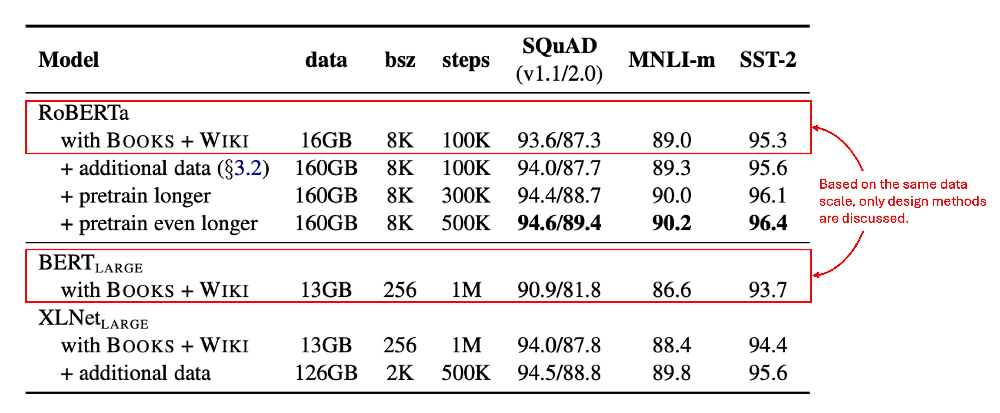

## 訓練 BERT 的說明書

[**RoBERTa: A Robustly Optimized BERT Pretraining Approach**](https://arxiv.org/abs/1907.11692)

---

BERT 的成功帶給後續研究者大量的啟發。

作者在這個階段，回顧了 BERT 的設計，做了大量的實驗，發現原來 BERT 還有超多可以改進的地方。

## 定義問題

先複習一下 BERT 的設計：

BERT 的預訓練過程主要包括兩個目標：遮蔽語言模型（Masked Language Modeling, MLM）和下一句預測（Next Sentence Prediction, NSP）。

BERT 會先在大規模未標註的文本上進行預訓練，之後再使用標註的資料進行微調。

BERT 採用了 Transformer 架構，並在此基礎上進行改進。模型由 L 層 Transformer 組成，每層包含 A 個自注意力頭（self-attention heads），並具有 H 維的隱藏層。

預訓練目標主要包括兩個部分：

- **遮蔽語言模型（MLM）**：

  - 在輸入序列中，隨機選擇 15% 的詞彙進行替換，主要目標是預測被遮蔽的詞彙。選中的詞彙有 80% 會被替換成特殊標記 `[MASK]`，10% 保持不變，另 10% 會被隨機詞彙替換。

- **下一句預測（NSP）**：
  - NSP 是一個二元分類任務，用來預測兩個段落是否在原文中連續。正樣本來自於連續的句子，負樣本則是來自於不同文件的句子段落。正負樣本各佔一半。

BERT 採用了 Adam 優化器，具體參數如下：

- $\beta_1 = 0.9$，$\beta_2 = 0.999$，L2 正則化參數 weight decay 設為 0.01。
- 學習率在前 10,000 步逐漸增至 1e-4 的峰值，之後再線性遞減。
- 使用 0.1 的 dropout 機率，且在所有層與注意力權重上應用 GELU 啟動函數。
- 模型預訓練持續 1,000,000 次更新，每個小批量包含 256 條序列，序列的最大長度為 512。

BERT 的訓練資料來自 BOOKCORPUS 和英文 WIKIPEDIA 的組合，共計 16GB 的未壓縮文本。

---

本篇論文的作者認為：上面這些設計都要優化，通通都要改。

## 解決問題

### 優化實作細節

大部分超參數遵循原始 BERT 的優化設定，除了學習率峰值和暖啟步數會根據不同設置進行調整。

作者發現訓練對 Adam 優化器中的 epsilon 值非常敏感，調整後可能會提升性能或穩定性；當批量大小較大時，設定 $\beta_2 = 0.98$ 也能增強穩定性。

預訓練時，序列長度最多為 512 個 token，與之前文獻不同，這裡沒有隨機插入短序列，也沒有在前 90% 的更新中減少序列長度，僅使用完整長度序列進行訓練。

作者使用混合精度浮點運算進行訓練，使用 DGX-1 機器，每台配有 8 × 32GB 的 Nvidia V100 GPU。

### 優化訓練資料

BERT 式預訓練非常依賴大規模文本數據，過去研究顯示，增加數據量可以提升最終任務的性能。

許多研究使用了比原始 BERT 更大且更多樣化的數據集，但這些附加數據集並非都可以公開釋出。作者在這裡盡可能收集大量數據進行實驗，以便在比較時達到合適的數據品質和數量。

最後，作者使用了五個不同大小和領域的英文語料庫，總計超過 160GB 的未壓縮文本：

1. **BOOKCORPUS** 和 **WIKIPEDIA**：這是原始 BERT 訓練所用的數據集。（16GB）
2. **CC-NEWS**：我們從 CommonCrawl News 數據集中收集的英文部分，包含 2016 年 9 月至 2019 年 2 月期間的 6300 萬篇英文新聞文章。（經過過濾後共 76GB）

3. **OPENWEBTEXT**：這是 Radford 等人（2019）所描述的 WebText 資料集的開源重建版，包含來自 Reddit 並獲得至少三個點贊的 URL 所提取的網頁內容。（38GB）

4. **STORIES**：Trinh 和 Le（2018）引入的一個數據集，包含從 CommonCrawl 中篩選出的與 Winograd schema 故事風格匹配的文本。（31GB）

:::tip
我做了好多努力，然後搭配十倍的資料量，最後得到一個更好的模型！

這是我們內部的玩笑話，事實上，作者在後面有證明就算不增加數據量，只修改訓練策略也能得到更好的模型。
:::

## 討論

在論文中，作者將主要調整的部分分為幾個方面來討論：

### 靜態遮蔽 vs. 動態遮蔽

<figure style={{ "width": "60%"}}>

</figure>

原始 BERT 的實作使用靜態遮蔽，預處理時將遮蔽一次並在每個 epoch 重複使用相同的遮蔽模式。為了避免每個訓練實例使用相同的遮蔽，數據會重複 10 次，使每個序列在 40 個訓練 epoch 中以 10 種不同方式進行遮蔽，每個序列重複看到相同的遮蔽四次。

動態遮蔽則是在每次將序列輸入模型時生成新的遮蔽模式，對於進行更多訓練步驟或使用更大數據集的預訓練過程尤為重要。

結果顯示，動態遮蔽在效能上與靜態遮蔽相當，甚至略有優勢，因此後續實驗中採用動態遮蔽。

### 下一句預測（NSP）

原始 BERT 的輸入由兩個文件段落組成，這些段落可能來自同一文件或不同文件，並且模型會學習是否來自相同文件的輔助任務 NSP。

過去有研究質疑 NSP 的必要性，並提出去除 NSP 可能不會對性能造成負面影響。

為了驗證 NSP 的有效性，作者比較了幾種不同的輸入格式：

- **SEGMENT-PAIR+NSP**：與原始 BERT 相同，保留 NSP 損失，輸入為兩個段落。
- **SENTENCE-PAIR+NSP**：輸入為兩個自然句，保留 NSP 損失，但每個輸入明顯比 512 個 token 短。
- **FULL-SENTENCES**：輸入包含完整句子，移除 NSP 損失，序列可能跨越文件邊界。
- **DOC-SENTENCES**：與 FULL-SENTENCES 類似，但不跨越文件邊界，移除 NSP 損失。

結果顯示，去除 NSP 損失則能匹配甚至略微提升下游任務性能。

### 大批量訓練

<figure style={{ "width": "60%"}}>

</figure>

使用大批量訓練可以提高優化速度與最終任務的性能，BERTBASE 原始訓練使用 256 個序列的批量大小，總共進行 100 萬步的訓練。

結果顯示，增大批量大小能改善遮蔽語言模型的困惑度（perplexity）和下游任務準確率，大批量訓練也更易於進行分布式數據並行訓練。因此，作者在後續實驗中使用 8000 個序列的批量大小。

### 文本編碼

使用 Byte-Pair Encoding (BPE) 能夠處理自然語言中的大規模詞彙，BPE 將子詞單位作為基礎單位。

原始 BERT 使用 30K 個字元級別的 BPE 詞彙表，而本篇論文中，作者考慮採用 50K 個字節級別的 BPE 詞彙表，並且不對輸入進行額外的預處理或分詞。

初步實驗顯示，兩者效能差異不大，字節級別 BPE 在某些任務上略微表現較差，但考慮到其通用性，作者在後續實驗中使用字節級別 BPE。

### 訓練資料規模

作者首先採用與 $BERT_{\text{LARGE}}$ 相同的架構（L = 24，H = 1024，A = 16，355M 參數），並在與原始 BERT 相同的 BOOKCORPUS 和 WIKIPEDIA 資料集上進行 100K 步的預訓練。

使用 1024 顆 V100 GPU，訓練約持續一天。

結果顯示，RoBERTa 在控制訓練資料的情況下，相較於原始 $BERT_{\text{LARGE}}$ 有顯著提升，這裡強調了設計選擇的重要性。

:::tip
1024 顆 V100 GPU。（？？？）
:::

## 結論

總結全文中提到的改善方向：

1. 延長模型的訓練時間。
2. 使用更大批次並訓練更多數據。
3. 移除「NSP」的目標。
4. 使用更長的輸入序列進行訓練。
5. 動態調整應用於訓練數據的遮蔽模式。

RoBERTa，在 GLUE、RACE 和 SQuAD 基準上取得了最先進的結果，且在 GLUE 上不需要多任務微調，SQuAD 也不需要額外的數據支援。這些結果展示了這些之前被忽略的設計選擇的重要性。

同理可以類推到其他模型架構：一個優秀的模型訓練架構可以帶來更好的模型性能，這個概念在每個領域也同樣適用。
