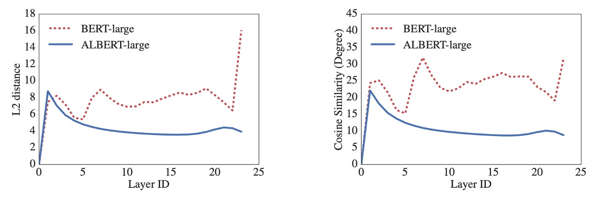

## 愛因斯 BERT

[**ALBERT: A Lite BERT for Self-supervised Learning of Language Representations**](https://arxiv.org/abs/1909.11942)

---

BERT 之後，還是 BERT。

## 定義問題

一個 BERT 大概有 340M 個參數，很難 Train，要 Train 很久。有了 BERT 作為基礎比較對象，後續研究開始加大模型規模，模型參數愈來愈多。

0.1B ➔ 0.3B ➔ 0.5B ➔ 1.0B ➔ 1.5B ➔ ？？？

這篇論文的作者說：不行，不能再更大了，我們快要 Train 不起了！

- **我們需要小的 BERT！**

## 解決問題

ALBERT 的基礎架構與 BERT 一樣，但做了以下幾個改進：

### 分解的嵌入參數化

在 BERT 及其後續改進模型（這裡說的是 XLNet 和 RoBERTa）中，WordPiece 嵌入大小 $E$ 與隱藏層大小 $H$ 被綁定，即 $E ≡ H$。

這樣的設計在模型和實用性上有兩個缺點：

- **模型角度**：WordPiece 嵌入主要學習上下文無關的表示，而隱藏層嵌入則專注於上下文相關的表示。透過分離 $E$ 和 $H$，模型可以更有效地根據需求分配參數，因為隱藏層應有較大的容量（即 $H > E$）。

- **實用角度**：自然語言處理中，詞彙表大小 $V$ 通常很大。如果 $E ≡ H$，則增大 $H$ 會顯著增加嵌入矩陣的大小，該矩陣的尺寸為 $V \times E$。這可能會導致模型的參數量達到數十億，且大多數參數在訓練中僅會稀疏更新。

因此，ALBERT 使用了嵌入參數的分解，將它們分成兩個較小的矩陣：

- 首先將 one-hot 向量投影到較低維度的嵌入空間，大小為 $E$
- 然後再將其投影到隱藏層空間

此分解使嵌入參數的數量從 $O(V \times H)$ 降低至 $O(V \times E + E \times H)$。

當 $H > E$ 時，參數量會顯著地減少！

:::tip
**舉個例子吧！**

假設詞彙表大小 $V$ 為 30,000，隱藏層大小 $H$ 為 1,024。在 BERT 中，因為 $E ≡ H$，這意味著嵌入矩陣的大小會是 $V \times H = 30,000 \times 1,024 = 30,720,000$ 個參數。

然而，如果我們在 ALBERT 中將嵌入維度 $E$ 設定為較小的 128，那麼嵌入矩陣的大小會被分解為兩部分：

- 第一部分是 $V \times E = 30,000 \times 128 = 3,840,000$ 個參數
- 第二部分是 $E \times H = 128 \times 1,024 = 131,072$ 個參數

因此，ALBERT 的總嵌入參數數量為 $3,840,000 + 131,072 = 3,971,072$，相比 BERT 中的 $30,720,000$ 個參數大幅減少。

這不僅能降低記憶體需求，還能提高計算效率。
:::

### 跨層參數共享

過去有許多研究專注於提高模型的參數效率:

- **Dehghani 等人 (2018) 的 Universal Transformer (UT)**：

  - [**[18.07] Universal transformers**](https://arxiv.org/abs/1807.03819)

  他們提出了一種 Universal Transformer，並發現這種模型在性能上超越了標準的 Transformer。Universal Transformer 是一種改進版的 Transformer，它通過將多層 Transformer 的參數共享（類似 ALBERT 的做法），強化了模型的學習能力，特別是在處理不同層的時間步進時，有效提升了模型的表現。

- **Bai 等人 (2019) 的 Deep Equilibrium Models (DQE)**：

  - [**[19.09] Deep equilibrium models**](https://arxiv.org/abs/1909.01377)

  他們的研究發現，Deep Equilibrium Models (DQE) 能夠達到一個「平衡點」，在該平衡點上，某一層的輸入和輸出嵌入變得相同，這意味著該層模型的表示不再發生變化。也就是說模型的表達能力在達到這個平衡點後，逐漸趨於穩定，不再有顯著的變動。

除了上述兩個研究，共享參數的概念實現的方式有很多種：

- 只在層與層之間共享前饋網路 (FFN) 的參數
- 只共享注意力機制的參數

ALBERT 的預設設計是**共享所有層之間的所有參數**，除非另有說明，所有實驗均基於此預設進行。如下圖，作者通過對 L2 距離和餘弦相似度的測量來進行分析，測量顯示 ALBERT 的嵌入表現出的是**震盪狀態**，而不是像 DQE 模型那樣收斂。

ALBERT 的嵌入參數並不會像 DQE 那樣達到穩定的平衡點，而是保持動態變化，這與其他研究的結果形成了對比，並且這樣的動態變化或許對 ALBERT 的設計和性能具有特定的優勢。

### 句序預測損失 Loss

句序預測損失，Sentence-Order Prediction, 簡稱 SOP。

BERT 除了 MLM 損失外，還使用了一種額外的損失函數 NSP（Next Sentence Prediction）。在許多後續研究發現 NSP 的效果不穩定，並選擇移除 NSP 損失。

作者推測 NSP 的低效原因是該任務相對於 MLM 來說過於簡單。NSP 將主題預測與一致性預測混為一體，而主題預測相對於一致性預測更容易學習，並且與 MLM 損失的學習重疊較大。

考慮到這些因素，作者認為跨句建模是語言理解中重要的一部分，為此提出了句序預測損失：

- 正樣本與 BERT 相同，來自同一文檔中的兩個連續片段。
- 負樣本則是相同兩個連續片段，但交換它們的順序。

模型必須判斷哪個片段是先出現的，這樣能強迫模型學習更細緻的一致性區別。

## 討論

### BERT 與 ALBERT 的整體比較

ALBERT 的設計選擇主要體現在參數效率的提升。

如上表所示：ALBERT-xxlarge 只使用 BERT-large 約 70% 的參數，卻在多個代表性下游任務上表現優異，包括 SQuAD v1.1 (+1.9%)、SQuAD v2.0 (+3.1%)、MNLI (+1.4%)、SST-2 (+2.2%)、RACE (+8.4%)。

此外，ALBERT 的訓練數據處理速度優於 BERT，在相同的 TPU 訓練配置下，ALBERT-large 的處理速度是 BERT-large 的 1.7 倍，而 ALBERT-xxlarge 則因其較大結構速度較慢，大約是 BERT-large 的三倍時間。

### 嵌入參數分解

上表展示了在 ALBERT-base 設定下，改變詞彙嵌入大小 $E$ 的效果。

對於非共享參數的情況下（BERT 風格），較大的嵌入尺寸帶來了些許性能提升，但在全參數共享（ALBERT 風格）下，嵌入大小 $E=128$ 表現最佳。

基於這些結果，作者決定在未來的設置中使用嵌入大小 $E=128$ 進行模型擴展。

### 跨層參數共享

上表展示了不同的跨層參數共享策略實驗結果：

- 使用 ALBERT-base 配置（$E=768$ 和 $E=128$）。

全共享策略會在兩種條件下影響性能，但對於 $E=128$，損失較小（-1.5）；對於 $E=768$，損失較大（-2.5）。

大部分性能下降源於共享 FFN 層的參數，當 $E=128$ 時共享注意力層的參數對性能幾乎沒有影響 (+0.1)，而當 $E=768$ 時則有小幅下降 (-0.7)。

雖然可以考慮將 L 層劃分為 N 個大小為 M 的組，每組內共享參數，但實驗表明，分組的大小愈小，性能愈好，但參數總數也隨之增加。

因此，作者最終選擇了全共享策略作為預設。

### 句序預測的有效性

作者比較了三種跨句損失條件：

- 無（XLNet 和 RoBERTa 風格）
- NSP（BERT 風格）
- SOP（ALBERT 風格）。

結果顯示，NSP 對 SOP 任務沒有辨識力（準確率為 52.0%，接近隨機猜測），這表明 NSP 主要學習了主題轉換。而 SOP 在 NSP 任務上表現不錯（準確率為 78.9%），且在 SOP 任務上表現更佳（準確率為 86.5%）。

此外，SOP 對於多句編碼任務的下游性能有顯著提升：SQuAD1.1 提升 1%、SQuAD2.0 提升 2%、RACE 提升 1.7%。

### NLU 任務的當前最先進水平

<figure>

<figcaption>ALBERT 在 GLUE benchmark 上的表現</figcaption>
</figure>

---

<figure>

<figcaption> ALBERT 在 SQuAD and RACE benchmarks 上的表現</figcaption>
</figure>

---

最後，作者在兩種微調設定下發表了 SOTA 結果：**單模型** 和 **系集模型**：

- **單模型**：
  - 在訓練集上報告了五次運行中的中位數結果。
  - 單模型的 ALBERT 配置使用了最佳表現的設置：ALBERT-xxlarge 配置，結合了 MLM 和 SOP 的損失函數，且不使用 dropout。
- **系級模型**：
  - 系級模型的檢查點根據訓練集的性能選取，根據任務的不同，檢查點的數量範圍從 6 到 17。
  - 在 GLUE 和 RACE 基準測試中，系集模型的預測結果是對來自不同訓練步驟的 12 層和 24 層架構進行微調後的模型預測進行平均。
  - 在 SQuAD 中，則是對具有多個概率的 span 的預測分數進行平均，並對「無法回答」的決策分數進行平均。

無論是單模型還是系集模型，ALBERT 在以下三個基準測試中顯著提升了當前的 SOTA 水準：

- **GLUE**：取得了 89.4 分
- **SQuAD 2.0**：測試 F1 分數達到 92.2
- **RACE**：測試準確率達到 89.4

RACE 測試的結果特別好，相較於其他模型的提升幅度巨大：

- 比 BERT 提升了 17.4%。
- 比 XLNet 提升了 7.6%。
- 比 RoBERTa 提升了 6.2%。
- 比 DCMI+ 提升了 5.3%。

## 結論

ALBERT 以創新的方式大幅提升了參數效率，並且引入了更具針對性的損失函數來提升跨句理解任務的表現。它的設計理念對於未來的大型語言模型具有深遠的影響。

如果你也是在資源有限的環境下開發語言模型，ALBERT 可能是一個不錯的選擇！
