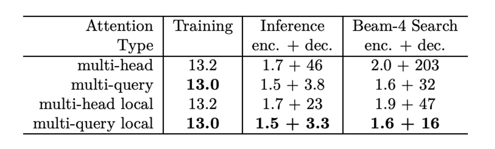

## 共享 Key-Value

[**Fast Transformer Decoding: One Write-Head is All You Need**](https://arxiv.org/abs/1911.02150)

---

共享經濟大行其道，看來在注意力機制中也可以這樣玩。

這篇論文的作者是 Noam Shazeer，是 「Attention is all you need」 的作者群。

## 定義問題

作者在提出一般的注意力機制後，發現在解碼的過程中，由於使用自回歸的方式輸出，每一個位置都會計算所有的鍵值對，會導致大量的重複計算。

這樣操作非常的低效，作者認為這是一個可以改進的地方。

## 回顧注意力機制

想要知道作者怎麼改進這個問題，那我們就必須從原本的注意力機制開始看起。

:::tip
在這個過程中會大量使用 `einsum` 運算子來表示矩陣運算，如果你不熟悉這個運算子的話，可以參考相關的文章：

- [**Einsum is All you Need**](https://rockt.github.io/2018/04/30/einsum)

這篇論文中使用的是 `tf.einsum`，如果你習慣使用 PyTorch，可以直接改成：`torch.einsum`。

現在我們假設你已經是個使用 `einsum` 運算子的高手了。
:::

:::warning
**數學警告：** 以下段落存在大量的矩陣運算，如果你不需要這些細節，可以直接跳到結論。

- [**結論**](#結論)
  :::

### Dot-Product Att

首先介紹處理單個查詢向量（query）和一組鍵值對（keys-values）的關係。

```python
def DotProductAttention(q, K, V):
    """
    Dot-Product Attention on one query.
    Args:
    q: 一個形狀為 [k] 的向量（query，查詢向量）
    K: 形狀為 [m, k] 的矩陣（keys，鍵向量集合）
    V: 形狀為 [m, v] 的矩陣（values，值向量集合）

    Returns:
    y: 形狀為 [v] 的向量（輸出結果向量）
    """
    # 計算查詢向量 q 和鍵矩陣 K 的點積，產生 logits，形狀為 [m]
    logits = tf.einsum("k,mk->m", q, K)

    # 對 logits 使用 softmax，得到每個鍵的權重，形狀為 [m]
    weights = tf.nn.softmax(logits)

    # 使用權重對值矩陣 V 進行加權求和，輸出向量 y 形狀為 [v]
    y = tf.einsum("m,mv->v", weights, V)

    return y
```

這是經典的**點積注意力機制**。

它將查詢與鍵進行點積以計算相似性，並根據這些相似性對值進行加權，最終生成輸出向量。

### Multi-head Att

再來是多頭注意力機制，這是將多個點積注意力機制組合在一起，以提高模型的表現。

在下列函數中，參數意義表示：

- $d$：查詢向量的維度
- $m$：鍵值對的數量
- $h$：注意力頭的數量
- $k$：查詢和鍵的線性投影維度
- $v$：值的線性投影維度

```python
import tensorflow as tf

def MultiheadAttention(x, M, P_q, P_k, P_v, P_o):
    """
    Multi-head Attention on one query.

    Args:
    x: 一個形狀為 [d] 的向量，表示查詢向量
    M: 一個形狀為 [m, d] 的矩陣，表示鍵和值的矩陣
    P_q: 一個形狀為 [h, d, k] 的張量，表示查詢的線性投影矩陣
    P_k: 一個形狀為 [h, d, k] 的張量，表示鍵的線性投影矩陣
    P_v: 一個形狀為 [h, d, v] 的張量，表示值的線性投影矩陣
    P_o: 一個形狀為 [h, d, v] 的張量，表示輸出的線性投影矩陣

    Returns:
    y: 一個形狀為 [d] 的向量，最終的輸出結果
    """

    # 查詢向量 x 的線性投影，形狀為 [h, k]
    q = tf.einsum("d, hdk->hk", x, P_q)

    # 鍵和值矩陣 M 的線性投影
    # 鍵矩陣 K 的形狀為 [h, m, k]，值矩陣 V 的形狀為 [h, m, v]
    K = tf.einsum("md, hdk->hmk", M, P_k)
    V = tf.einsum("md, hdv->hmv", M, P_v)

    # 計算查詢與鍵的點積（logits），形狀為 [h, m]
    logits = tf.einsum("hk, hmk->hm", q, K)

    # 使用 softmax 計算注意力權重，形狀為 [h, m]
    weights = tf.nn.softmax(logits)

    # 使用權重對值向量進行加權求和，形狀為 [h, v]
    o = tf.einsum("hm, hmv->hv", weights, V)

    # 將多頭輸出進行線性投影並合併，最終輸出向量形狀為 [d]
    y = tf.einsum("hv, hdv->d", o, P_o)

    return y
```

### Multi-head Att (Batched)

接著我們擴展一下。

在一般訓練中，我們會使用批次訓練，這時候我們就需要對上面的函數進行修改。

```python
import tensorflow as tf

def MultiheadAttentionBatched(X, M, mask, P_q, P_k, P_v, P_o):
    """
    Multi-head Attention for batched inputs.

    Args:
    X: 一個形狀為 [b, n, d] 的張量，表示查詢向量，批次大小為 b，序列長度為 n，向量維度為 d
    M: 一個形狀為 [b, m, d] 的張量，表示鍵和值矩陣，m 是鍵和值的數量
    mask: 一個形狀為 [b, h, n, m] 的張量，用於遮罩不合法的注意力位置
    P_q: 一個形狀為 [h, d, k] 的張量，表示查詢的線性投影矩陣
    P_k: 一個形狀為 [h, d, k] 的張量，表示鍵的線性投影矩陣
    P_v: 一個形狀為 [h, d, v] 的張量，表示值的線性投影矩陣
    P_o: 一個形狀為 [h, d, v] 的張量，表示輸出的線性投影矩陣

    Returns:
    Y: 一個形狀為 [b, n, d] 的張量，最終的輸出結果
    """

    # 查詢向量 X 的線性投影，形狀為 [b, h, n, k]
    Q = tf.einsum("bnd, hdk->bhnk", X, P_q)

    # 鍵和值矩陣 M 的線性投影，鍵 K 的形狀為 [b, h, m, k]，值 V 的形狀為 [b, h, m, v]
    K = tf.einsum("bmd, hdk->bhmk", M, P_k)
    V = tf.einsum("bmd, hdv->bhmv", M, P_v)

    # 計算查詢與鍵的點積（logits），形狀為 [b, h, n, m]
    logits = tf.einsum("bhnk, bhmk->bhnm", Q, K)

    # 將 mask 應用於 logits 並使用 softmax 計算注意力權重，形狀為 [b, h, n, m]
    weights = tf.nn.softmax(logits + mask)

    # 使用權重對值向量進行加權求和，形狀為 [b, h, n, v]
    O = tf.einsum("bhnm, bhmv->bhnv", weights, V)

    # 將多頭輸出進行線性投影並合併，最終輸出向量形狀為 [b, n, d]
    Y = tf.einsum("bhnv, hdv->bnd", O, P_o)

    return Y
```

在這裡，作者對計算與記憶體訪問進行了簡化假設：

1. $m = n$：假設鍵和值的數量 $m$ 與查詢的序列長度 $n$ 相等。
2. $k = v = \frac{d}{h}$：根據 Transformer 原始論文的建議，查詢和鍵的維度 $k$ 等於值的維度 $v$，並且它們與特徵維度 $d$ 成正比，比例因子為頭的數量 $h$。
3. $n ≤ d$：假設序列長度 $n$ 小於或等於特徵維度 $d$。

---

根據這些假設，計算的總數量是 $Θ(bnd^2)$，其中 $b$ 是批次大小，$n$ 是序列長度，$d$ 是特徵維度。這是由於每個 `tf.einsum` 操作的複雜度為 $O(bnd^2)$。

:::tip
舉個例子，假設我們有 1000 個序列，每個序列長度是 100，每個向量的維度是 512。那麼，計算量大概會是 $1000 \times 100 \times 512^2$。
:::

記憶體訪問大小的部分，所有張量的總記憶體需求為 $O(bnd + bhn^2 + d^2)$：

- 第一項 $bnd$ 來自於輸入 $X$、鍵和值矩陣 $M$、查詢 $Q$、鍵 $K$、值 $V$、輸出 $O$ 和最終的輸出 $Y$。
- 第二項 $bhn^2$ 來自於 logits 和權重。
- 第三項 $d^2$ 來自於投影張量 $P_q$、$P_k$、$P_v$ 和 $P_o$。

記憶體訪問與計算之比為：

$$
O\left(\frac{1}{k} + \frac{1}{bn}\right)
$$

這個比值越低，對現代 GPU/TPU 硬體的性能越好，因為這類硬體的計算能力遠高於記憶體帶寬。

### Multi-head Att (Incremental)

除了一般的多頭注意力機制，另外一種是基於自回歸的增量注意力機制。

```python
import tensorflow as tf

def MultiheadSelfAttentionIncremental(x, prev_K, prev_V, P_q, P_k, P_v, P_o):
    """
    Multi-head Self-Attention for one step in incremental generation.

    Args:
    x: 一個形狀為 [b, d] 的張量，表示當前步驟的查詢向量
    prev_K: 一個形狀為 [b, h, m, k] 的張量，表示之前步驟的鍵矩陣
    prev_V: 一個形狀為 [b, h, m, v] 的張量，表示之前步驟的值矩陣
    P_q: 一個形狀為 [h, d, k] 的張量，表示查詢向量的線性投影矩陣
    P_k: 一個形狀為 [h, d, k] 的張量，表示鍵的線性投影矩陣
    P_v: 一個形狀為 [h, d, v] 的張量，表示值的線性投影矩陣
    P_o: 一個形狀為 [h, d, v] 的張量，表示輸出的線性投影矩陣

    Returns:
    y: 一個形狀為 [b, d] 的張量，當前步驟的輸出結果
    new_K: 一個形狀為 [b, h, m+1, k] 的張量，更新後的鍵矩陣
    new_V: 一個形狀為 [b, h, m+1, v] 的張量，更新後的值矩陣
    """

    # 計算查詢向量 x 的線性投影，形狀為 [b, h, k]
    q = tf.einsum("bd, hdk->bhk", x, P_q)

    # 更新鍵矩陣，將當前步驟的新鍵向量與之前的鍵矩陣連接，形狀為 [b, h, m+1, k]
    new_K = tf.concat(
        [prev_K, tf.expand_dims(tf.einsum("bd, hdk->bhk", x, P_k), axis=2)],
        axis=2
    )

    # 更新值矩陣，將當前步驟的新值向量與之前的值矩陣連接，形狀為 [b, h, m+1, v]
    new_V = tf.concat(
        [prev_V, tf.expand_dims(tf.einsum("bd, hdv->bhv", x, P_v), axis=2)],
        axis=2
    )

    # 計算查詢與鍵的點積（logits），形狀為 [b, h, m]
    logits = tf.einsum("bhk, bhmk->bhm", q, new_K)

    # 使用 softmax 計算注意力權重，形狀為 [b, h, m]
    weights = tf.nn.softmax(logits)

    # 使用權重對值向量進行加權求和，形狀為 [b, h, v]
    o = tf.einsum("bhm, bhmv->bhv", weights, new_V)

    # 將多頭輸出進行線性投影並合併，最終輸出向量形狀為 [b, d]
    y = tf.einsum("bhv, hdv->bd", o, P_o)

    return y, new_K, new_V
```

作者沿用了之前的簡化假設，並對增量推論進行了性能評估。

在整個推論過程中，運算量的總數為 $\Theta(bnd^2)$，其中 $b$ 是批次大小，$n$ 是序列長度，$d$ 是特徵維度。

記憶體訪問的總量為 $\Theta(bn^2d + nd^2)$：

- 第一項 $bn^2d$ 來自於每一步需要重新載入鍵 $K$ 和值 $V$ 的記憶體操作，這些張量的大小隨著序列長度 $n$ 增加而增加。
- 第二項 $nd^2$ 來自於查詢、鍵和值的線性投影矩陣 $P_q, P_k, P_v, P_o$。

記憶體訪問與計算之比率為：

$$
\Theta\left(\frac{n}{d} + \frac{1}{b}\right)
$$

當 $n ≈ d$ 或 $b ≈ 1$ 時，這個比率接近 1，說明記憶體頻寬成為了現代計算硬體中的主要瓶頸。

---

比較簡單的優化策略是增加批次大小，這樣可以輕鬆減少記憶體訪問與計算的比率。

另外一種是**減少 $\frac{n}{d}$ 比例**，這比較困難，因為涉及到每一步重新載入鍵和值張量。優化方法包括限制序列長度 $n$，或者只對局部範圍進行注意力計算，壓縮需要處理的記憶位置數量。

## 解決問題

為了減少鍵和值張量的大小，作者提出的具體方法是去掉 $\text{Key}$ 和 $\text{Value}$ 的「頭」（heads）維度，但保留查詢中的「頭」維度，從而減少記憶體負擔並提高效率。

### Multi-Query Attention

**多查詢注意力**（Multi-Query Attention）是**多頭注意力**（Multi-Head Attention）的一種變體。

在傳統多頭注意力中，不同的「頭」會擁有獨立的查詢（queries）、鍵（keys）、值（values）和輸出，但多查詢注意力則簡化了這一結構：不同的頭共享一組鍵和值，僅保留查詢的多頭結構。這樣可以減少記憶體的負擔並提高推論速度。

```python
def MultiQueryAttentionBatched(X, M, mask, P_q, P_k, P_v, P_o):
    """
    Multi-Query Attention for batched inputs.

    Args:
    X: 一個形狀為 [b, n, d] 的張量，表示查詢向量
    M: 一個形狀為 [b, m, d] 的張量，表示鍵和值的矩陣
    mask: 一個形狀為 [b, h, n, m] 的張量，用於掩蔽無效的位置
    P_q: 一個形狀為 [h, d, k] 的張量，表示查詢向量的線性投影
    P_k: 一個形狀為 [d, k] 的張量，表示鍵的線性投影
    P_v: 一個形狀為 [d, v] 的張量，表示值的線性投影
    P_o: 一個形狀為 [h, d, v] 的張量，表示輸出向量的線性投影

    Returns:
    Y: 一個形狀為 [b, n, d] 的張量，最終的輸出結果
    """

    # 查詢向量 X 的線性投影，形狀為 [b, h, n, k]
    Q = tf.einsum("bnd, hdk->bhnk", X, P_q)

    # 鍵和值矩陣 M 的線性投影，鍵 K 形狀為 [b, m, k]，值 V 形狀為 [b, m, v]
    K = tf.einsum("bmd, dk->bmk", M, P_k)
    V = tf.einsum("bmd, dv->bmv", M, P_v)

    # 計算查詢與鍵的點積，形狀為 [b, h, n, m]
    logits = tf.einsum("bhnk, bmk->bhnm", Q, K)

    # 應用 softmax 計算注意力權重，並考慮掩蔽
    weights = tf.nn.softmax(logits + mask)

    # 使用注意力權重對值進行加權求和，形狀為 [b, h, n, v]
    O = tf.einsum("bhnm, bmv->bhnv", weights, V)

    # 最後的線性投影與合併，形狀為 [b, n, d]
    Y = tf.einsum("bhnv, hdv->bnd", O, P_o)

    return Y
```

作者也提供了**增量多查詢自注意力**（Incremental Multi-Query Self-Attention）的實現程式碼：

```python
def MultiQuerySelfAttentionIncremental(x, prev_K, prev_V, P_q, P_k, P_v, P_o):
    """
    Incremental Multi-Query Self-Attention for one step.

    Args:
    x: 一個形狀為 [b, d] 的張量，表示當前步驟的查詢向量
    prev_K: 一個形狀為 [b, m, k] 的張量，表示先前的鍵矩陣
    prev_V: 一個形狀為 [b, m, v] 的張量，表示先前的值矩陣
    P_q: 一個形狀為 [h, d, k] 的張量，表示查詢的線性投影
    P_k: 一個形狀為 [d, k] 的張量，表示鍵的線性投影
    P_v: 一個形狀為 [d, v] 的張量，表示值的線性投影
    P_o: 一個形狀為 [h, d, v] 的張量，表示輸出的線性投影

    Returns:
    y: 一個形狀為 [b, d] 的張量，輸出結果
    new_K: 更新後的鍵矩陣，形狀為 [b, m+1, k]
    new_V: 更新後的值矩陣，形狀為 [b, m+1, v]
    """

    # 計算查詢向量的線性投影，形狀為 [b, h, k]
    q = tf.einsum("bd, hdk->bhk", x, P_q)

    # 更新鍵和值矩陣
    new_K = tf.concat([prev_K, tf.expand_dims(tf.einsum("bd, dk->bk", x, P_k), axis=2)], axis=2)
    new_V = tf.concat([prev_V, tf.expand_dims(tf.einsum("bd, dv->bv", x, P_v), axis=2)], axis=2)

    # 計算查詢與鍵的點積，形狀為 [b, h, m]
    logits = tf.einsum("bhk, bmk->bhm", q, new_K)

    # 計算 softmax 權重
    weights = tf.nn.softmax(logits)

    # 使用權重對值進行加權求和
    o = tf.einsum("bhm, bmv->bhv", weights, new_V)

    # 線性投影並合併輸出
    y = tf.einsum("bhv, hdv->bd", o, P_o)

    return y, new_K, new_V
```

### 性能分析

與傳統多頭注意力相似，在增量多查詢注意力中，計算量依然是 $\Theta(bnd^2)$，而記憶體訪問量為 $\Theta(bnd + bn^2k + nd^2)$。

透過移除鍵和值的「頭」維度，記憶體的消耗大幅減少，而計算效率則顯著提高。

:::tip
假設頭的數量 $h = 8$，鍵的維度 $k = \frac{d}{h} = \frac{512}{8} = 64$，這樣會比原來多頭注意力的需求更低，因為多頭注意力的訪問量是 $\Theta(bnd + bhn^2 + d^2)$，其中多了一個與頭數 $h$ 有關的項。
:::

記憶體訪問與計算之比為：

$$
\Theta\left(\frac{1}{d} + \frac{n}{dh} + \frac{1}{b}\right)
$$

由於 $\frac{n}{d}$ 項被頭的數量 $h$ 減少了，這使得增量推論的性能大幅提升。

:::tip

- **原始多頭注意力的比率**：$\Theta\left(\frac{n}{d} + \frac{1}{b}\right)$

  在傳統多頭注意力中，記憶體訪問量與計算量的比率受序列長度 $n$ 和特徵維度 $d$ 的比例影響。當序列長度接近特徵維度時，這個比率接近 1，這意味著記憶體訪問成為性能瓶頸。

- **多查詢注意力的比率**：$\Theta\left(\frac{1}{d} + \frac{n}{dh} + \frac{1}{b}\right)$

  鍵和值的維度減少了，這裡的 $n/d$ 比例被減少了 $h$ 倍。假設 $h = 8$，那麼記憶體訪問量大幅降低，這使得推論效率顯著提升。

:::

假設你在進行語言模型生成，處理一批次大小 $b = 128$ 的 100 個單詞（序列長度 $n = 100$），而每個單詞的向量維度 $d = 512$。

傳統多頭注意力的「記憶體訪問-計算比」可能是：

$$
\frac{n}{d} + \frac{1}{b} = \frac{100}{512} + \frac{1}{128} \approx 0.195 + 0.0078 = 0.2028
$$

而使用多查詢注意力，假設頭的數量 $h = 8$，那麼這個比率會變成：

$$
\frac{1}{d} + \frac{n}{dh} + \frac{1}{b}
$$

$$
= \frac{1}{512} + \frac{100}{512 \times 8} + \frac{1}{128}
$$

$$
\approx 0.00195 + 0.0244 + 0.0078 = 0.03415
$$

我們簡單動手算一下，就可以看到，多查詢注意力有效地降低了記憶體訪問與計算量的比率，這也是整體推論效率提升的關鍵。

### 訓練策略

作者基於 WMT 2014 英德翻譯任務進行評估。

模型方面採用 6 層編碼器-解碼器 Transformer 模型，設置如下：

- $d_{model} = 1024$
- $d_{ff} = 4096$
- 頭的數量 $h = 8$
- $d_k = d_v = 128$，使用學習的位置嵌入，並在 token 嵌入層和輸出層之間共享權重。

訓練 20 個 epoch，每個批次包含 128 個樣本，每個樣本有 256 個 token 的輸入序列和 256 個 token 的目標序列。模型在 32 核 TPUv3 集群上訓練，每個模型訓練約 2 小時。

在 MQA 的模型中，作者將模型中所有的注意力層替換為 Multi-Query 注意力，並將前饋層的隱藏維度從 4096 增加到 5440，以保持總參數量與基線模型一致。

## 討論

### WMT14 EN-DE 結果


上表為作者提供的實驗數據。

從表中可以發現多查詢注意力模型表現「略差」於基線模型，但優於降低 $h$、$d_k$ 和 $d_v$ 的其他變體。

### 推理時間改進



從訓練速度方面來看，使用 **TPUv2（8 核心）** 進行訓練速度測試，每次訓練步驟處理 32,768 個 token。

    - **基線模型**：每步訓練時間為 **433ms**。
    - **多查詢模型**：每步訓練時間為 **425ms**，稍微比基線模型快。

每個 token 的訓練時間為：

- **基線模型**：

  $$
  \frac{433}{32,768} = 13.2\mu s
  $$

- **MQA 模型**：

  $$
  \frac{425}{32,768} = 13.0\mu s
  $$

---

換成用自回歸模型來看，在 1024 個序列（每個序列 128 token，平均每個 TPU 核心處理 128 序列）的情況下，測試了增量貪婪解碼的推論速度。

- **基線模型**：

  - 編碼器部分耗時 **222ms**，即每個 token 的時間為 **1.7µs**。
  - 解碼器每步耗時 **47ms**，即每個 token 的解碼時間為 **46µs**。

- **MQA 模型**：

  - 編碼器部分耗時 **195ms**，即每個 token 的時間為 **1.5µs**。
  - 解碼器每步耗時 **3.9ms**，即每個 token 的解碼時間為 **3.8µs**，顯著快於基線模型。

## 結論

快又有效！

在幾乎沒有損失精度的前提下，大幅提升推論速度，特別是在自回歸模型中，提升了約 10 倍！

:::tip
這個架構在後續的 `MobileNet V4` 也再次被拿出來使用，有興趣的讀者可以看看：

- [**[24.04] MobileNet-V4: 時隔五年的傳承**](../../lightweight/2404-mobilenet-v4/index.md#mobile-mqa)
  :::
