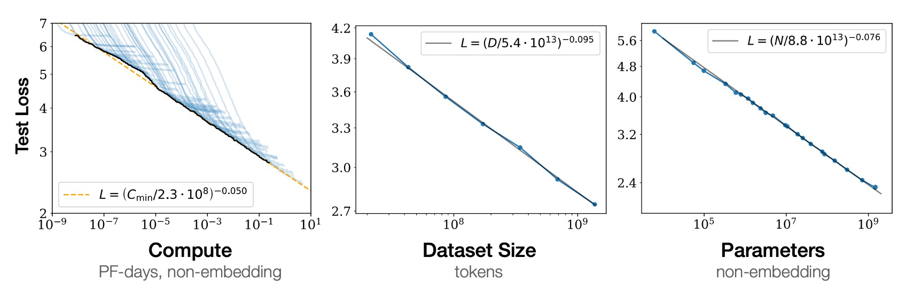

## 模型的縮放律

[**Scaling Laws for Neural Language Models**](https://arxiv.org/abs/2001.08361)

---

OpenAI 在 Transformer 解碼器上走得愈來愈遠了。

## 定義問題

從前幾篇文章中，想必你也看出 OpenAI 的野心了：他們想建立一個「超級大」的語言模型。

於是就有了這篇研究：

- 到底該怎麼把模型做大？

這個問題，就是本論文想解決的核心挑戰。

## 解決問題

本文中，使用了以下超參數來參數化 Transformer 架構：

- **中間前饋層的維度**
- **注意力輸出的維度**
- **每層的注意力頭數**
- **層數**：Transformer 的層數
- **Token 數量**：上下文長度，通常設定為 1024

### 訓練過程

除非特別註明，否則使用 Adam 優化器進行訓練，每次訓練進行 $2.5\times10^{5}$ 步，批次大小為 512 個序列，每個序列包含 1024 個標記。由於記憶體限制，超過 10 億參數的模型使用 Adafactor 進行訓練。

作者試驗了各種學習率和學習率調度方法，發現收斂時的結果基本不受學習率調度的影響。除非特別說明，所有訓練均使用 3000 步的線性增溫後逐步衰減至零的學習率調度。

### 數據集

模型訓練在「**擴展版的 WebText 數據集**」上。

- 原始 WebText 數據集來自於 Reddit 的外部鏈接，這些鏈接在 2017 年 12 月前獲得至少 3 個其他讀者認同。
- WebText2 中，加入了 2018 年 1 月至 10 月期間的 Reddit 外部鏈接，這些鏈接也需要至少 3 個其他讀者認同。
- 使用 Newspaper3k Python 庫提取鏈接文本，最終數據集包含 2030 萬個文件，總計 96GB 文本和 $1.62\times10^{10}$ 詞。
- 應用了可逆的字節對編碼（byte-pair encoding）來進行標記化，最終得到 $2.29\times10^{10}$ 個標記，並保留了 $6.6\times10^{8}$ 個標記作為測試集。
- 在 Books Corpus、Common Crawl、英語維基百科和其他公共可用的網路書籍樣本上進行測試。

### 變化因素

為了全面研究語言模型的縮放特性，本論文在以下方面進行了廣泛的模型訓練：

- **模型大小**：從 768 到 15 億非嵌入參數的模型
- **數據集大小**：從 2200 萬到 230 億標記的數據集
- **模型形狀**：包括深度、寬度、注意力頭數和前饋層維度
- **上下文長度**：大多數訓練使用 1024 長度的上下文，但我們也試驗了更短的上下文
- **批次大小**：大多數訓練使用 $2^{19}$ 的批次大小，但我們也變化批次大小來測量關鍵批次大小

上述的實驗設計旨在系統地研究模型在不同條件下的性能表現，並得出相關的縮放規律。

## 討論

### 規模大於一切

模型的性能很大程度上取決於規模，而較弱地取決於模型形狀，模型性能很大程度上取決於規模，它由三個因素組成：

1. **N: 模型參數的數量**
2. **D: 數據集大小**
3. **C: 使用的計算量**

實驗指出：在合理的範圍內，效能對其他架構超參數（例如深度與寬度）的依賴性非常弱。

### 冪定律

當不受其他兩個比例因子限制時，表現與三個比例因子 N、D、C 中的每一個都存在冪律關係，趨勢跨越「六個」數量級以上，如上圖。

- **左圖**：計算量愈大，模型效能愈好。
- **中圖**：數據集愈大，模型效能愈好。
- **右圖**：模型參數愈多，模型效能愈好。

:::tip
你可能會覺得好像在說廢話？

並不是。在過去的架構中，例如 CNN 或 LSTM，這些關係並不總是成立。要不就是效能飽和，要不就是過擬合。這種橫跨六個數量級的關係，的確是一個很大的突破。
:::

### 過擬合的普遍性

實驗指出：只要我們同時擴大 N 和 D，效能就可以預見地提高，但如果 N 或 D 保持固定而另一個增加，則進入收益遞減狀態。效能損失可預測地取決於比率 $N^{0.74}\over D$，這意味著每次我們將模型大小增加 8 倍，我們只需將資料增加約 5 倍即可避免損失。

### 測試表現與下游表現

實驗指出：當我們在分佈與訓練不同的文本上評估模型時，結果與訓練驗證集上的結果密切相關，損失的偏移量大致恆定。

換句話說，轉移到不同的分佈會產生恆定的懲罰，但在其他方面會根據測試集的表現大致提高。

### 樣本效率

大型模型比小型模型的樣本效率更高，可以透過更少的最佳化步驟(上圖，第一張圖表)和使用更少的數據點(上圖，第二張圖表)達到相同的效能水準。

### 收斂是一件低效的事情

如上圖顯示，增加模型尺寸是一個更有效的方法，而不是訓練小模型直到完全收斂。

簡單來說，如果我們有固定的計算資源，最好訓練非常大的模型並在它們完全收斂之前停止，這樣可以在固定的計算預算內獲得最佳性能。相比之下，訓練小模型直到它們完全收斂反而效率更低。

此外，隨著計算資源的增加，所需的訓練數據量增加得很慢，因此我們不需要大量增加數據來匹配增加的計算資源。

### 最佳批量大小

訓練語言模型的最佳批次大小並不是一個固定的數值，而是與損失函數有關，可以通過測量梯度噪聲尺度來確定。

在本論文中，定義的最大模型為 15 億（1.5B），在訓練效果最好的時候，最佳的批次大小大約是 100 萬到 200 萬個 Tokens。這樣的批次大小有助於在訓練過程中達到最佳性能和效果。

:::tip
這邊提到的 100 萬到 200 萬指的是 Tokens 數量，而不是 Batch size 的數量。如果模型的上下文長度是 1024 的話，那麼對應的 Batch size 大約是 1000 到 2000，就能達到最佳效果。
:::

## 結論

這篇論文中做了大量的實驗，並對語言模型的訓練方式提出了總結。

這些結論在我們眼裡看到的都是白花花的鈔票，我們心懷感激地接受這些實驗結果。
