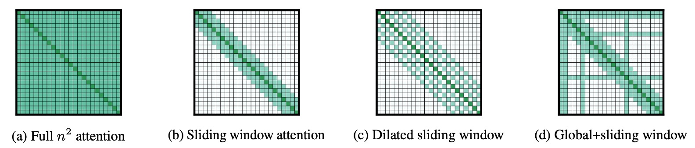

## 長注意力機制

[**Longformer: The Long-Document Transformer**](https://arxiv.org/abs/2004.05150)

---

Transformer 的自注意力機制的計算複雜度為 $O(n^2)$。

當任何一個演算法的計算複雜度出現這種情況時，都意味著其中有非常大量的優化空間。

恩？這個開頭是不是有點熟悉？

## 定義問題

為了解決原始的 Transformer 計算複雜度的問題，研究者不停地尋找優化的方法。

一部分的方法是採用 **Transformer-XL** 的設計理念，用滑動視窗搭配額外記憶區塊的方式來處理長文件。

- [**Transformer-XL: 更長的上下文**](../1901-transformer-xl/index.md)

但滑動視窗的這種設計，對於雙向的注意力機制上有著天生的設計缺陷。

另外一種流派則是採用稀疏注意力機制，例如：比這篇論文還要早一年提出的 **Sparse Transformer**。

- [**Sparse Transformer: 稀疏注意力機制**](../1904-sparse-transformer/index.md)

而過去關於稀疏注意力機制的研究，卻沒有提到基於預訓練模型的微調以及對於更多下游任務的泛化性。

本篇論文的作者的動機到這裡就很明確了：

1. 長上下文採用「稀疏注意力機制」是一個不錯的解題方向。
2. 但是注意力圖的設計必須進行優化。
3. 並且應該引入預訓練的框架和測試更多下游任務的泛化能力。

## 解決問題

### 模型架構

這篇論文其實非常容易閱讀，因為看到這張圖就差不多了。

這裡的描述非常明確，作者提出了三種稀疏架構，用於測試長文件的處理能力：

- 上圖 (a) 是原始的注意力機制，每個 Token 都需要關注到所有其他 Token。
- 上圖 (b) 是 Sliding Window Attention，每個 Token 只關注到前後固定範圍內的 Token。
- 上圖 (c) 是 Dilated Sliding Window Attention，每個 Token 關注到前後固定「間隔」的 Token。
- 上圖 (d) 是 Global+Sliding Window Attention，除了每個 Token 只關注到前後固定範圍內的 Token 之外，有「特定」幾個 Token 會和所有其他的 Token 「互相」關注。
  - 例如在上圖中的「特定」幾個 Token 就是第 1,2,6,16 個 Token，當然這只是示意圖，實際上的設計是可以調整的。

### 自回歸建模

這裡使用的是 Dilated Sliding Window Attention 的注意力機制，也就是上圖 (c) 的設計，同時也跟隨過去的研究，對於不同層應用了不一樣的間隔大小。

特別是低層使用較小的間隔，高層使用較大的間隔，這樣的設計可以讓模型在不同層次上有不同的感受野。

訓練的方面也有一些技巧，首先並不是一開始就直接使用超長的上下文，而是逐漸增加上下文的長度，這樣可以讓模型更容易收斂。

在初始階段從較短的序列長度和視窗大小開始。這有助於模型快速學習捕捉局部細節的能力。在後續的每個階段，系統將視窗大小和序列長度加倍，同時將學習率減半。這種訓練方法不僅可以加速訓練過程，還可以使模型在進行更複雜計算前有充足的準備，進而處理更長的序列。

模型在總共五個階段中進行訓練。在這五個階段中，模型逐漸適應處理越來越長的序列。

最後一階段從序列長度 2,048 開始，增至 23,040。這樣的逐步增長使模型有能力在不超出記憶體限制的前提下，處理大規模數據。

### 自編碼建模

除了對比自回歸模型之外，作者也想和自編碼的模型 BERT 進行比較。

但是考慮到訓練 BERT 的成本高昂，因此作者選擇從預訓練好的 RoBERTa 模型開始進行 MLM 微調，同時修改原本注意力機制成為 Longformer 的設計。

在這邊使用 Sliding Window Attention 的注意力機制，也就是上圖 (b) 的設計。

由於是稀疏注意力機制，因此上下文的長度比起原本的 RoBERTa 來說，可以從 512 增加到 4,096。

此外，有些特定的任務需要 Golbal 的注意力機制，例如文本分類的 \[CLS\] Token，還有 QA 任務的所有 Question Token。這些情況下，作者會使用 Global+Sliding Window Attention 的設計，也就是上圖 (d) 的設計。

## 討論

### 自回歸實驗結果

參考論文的 Table 2，實驗結果顯示，在小規模的模型上，Longformer 的表現得到了最優秀的結果。

參考論文的 Table 3，另外在同等規模的大模型上，Longformer 的效果和其他 SOTA 模型持平。

### 自編碼實驗結果

上表總結了所有微調實驗的結果。

作者觀察到 Longformer 始終優於 RoBERTa 基準。

- 對於需要長上下文的任務（例如 WikiHop 和 Hyperpartisan），其效能提升尤其明顯。
- 對於 TriviaQA 來說，改進幅度較小，因為本地上下文通常足以回答問題。
- 就 HotpotQA 而言，支援事實輔助監督使模型可以輕鬆找到相關上下文，然後專注於本地上下文，從而獲得較小的收益。
- WikiHop 僅包括對中間推理鏈的遠端監督，Longformer 的方法透過對整個上下文進行推理而表現出色。
- 在 IMDB 和 OntoNotes 資料集上，效能提升較小。對於 IMDB，大部分資料集由短文件組成，因此預計任何兩個提及之間的距離通常非常小，因此單獨處理較小區塊的基線能夠將提及縫合到共指鏈中，而無需考慮交叉塊交互。

### 自回歸消融實驗

作者針對自回歸模型做了兩組消融實驗。

第一組實驗測試滑動視窗的設計中：

- Decreasing w (from 512 to 32)，意思是從底層開始，逐步縮小滑動視窗的大小。
- Fixed w (=230)，意思是從頭到尾都使用相同大小的滑動視窗。
- Increasing w (from 32 to 512)，意思是從底層開始，逐步增加滑動視窗的大小。

結果顯示採用 Increasing w 的設計效果最好，這也符合直覺，因為這樣的設計可以讓模型在不同層次上有不同的感受野。

另外一組實驗是測試是否使用膨脹滑動視窗的機制，結果顯示在多頭注意力的其中兩個頭上使用膨脹滑動視窗的設計效果最好。

:::tip
關於第二組的消融實驗，作者的原文是：

> Adding some dilation to two heads leads to some improvement compared with no dilation at all.

這邊我們推測這個 "heads" 指的應該是多頭注意力機制中的其中兩個頭，如果理解的不對，請告訴我們。
:::

### 自編碼消融實驗

作者針對自編碼模型做了一連串的消融實驗。

首先是使用 Longformer-base 模型進行所有實驗。除非另有說明，所有實驗均使用相同的超參數並對五個時期進行微調。

1. **長序列的效益**： Longformer 能夠從更長的序列中受益，提升模型性能。
2. **全局注意力的影響**： 全局注意力以及其單獨投影矩陣對模型性能有正面影響。
3. **預訓練的影響**： MLM 預訓練有助於提升模型性能。
4. **訓練時間的影響**： 更長時間的訓練有助於性能提升。
5. **與 RoBERTa-base 的比較**： 當 Longformer 的配置與 RoBERTa-base 相同（seqlen：512 和 n2 注意力）時，Longformer 的性能略遜於 RoBERTa-base。這確認了性能提升不是由於額外的預訓練所致。
6. **僅解凍位置嵌入的影響**： 使用預先訓練的 RoBERTa 模型並僅解凍附加位置嵌入時，性能略有下降。這表明 Longformer 可以在大型訓練資料集（如 WikiHop）的任務特定微調中有效地學習並利用長範圍上下文。

## 結論

我們認為本篇論文的研究重點還是在於稀疏注意力機制的設計。

Longformer 的全域性的注意力機制，是透過下游任務來決定應該讓「哪個」 Token 具有全局的視野；對比先前的 Sparse Transformer 而是使用固定的間隔來實現「類」全域性的注意力機制。

至於哪種設計更好，就實驗的表格上來看，Longformer 確實優於過去的其他稀疏架構，但差異其實沒有很大。

所以具體要怎麼選擇，還是看使用者的需求吧。（~或是每個架構都試試看，也是個可以考慮的方式。~）
