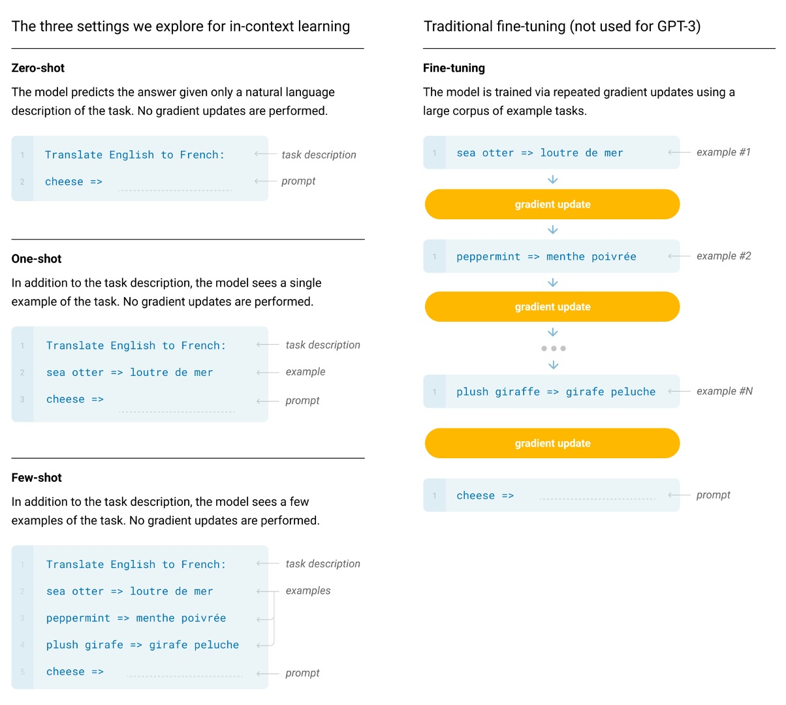

## 九十六層解碼器

[**Language Models are Few-Shot Learners**](https://arxiv.org/abs/2005.14165)

---

第二代的 GPT 疊了四十八層 Transformer 解碼器。

OpenAI 覺得這樣不夠，於是他們繼續往上疊了九十六層 Transformer 解碼器，參數量達到史無前例的 175 B，名為 GPT-3。

## 定義問題

最近的工作已經證明，透過對大量文字進行預訓練，然後對特定任務進行微調，在許多 NLP 任務和基準測試中取得了巨大的成果。在我們的理想中的 NLP 技術應能像人類一樣，在接收少量指示或示例的情況下，快速適應和處理多種語言任務，但現階段的研究中還是有幾個問題，顯然和理想上還有很大的差距：

### 多樣化的語言任務需求

當前的語言模型面臨著適應廣泛且多樣化的語言任務的需求，從語法糾正到抽象概念生成等。每個新任務通常需要大量特定的標記數據集，這限制了模型的普遍適用性。

### 依賴大規模監督數據集

收集和標記大型數據集對於許多語言任務來說既昂貴又耗時。每個新任務都需要重複這一數據收集過程，這增加了開發成本並延長了部署時間。

### 模型的過度專業化和泛化問題

當前模型在特定任務上進行微調可能導致過度專業化，使得模型在訓練分佈之外的數據上泛化能力差。訓練中的虛假相關性可能會誤導模型，影響其長期和廣泛的應用。

### 人類的學習效率與模型的對比

相對於人類通過少量示例或直接指令就能快速適應新任務的能力，當前模型對大量標記數據的依賴顯得效率低下。

## 解決問題

在 GPT-3 中，基本預訓練方法，包括模型、資料和訓練，都與 GPT-2 中描述的過程類似，相對簡單地擴大了模型大小、資料集大小和多樣性以及訓練長度。對情境學習的使用也與 GPT-2 類似，但在這項工作中，作者們系統地探索了情境中學習的不同設定，主要的分別為：

1. **Fine-tuning**

   - 這是最常見的方法，涉及透過對特定於所需任務的監督資料集進行訓練來更新預訓練模型的權重。通常使用數千到數十萬個標籤的範例。微調的主要優點是在許多基準測試中表現出色。
   - 主要缺點是每個任務都需要一個新的大型資料集，分佈外泛化能力差的可能性，以及利用訓練資料的虛假特徵的可能性，這可能會導致與人類表現進行不公平的比較。
   - 在這項工作中，作者們沒有對 GPT-3 進行微調，因為他們的重點是與任務無關的性能，但 GPT-3 原則上可以進行微調，這是未來工作的一個有希望的方向。

     :::tip
     這大概就是之後 ChatGPT-3.5 的伏筆了。
     :::

2. **Few-shot**

   - Few-shot 是指：在推理時為模型提供一些任務演示作為條件，但不允許權重更新。

     :::tip
     如上圖範例，假設我們需要解決的問題是「將英文句子翻譯成法文」，我們可以提供一些範例給模型，例如：

     - `Translate English to French: "sea otter" -> "loutre de mer", cheese -> `

     接著再讓主要需要翻譯的內容接續在下文，這裡就是期待模型會給出 `cheese` 的法文翻譯。
     :::

   - 主要優點是：大幅減少了對特定任務資料的需求，並降低了從大而窄的微調資料集中學習過於狹窄的分佈的潛力。
   - 主要缺點是：迄今為止，這種方法的結果比最先進的微調模型要差得多。此外，仍需要少量任務特定資料。

3. **One-shot**

   - One-shot 與 Few-shot 相同，只是只允許進行一次演示，此外還需要對任務進行自然語言描述。這種方法提供了最接近某些任務與人類溝通的方式。例如，當要求人類在人類工作者服務（例如 Mechanical Turk）上產生資料集時，通常會給出一個任務演示。相較之下，如果不給予範例，有時很難傳達任務的內容或格式。

4. **Zero-shot**

   - 與 One-shot 相同，只是不允許進行演示，並且僅向模型提供描述任務的自然語言指令。這種方法提供了最大的便利性、穩健性的潛力，並避免了虛假相關性，但也是最具挑戰性的設定。在某些情況下，如果沒有先前的範例，人類甚至可能很難理解任務的格式，因此這種設定在某些情況下「相當困難」。

### 模型架構

在本文中，作者使用與 GPT-2 相同的模型和架構，包括修改後的初始化、預歸一化和可逆標記化。

不同之處在於：作者在 Transformer 中使用了稀疏注意力的 Transformer，關於該技術的詳細內容，讀者可以參考我們的另外一篇文章以獲取更多資訊：

- [**\[19.04\] Sparse Transformer**](../1904-sparse-transformer/index.md)

  

為了研究機器學習效能對模型大小的依賴性，作者們訓練了 8 種不同大小的模型，範圍從 1.25 億個參數到 1750 億個參數三個數量級，最後一個是他們稱為 GPT-3 的模型。

從上表中可以看到，所有模型都使用 2048 個 Token 的上下文視窗。作者們沿著深度和寬度維度跨 GPU 劃分模型，以最大程度地減少節點之間的資料傳輸。每個模型的精確架構參數是根據運算效率和跨 GPU 模型佈局的負載平衡來選擇的。

### 資料集設定

在本文中，作者使用包含近兆字的 Common Crawl 資料集來預先訓練模型。

另外，作者也發現未經篩選或僅輕度篩選的 Common Crawl 版本的資料品質通常不如精心準備的資料集。

為了提升資料集的平均品質，他們採取了以下三個步驟：

1. **資料篩選和品質控制**：篩選 Common Crawl 的數據，選擇與一系列高品質參考語料庫相似度較高的數據。
2. **去重處理**：在文件層級進行模糊重複資料刪除，既在資料集內部進行，也跨資料集進行，以防止資料冗餘，並保持驗證集的完整性。
3. **增強資料多樣性**：在訓練組合中加入了已知的高品質參考語料庫，以增強 Common Crawl 資料並提高其多樣性。

透過這種方法，作者收集了從 2016 年至 2019 年間的 41 個 Common Crawl 每月資料片段，這些資料包含了過濾前的 45TB 壓縮明文和過濾後的 570GB，大約等同於 4000 億個位元組編碼的 Token。

此外，在訓練期間並非按資料大小進行採樣，而是更頻繁地採樣品質較高的資料集，例如 Common Crawl 和 Books2 資料集在訓練期間的採樣次數不足一次，而其他數據集則採樣 2 至 3 次。這種做法本質上是為了用少量的過度擬合換取更高品質的訓練資料。

:::tip
在預訓練期間無意中看到測試或訓練集，可能會污染下游任務的效果。

為了減少這種污染，作者搜尋並嘗試消除所有 Benchmark 和 Training 資料的任何重疊。不幸的是，過濾中的錯誤導致作者們忽略了一些重疊，而由於訓練成本，模型不能重新訓練（因為沒錢了），只能在後面試著挽救這個錯誤。
:::

## 討論

作者測試 GPT-3 在語言建模和相關任務中的表現，包括預測單字、完成句子或段落。

### LAMBADA

LAMBADA 資料集要求模型預測一個句子的最後一個單字，需要閱讀整段上下文。這個基準測試特別挑戰模型對遠端依賴關係的建模能力。

- 最近研究指出，在 LAMBADA 基準測試中，語言模型的持續擴展已經帶來收益遞減。過去的研究顯示，兩個先進結果間模型大小加倍僅提升了 1.5% 的準確率，並提出結論認為通過擴展硬體和數據規模來提升性能並不是可行之路。
- 而 OpenAI 則表示：那是你的規模不夠。在 Zero-shot 的設定中，GPT-3 在 LAMBADA 上達到了 76% 的準確率，比之前最佳技術水平「提高了 8%」。（上圖的藍線）
- 在 Few-shot 設定中，GPT-3 達到了 86.4% 的準確率，比之前最佳技術水平「提高了超過 18%」。（上圖的橘線）

特別需要注意的是，當模型規模不足時，使用 Few-shot 設定會讓模型的表現大幅下降，上圖顯示大約有 20% 的差距。也就是說，模型的規模「必須」足夠大，才能在 Few-shot 設定下取得好的表現。從上圖看來，這種「頓悟」的現象，大約在參數量達到 2.6B 時開始出現，這讓後續的研究者有了一個參考點。

### Closed Book Question Answering

這項任務用來衡量 GPT-3 回答廣泛事實知識問題的能力，通常這些問題透過資訊檢索系統查找相關文本並生成答案。此任務被稱為「open-book」設定，即系統可以搜尋並利用相關文字回答問題。另一種設定是「閉卷」（closed-book），系統直接回答問題，不依賴外部資訊。

本研究測試 GPT-3 在相同 closed-book 設定中的表現，在 Zero-shot 的設定中達到 64.3%，在 One-shot 的設定中達到 68.0%，在 Few-shot 的設定中達到 71.2%。相比微調後的 T5-11B，GPT-3 在 Zero-shot 的設定中提高了 14.2%，比帶有 Q&A 定制跨度預測的版本提高了 3.8%，而且用 One-shot 設定就達到 SOTA 水平。

在所有測試資料集上，作者發現效能隨模型大小的變化非常平滑，這可能反映了模型容量直接轉化為模型參數吸收的更多「知識」的想法。

## 結論

該論文是一份共有 75 頁的 PDF 檔案，裡面提供的圖表遠不止上面提到的這些，但所有的圖表都表明了一個共同的趨勢：大語言模型的性能需要經過 Few-shot 設定才能發揮出來。這種趨勢在各種任務和基準測試中都是如此。這也在後續衍生出一連串的「提示工程（Prompt Engineering）」研究，這些研究主要是為了找到最佳的提示方式，以便模型能夠在 Few-shot 設定下發揮最佳性能。

儘管 GPT-3 在文本生成和自然語言處理任務上相較於前代模型有顯著進步，它仍然存在諸如語義重複、失去連貫性及邏輯錯誤等問題。在處理常識物理問題和上下文學習行為上，GPT-3 顯示出特定的弱點，這反映了模型在某些特定語言任務上的局限性。

另外就是關於偏見與公平性問題，GPT-3 和類似的大型語言模型在訓練過程中使用的大量數據來自於網際網路，這使得模型不可避免地吸收並反映了訓練數據中的偏見。主要為以下幾個方面：

### 1. 性別偏見

GPT-3 在處理性別相關內容時展示出明顯的偏見。

例如，在關於職業的生成文本中，模型往往將男性與某些職業（如科技、工程等）聯繫起來，而將女性與護理、教育等領域相關聯。

這種偏見可能強化了社會中對性別角色的刻板印象。

### 2. 種族偏見

在種族方面，語言模型可能生成包含或暗示某種族群特徵的文本，這可能導致對某些族群的負面描述。

例如，當模型被引導討論特定種族的人時，生成的文本可能不成比例地反映了負面或刻板的特質。

### 3. 宗教偏見

GPT-3 在處理與宗教相關的查詢時也可能展現出偏見，例如，在描述不同宗教信徒的特性時，可能使用了過於一般化或具有偏見的描述。

---

這些挑戰和解決策略突顯了開發大型語言模型時，平衡技術進步和倫理責任的重要性，並強調了持續研究和改進的必要性，以減少 AI 系統可能帶來的不公正現象。

GPT-3 及類似的語言模型在提升文本生成和自然語言處理能力方面具有顯著的潛力，但也面臨諸多挑戰。未來的研究需平衡技術進步與倫理、公平性和效率之間的關係，確保這些先進技術在為人類服務的同時，也能促進更加公平和可持續的技術發展。
