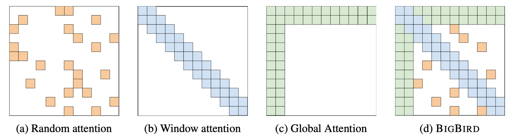
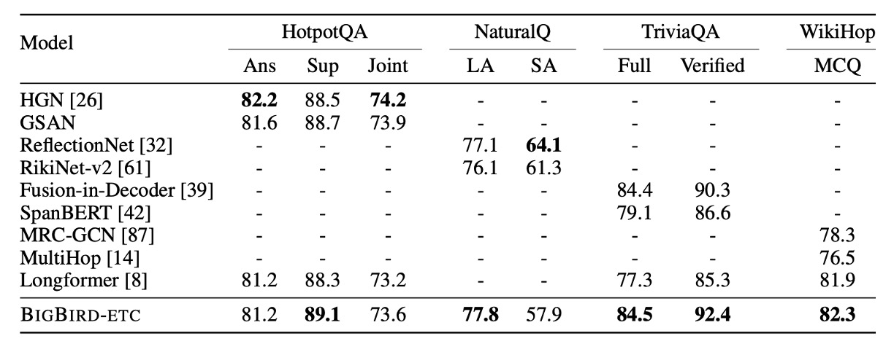
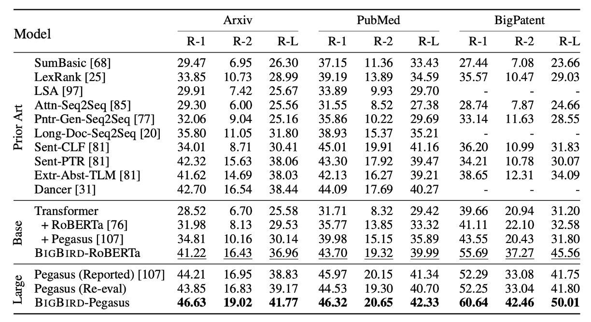

## 大鳥注意力機制

[**Big Bird: Transformers for Longer Sequences**](https://arxiv.org/abs/2007.14062)

---

Transformer 的自注意力機制的計算複雜度為 $O(n^2)$。

當任何一個演算法的計算複雜度出現這種情況時，都意味著其中有非常大量的優化空間。

恩？怎麼又是這個開頭？

## 定義問題

Transformer 模型，如 BERT，在各種自然語言處理任務中表現優異，主要由於自注意力機制的並行計算能力和現代硬體的支援。但是該機制帶來的計算和記憶體需求是序列長度的平方，這限制了其在需要較長上下文的任務中的直接應用。

在 **Longformer** 提出後不久，Google Brain 團隊也提出了 BigBird，這是一種專為處理長序列而設計的 Transformer 變體。

- [**Longformer: 長注意力機制**](../2004-longformer/index.md)

### 基礎理論不足

除此之外，作者認為過去的研究都是啟發式的研究，並未提供對自注意力模型的理論分析。他們指出，過去的研究對自注意力模型的表現關鍵因素和表達能力理解不足。儘管過去已有研究顯示 Transformer 具有圖靈完備性，但在減少計算複雜度的同時是否能維持這種能力仍不清楚。

基於上述動機，作者提出了 BigBird 模型，透過稀疏注意力機制在長序列任務上實現了優異的性能，同時保持了理論上的表達能力。

:::tip
圖靈完備性是指一個系統具備與圖靈機相同的運算能力，能夠模擬任何可計算的任務。

這意味著圖靈完備的系統可以執行任何演算法或電腦程序，理論上具備無限的計算潛力，只要有足夠的時間和資源。
:::

## 解決問題

### 模型架構

這篇論文的概念很簡單，同樣是看到這張圖就差不多了。

在 BigBird 的架構中，作者設計了三種元件，最終組成稀疏架構：

- 上圖 (a) 是隨機注意力機制，在模型的每個層內的 Token 之間隨機建立連接。
- 上圖 (b) 是 Sliding Window Attention，每個 Token 只關注到前後固定範圍內的 Token。
- 上圖 (c) 是 Global Attention，特定的 Token 會關注到所有其他 Token；同時，其他 Token 也會關注到這個 Token。
- 上圖 (d) 是把上述三種機制組合起來，形成 BigBird 的注意力機制。

### 架構設計

作者設計了兩種不同的全域令牌選擇方式，在後續實驗中進行比較：

- **BIGBIRD-ITC（內部 Transformer 構造）**

  - **全域令牌的選擇**：在這種設計中，某些已存在的令牌被指定為“全域”令牌。這意味著這些令牌將能關注整個序列中的所有其他令牌。
  - **矩陣表示**：對於選定為全域的令牌索引集合 $G$，對應的鄰接矩陣 $A$ 被調整，使得每個全域令牌 $i$ 在 $A$ 中的行和列的所有元素都設為 1（即 $A(i, :) = 1$ 和 $A(:, i) = 1$），這表示這些令牌可以與序列中的所有其他令牌進行互動。

- **BIGBIRD-ETC（擴展 Transformer 構造）**

  - **額外的全域令牌**：與 ITC 不同，ETC 設計引入了額外的全域令牌（例如 CLS 令牌），這些令牌專門設計來關注所有已存在的令牌。
  - **矩陣擴展**：為了包括這些額外的全域令牌，原有的鄰接矩陣 $A$ 被擴展成新的矩陣 $B$。向 $A$ 添加 $g$ 行，使得新矩陣 $B$ 在這 $g$ 行的所有元素設為 1（即 $B(i, :) = 1$），並且在這些行對應的列也設為 1（即 $B(:, i) = 1$），其中 $i$ 是全域令牌的索引。這樣，新的全域令牌就能夠關注整個序列。

### 證明之前

以下開始就是本論文中最艱澀的部分，作者開始證明 BigBird 的理論性質，並說明為什麼要採用「隨機注意力機制」。

雖然我們直接拿結論來用也無不可，但既然都來了，那就稍微看一下吧。

在證明之前，先看一下作者對於自注意力機制的理論描述：

1. **廣義注意力機制**

   - BigBird 模型使用了廣義注意力機制，這在每層的 Transformer 中對序列 $X = (x_1, \ldots, x_n)$ 進行處理。
   - 注意力機制是透過有向圖 $D$ 描述，圖中的節點集為 $[n] = \{1, \ldots, n\}$，有向邊代表將被考慮的內積集合。

2. **注意力輸出向量**

   - 對於圖中的每個節點 $i$，產生的輸出向量 $\text{ATTND}(X)_i$ 由節點 $i$ 和它的外鄰居 $N(i)$ 計算而來。
   - 具體計算方式為 $\text{ATTN}_{D}(X)_i = x_i + \sum_{h=1}^H \sigma \left(Q_h(x_i) K_h(X_{N(i)})^T\right) \cdot V_h(X_{N(i)})$。
   - $Q_h, K_h, V_h$ 分別為查詢、關鍵、值函數，將 $R^d$ 映射到不同的空間。
   - $\sigma$ 是評分函數，如 softmax 或 hardmax。
   - $H$ 為頭數量。

3. **全連接圖和稀疏化**：

   - 如果 $D$ 是一個完全的有向圖，則恢復為 Vaswani 等人描述的完全二次注意力機制。
   - 圖 $D$ 的稀疏化是通過節點間選取一定數量的隨機邊來實現，降低計算複雜度。

4. **稀疏隨機圖**：

- 利用隨機圖的概念來近似完整圖，這些圖在譜屬性上與完整圖相似，可以作為擴展器。
- 使用最簡單的 Erdos-Rényi 模型，其中每條邊都是獨立以固定機率選擇的。

5. **局部性和滑動視窗**：

- 考慮到在大多數 NLP 和計算生物學的背景中，大量的參考資訊表現出局部性，即從鄰近的令牌中提取信息。
- BigBird 模型中使用滑動視窗注意力機制，以應對這種局部性。

6. **全域令牌的使用**：

- 引入全域令牌來模擬涉及序列中所有令牌的情況，這些令牌在注意力計算中扮演關鍵角色，它們會參與到整個序列的處理中。

---

上面這一段其實沒有新東西，只是透過這段描述，說明了原始的注意力機制其實就是廣義注意力機制中的「特例」。

這個「特例」就是完全有向圖，所以當你開始調整注意力圖為「特製」的有向圖時，就意味著走進稀疏注意力機制的領域。

另外，這裡也說明了為什麼會採用隨機注意力機制：

- 因為我們需要「近似」完整圖。

利用隨機圖的概念來近似完整圖，這些圖在譜屬性上與完整圖相似，可以作為擴展器。在這邊，作者使用最簡單的 Erdos-Rényi 模型，其中每條邊都是獨立以固定機率選擇的。

:::tip
如果你有做過圖卷積神經網路（GCN）或其他圖神經網路的相關研究，這裡可以對比一下，圖卷積中的「節點」指的就是這裡的 Token；「邊」指的就是這裡的注意力連接；「鄰接矩陣」指的就是這裡的注意力圖。

圖卷積的技術為什麼在注意力機制提出後就不再流行了？因為注意力機制其實就是更通用的圖卷積，不僅堆疊深度更簡單，而且更容易訓練。
:::

### 開始證明

Transformer 的編碼器堆疊本質上是一系列重複的單層編碼器，每個編碼器都有自己的一套參數。

這種結構允許通過多個階段處理輸入數據，每一層都在前一層的輸出基礎上進一步轉換數據。

- **參數化**：

  - **H**：每個編碼器層中的注意力頭數量。
  - **m**：每個注意力頭的大小。
  - **q**：輸出網路中隱藏層的大小。

- **注意力機制**：

  - 由有向圖 $D$ 定義。與傳統的注意力機制（例如 Vaswani 等人提出的）不同，這種配置在每個序列的開始添加了一個特殊的標記，記為 $x_0$。這個標記可以用於各種目的，如代表序列的聚合信息或處理特定的上下文需求。圖 $D$ 的頂點集包括這個特殊標記，即 $\{0\} \cup [n] = \{0, 1, 2, \ldots, n\}$。

- **輸入和輸出處理**：

  - 儘管在開始時添加了額外的節點 $x_0$， Transformer 被概念化為將序列從 $\mathbb{R}^{n \times d}$ 映射到 $\mathbb{R}^{n \times d}$。
  - 在最終輸出層，假設將額外的節點及其向量丟棄，確保輸出的維度與輸入匹配。
  - 在輸入矩陣 $X$ 中追加位置嵌入 $E \in \mathbb{R}^{d \times n}$，增強模型基於元素在序列中的位置解釋序列數據的能力。

- **通用近似**：

  - 函數類 $\text{FCD}$ 被定義為連續函數集合 $f: [0, 1]^{n \times d} \to \mathbb{R}^{n \times d}$，其中連續性是根據特定 $p$-範數定義的拓撲。
  - 用來衡量函數近似的距離度量是 $p$-範數距離 $d_p(f_1, f_2) = \left(\int \|f_1(X) - f_2(X)\|^p \, dX\right)^{1/p}$。

    :::tip
    想像你有一個很大的平面，這個平面上的每一點都可以用兩個數字來描述，這就像地圖上的經緯度一樣。

    在這個例子中，這個平面被稱為 $[0, 1]^{n \times d}$，你可以把它想象成一個有很多行和很多列的大表格，其中每個格子的數字都在 0 和 1 之間。

    函數 $f$ 就像是一種特殊的規則，它可以將這個大表格中的每個點（或每行每列的數字）轉換成另一組新的數字，也就是輸出一個同樣大小的新表格。這個轉換過程需要符合一定的平滑度和連續性，這意味著輸出的數字不會突然劇烈變化，它們會是連貫和有序的變化。
    :::

- **定義：以 0 為中心的星形圖 $S$**

  - 在這裡，星形圖 $S$ 是一種特別的圖形結構，其中一個中心節點（0 號節點）與圖中的所有其他節點（1 至 n 號節點）都有直接連接。
  - 這個結構非常關鍵，因為它讓中心節點能夠直接影響到其他所有節點，這是後面證明中將會用到的一個重要特性。

- **定理：稀疏注意力機制的通用逼近能力**

  - 定理聲明，只要一個圖包含了這種星形圖 $S$，透過這個圖定義的稀疏注意力機制就可以被用作通用逼近器。
  - 這意味著，這樣的 Transformer 模型能夠逼近任何在函數類 $FCD$ 中的連續函數。

- **證明步驟 1：用分段常數函數逼近 $FCD$**

  首先，我們需要處理的函數 $f$ 是定義在有界區域 [0, 1)$^{n \times d}$ 的連續函數。要逼近這樣的函數，我們選擇用分段常數函數來逼近它。具體操作是將 [0, 1) 區間適當划分成小格子（粒度為 $\delta$），這樣整個區域就變成了一個離散的點集 $G_{\delta}$。在每個小格子內，我們假設函數的值是常數。這樣，我們就可以用一個新的分段常數函數 $\bar{f}$ 來逼近原始函數 $f$。

- **證明步驟 2：透過修改後的 Transformer 近似分段常數函數**

  這是整個證明中最關鍵的一步。在這一步中，我們利用自注意力機制來產生輸入的上下文映射。每個矩陣 $X$ 和它的一列 $x_i$ 被映射成一個唯一的代碼，然後這個代碼被用來生成唯一的輸出列。由於我們僅使用稀疏的注意力機制，因此挑戰在於如何確保每個查詢能夠獲得足夠的信息來完成這種映射。解決方案是開發了一種稀疏的移位運算符，該運算符會根據輸入矩陣中數據的範圍進行調整，以保證每一列數據都能形成完整且唯一的映射。

- **證明步驟 3：透過原始 Transformer 近似修改後的 Transformer**

  最後一步是將修改後的 Transformer 模型用原始的 Transformer 模型（使用 ReLU 和 softmax 函數）來逼近。這一步確保了這些的修改不會偏離原始模型的基本功能和效率。

### 圖靈完備性

事實上，Pérez 等人的研究表明，基於完整注意力機制的 Transformer 模型是圖靈完備的，也就是說，它能模擬任何圖靈機的計算過程。

不過，這個結果建立在一個理論上的假設之上，即模型能「處理任意精確度的數據」。

在實際應用中，這個假設往往不成立，因為 Transformer 實際上是有限狀態機，並不能達到真正的圖靈完備。

- **稀疏注意力是否也足夠用來模擬任何圖靈機？**

  本文中提到，透過適當的調整，使用稀疏編碼器和解碼器的 Transformer 同樣能夠實現圖靈完備。

  這種稀疏注意力機制在實際操作中要求每個令牌只與前面的令牌相互作用，與 BERT 全注意力一次性應用不同，在解碼過程中，它是逐令牌運作的。

  此外，Pérez 等人的方法中，每個令牌還充當了磁帶歷史的表示，全注意力用於移動和檢索磁帶上的正確符號。

  對於稀疏注意力機制的實施，除了需要修改它們指向歷史記錄的位址方案外，其餘的架構大部分可以直接應用。

  這顯示了即使在稀疏配置下，Transformer 也具有模擬任意計算過程的潛力，這為理解和擴展 Transformer 在各種複雜計算任務中的應用提供了理論基礎。

:::tip
圖靈完備性（Turing Completeness）是指一種計算系統的能力，如果該系統能夠模擬任何圖靈機的計算過程，則被認為是圖靈完備的。圖靈機是由數學家艾倫·圖靈提出的一種抽象機器，它透過一套簡單的規則來讀寫無限長的紙帶上的符號。一個圖靈完備的系統可以實現任何可計算的函數，也就是說，它可以執行任何其他圖靈完備系統能夠執行的計算任務。這是評估計算系統能力的一個重要標準，例如程式語言和處理器架構。
:::

### 稀疏注意力的限制

這個任務要求給定 $n$ 個單位向量 $\{u_1, ..., u_n\}$，對於每個向量 $u_j$，找到一個對應的最遠向量 $u_j^*$。

這裡的「最遠」是指在向量空間中，兩個向量之間的歐幾里得距離最大，這在實際中通常轉化為最小化內積。

在完整注意力機制下，這個任務相對容易解決，因為該機制允許對所有向量對進行內積計算。

換句話說，完整的自我注意機制可以同時評估所有向量對之間的關係，從而能在 $O(1)$ 層內找到每個向量的最遠向量。

對於稀疏注意力機制，情況則大不相同。

作者提到，根據正交向量猜想（Orthogonal Vector Conjecture，OVC），在稀疏注意力機制下，這個問題變得難以解決。定理表明，對於任何具有 $O(n \log^k n)$（用 $O\tilde{}$ 表示隱藏了多對數因子）邊的稀疏注意力圖 $D$，即使是解決這種看似簡單的最遠向量查找問題，也需要 $\Omega(\tilde{n}^{1-o(1)})$ 層。

這表明在稀疏注意力機制下，雖然能夠減少計算資源的消耗，但在解決某些類型的問題時，可能需要顯著更多的層次，這在實際應用中可能會成為一個限制。

:::tip
OVC 是精細計算複雜性理論中一個廣泛使用的假設，它指出在次二次時間內無法判斷 $n$ 個布爾向量的最小內積是否為 0。
:::

## 討論

本節旨在展示在自然語言處理（NLP）任務中處理更長輸入序列的好處。我們選擇了三個代表性的任務來進行研究：掩碼語言模型（MLM）、帶有支持證據的問答（QA）、以及長文件分類。這些任務旨在探索通過利用長連續序列來學習更好的上下文表示的可能性。

### QA-dev

- **資料集**：包括 HotpotQA、Natural Questions、TriviaQA 和 WikiHop。
- **度量指標**：使用基本尺寸的模型，報告了 WikiHop 的準確率以及 HotpotQA、Natural Questions 和 TriviaQA 的 F1 分數。

這裡比較了包括 RoBERTa、Longformer、BIGBIRD-ITC 和 BIGBIRD-ETC 在內的多個模型性能。BIGBIRD-ETC 模型在擴展全域令牌的設計下，一致性地在所有其他模型中表現出色。

### QA Test finttune

- **任務與資料集**：同樣包括 HotpotQA、Natural Questions、TriviaQA 和 WikiHop。
- **比較基準**：將 BIGBIRD-ETC 模型與不包括 BIGBIRD 的排行榜前三名進行比較。

在這個實驗中，BIGBIRD-ETC 在多個資料集上設立了新的 SOTA，特別是在 Natural Questions 的長答案、TriviaQA 和 WikiHop 測試中。與僅使用單一模型的 BIGBIRD 相比，其他領先條目多為集合模型，這可能解釋了在某些情況下 BIGBIRD 在精確答案選擇上準確率略低的原因。

### 長文件摘要能力

在本段中，文章探討了使用 BIGBIRD 模型進行長文件抽象摘要的實驗設計與成果，特別是在處理需要深入上下文理解的長範圍文本時，模型如何表現出顯著的改進。實驗中使用了三個專為長文件設計的數據集。實驗結果如上表，證明了通過應用 BIGBIRD 的稀疏編碼器和完整解碼器來訓練這些長文件數據集時，模型能夠有效地提升摘要的品質和準確性。

這一提升得益於模型能夠處理更長的文本範圍，從而更好地理解和整合文件中分散的關鍵信息。

這些觀察結果凸顯了 BIGBIRD 在處理高度複雜的 NLP 任務中的潛力與實際效益，尤其是在需要深層次文本分析和理解的應用場景中。

:::tip
Pegasus（Pre-training with Extracted Gap-sentences for Abstractive SUmmarization Sequence-to-sequence models）是一種專為文本摘要任務設計的預訓練方法，由 Google Research 團隊開發。Pegasus 的核心創新在於其預訓練策略，該策略專門針對摘要任務的需求來優化。

Pegasus 的預訓練過程採用了一種稱為“gap sentences prediction”（GSP）的策略，即「間隙句子預測」。在這個過程中，從一個文件中隨機選擇若干句子並將其「遮蔽」（即移除），然後模型需要預測這些被遮蔽的句子。這與傳統的掩碼語言模型（如 BERT）略有不同，BERT 通常是隨機掩蔽單詞或 token，而 Pegasus 掩蔽整個句子。
:::

## 結論

比起過去的 Sparse Transformer 和 Longformer 等模型，我們認為本文的主要貢獻在於為稀疏注意力機制提供了一份詳細的數學理論證明。

並且指出若我們希望可以近似完整注意力機制，則需要使用隨機、滑動視窗、部分全域的方式來設計模型的注意力機制。

通過對 Transformer 模型的理論性質進行深入研究，作者展示了稀疏注意力機制的通用逼近能力，並證明了這種機制在處理長序列任務時的優越性。

關於詳細的證明方式，在該論文中的附錄有大約 20 頁的篇幅，讓我們看得頭昏眼花，有興趣的讀者歡迎自行翻閱原始論文。
