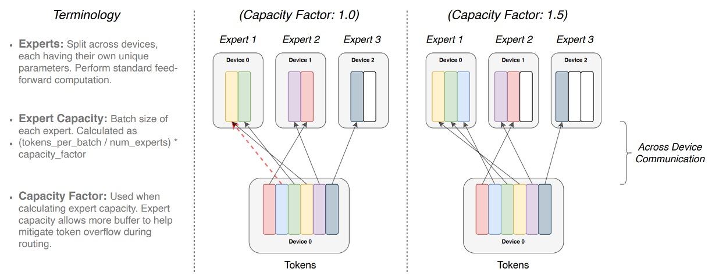

## 讓專家說話

[**Switch Transformers: Scaling to Trillion Parameter Models with Simple and Efficient Sparsity**](https://arxiv.org/abs/2101.03961)

---

大語言模型（LLM）的效果好，大家都知道。

但是無腦堆疊參數量的方式，終究會走到盡頭。

## 定義問題

一個想法是走微調路線，就像我們之前看過的 LoRA，但這沒有從根本上解決問題。

根本上的問題在於，我們所採用的模型架構是密集型的計算，這導致了高昂的計算成本。

這就算了，偏偏自注意力機制的 $O(n^2)$ 複雜度，讓模型的規模增加，計算量呈指數級增長，基於目前的硬體資源，根本玩不下去。

另外一個解題方向是專家混合模型（Mixtures of Experts, MoE）。

MoE 不是什麼新鮮事，早在 2017 年，Google Brain 就提出了這個概念。

- [**[17.01] Outrageously Large Neural Networks: The Sparsely-Gated Mixture-of-Experts Layer**](https://arxiv.org/abs/1701.06538)

    

    <figure style={{"width": "50%"}}>
    
    </figure>
    

MoE 將模型拆解為多位「專家」，由一個「路由器」依照輸入 token 的特性，將該 token 指派給最適合的專家處理。透過這種「稀疏啟動」的策略，在不額外增加每筆資料運算量的前提下，大幅提升模型的參數數量。

換句話說，MoE 的目標就是建造一個「體型巨大、但每次運算只啟動少部分元件」的模型，期望達到在相同硬體成本下取得更佳效能的目標。

作者認為 MoE 模型採用「top-$k$」專家路由策略（$k > 1$），這雖然有助於讓路由器有多專家比較的空間，但也帶來了相對複雜的計算與通訊成本，這個過程應該可以被簡化：

- **正所謂人多嘴雜，這裡的「專家」，只要一個就夠了！**

## 解決問題

### 模型架構

<figure style={{"width": "90%"}}>

</figure>

從模型架構圖中，可以清楚看到 Switch Transformer 的設計概念：

1. **傳統 FFN 換成稀疏專家層（Switch FFN）**：

   在一般 Transformer 中，每個 token 都會通過同一組 FFN 權重進行前饋運算。但在 Switch Transformer 中，FFN 被拆解成多個「專家」（Experts），每個專家都是一個獨立的 FFN。

2. **路由器（Router）的作用**：
   圖中顯示有一個路由器，它會根據每個 token 的特徵（例如輸入的單字向量表示），動態地選擇該 token 要交由哪一個專家處理。

   - 舉例來說，圖中有兩個 token（x1 = "More"、x2 = "Parameters"），路由器會對這兩個 token 分別進行運算並評估，然後將 x1 丟給某位特定專家，將 x2 丟給另一位或同一位專家處理。

3. **稀疏化特性**：
   因為每個 token 最終只由其中一個專家 FFN 處理（而非像原本的 dense FFN 一次處理全部 token），這便是所謂的「稀疏」：雖然整體有多組專家參數，但每次只啟用其中一小部分，大幅減少計算量。

4. **輸出與路由器權重（Gate Value）**：
   每個 token 經過選定的專家 FFN 後，會乘上一個由路由器產生的「gate value」，這個值類似一個加權因子，用來表示該專家對該 token 的信任度或重要性。

這就是 Switch Transformer 的「多位專家、單一 token 各自分配」的動態路由機制。

### 專家容量

<figure style={{"width": "90%"}}>

</figure>

當我們有多位專家（Experts）來處理一組 batch 的 token 時，我們會事先劃定每位專家所能處理的最大 token 數量上限。

這個上限由「專家容量」（expert capacity）決定，它的計算方式是：

$$
\text{expert capacity} = \frac{\text{total tokens in batch}}{\text{num experts}} \times \text{capacity factor}
$$

也就是說，每位專家的「slot」數量是固定的，由「容量因子」(capacity factor) 來調整額外的空間。

每個 token 都會經過一個路由器（Router）的計算，根據路由器的機率分佈選擇最合適的專家處理該 token。理想狀況下，token 分配平均，所有專家容量都剛好被填滿而不超過，大家各司其職。

如果某些專家相對於其他專家被分配較多的 token（不均衡分配），就會出現「Overflow」情況。這表示有些 token 想要分給該專家，但該專家的容量已滿，這些「溢出」token 就無法在該層得到處理，必須直接跳到下一層（上圖中的紅色虛線表示）。

提高 capacity factor 能預留更多空間，減少 overflow 發生的機率。但相對地，這也代表在有些情況下專家的部分空間可能是空著（圖中的白色空格表示沒有 token 填滿的「padding」），而這意味著更多不必要的計算和通訊成本。

因此，Switch Transformer 需要在「專家容量」與「token 路由」之間取得平衡，以達到最佳的效能。

### 負載平衡損失

為了確保路由器不會老是把 token 丟給同一位專家，Switch Transformer 引入一個可微分的負載平衡損失。

基本概念是讓分配到每位專家的 token 數量，以及路由器對該專家賦予的總機率值，都盡可能平均。令 $f_i$ 為指派到專家 $i$ 的 token 比例（fraction of tokens），$P_i$ 為該專家的平均路由機率值（fraction of probability），即：

$$
f_i = \frac{1}{T} \sum_{x \in B} 1\{\arg\max p(x) = i\},
$$

$$
P_i = \frac{1}{T} \sum_{x \in B} p_i(x).
$$

若我們希望所有專家平均分配，那理想狀態是 $f_i \approx \frac{1}{N}$ 且 $P_i \approx \frac{1}{N}$。因此定義輔助損失函數：

$$
\text{loss}_{\text{aux}} = \alpha \cdot N \sum_{i=1}^{N} f_i P_i,
$$

其中 $\alpha$ 是一個超參數（本研究取 $\alpha = 10^{-2}$）。當分配越平均，$f_i$ 與 $P_i$ 趨近 $1/N$，則 $f_i P_i \approx \frac{1}{N^2}$，整體損失越低。

此機制會在訓練中提供額外梯度，鼓勵模型達到更均勻的負載分配。

### 改進的訓練與微調

Switch Transformer 的稀疏專家模型在訓練中可能引發不穩定性，尤其是硬切換路由（hard-switching）決策與低精度格式（如 bfloat16）的使用。

作者提出了兩種改進技術：

1. **選擇性精度管理**：在路由函數內局部使用 float32 精度，僅在裝置本地進行計算，最後再將結果轉回 bfloat16。這種方法既保持了 bfloat16 訓練的速度，又兼具 float32 的穩定性。
2. **更小的參數初始化**：初始化對深度學習模型的成功與否影響很大。作者建議將 Transformer 初始化比例 $s=1.0$ 減少十倍。此策略能提升模型表現並減少早期訓練的不穩定性。

此外，為了解決微調階段的過擬合問題，作者提出了一種簡單但有效的方法來緩解此問題：

- **增加專家層內部的 dropout，又稱為「Expert dropout」。**

在微調階段，對每個專家層設置不同的 dropout 率，能有效減輕過擬合問題，並在小樣本下游任務上實現性能提升。

## 討論

### 與密集模型的比較

作者將 Switch T5 Base 與密集模型基準進行比較，結果顯示使用 Switch Transformer 架構的模型在所有 101 種語言中，都能帶來性能上的提升。

透過引入專家稀疏化的 Switch Transformer，在多語言、多任務的預訓練設定下，整體表現比起單純增加密集參數的模型更加出色，並且改進並非只侷限於個別語種，而是全面性的表現增強。

### 專家數量的影響

<figure style={{"width": "90%"}}>

</figure>

作者在論文中討論幾個縮放特性，首先是專家數量對模型表現的影響。

- **左圖**：

  - 水平軸代表模型的參數量（主要透過增加專家數達成），
  - 垂直軸則是模型的困惑度（perplexity）。

  圖中最左上方的點對應 T5-Base（約 2.23 億參數）。隨著往右下增加專家數量（從 2 位專家增至 256 位），雖然整體參數量大幅提升，但是模型使用的計算量仍維持大致不變。

  結果顯示，儘管計算預算不變，增加專家數可以讓模型的困惑度持續降低，也就是模型品質不斷提升。

---

- **右圖**：

  - 橫軸是訓練步數（steps）。
  - 縱軸則為負對數困惑度（negative log perplexity），數值愈高代表困惑度愈低（模型效能愈佳）。

  圖中將密集模型（dense baseline，以紫色線表示）與多種專家數配置的 Switch-Base 進行比較。結果顯示，相較於相同計算預算下的密集模型，擁有更多專家的 Switch-Base 模型在相同的訓練步數下能達到更佳的效能，也就是擁有更好的「樣本效率」（sample efficiency）。

綜合來看，在固定運算資源下，增加專家數（進而增加參數量）能使 Switch Transformer 既提升模型品質、又加快學習進度，展現了透過「稀疏專家」方法來實現模型擴展的有效性。

### 固定計算與訓練時間

<figure style={{"width": "70%"}}>

</figure>

作者比較在相同的 TPU 核心資源與每個樣本相同的 FLOPs 配置下的訓練結果。

結果顯示，如上圖，相比於傳統的密集 Transformer 來看，Switch Transformer（特別是有 64 位專家的模型）能在更短時間內達到與 T5-Base 相同的品質表現，甚至只需要 T5-Base 所需時間的七分之一即可取得同等困惑度水準。而且在達到該品質門檻之後，Switch Transformer 仍可持續改進模型表現。

### 模型與資料平行化

作者進一步探討在大規模訓練情境中，如何同時考量「資料並行化」、「模型並行化」及「專家並行化」等多種維度的資源分配策略。

1. **資料並行化（Data Parallelism）**：
   將訓練資料分成多份，每個運算核心（core）都處理不同的一部分資料，但模型的參數在每個核心上都是一樣的。訓練結束後，再將各核心得到的梯度彙整合併，更新整體模型參數。好處是簡單，不需要在正向傳播和反向傳播中途溝通參數或中間計算結果，只在最後合併梯度，但隨著模型變大，單個核心的記憶體和計算壓力還是會越來越大。

2. **模型並行化（Model Parallelism）**：
   將模型的參數（例如 FFN 中的大型權重矩陣）切分到不同核心，使得每個核心只保存並計算一部分的權重。這樣就能訓練更大的模型，因為不再需要在單一核心中塞下整個巨大的權重矩陣。代價是，計算過程中核心間需要頻繁溝通。例如，FFN 的輸入和輸出需要在核心之間傳遞和彙整，因為每個核心只計算一部分的輸出。

3. **專家並行化（Expert Parallelism）**：
   這是 Switch Transformer 的特色之一。將模型的一部分（例如 FFN 層）分成多個「專家（experts）」，每個 expert 在不同核心上運行，並依據路由機制讓每個 token 只經過一位專家運算。這樣可以在不增加太多計算量的情況下增加參數量。但專家數量增加到某個程度，效益會變小，因此需要搭配資料並行和模型並行來達到最佳的資源使用。

詳細的示意圖如下：

<figure style={{"width": "90%"}}>

</figure>

這張圖透過一個 4×4 的虛線網格展示了在分散式訓練中，模型權重與資料在不同運算核心間的分割策略，整張圖分成上下兩部分：

- **上半部分**：
  用不同尺寸的形狀代表模型中不同大小的權重矩陣（例如 FFN 層中較大的權重矩陣）。每個核心上都會放置一部分的權重，使每個核心分擔固定大小的參數量。較大的權重矩陣意味著每個 token 要執行較多的計算，但整體透過切割權重可平衡核心間的負載。

- **下半部分**：
  展示資料（token 批次）的切分方式。每個核心會收到等量的 token，以維持核心間記憶體使用的一致性。然而，不同的資料切分策略會導致核心之間所擁有的 token 是否相同或不同（以方格顏色區分）。這些差異化的資料分割策略將影響訓練效能與溝通成本。

透過結合資料並行、模型並行及專家並行，作者成功地訓練出 3950 億與 1.6 兆參數規模的 Switch Transformer，並展現比同等 FLOPs 條件下的 T5-XXL 模型更優異的困惑度表現。

這表示巨大規模的參數拓展在理論上是可行的，而且能帶來樣本效率上的改善。但在 Switch-XXL 模型上仍會出現偶發性的訓練不穩定，這意味著在實際應用中，穩定性仍然是個不可避免的問題。

:::tip
模型崩潰代表投入的資源在那一瞬間化為烏有，不可不慎。
:::

### 效果好是因為參數量？

對，作者承認，Switch Transformer 的優勢確實來自巨量的參數量：

- **但這是刻意的設計策略！**

在維持相同計算預算下增大參數數能帶來更好的樣本效率與性能提升。同時，相對於僅依賴增加 FLOPs（計算量）的傳統擴展方式，這種方法在固定資源下顯示出「用同等時間、相同計算量卻得到更好結果」的價值。

### 小模型能用嗎？

作者強調，Switch Transformer 雖然專注於極大規模的模型（上千億甚至上兆參數），但即使只有少量的專家（例如 2 個），仍能在標準 GPU/TPU 上執行並帶來性能增益。換言之，小型或中型規模的研究者與使用者也可受益於此方法。

### 稀疏模型未被廣泛採用的原因？

因為過往密集模型的成功，以及硬體對這些密集模型的快速配合與優化，使得嘗試稀疏方法的動機減弱。另外，稀疏模型在以往面臨許多實作與訓練難題（如路由機制複雜性、訓練不穩定、核心間通訊問題）。

Switch Transformer 的設計在這些方面已有明顯改進，減輕了使用者採用稀疏模型的門檻。

## 結論

Switch Transformers 通過簡化 Mixture of Experts (MoE) 的設計，實現了一種易於理解、穩定訓練且高效利用樣本的模型架構。這種簡化使得 Switch Transformers 在應用降低了實現的複雜性。

相較於稠密模型基線，Switch Transformers 在多個自然語言處理任務和不同訓練模式下都表現出色，並實現了顯著的加速效果。

作者認為「稀疏模型」的應用絕對是值得進一步探討的方向，希望這項研究能夠讓更多人關注這個領域。
