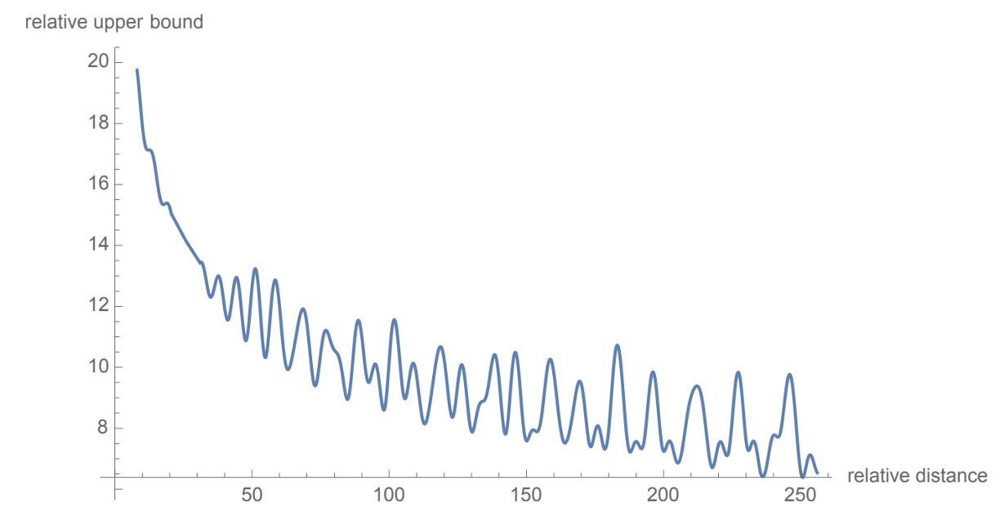

## 旋轉位置編碼

[**RoFormer: Enhanced Transformer with Rotary Position Embedding**](https://arxiv.org/abs/2104.09864)

---

比起 RoFormer 這個名字，其實 RoPE 應該更廣為人知。

RoPE 是 RoFormer 的核心概念，全名為「Rotary Position Embedding」，是一種新型的位置編碼方法。

## 定義問題

和 RNN 或 CNN 不同，Transformer 沒有對於位置的歸納偏差。

因此，我們必須額外提供位置信息，以便模型能夠理解序列中的順序。

一般來說，位置編碼是透過將位置信息轉換為向量形式，然後「加」到輸入的 token embedding 中。

### 絕對位置：三角式

- [**Attention Is All You Need**](https://arxiv.org/abs/1706.03762)

在第一篇 Transformer 的論文中，採用的方法為三角函數式。

$$
PE_{(pos, k)} = \begin{cases}
\sin(pos/10000^{2i/d_{\text{model}}}) & \text{if } k = 2i \\
\cos(pos/10000^{2i/d_{\text{model}}}) & \text{if } k = 2i + 1
\end{cases}
$$

這個函數同時考慮了序列的長度和特徵維度，給予每個位置一個固定的位置編碼。

三角函數式由於有固定的生成規律，因此有一定的外推能力。

:::tip
**那個數學式中的 10000 是什麼？**

這個 10000 的物理意義可以被解釋為位置編碼的尺度。我們將位置編碼的尺度限制在一個合適的範圍內，以便它能夠有效地捕捉到不同位置之間的關係，同時避免了太高或太低的頻率造成的不良影響。

如果將位置編碼中的 10000 改為 100，將會改變正弦和餘弦函數的頻率，正弦和餘弦函數的頻率將增加，每個位置的位置編碼將在更短的距離內週期性地重複。這可能會導致模型對於較遠位置之間的關係感知能力下降，因為它們的位置編碼會顯示出更大的相似性。
:::

### 絕對位置：訓練式

- [**BERT: Pre-training of Deep Bidirectional Transformers for Language Understanding**](https://arxiv.org/abs/1810.04805)

在 BERT 和 GPT 等模型中，位置編碼是透過訓練來獲得的。

假設最大序列長度為 $N$，則位置編碼的維度為 $d_{\text{model}}$，則位置編碼的矩陣為 $N \times d_{\text{model}}$。

這樣的設計優點是非常簡單，完全不需經過大腦思考，但缺點是無法泛化到更長的序列，如果序列長度改變，就必須重新訓練。

:::tip
其實外推性也不是絕對位置編碼的明顯缺點，讀者可以參考蘇劍林的這篇文章：

- [**层次分解位置编码，让 BERT 可以处理超长文本**](https://spaces.ac.cn/archives/7947)
  :::

### 相對位置：XL 式

- [**Transformer-XL: Attentive Language Models Beyond a Fixed-Length Context**](https://arxiv.org/abs/1901.02860)

在這篇論文中，對自注意力機制中的 $QK^T$ 展開：

- $Q_i=(x_i+pos_i)W_Q$
- $K_j=(x_j+pos_j)W_K$
- $Q_iK_j^T=(x_i+pos_i)W_QW_K^T(x_j+pos_j)^T$

最後，得到了下式：

- $Q_iK_j^T=x_iW_QW_K^Tx_j^T+x_iW_QW_K^Tpos_j^T+pos_iW_QW_K^Tx_j^T+pos_iW_QW_K^Tpos_j^T$

接著，將 $pos_j$ 替換成相對位置向量 $R_{i-j}$；將 $pos_i$ 替換成可學習的向量 $u$, $v$，得到：

- $Q_iK_j^T=x_iW_QW_K^Tx_j^T+x_iW_QW_K^T{\color{red}{R_{i-j}^T}}+{\color{green}{u}}W_QW_K^Tx_j^T+{\color{green}{v}}W_QW_K^T{\color{red}{R_{i-j}^T}}$

然後 $uW_Q$ 和 $vW_Q$ 都是可學習的參數，可以合併成一個，得到：

- $Q_iK_j^T=x_iW_QW_K^Tx_j^T+x_iW_QW_K^T{\color{red}{R_{i-j}^T}}+{\color{green}{u}}W_K^Tx_j^T+{\color{green}{v}}W_K^T{\color{red}{R_{i-j}^T}}$

考慮到 ${\color{red}{R_{i-j}^T}}$ 的編碼空間和原本 $pos_j$ 的編碼空間不同，因此把 $W_K^T$ 換成 $W_{K, R}^T$，得到：

- $Q_iK_j^T=x_iW_QW_K^Tx_j^T+x_iW_QW_{K, R}^T{\color{red}{R_{i-j}^T}}+{\color{green}{u}}W_K^Tx_j^T+{\color{green}{v}}W_{K, R}^T{\color{red}{R_{i-j}^T}}$

最後，在這篇論文中，沒有在 QKV 的 V 矩陣中添加位置編碼，之後的研究也都只在 QK 矩陣（也就是注意力矩陣）中添加位置編碼。

### 相對位置：T5 式

- [**Exploring the Limits of Transfer Learning with a Unified Text-to-Text Transformer**](https://arxiv.org/abs/1910.10683)

在 T5 中，作者解耦了內容資訊和位置資訊，把跟位置有關的資訊全部放到 $\beta_{i,j}$，得到：

- $Q_iK_j^T=x_iW_QW_K^Tx_j^T + \beta_{i,j}$

### 還有更多

我們沒有要回顧所有的位置編碼方法，更多內容可以參考蘇劍林的網站文章：

- [**让研究人员绞尽脑汁的 Transformer 位置编码**](https://spaces.ac.cn/archives/8130)

## 解決問題

可以看到過去的研究，絕對位置編碼和相對位置編碼都有各自的優點和缺點。

本研究期望可以提出一個融合絕對位置編碼和相對位置編碼的方法。

### 模型架構

基於 Transformer 的語言建模通常透過自注意力機制利用各個 token 的位置資訊，作者希望內積僅以相對形式編碼位置資訊：

$$
\langle f_q(x_m, m), f_k(x_n, n) \rangle= g(x_m, x_n, m-n)
$$

最終目標是找到一個等價的編碼機制來解函數 $f_q(x_m, m)$ 和 $f_k(x_n, n)$ 以符合上述關係式。

經過一串推導之後(**細節請詳閱論文**)，作者提出的公式的解是：

- $f_q(x_m, m) = (W_qx_m)e^{im\theta}$
- $f_k(x_n, n) = (W_kx_n)e^{in\theta}$
- $g(x_m, x_n, m - n) = \Re \left[ (W_q x_m)(W_k x_n)^* e^{i(m - n) \theta} \right]$

在上式中，$\Re$ 表示取實部，$*$ 表示共軛複數，$\theta$ 是一個不為零的常數。

:::info
**歐拉公式與旋轉**

歐拉公式的核心概念是旋轉。對於一個複數 $z = x + iy$，我們可以將其看作平面上的一個點 $(x, y)$，也可以視作一個向量 $(x, y)$。當我們對複數 $z$ 乘上 $e^{i\theta}$ 時，相當於將向量 $(x, y)$ 逆時針旋轉 $\theta$ 角度。

舉個例子來看一下，我們用 markdown 畫個潦草的圖：

- **初始狀態**

  ```
      y
      ^
      |
      |   z = x + iy
      |
      +-----------------> x
  ```

- **旋轉後**

  當我們對複數 $z$ 乘上 $e^{i\theta}$ 時，相當於將向量 $(x, y)$ 逆時針旋轉 $\theta$ 角度：

  ```
      y
      ^
      |        z' = e^{i\theta}z
      |       /
      |      /
      |     /
      |    /
      |   /  z = x + iy
      |  /
      | /
      |/
      +-----------------> x
  ```

這是因為 $e^{i\theta}$ 可以用歐拉公式展開為：

- $e^{i\theta} = \cos(\theta) + i\sin(\theta)$

這個公式表示的是一個單位向量在複平面上繞原點逆時針旋轉 $\theta$ 角度。

- **特殊情況**

  當 $\theta = \pi$ 時，我們得到：

  - $e^{i\pi} = -1$

  這意味著將複數 $z$ 乘以 $e^{i\pi}$ 就是將其旋轉了 180 度，得到相反方向的向量。因此，我們可以得到著名的恆等式：

  - $e^{i\pi} + 1 = 0$

  這個公式被稱為歐拉恆等式，是數學中最優美的公式之一，將自然對數的底數 $e$、虛數單位 $i$、圓周率 $\pi$、1 和 0 巧妙地聯繫在一起。
  :::

:::tip
在論文中，出現了 $in\theta$ 這樣的形式，這裡的 $n\theta$ 表示在旋轉角度上的多重倍數。

$f_q(x_m, m)$ 和 $f_k(x_n, n)$ 的形式表示了兩個向量在複平面上分別旋轉 $m\theta$ 和 $n\theta$ 角度。

這裡的 $m$ 和 $n$ 是參數，代表不同的頻率成分或不同的空間位置。這樣的形式可以捕捉到兩個向量在不同旋轉角度下的行為。

$$
g(x_m, x_n, m - n) = \Re \left[ (W_q x_m)(W_k x_n)^* e^{i(m - n)\theta} \right]
$$

這裡 $i(m - n)\theta$ 則表示兩個旋轉角度的差異。
:::

### 高維拓展


RoPE 的圖形說明如上圖。

為了將在二維空間中的結果推廣到任何 $x_i \in R^d$ 且 $d$ 為偶數的情況，作者將 $d$ 維空間分為 $d/2$ 個子空間，並利用內積的線性特性將 $f\{q,k\}$ 轉化為：

$$
f\{q,k\}(x_m, m) = R^d_{\Theta,m} W_{\{q,k\}} x_m
$$

其中

$$
R^d_\Theta,m =
\begin{pmatrix}
\cos m\theta_1 & -\sin m\theta_1 & 0 & 0 & \cdots & 0 & 0 \\
\sin m\theta_1 & \cos m\theta_1 & 0 & 0 & \cdots & 0 & 0 \\
0 & 0 & \cos m\theta_2 & -\sin m\theta_2 & \cdots & 0 & 0 \\
0 & 0 & \sin m\theta_2 & \cos m\theta_2 & \cdots & 0 & 0 \\
\vdots & \vdots & \vdots & \vdots & \ddots & \vdots & \vdots \\
0 & 0 & 0 & 0 & \cdots & \cos m\theta_{d/2} & -\sin m\theta_{d/2} \\
0 & 0 & 0 & 0 & \cdots & \sin m\theta_{d/2} & \cos m\theta_{d/2}
\end{pmatrix}
$$

是帶有預定參數 $\Theta = \{\theta_i = 10000^{-2(i-1)/d}, i \in [1, 2, ..., d/2]\}$ 的旋轉矩陣。

將 RoPE 應用於自注意力機制的方程式，我們可以得到：

$$
q^\top_m k_n = (R^d_{\Theta,m} W_q x_m)^\top (R^d_{\Theta,n} W_k x_n) = x^\top W_q R^d_{\Theta,n-m} W_k x_n
$$

其中 $R^d_{\Theta,n-m} = (R^d_{\Theta,m})^\top R^d_{\Theta,n}$。需要注意的是，$R^d_\Theta$ 是一個正交矩陣，這確保了在編碼位置資訊過程中的穩定性。

### 長距離衰減



作者遵循連原始 Transformer 的設計觀點，設定 $\theta_i=10000^{-2i/d}$，提供位置編碼的長距離衰減的特性，如上圖。

意思是當兩個位置之間的距離增加時，位置編碼間的內積會減少，因為我們通常會預期在文本中較遠的位置之間的關係會比較弱。

## 討論

### 對比其他位置編碼


上圖展示了 RoPE 和其他位置編碼方法的比較。

左邊是和 BERT 對比，可以看出使用 RoPE 的模型在訓練過程中展現出更好的性能，MLM Loss 下降更快。右邊是把 RoPE 加入 PerFormer，可以看到訓練過程的收斂速度更快，並且在訓練結束時有更好的性能。

### GLUE benchmark


作者使用 Hugging Face 的 Transformers 庫進行微調，並在 GLUE 數據集上進行了實驗。

實驗結果看來 Roformer 在 GLUE 數據集上的表現大多優於 BERT，這表明 RoPE 在自然語言處理任務中的有效性。

### 限制

儘管本論文的研究提供了強有力的理論支持和令人鼓舞的實驗結果，但作者認為仍然存在一些限制：

1. 在數學上將相對位置關係表示為 2D 子空間中的旋轉，但對於為什麼這種方法比採用其他位置編碼策略的基線模型收斂更快，還缺乏深入的解釋。
2. 雖然證明了模型具有長期衰減的有利特性，這與現有的位置編碼機制相似，並且在長文本處理方面的性能優於其他模型，但在主尚未找到令人信服的解釋。

## 結論

這篇論文可能不太容易閱讀，但 RoPE 的概念非常有趣，我們強烈推薦閱讀原文。

目前已經有大量的工作（ex. LLaMA, Mamba）已經使用了 RoPE 這個方法，這表明 RoPE 在自然語言處理領域的應用前景非常廣闊。

後續有很多工作探討和改進 RoPE 了的方法，我們之後遇到再接著聊。
