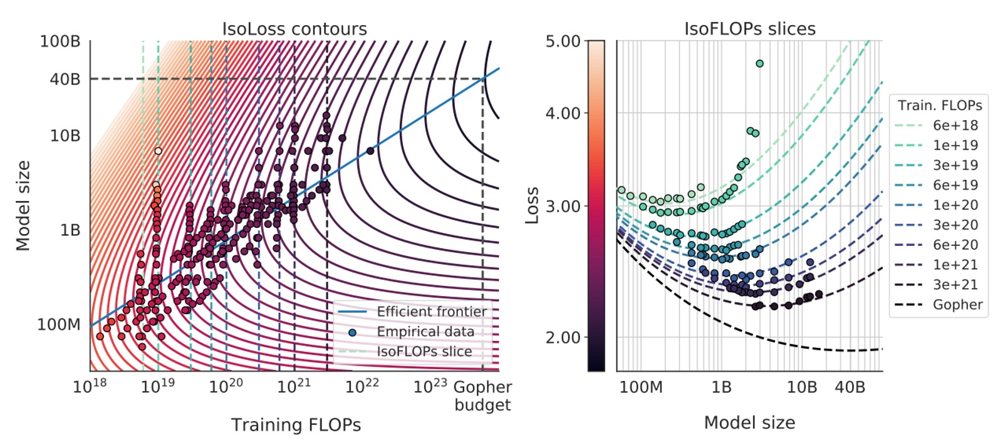
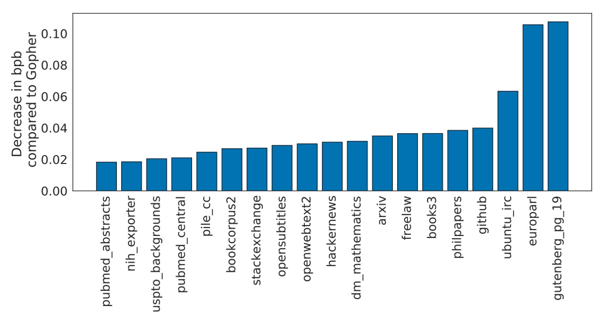

## 栗鼠之眼

[**Training Compute-Optimal Large Language Models**](https://arxiv.org/abs/2203.15556)

---

對於這些論文作者的各種莫名奇妙的命名方式，我們已經懶得吐槽了。

這篇論文是進階版的 Scaling Laws，作者推翻了過去的一些觀點，提出了一個新的訓練策略。

:::tip
如果你還不知道 Scaling Laws，可以參考我們之前的文章：

- [**[20.01] Scaling Laws: 模型的縮放律**](../2001-scaling_laws/index.md)
  :::

## 定義問題

最近的大型語言模型不論是密集架構的 transformer 還是混合專家（MoE）的模型，大家都在追求越來越大的參數規模，動不動就是上百億、甚至五百億參數起跳。

這種擴張帶來一連串的問題，像是訓練成本與推論成本飆升，以及我們需要更龐大、更高品質的資料集來餵給這些模型，否則再大的模型也練不出令人滿意的結果。

這篇文章的作者想解決的問題是：

- **在給定一個固定的運算（FLOPs）預算下，怎麼樣去選擇「模型大小」和「資料量」的最佳組合，來讓語言模型的最終預訓練損失最小化。**

雖然 Scaling Laws 已經有嘗試回答「給定計算資源下，該選什麼大小的模型？」這種問題，但 Scaling Laws 在實驗中固定了訓練的 token 數量和學習率排程，導致他們的結論在這個問題上有點偏差：

- **Scaling Laws 的分析偏向建議「模型變更大，但資料不用增加那麼多」。**

而本篇作者認為果調整學習率和訓練步數的配合方式，會發現模型大小和訓練資料量應該同等比例地一起增大才對。

更正式一點的描述是，作者定義了最佳解如下：

$$
N_{\text{opt}}(C), D_{\text{opt}}(C) \;=\; \arg\min_{N,D \;\;s.t.\;\; \text{FLOPs}(N,D)=C}\, L(N,D),
$$

其中：

- $N$ 是模型參數數量，
- $D$ 是訓練 token 的數量（代表訓練資料量的多寡），
- $C$ 是固定的計算預算（即在給定的算力和時間下，你總共能花多少 FLOPs 來訓練），
- $L(N, D)$ 是該模型在參數規模為 $N$、看到 $D$ 個訓練 token 後的預訓練 loss。

真正同時考慮「模型大小 (N)」與「訓練 token 數量 (D)」在固定的計算預算 (C) 下做到最佳化，這是本篇論文的目標。

## 解決問題

為了降低以下文章的閱讀困難度，請先記得對應的專有名詞：

- $C$：固定的計算資源（FLOPs）預算，
- $N$：模型大小（參數數量），
- $D$：訓練資料量（訓練 token 數），

作者在這篇論文中提出了三種不同的方法來估計「最優的 $N$ 和 $D$ 隨 $C$ 的縮放關係」

### 方法 1：固定模型大小（$N$）

這個方法是先「固定一組模型大小」，然後對於每個大小的模型，分別嘗試不同的訓練數量。

模型大小從約 70M 參數一直到超過 10B 參數，各進行四次獨立訓練，每次訓練所使用資料量的差異範圍可達 16 倍。訓練過程中，學習率按照排程衰減，並且對每個設定都進行平滑和內插以得到連續的損失曲線。

透過這樣的實驗設計，他們就能很直觀地回答：「在某個指定的 FLOPs 預算 $C$ 下，哪個組合的 $(N, D)$ 可以達到最低的損失 $L(N,D)$？」。

從數學式來看，作者是要解下面的優化問題：

$$
N_{\text{opt}}(C), D_{\text{opt}}(C) = \arg\min\_{N, D \; s.t. \; \text{FLOPs}(N,D)=C} L(N,D).
$$

在這個過程中，他們選擇了 1500 個在對數刻度（log scale）分布的不同 $C$ 值（也就是不同 FLOPs 預算），並觀察對應的 $N_{\text{opt}}(C)$ 和 $D_{\text{opt}}(C)$。

透過擬合，他們發現最佳的參數配置大約符合

$$
a = 0.50, \quad b = 0.50
$$

也就是說，當可用算力 $C$ 增加時，最好的策略是同時讓模型參數量 $N$ 與訓練 token 數 $D$ 以差不多 $C^{0.5}$ 的比例一同成長。這個結果和先前文獻的建議有很大落差，因為過去大多傾向認為模型大小應該比訓練資料量增長得更快。

實驗結果如下圖：

在圖的左邊，每一條曲線對應不同的模型大小 $N$ 和不同的訓練資料量數。橫軸大致上是訓練所使用的 FLOPs 數量，縱軸則是該模型在訓練過程中的損失值 $L$。

作者先把這些訓練曲線都畫出來，然後從中取包絡線，也就是在任意給定的 FLOPs 預算 $C$ 下，觀察所有不同實驗所達成的最小可能損失值 $L_{\min}(C)$。

透過包絡線，我們就能知道：給定一個固定的運算預算，有沒有更好的 $(N, D)$ 組合可以讓損失更低？如果有，那就代表我們還可以調整模型大小和訓練 token 數的比例，以獲得更佳的結果。

接著，圖中間的圖顯示當我們在不同的 FLOPs $C$ 下，根據包絡線推斷出「最佳的模型參數數量 $N_{\text{opt}}(C)$」。簡單來說，就是在特定的 FLOPs 下，到底該用多大的模型才是最好。

右邊的圖則顯示「最佳訓練 token 數 $D_{\text{opt}}(C)$」隨著 FLOPs 改變的情況。把這些點取出來後，作者再用冪律（power law）關係來擬合，找出類似 $N_{\text{opt}}(C) \propto C^a$ 和 $D_{\text{opt}}(C) \propto C^b$ 這樣的縮放關係。

圖中的綠色點線則是參考 Gopher 模型所使用的 FLOPs（約 $5.76 \times 10^{23}$）來對比。

如果在同樣的算力預算下，根據這些包絡線和推斷的冪律關係，會發現最佳的 $N_{\text{opt}}$ 和 $D_{\text{opt}}$ 與 Gopher 原本的設計有顯著差異。也就是說，如果照本篇論文的分析調整配置，能在同樣的算力下取得更低的損失。

### 方法 2：固定訓練資料量（$D$）

在這個方法裡，作者先固定一組 FLOPs 預算集合，然後對於每個固定的 $C$，他們會調整模型大小 $N$ 與訓練 token 數 $D$ 來確保最後執行完訓練時所花的 FLOPs 正好等於這個 $C$ 值。

簡單來說，就是「固定 FLOPs 消耗不變」，在這條「等 FLOPs 線」上，他們看看不同模型大小會得到什麼樣的最終損失 $L$。

理論上，這個圖通常會出現一個「U 型曲線」（或有點像拋物線的谷底），表示有一個最佳的模型大小 $N_{\text{opt}}(C)$ 能在固定算力下達到最低的損失。他們用一個拋物線函數去擬合這個曲線，找到最小值的位置。

透過這個擬合，作者得到一組資料點，可以用冪定律來擬合：

$$
N_{\text{opt}} \propto C^a \quad \text{和} \quad D_{\text{opt}} \propto C^b.
$$

實驗結果如下圖：

算出來 $a \approx 0.49$ 而 $b \approx 0.51$。

同樣地，這意味著當運算預算 $C$ 增加時，最佳策略是讓模型大小 $N$ 和訓練 token 數 $D$ 同步用差不多 $\sqrt{C}$ 的方式一起長大（因為 0.5 次方就是開根號）。

最後，他們再把這個結果用在像是 Gopher 訓練所使用的 FLOPs 預算上進行預估（圖中綠色標記）。

結論跟上一個方法類似：現有的大模型或許太大了，而訓練 token 數相對太少。根據這些結果，如果在同樣的算力下縮小模型、增加訓練 token 數，理論上能達到更好的 final loss。

### 方法 3：整合性的參數化模型

既然我們有「方法 1」和「方法 2」的大量實驗資料 $(N, D, L)$，何不直接用一個合適的數學模型來同時擬合所有的最終損失數據，然後看看從中推導出的最佳縮放規則是什麼？

假設一個參數化的函數形式如下：

$$
\hat{L}(N,D) = E + \frac{A}{N^\alpha} + \frac{B}{D^\beta}.
$$

在這個模型中：

- $E$ 可以被視為理想情況下、資料生成過程中對自然語料的理論損失下限（類似於文本的熵）。
- $\frac{A}{N^\alpha}$ 代表即使把模型訓練到極致，在有限大小的模型下仍然存在一種偏差（bias）。隨著 $N$ 增加，模型能更接近理想生成過程，但不會完全抵消差距。
- $\frac{B}{D^\beta}$ 則代表因為訓練 token 數不夠多、訓練步數不夠長，而產生的「未充分訓練」誤差。隨著 $D$ 增大，可以降低這部分的誤差。

接著作者透過 L-BFGS 優化器去最小化 Huber loss，使 $\hat{L}(N,D)$ 與實際觀察到的實驗損失 $L$ 在對數尺度（$\log L$）上盡量吻合。

這裡的目標函數是：

$$
\min_{A,B,E,\alpha,\beta} \sum_{i} \text{Huber}_\delta\bigl(\log \hat{L}(N_i,D_i) - \log L_i\bigr),
$$

一旦有了這組參數化模型，作者就可以在固定的 FLOPs 預算 $C$ 下，求解最適化問題來取得 $N_{\text{opt}}(C)$ 與 $D_{\text{opt}}(C)$。

又已知 FLOPs 與 $N, D$ 的關係約為 $\text{FLOPs}(N,D) \approx 6ND$（參考 Scaling Laws 之結論），把此約束帶入，透過數學推導，可以發現 $N_{\text{opt}}(C)$ 和 $D_{\text{opt}}(C)$ 也呈冪律關係：

$$
N_{\text{opt}}(C) \propto C^a, \quad D_{\text{opt}}(C) \propto C^b,
$$

其中

$$
a = \frac{\beta}{\alpha+\beta}, \quad b = \frac{\alpha}{\alpha+\beta}.
$$

經過擬合和參數估計，他們發現約 $a = 0.46$ 和 $b = 0.54$，和前面兩個方法得出的結論非常接近：也就是仍然建議 $N$ 和 $D$ 同等比例地同時增加。

最後，他們還利用這個參數化模型在圖中畫出各種等損失曲線（isoLoss contours）和等 FLOPs 切片（isoFLOP slices），並用藍色的「efficient frontier」顯示在同樣的算力下，哪裡是能達到最低損失的 $(N,D)$ 組合，如下圖：

套用在 Gopher 所用的算力預算下，他們預測最優模型大小應該是約 40B 參數，比原本 Gopher 的 280B 小多了，同時需要更多的訓練 tokens。

## 討論

儘管前三種方法的實作細節和分析方式各有不同，它們給出的建議卻很接近：

- **在計算資源（FLOPs）增加時，最佳的做法是讓模型參數數量 $N$ 與訓練資料量（token 數）$D$ 幾乎「等比例」擴張**。

也就是說，如果你的算力 $C$ 增加，最優策略是 $N_{\text{opt}}(C) \propto C^a$ 和 $D_{\text{opt}}(C) \propto C^b$，而且 $a$ 和 $b$ 都接近 0.5 左右。

<figure style={{"width": "90%"}}>

</figure>

相比之下，Scaling Laws 的結論（如上表）認為 $N$ 應該成長更快（$a \approx 0.73$）而 $D$ 成長較慢（$b \approx 0.27$）。本篇作者的分析結果顯示，之前的觀點可能低估了增加訓練 token 數量的效益，也就是「資料量」的重要性被忽略了。

作者接著以下表格中列出不同模型大小，在理想狀態下、位於「compute-optimal frontier」上時所需的 FLOPs 和對應的訓練 token 數：

<figure style={{"width": "80%"}}>

</figure>

結果顯示：想要把一個 1750 億參數的模型（像 GPT-3 大小的規模）真正訓練到「算力最佳化」的狀態，需要的 FLOPs 和 token 數遠遠超過目前常見的做法！也就是說，如果真的想把那麼大的模型完整訓練到最佳狀態，所需的計算量和訓練資料量都是超乎目前主流投入的規模。

再舉例，Gopher 的訓練規模（約 $5.76 \times 10^{23}$ FLOPs）對照本研究的分析，最優模型大小應該是約 67B 參數，並且要搭配約 1.5 兆的訓練 token，比 Gopher 真實使用的 280B 大小的模型小了整整 4 倍，但需要吃的資料量卻是現實中訓練多數 LLM 的數倍乃至數倍以上。

:::tip
作者在論文中也特別指出這些結果雖然有「往外推（extrapolate）時的不確定性」，但清楚顯示現今許多大型語言模型「吃不夠」的情況，也就是它們的參數規模相對於給定的訓練算力和資料量，並不是「算力最佳化」的選擇。
:::

### Chinchilla 的表現

<figure style={{"width": "80%"}}>

</figure>

作者將他們的模型命名為 Chinchilla，並將其表現放到各種基準上測試，包括語言模型任務（language modelling）和 MMLU 等。上圖是 Chinchilla 在 The Pile 的各種子資料集上的表現。

實驗結果顯示：Chinchilla 相較於 Gopher 在 bits-per-byte (bpb) 評分上都有顯著改善，也就是說它的壓縮效能（預測文字的精確度）比 Gopher 更好。相較 Jurassic-1（178B 參數）也只在 dm_mathematics 和 ubuntu_irc 這兩個子集略遜色，其他方面都更勝一籌。

:::info
論文中有非常多的實驗結果，大多都得到一致的結論，有興趣的讀者歡迎去翻閱原始論文，這裡我們就不再列舉了。
:::

## 結論

最後，作者坦誠因為訓練超大型模型實在太貴，他們只有 Chinchilla 和 Gopher 兩個大規模點進行了實際的驗證，沒有一整條中間規模的「連續實驗點」。

另外，他們的分析是假設 $N_\text{opt}(C)$ 與 $D_\text{opt}(C)$ 的關係是簡單的冪律，但其實隨著規模擴張，可能會有曲度 產生，代表在超高算力下最優模型規模可能更小。再來，他們的實驗都在「不到一個 epoch」的情況下進行，即資料只看一遍就結束，未來可能需要考慮「多個 epoch」情境。

儘管如此，Chinchilla 相對 Gopher 的結果已經很好地印證了他們的理論：在相同的訓練成本下，用更小但訓練更多資料的模型真能勝過單純靠大規模堆出來的模型，研究者們應該更重視資料集的擴張和品質，而不是只盯著模型大小。

最後，作者推測這種「模型大小 vs. 訓練資料量」的最佳化關係並不限於語言模型，也適用於其他領域的模型訓練。不管訓練什麼大型模型，在預先預估最佳模型大小和訓練時程之前，就能避免很多資源浪費，希望帶給未來研究社群的啟示。

:::tip
對於這種用錢堆出來的結論，我們都抱持著感恩的心接受了。
:::
