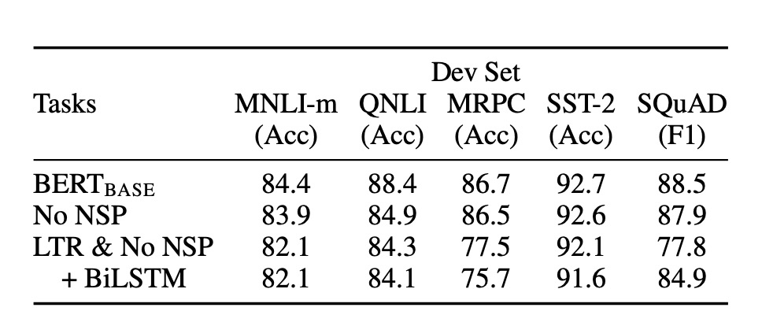

# [18.10] BERT

## 十二層編碼器

[**BERT: Pre-training of Deep Bidirectional Transformers for Language Understanding**](https://arxiv.org/pdf/1810.04805.pdf)

---

在 Transformer 提出後，許多研究者開始探討如何更好地利用這個架構。

先前的 GPT-1 選擇了**全編碼器（decoder-only）** 的架構，而 BERT 恰好相反，選擇了**全編碼器（encoder-only）**。

:::tip
在 BERT 模型前半年，有個模型叫做 ELMo。然後從 BERT 取名為 BERT 之後，研究者開始流行起將模型取名芝麻街角色的風潮。我們還記得一開始的論文都還會認真地用標題來找縮寫，後來則是完全放飛自我，想取什麼名字就取什麼名字...
:::

## 定義問題

將預先訓練的語言模型應用於下游任務，通常有兩種策略：

- **1. 基於特徵的方法**

  這類方法，例如 ELMo（[Peters 等人，2018a](https://arxiv.org/abs/1802.05365)），使用特定於任務的架構，其中包括預訓練的表示作為附加特徵。

- **2. 微調方法**

  這類方法，例如生成式預訓練的 OpenAI GPT，引入了最少的特定任務的參數，並透過簡單地微調所有預訓練參數來訓練下游任務。

---

這兩種方法在預訓練期間共享相同的目標函數，它們使用單一語言模型來學習通用語言表示。

其中，作者認為「單向性」的問題特別嚴重。

### 單向性

在我們上一篇提到的 OpenAI GPT 中，使用的是從左到右的架構，其中每個 Token 只能專注於 Transformer 的自注意力層中的先前 Token。

這種限制對於句子級任務來說並不是最優的，並且當將基於微調的方法應用於標記級任務（例如問答）時可能非常有害，因為在這些任務中，從兩個方向合併上下文可以大幅提高性能。

## 解決問題

### 模型架構

這是作者提出的模型架構，總共有 12 層編碼器。

相關的配置如下：

- **BERT-Base**

  - 共 12 層編碼器，每層編碼器都是 Transformer 的基本結構。
  - 每層編碼器有 768 維特徵和 12 個注意力頭。
  - 總參數量為 110M。

- **BERT-Large**
  - 共 24 層編碼器，每層編碼器都是 Transformer 的基本結構。
  - 每層編碼器有 1024 維特徵和 16 個注意力頭。
  - 總參數量為 340M。

對於輸入資料，BERT 採用了一些策略：

1. **輸入序列的靈活定義**：在 BERT 的上下文中，「句子」並不局限於實際的語言學上的句子，而可以是任何連續文本的範圍。「序列」則指的是 BERT 處理的輸入 Token 序列，可能包含單一句子或兩個句子。

2. **WordPiece 嵌入**：使用一個包含 30,000 個標記的 WordPiece 詞彙來進行嵌入（[**Wu et al., 2016**](https://arxiv.org/abs/1609.08144)），這有助於有效地處理未知詞或罕見詞。

3. **特殊標記的使用**：

   - **[CLS] Token**：每個序列的第一個標記。這個標記的最終隱藏狀態會被用作進行分類任務的序列表示。
   - **[SEP] Token**：用來分隔句子對。這有助於 BERT 識別和處理來自不同句子的資訊。
   - **[MASK] Token**：在預訓練過程中，隨機遮蓋一些 Token，以便模型預測這些被遮蓋的 Token。

4. **句子分隔的特徵標記**：除了[SEP]標記外，BERT 還在每個 Token 上添加學習的參數，用以指示該 Token 屬於句子 A 還是句子 B。

### 預訓練策略

如上圖，左側是 BERT 的預訓練策略，右側是微調策略。

BERT 的預訓練策略非常經典，影響了後來許多模型的設計。

- **Masked Language Model（MLM）**

  BERT 採用掩碼語言模型（又稱完形填空任務）來訓練深度雙向表示。在此任務中，模型隨機遮蓋輸入序列中的一定比例的 Token，目標是預測這些被遮蓋的 Token。

  - **隨機遮蓋策略**：在 BERT 中，每個輸入序列中約 15% 的 WordPiece Token 會被隨機選中並遮蓋。遮蓋選中的 Token 時，80% 的情況下會用 [MASK] Token 替換，10% 的情況下替換為隨機 Token，另外 10%的情況下保持不變。

  - **預測被遮蓋的 Token**：對於每個被遮蓋的 Token，BERT 使用對應的最終隱藏向量，通過一個輸出 softmax 層來預測原始 Token。這個過程類似於傳統語言模型的操作。

  - **微調階段的潛在不匹配問題**：由於在預訓練期間使用了 [MASK] Token，而這些 Token 在實際下游任務的微調階段並不會出現，這在理論上造成了預訓練和微調之間的不匹配。BERT 通過不總是使用實際的 [MASK] Token 來替換選中的 Token，而是採用上述的隨機策略來緩解這一問題。

- **Next Sentence Prediction（NSP）**

  為了讓模型更好地理解和捕捉句子之間的關係，BERT 引入了下一句預測這個預訓練任務。

  在預訓練過程中，當選擇句子 A 和 B 組成輸入對時，有 50% 的機會 B 是 A 的實際後續句子（標記為 IsNext），另外 50% 的機會 B 是從語料庫中隨機選擇的非連續句子（標記為 NotNext）。這種設計使模型能學習識別兩個句子是否在邏輯上相關或順序上相繼。

  通過 NSP 任務，BERT 能夠在預訓練階段就學習到如何理解和處理不同句子之間的關係。

### 微調策略

在微調階段，BERT 通過添加一個額外的分類層來進行下游任務的微調。

- **問答任務（SQuAD）：**

  在問答任務中，BERT 會將問題和包含答案的段落作為單一序列處理，利用不同的嵌入來標識問題部分和段落部分。微調過程中，BERT 引入了特定的起始和結束向量來預測答案在段落中的位置。

- **自然語言推理（NLI）：**

  在 NLI 任務中，BERT 接受兩個句子作為輸入，並通過將兩個句子的表示進行連接，然後通過一個分類層來預測兩個句子之間的關係。

這種微調方法相對成本較低，且能在短時間內（例如，在 Cloud TPU 上 1 小時或 GPU 上數小時內）完成。這種效率和通用性使得 BERT 特別適合於快速部署和實現各種自然語言處理任務的高性能解決方案。

## 討論

在 GLUE 任務上，BERT 的表現顯著超過了 OpenAI GPT 模型，特別是在 MNLI 任務上，BERT-LARGE 版本達到了 80.5 分，顯著高於 GPT 的 72.8 分。研究還顯示，對於資料量較少的任務，BERT-LARGE 相比於 BERT-BASE 有更出色的表現，表明模型大小對於提高表現具有重要影響。

不僅如此，BERT 總共在 11 個自然語言處理任務中取得了新的最佳結果，這表明了 BERT 在多個任務上的通用性和有效性。

### 消融實驗

作者也進行了一系列消融實驗，以探討 BERT 的不同組成部分對性能的影響。

1. **無 NSP**

   - 使用了 Masked LM (MLM) 進行訓練的雙向模型，但沒有執行下一句話預測 (NSP) 任務。結果表明，缺少 NSP 會顯著損害 QNLI、MNLI 和 SQuAD 1.1 的效能。

2. **LTR & 無 NSP**

   - 僅使用從左到右 (LTR) 語言模型進行訓練，未使用 MLM 或 NSP。
   - 在所有任務上，這個模型的表現均不如 MLM 模型，特別是在 MRPC 和 SQuAD 任務上的下降幅度更大。
   - 在 SQuAD 任務上，LTR 模型的 Token 預測效能顯著較差，這是因為其 Token 層級隱藏狀態缺乏右側上下文的支持。

3. **BiLSTM 的添加**

   - 為了嘗試改善 LTR 系統，添加了一個隨機初始化的 BiLSTM。雖然 BiLSTM 在 SQuAD 的表現有所提升，但仍遠不如雙向模型。
   - BiLSTM 對 GLUE 任務的效能有損害。

4. **比較 ELMo 的策略**
   - 訓練獨立的 LTR 和 RTL 模型並將它們的輸出串聯起來，這一策略類似於 ELMo 所採用的方法。雖然這種方法能夠利用左右上下文，但成本是單一雙向模型的兩倍。

## 結論

BERT 的知名度，來自於它的高性能。

在那個年代，這種屠榜的行為是非常少見的，因此 BERT 的出現引起了極大的關注。從 BERT 提出之後，學術圈內再也沒有 LSTM 立足的地方，天底下只剩下 Transformer。

BERT 的成功證明了「預訓練-微調的模式」在多樣化的自然語言理解任務中具有潛力，為後續更大規模、更強性能的模型奠定了基礎。
