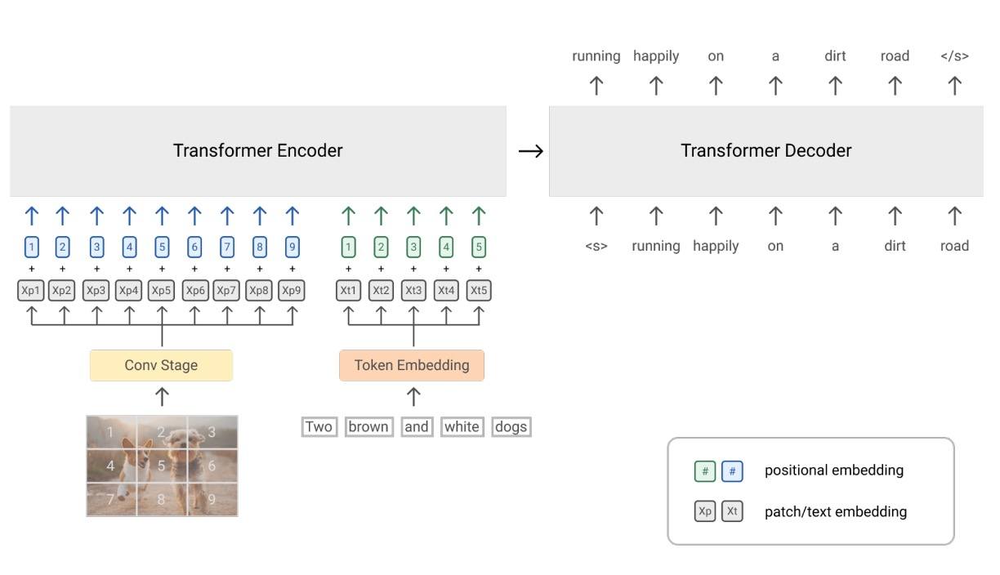
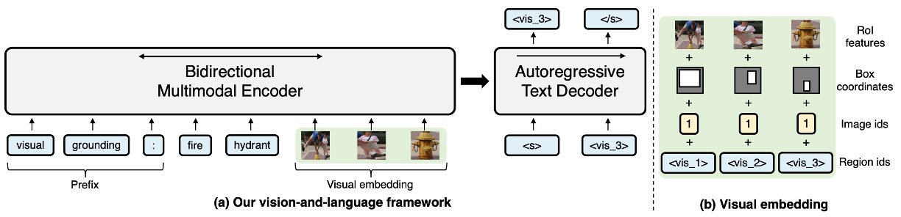
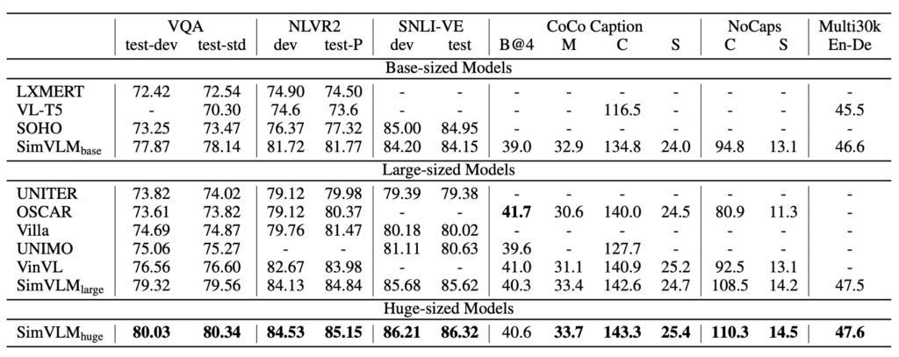
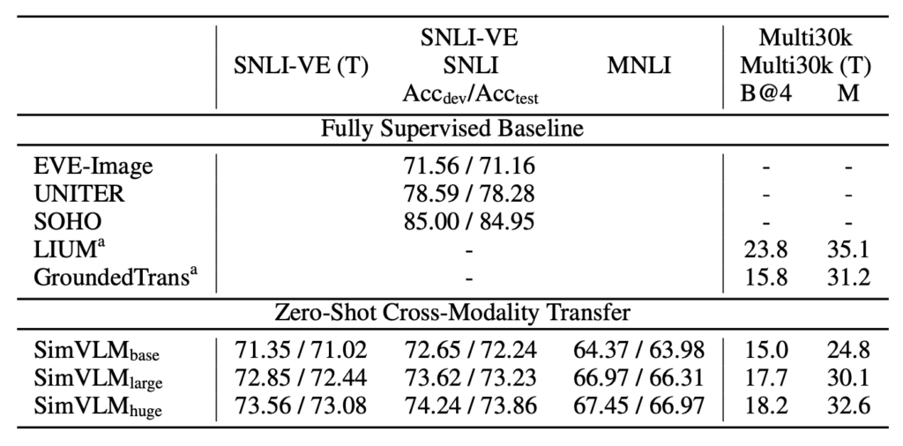

# [21.08] SimVLM

## 簡單一點

[**SimVLM: Simple Visual Language Model Pretraining with Weak Supervision**](https://arxiv.org/abs/2108.10904)

---

當一件事情發展得太過複雜，就會讓人望之卻步：

一定要搞成這樣嗎？

在這個當下， GPT3 已經問世了，並且取得相當不錯的表現，而且他們並沒有把整件事情搞得這麼複雜呀！

本論文的作者基於這個想法，認為不要再拘泥於原本的編碼器的架構了。

或許，我們可以讓整件事情簡單一點？

## 定義問題

作者定義的問題包括以下幾點：

1. **預訓練微調範式的缺陷**

   - 雖然利用掩碼語言建模 (MLM) 在大規模未標記文字語料庫上預訓練模型（例如 BERT）後進行微調已成為主流，但近期的自回歸語言模型，如：GPT-3，顯示出在無需微調的情況下，使用少量資料即能達到強大的性能。

2. **多模式對應的挑戰**

   - 嘗試建立視覺和文字的多模式對應，但要捕捉影像和文字之間的對齊並不容易。早期的方法通常依賴於人工標記的資料集，進行物件偵測和融合模型的 MLM 預訓練。
   - 由於人類註釋資料的規模有限，先前的方法不僅需要使用複雜的預訓練方案，還要引入特定於任務的輔助損失，使整個 VLP 的預訓練協議變得更為複雜。

3. **缺乏零樣本能力**
   - 目前基於預訓練微調的方法在零樣本能力方面表現不佳，即模型在沒有看過的新任務上的泛化能力受限。
   - 一些方法只關注特定的任務，因此不容易被用作通用的預訓練微調表示。例如：某些方法只專注於影像分類或圖文檢索的特定任務。

## 解決問題

### SimVLM 模型設計

1. **PrefixLM**

   受到單向語言模型所帶來的零樣本能力啟發，作者提出了一種新的方法，稱為「前綴語言建模」或「PrefixLM」。與傳統的單向語言模型不同，PrefixLM 有幾個特性：

   - **雙向關注於前綴序列**：

     PrefixLM 不僅考慮前綴序列前的上下文，還考慮其後的上下文。這意味著它同時從過去和未來的信息中學習。

   - **自迴歸分解的範圍**：

     只有在前綴之後的部分，PrefixLM 進行自迴歸分解，也就是嘗試預測接下來的序列。

   - **圖像作為文字的前綴**：

     在視覺語言任務中，PrefixLM 的另一個重要特性是它將圖像視為文字描述的前綴。這是基於觀察到圖像往往在文本描述之前出現。

   :::tip
   假設我們有一張圖片，圖片中顯示的是一只狗正在公園裡玩球。PrefixLM 的任務就是從給定這張圖片，生成描述這張圖片的文字，整體的處理步驟可能會長這個樣子：

   1. 圖像作為前綴：首先，我們將圖片的特徵表示（可能是通過某種視覺模型，例如：ResNet 或 VGG）作為前綴輸入到模型中。
   2. 一部分的文字描述：有了這張圖片作為前綴，還要搭配一段簡短的描述，例如：「一只狗…」。
   3. 考慮雙向上下文，從解碼器開始生成描述：它不僅考慮到目前為止生成的文字（例如：「一只狗」），還考慮到圖片的前綴信息。因此，當模型試圖生成詞語時，它不僅從「一只狗」這個上下文獲取信息，還從圖片中獲取信息。
   4. 繼續生成描述：考慮到上述的上下文，模型可能會生成「公園裡玩球」。

   所以，結合圖片前綴和生成的文字，我們得到了完整的描述：「一只狗正在公園裡玩球。」
   :::

2. **架構設計**

   使用 Transformer 作為核心架構，用 Encoder-Decoder 的序列到序列語言模型，結合了視覺模塊和文本模塊：

   - **視覺模塊**

     這裡就是 ViT，但有些差異，ViT 在一開始是透過一個 Linear 層，把影像的 patch 轉成特徵，而在這邊則是把 Linear 的部分換成 ResNet。原本的 ViT 只接受影像的輸入，但這邊則是把一部分的文字輸入串進去 token 序列。

   - **文本模塊**

     這裡遵循 SentencePiece 的分詞方式，也就是 Byte-Pair Encoding (BPE) 方法，這種方法首先將文本切分成字符，然後反覆合併最常見的字符對成為新的單位，直到達到預定的詞彙大小，然後針對固定的詞彙進行學習編碼。

   :::tip
   等等！這架構，看起來就像是 VL-T5 ！

   讓我們把 VL-T5 的架構拿出來看一下：

   

   - 他們都有 Encoder-Decoder
   - 他們都在 Encoder 加入圖像資訊和文字資訊
   - 他們，真的不一樣！

   乍看之下很像，但實際上差很多。

   在 VL-T5 中，**使用物件偵測器的輸出**，把裁切出來的影像片段給模型看。同時，加上兩段文字的敘述：

   - 第一段：也就是 prefix，告訴模型要解決的問題類型。
   - 第二段：問題的本體。

   透過兩段文字加上影像片段，讓模型從「很多個物件」中，找到符合文字的描述，並且使用 Decoder 輸出結果。

   這樣的設計把大部分的困難都留給 Encoder，反觀 Decoder 在這裡的處境十分尷尬，甚至可以把 Decoder 拿掉，然後在 Encoder 的部分外加一個 [CLS] 的 Token 給他，讓他去回答問題，說不定也能達到差不多的表現。

   :::

   接著回來看 SimVLM，他並沒有把問題都留在 Encoder，在我們看來，他更像是營造了一個「案發現場」，在這裡的 Decoder 像是偵探的角色，他必須透過 Encoder 留下來的蛛絲馬跡，試著推理出後續的結果。

   甚至，根據作者所言：**這裡的提到「前綴」的影像線索，甚至可以不用來自影像，你要輸入一段用來「描述影像的文字」作為線索**，也是完全沒問題的！

   也就是這個設計上的差異，在後續的下游任務中，居然有提升將近 10 個百分點的表現。

### 預訓練策略

這裡沒有 MLM，沒有 ITM，沒有那些你以為應該要有的東西。

作者在這邊的預訓練就只是採用「PrefixLM」策略，也就是加上影像線索之後，像是 GPT 這樣，去玩文字接龍遊戲。

哎呀！簡單到讓我們措手不及……

### 資料集

- **ALIGN 訓練資料集**：一個涵蓋圖像與其相關描述或文字標注，且帶有「大量雜訊」的大型資料集。這種圖像-文字配對的資料集通常用於視覺語言預訓練，支持多模態學習任務。
- **Colossal Clean Crawled Corpus (C4)**：C4 是一個大型的文本資料集，主要用於預訓練語言模型。該資料集是從網頁文本中整理和淨化的，並專為高效和大規模的預訓練而設計。

## 討論

### 模型效果如何？

SimVLM 可以利用其簡化的預訓練和微調方法來達到出色的性能，它可以無縫地應用於預訓練微調的流程中：

1. **模型比較**

   - SimVLM 被與多個先進的視覺語言預訓練 (VLP) 方法比較，這包括：LXMERT、VL-T5、UNITER、OSCAR、Villa、SOHO、UNIMO 和 VinVL。
   - 在多模態任務上，SimVLM 的性能超越了所有比較的模型，設定了新的 SOTA 結果。
   - 該結果指出 SimVLM 的生成預訓練方法具有競爭力，且其弱監督的簡單框架能夠學習高品質的多模態表示。

2. **特定任務上的表現**

   - **判別任務**

     即使容量較小，SimVLMbase 也優於所有其他方法。特別是 SimVLMhuge 在 VQA 任務上「首次達到超過 80%」 的性能，比先前的 SOTA (VinVL) 提升了近 4 分。

   - **複雜的視覺語言推理**

     SimVLM 在 NLVR2 和 SNLI-VE 上的表現均優於先前方法。

   - **生成任務**

     SimVLM 顯示了顯著的改進，特別是在 CoCo 字幕的「Karpathy」5k 測試分割和 NoCaps 基準上，其性能超越了使用更複雜的 CIDEr 優化強化學習方法的先前模型。

   - **圖像翻譯**

     SimVLM 也在 Multi30k 的英語到德語的圖像翻譯任務上展現出效果。

### Zero-shot 的表現？

作者在這邊主要探索了三種零樣本的應用方式，具體如下：

1. **零樣本/少樣本圖片標題生成**

   

   SimVLM 的預訓練過程可以視為對網路上的影像字幕目標的解釋。當用於零樣本或少樣本設定時，這種模型的效果與完全監督模型相媲美。而使用某些前缀提示，如：「A picture of」，可以提高字幕質量。模型具有強大的泛化能力，不僅能夠識別真實世界的概念，還能對視覺輸入提供詳細的描述。

2. **零樣本跨模態傳輸**

   

   SimVLM，一種 VLP 模型，被用於這項研究。由於文字訓練資料的成本通常低於視覺資料，因此該模型在純文字資料上進行了微調，之後再評估其在聯合視覺-語言任務上的效能。這種方法在 SNLI-VE 和 Multi30k 資料集上得到了驗證。

   尤其在 SNLI-VE 的應用中，SimVLM 通過在文字 NLI 資料集上的微調，然後再將圖像資料作為輸入，達到了令人滿意的零樣本傳輸效果，與其他完全監督方法具有可比性。

   值得注意的是，當屏蔽圖像特徵只使用假設進行預測時，該模型的表現與隨機猜測相似，確認了 SimVLM 在跨模態傳輸上的有效性。此外，該模型還成功地從一種模態和語言轉移到另一種，證明了其在跨域和跨語言上的能力。

3. **開放式視覺問答**

   

   在視覺問答（VQA）任務上，傳統方法通常將問題表述為對一套預定義的 3,129 個候選答案進行多標籤分類。然而，這種方法在現實應用中受到限制，因為固定的答案集很難涵蓋所有可能的情境，這使得開放式 VQA 變得具有挑戰性。

   實驗結果顯示，SimVLM 在開放式 VQA 上表現出色。它不僅在那些答案不在預定義候選答案中的問題上超越了其他基線模型，而且即使只使用部分的預定義答案進行訓練，它仍能在未見過的答案上表現良好。但值得注意的是，如果模型不進行微調，它在某些問題上可能無法生成有意義的答案。

### 誰的貢獻？

首先，當模型只有解碼器而沒有雙向編碼器時，其在視覺問答（VQA）的表現明顯下滑。這樣的結果意味著，結合雙向的編碼方式和單向的解碼策略是一個對模型效能有正面影響的策略。

接著，研究發現在預訓練的目標中，PrefixLM 的方法比其他策略更為出色。這不僅說明了 PrefixLM 的有效性，更進一步表示，在處理視覺和文本資料時，有一套統一和一致的目標公式是非常重要的。

另外，模型在訓練過程中，雖然需要有弱對齊的圖像文字資料以幫助模型理解視覺和文本之間的關係，但同時，純文字的語料庫也是不可或缺的。這因為純文字語料庫能提供豐富的語言資訊，幫助模型獲得更深入的語言理解能力。

最後，研究強調了卷積階段在視覺語言（VL）任務中的重要性。特別是當使用三個卷積（conv）區塊時，模型的效能表現最為突出。這個結果揭示了影像和文本資料在表示時，具有不同的粒度和特點，因此，在模型架構中考慮這些差異性是很有幫助的。

## 結論

透過一個如此簡單的架構，居然能達到如此的結果。

但這樣的簡單性並不意味著易於被發現或實現。SimVLM 的成功就是對這一原則的最佳證明。這篇論文所展示的，不僅是一種效果卓越的技術策略，更重要的是，它告訴我們即使在當今這個看似複雜的技術世界中，仍有可能找到簡單而直接的解決方案。

很多時候，人們都會自然而然地認為複雜的問題需要複雜的解決方案。當 SimVLM 以其簡潔的「PrefixLM」策略出現，它打破了這一固有的思維模式，並為後續的研究提供了一個清晰的方向。

我們可以試著發想一下，基於 SimVLM 的優異性能，未來的研究者可以嘗試從 ViT 的角度進行優化，畢竟 ViT 已經有了這麼多的進化形態；或者從 GPT 的策略上進一步深化，都有可能再繼續推動整個視覺語言預訓練領域的進一步發展。
