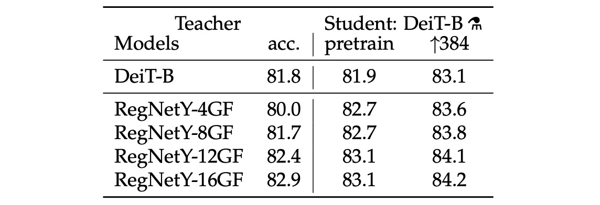
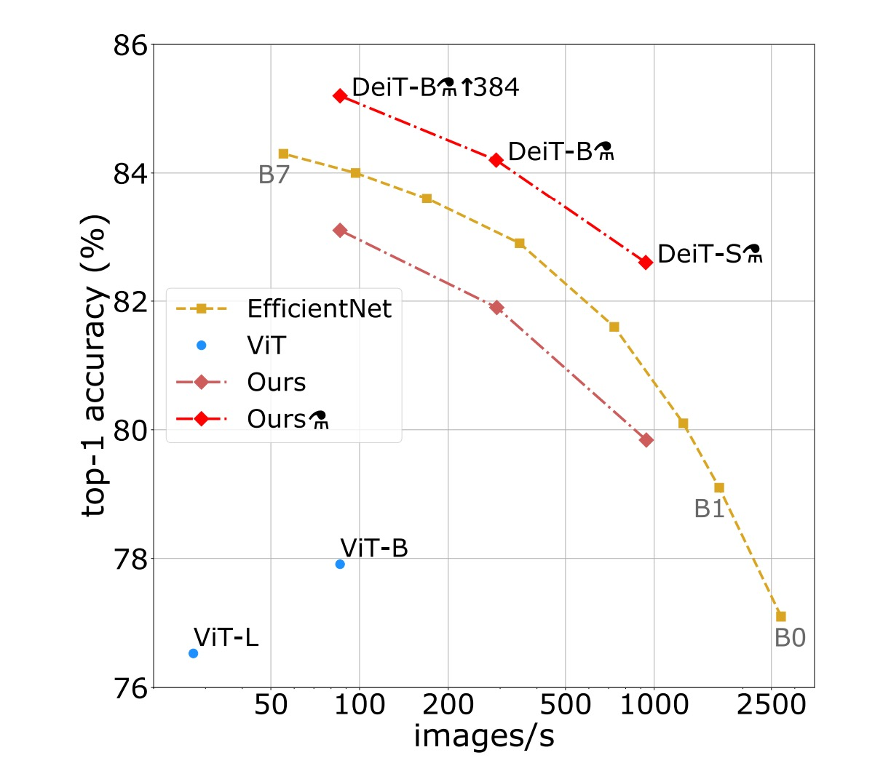

## 蒸餾後更香醇

[**Training data-efficient image transformers & distillation through attention**](https://arxiv.org/abs/2012.12877)

---

稍早，我們看完了 ViT。

- [**ViT: 新世界拓荒者**](../2010-vit/index.md)

這篇論文探索了 Transformer 在圖像領域的應用，在大資料集上的效果超越了傳統的卷積網路，並且在實驗中展現了更大的潛力。

對此，我們得到了一個作者給出的結論：

- **在數據量不足的情況下無法很好地進行泛化。**

## 定義問題

本篇論文的作者認為：

- 我們可以透過**知識蒸餾**的方式，降低模型對資料的依賴，同時提升模型的性能。

## 解決問題

### 模型架構

看到這個圖不要緊張。

這不是什麼新東西，你把 `distillation` 那個部分拿掉，就是原始的 ViT。

上圖左邊的 CE loss 就是走原本的 ViT 訓練流程。

這篇論文的所有內容，都是從上圖右邊 `distillation` 這個 Token 開始講起。

### 模型蒸餾

作者在原本的 ViT 架構中，額外加入一個 Token，讓這個 Token 加入整個模型的自注意力機制中。最後，對於這個 Token 的輸出使用 Teacher-Steudent 的方式進行監督。

Teacher 在這裡會引入「另外一個」已經訓練好的模型，可以是 ConvNet 或是其他的架構。

訓練時，Teacher 會提供輸出類別給 Student 學習，不會參與梯度更新。

Student 則是我們要訓練的模型，這篇論文中的目標就是 ViT-B/16 的架構。

監督方式分為兩種：

1. **軟蒸餾（Soft distillation）**

   軟蒸餾方法通過最小化教師模型與學生模型的 softmax 輸出之間的 Kullback-Leibler 散度來進行訓練。假設 Zt 為教師模型的 logits，Zs 為學生模型的 logits，τ 表示蒸餾溫度，λ 為平衡 Kullback-Leibler 散度損失（KL）和基於地面真值標籤 y 的交叉熵（LCE）的係數，ψ 表示 softmax 函數。蒸餾的目標函數定義為：

   - $$L_{global} = (1 − λ)L_{CE}(ψ(Zs), y) + λτ^2KL(ψ(Z_s/τ), ψ(Z_t/τ))$$

   上式中，$L_{CE}$ 是原本 ViT 訓練架構，表示交叉熵損失。KL 表示蒸餾架構的 KL 散度損失。

   訓練時，我們會使用 λ 來調整軟蒸餾和交叉熵損失的權重。

2. **硬蒸餾（Hard-label distillation）**

   作者引入了一種蒸餾變體，其中將教師模型的決策視為真實標籤。

   令 $y_t = \arg\max_c Z_t(c)$ 為教師模型的硬決策，則與此硬標籤蒸餾相關的目標函數為：

   - $$L_{global}^{hardDistill} = \frac{1}{2} L_{CE}(ψ(Z_s), y) + \frac{1}{2} L_{CE}(ψ(Z_s), y_t)$$

   對於給定的圖像，教師模型的硬標籤可能會隨具體數據增強方式而變化。我們將看到，這種選擇比傳統方法更優，且無需參數，概念上更簡單：教師的預測 $y_t$ 起到與真實標籤 $y$ 相同的作用。

   還需注意，硬標籤也可以通過標籤平滑轉換為軟標籤，其中真實標籤被認為具有 $1 - ε$ 的概率，其餘 $ε$ 則在其餘類別中分配。在論文中所有使用真實標籤的實驗中，我們將這個參數固定為 $ε = 0.1$。

   :::tip
   這裡可能不好理解。

   舉例來說，假設輸入一張影像，標籤是「狗」，但這張圖片的「狗」可能很小，影像中大部分的區域是草地。當我們把這張圖片給 Teacher 模型時，得到的輸出為「草地」。

   在這種情況下：

   - **[class token]** 會監督「狗」這個標籤
   - **[distillation token]** 會監督「草地」這個標籤。

   最後將兩個損失用一個權重相加，就是最終的損失函數。
   :::

### 教師網路

對於教師網路的選擇，作者做完實驗後得到的結論是使用卷積網路作為教師可以得到最好的效果。

推測其中原因是 ViT 透過蒸餾的方式繼承了卷積網路的歸納偏差，進而提升了模型的泛化能力。

## 討論

### 哪個蒸餾的策略最好？

上表展示了不同蒸餾策略的性能。

- 不使用蒸餾和只使用軟蒸餾的模型表現相當。
- 只使用硬蒸餾約可以提高 1% 的性能，這表示使用硬蒸餾的效果比較好。

在上表的下半部中，都在訓練時同時使用 label 和 teacher 的資訊。接著要比較的是預測時是否使用 teacher 的資訊。從結果來看，在預測階段時候同時使用 class embedding 和 distillation embedding 的效果最好。

### ImageNet 實驗結果

在影像分類方法的文獻中，作者通常將準確性與其他標準（例如 FLOPs、參數數量、網路大小等）之間的折衷進行比較。

研究發現，DeiT 方法的表現略低於 EfficientNet，這表明僅使用 ImageNet 進行訓練時，作者已經幾乎縮小了視覺 Transformer 和 CNN 之間的差距。與先前僅在 ImageNet1k 上訓練的 ViT 模型相比，DeiT 的結果是一個重大改進，在可比較設定中提高了 6.3%的 top-1 準確率。

此外，當 DeiT 從相對較弱的 RegNetY 進行蒸餾以產生 DeiT 時，其性能優於 EfficientNet。研究結果顯示，DeiT 比在 JFT300M 上以 384 解析度預訓練的 ViT-B 模型高出 1%（top-1 準確率 85.2%對比 84.15%），同時訓練速度顯著更快。

下表詳細報告了在 ImageNet V2 和 ImageNet Real 上的數據和附加評估結果，這些測試集與 ImageNet 驗證集不同，可以減少驗證集上的過度擬合。研究結果表明，在 GPU 上的準確性和推理時間之間的權衡方面，DeiT-B 和 DeiT-B ↑384 在一定程度上優於最先進的技術。

## 結論

DeiT 模型，透過僅在 ImageNet 上訓練，並在不到三天的時間內（使用單個 8-GPU 節點）完成訓練，在沒有外部資料的情況下，達到了 83.1%的 top-1 準確率。

更為重要的是，作者們引入了一種基於蒸餾標記的蒸餾策略，這種策略使得學生模型能夠通過注意力機制從教師模型中學習，並在與卷積網路進行比較時，展示出明顯的優勢。

這篇論文證明了不需要大量資料和計算資源也能訓練出高效能的 ViT，並展示了這些模型在未來成為圖像分類方法的一種有力選擇的潛力。

:::tip
這個方式的訓練成本不高，我們覺得非常好用。
:::
