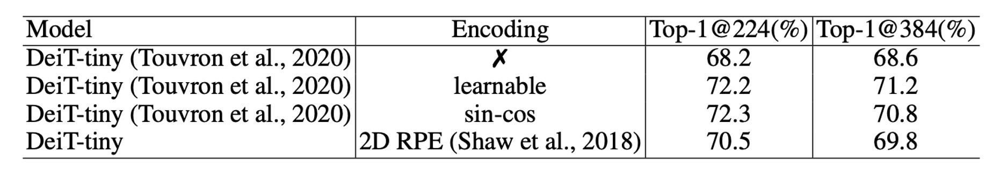
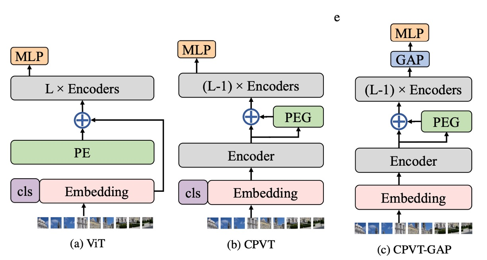
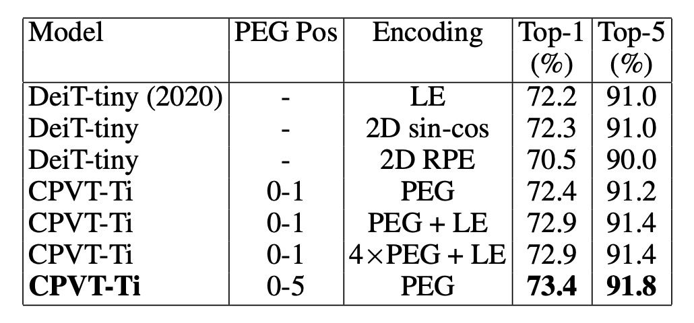

# [21.02] CPVT

## 條件位置編碼

[**Conditional Positional Encodings for Vision Transformers**](https://arxiv.org/abs/2102.10882v3)

---

ViT 提出後不久，各方面的研究紛至沓來。

如果你也常在使用 ViT 相關的架構，你一定也會有相同的困擾：這個「可學習式」的位置編碼，真的很難用啊！

## 定義問題

在 ViT 中，輸入影像會被切割成固定大小的圖像區塊，這些區塊會與對應的可學習絕對位置編碼相加。然而，這種位置編碼方式存在兩個主要問題：

### 序列拓展

絕對位置編碼的長度是固定的，這限制了模型處理比學習到的位置編碼更長的序列。

對於這個問題，或許我們可以直接捨棄位置編碼？

- **答案是不行！**

捨棄位置編碼會大幅降低模型的性能，在 DeiT 的論文中已經做過這個實驗了， DeiT-tiny 模型在 ImageNet 上的準確率從 72.2% 驟降至 68.2%，可說是災難性的下降。

這其實不難理解，因為輸入序列的順序是很重要的線索，若沒有位置編碼，模型就無法獲取順序資訊。

### 平移等變性

平移等變性是指當物體在影像中移動時，模型的回應能夠相應改變。

在 ViT 架構中，每個區塊都會加上一個唯一的位置編碼，這使得模型失去了平移等變性，無法隨著物體在影像中的移動而產生相應變化。失去了這個特性，模型的性能會降低，特別是分類任務尤為明顯。

DeiT 模型的研究表明，可以通過插值技術將位置編碼延伸到與較長序列相同的長度，只是這種方法需要進行多輪微調，如果不做微調直接上，那模型的性能會大幅下降。

**那改成相對位置編碼（Relative Positional Encoding, RPE）行不行？**

- **答案是：可以解決上面的兩個問題。**

但是由於無法提供絕對位置的資訊，根據實驗數據，相對位置編碼的表現不如絕對位置編碼。

:::tip

「相對位置編碼」和「絕對位置編碼」，在 ImageNet 資料集上，大約有 1.5% 的差距。
:::

## 解決問題

### 條件位置編碼



為了解決上面提到的問題，作者提出了一種新的位置編碼方式：條件位置編碼（Conditional Positional Encodings, CPE）。

如上圖，最左邊的是原始的 ViT 架構，輸入影像經過 Patchify 之後，直接加上一個「可學習式」的絕對位置編碼。

中間的圖是作者提出的 CPE 架構，這裡的關鍵是：**將位置編碼的計算過程放在了 Transformer 的 Encoder 中**。

確切來說：是放在「第一層」 Encoder 之後，「第二層」 Encoder 之前。

:::tip
這什麼操作？

等會兒再講，我們先繼續看 PE 的結構。
:::

### 位置編碼生成器


位置編碼生成器，在論文中名稱為：Positional Encoding Generator。

我們先撇開這個位置編碼放置的位置，單純來看一下這個 Generator 的結構：

- **就是一個 Conv2d 卷積！**

意思就是，當我們把影像拆解成 Patch 之後，讓這些 Patch 會通過一個卷積層，生成對應的位置編碼。

這個卷積層是有講究的，它必須有 `Zero Padding`！這裡的 `Zero Padding` 是用來讓模型定位具體位置的方式。透過卷積的方式，模型就可以根據輸入的影像，動態生成對應的位置編碼，也就是這篇論文標題提到的：**條件位置編碼**。

論文中有提供實作的細節，我們可以簡單看一下：

```python title="Algorithm 1 PyTorch snippet of PEG by the authors"
import torch
import torch.nn as nn

class VisionTransformer:

    def __init__(self, layers=12, dim=192, nhead=3, img_size=224, patch_size=16):
        self.pos_block = PEG(dim)
        self.blocks = nn.ModuleList([
            TransformerEncoderLayer(dim, nhead, dim*4)
            for _ in range(layers)
        ])
        self.patch_embed = PatchEmbed(img_size, patch_size, dim*4)

    def forward_features(self, x):
        B, C, H, W = x.shape
        x, patch_size = self.patch_embed(x)
        _H, _W = H // patch_size, W // patch_size
        x = torch.cat((self.cls_tokens, x), dim=1)
        for i, blk in enumerate(self.blocks):
            x = blk(x)
            if i == 0:
                x = self.pos_block(x, _H, _W)
        return x[:, 0]

class PEG(nn.Module):

    def __init__(self, dim=256, k=3):
        # Only for demo use, more complicated functions are effective too.
        self.pos = nn.Conv2d(dim, dim, k, 1, k//2, groups=dim)

    def forward(self, x, H, W):
        B, N, C = x.shape
        cls_token, feat_tokens = x[:, 0], x[:, 1:]
        feat_tokens = feat_tokens.transpose(1, 2).view(B, C, H, W)
        x = self.pos(feat_tokens) + feat_tokens
        x = x.flatten(2).transpose(1, 2)
        x = torch.cat((cls_token.unsqueeze(1), x), dim=1)
        return x
```

你可以看到 `PEG` 這個實作，就真的只有一個 Conv2d 卷積層，沒有多餘的東西。

### 模型訓練策略

為了驗證這個新的位置編碼方式，作者嚴格遵守 DeiT 的訓練策略，相關實驗配置如下：

1. **資料集**

   - 本研究使用 ImageNet 資料集，包含 1000 個類別及 130 萬張影像，進行模型訓練。
   - 評估結果則基於含有 5 萬張影像的驗證集。
   - 沒有使用更大的 JFT-300M 資料集。

2. **模型變體**

   - 針對不同的運算需求，作者設計了三個不同大小的模型。
   - 所有實驗均在 Tesla V100 機器上執行。
   - 訓練 Tiny 模型 300 個 epochs 約需 1.3 天（使用單一節點的 8 張 V100 GPU），CPVT-S 與 CPVT-B 模型則分別需要 1.6 天及 2.5 天。

3. **訓練細節**

   - 除了 CPVT-B 模型外，其餘模型均訓練 300 個 epochs，使用 Tesla V100 機器，批次大小為 2048。
   - 使用 AdamW 優化器進行訓練。

## 討論

### PEG 的放置位置


剛才提到的「放置位置」，為什麼會放在 Encoder 的第一層之後，第二層之前？

:::tip

- 位置 0：第一個 Encoder 的輸出
- 位置 -1：第一個 Encoder 之前
  :::

作者嘗試將 PEG 放置於不同的模型位置，根據結果（上表左），當 PEG 放置於位置 0 或位置 3 時，模型的 Top-1 準確率達到約 72.4%，表現最佳。將 PEG 放置於位置 0 比放置於 -1 的效果更好，顯示位置 0 的性能明顯優於位置 -1。

觀察到兩個位置的主要區別在於它們的接收場範圍不同：位置 0 擁有全局接收場，而位置 -1 只能看到局部區域。如果擴大卷積核的大小，兩者應該會有相似的效果。

為了驗證這一假設，作者在位置 -1 使用了較大的卷積核（27×27，填充大小為 13），結果顯示其性能（72.5%）與位置 0 的效果相似，證實了這一假設。

但增加卷積核的大小會增加計算量，因此作者選擇將 PEG 放置於位置 0，以獲得更好的性能。

### PEG 的改進來自哪裡？

<div align="center">
<figure style={{ "width": "70%"}}>

</figure>
</div>

人們會懷疑 PEG 的改進來自於 PEG 中卷積層引入的額外可學習參數，而不是 PEG 保留的局部關係。為了測試 PEG 的主要作用，作者只在注意力層中使用 PEG 來計算 Q 和 K，以便僅傳遞 PEG 的位置信息。

如上表，在這種情況下，DeiT-tiny 的 Top-1 準確率達到了 71.3%，明顯優於無位置編碼的 DeiT-tiny（68.2%），且與在 Q、K 和 V 上使用 PEG 的結果相近（72.4%）。這表明 PEG 主要是作為一種位置編碼方案發揮作用，而非僅依賴於卷積層增加的可學習參數。

為了進一步排除 PEG 的性能提升是由於新增參數，作者設計了另一個實驗：隨機初始化一個 3×3 的 PEG 並固定其權重，結果 Top-1 準確率達到了 71.3%，比無任何位置編碼的 DeiT-tiny 高出 3.1%。由於 PEG 的權重是固定的，性能提升只能歸因於 PEG 引入的位置信息。

:::tip
意思是使用一個「不能訓練」的卷積核，也能提升模型的性能。
:::

相反地，當使用 12 層卷積層（卷積核大小為 1，即不產生局部關係）來替代 PEG 時，這些層的可學習參數遠多於 PEG，但性能僅提升了 0.4%，達到 68.6%。這進一步證實了 PEG 的效果主要來自於位置信息，而非額外的參數。

### 泛化到更高解析度


如上表所示，PEG 能夠直接泛化到更大的影像尺寸，而無需進行微調。這點透過評估在 224 × 224 影像上訓練的模型於更大解析度（384 × 384、448 × 448、512 × 512）影像上的表現來證實。

DeiT-tiny 模型在使用 384 × 384 輸入影像時，若配備可學習的位置編碼，性能從 72.2%降至 71.2%。 當使用正弦編碼時，模型性能從 72.2%降至 70.8%。

反觀 CPVT 模型配備 PEG 時，可以直接處理較大的輸入影像，且 CPVT-Tiny（CPVT-Ti）的性能從 73.4%提升至 74.2%（在 384 × 384 解析度下）。CPVT-Ti 的性能比 DeiT-tiny 高出 3.0%，且隨著輸入解析度增加，這個差距還會繼續擴大。

### 降低複雜度

在 PEG 中，若選擇深度卷積，其額外的參數數量為 $d \times l \times k^2$（其中 $d$ 是模型的維度，$l$ 是深度卷積的層數，$k$ 是卷積核大小）。如果使用可分離卷積，參數數量為 $l(d^2 + k^2d)$。

以 CPVT-Tiny 為例，當 $k = 3$ 且 $l = 1$ 時（即模型維度 $d = 192$），PEG 帶來了 1,728 個參數。 DeiT-tiny 模型使用可學習的位置編碼，參數數量為 192 × 14 × 14 = 37,632。

因此，CPVT-Tiny 的參數比 DeiT-tiny 少 35,904 個。 即便使用 4 層可分離卷積，CPVT-Tiny 增加的參數數量僅為 960（38,952 − 37,632），這在 DeiT-tiny 總共 5.7M 的模型參數中幾乎可以忽略不計。

### 在 ImageNet 上的表現


與 DeiT 相比，CPVT 模型在 Top-1 準確率上表現更佳，且推理速度相似。CPVT 模型可以在無需微調的情況下，隨著輸入影像解析度的提升獲得性能提升；而 DeiT 的性能在解析度增加時有所下降。

配備全局平均池化（GAP）的 CPVT 模型創下了 ViT 的新紀錄，達到當前的最佳性能。

CPVT-Tiny 和 DeiT-tiny 模型在進行額外的硬蒸餾訓練後進行比較，硬蒸餾方法採用了 RegNetY-160 模型作為教師模型。CPVT 模型的 Top-1 準確率達到 75.9%，超過 DeiT-tiny 模型 1.4%。

### 和其他位置編碼的比較

<div align="center">
<figure style={{ "width": "70%"}}>

</figure>
</div>

最後作者比較了 PEG 與其他常見的位置編碼方式，並分析了 PEG 與絕對位置編碼（APE）和相對位置編碼（RPE）的組合效果。

1. **PEG 與其他位置編碼的比較**

   - DeiT-tiny 模型使用可學習的絕對位置編碼（LE）達到 72.2%的 Top-1 準確率。
   - 使用 2D 正弦編碼的性能相當，達到相似的表現。
   - 當使用相對位置編碼（RPE，範圍超參數 K 設為 8），其 Top-1 準確率為 70.5%，低於 LE。RPE 不編碼絕對位置信息，這也是其性能較低的原因之一。

2. **PEG 與其他編碼結合的效果**

   將可學習的絕對位置編碼與單層 PEG 結合，基準模型 CPVT-Ti 的性能提高了 0.5%。當使用 4 層 PEG 時，模型的 Top-1 準確率達到 72.9%。如果在前五個 Transformer 區塊中添加 PEG，準確率進一步提升至 73.4%，優於將 PEG 堆疊在單一區塊中的效果。

## 結論

作者證明了 PEG 在處理長輸入序列和保持平移等變性時能顯著提升模型的表現，特別是在分類任務中，相較絕對位置編碼（APE）和相對位置編碼（RPE），PEG 展現出更優異的性能。

此外，PEG 的實現過程簡單，引入的額外計算成本和參數極少，使其成為一個有效且具實用價值的解決方案。

:::tip
在做研究時總不免會分個派系，例如使用 Transformer 架構的時候絕對不用 CNN，或者是使用 CNN 的時候絕對不用 Transformer 等，才能凸顯自己的研究成果。

但從我們平常的施工現場來看，一個簡單有效，又能提升效能的方法，就是我們需要的。

我們找機會試試看，之後再來更新一下使用心得。
:::
