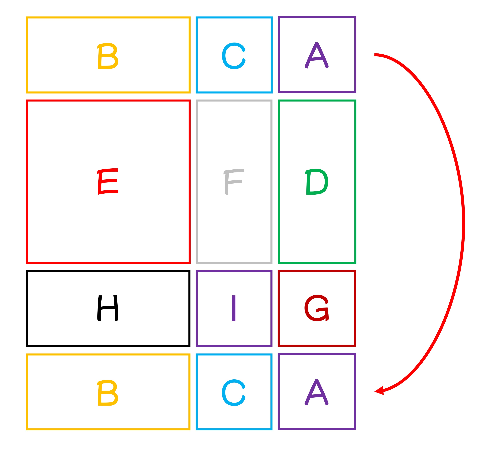
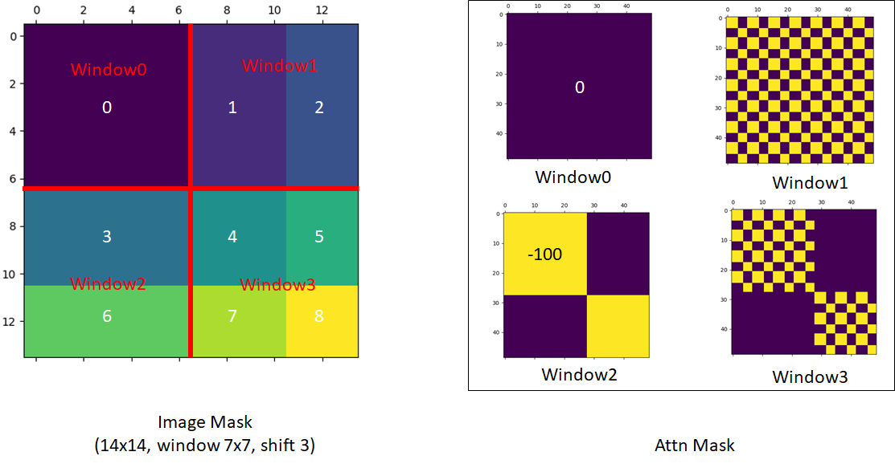
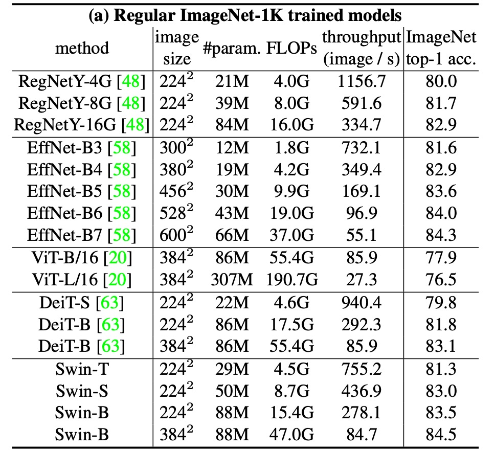
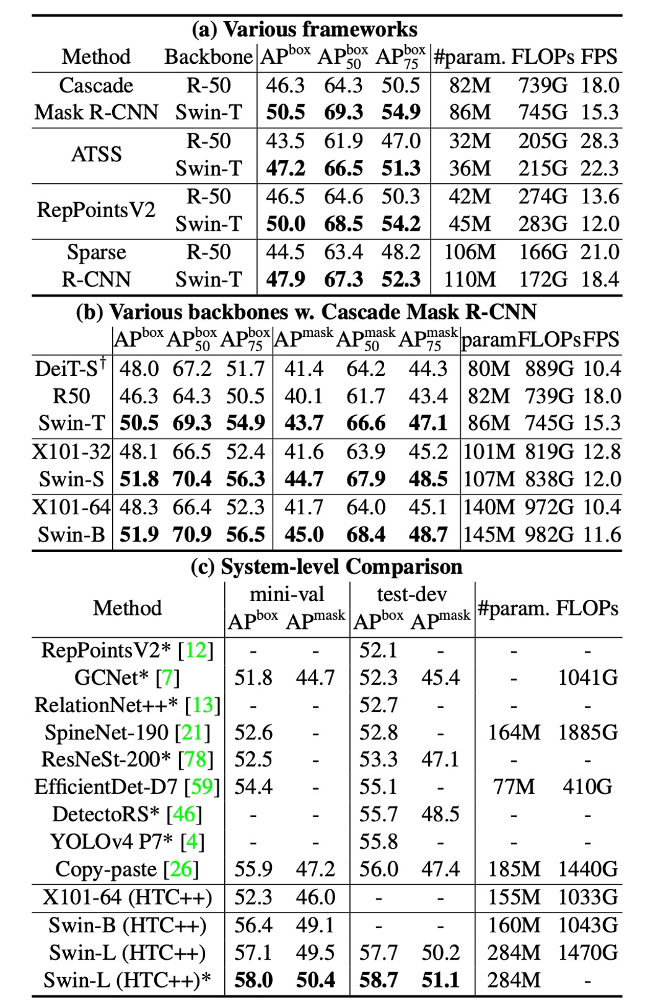
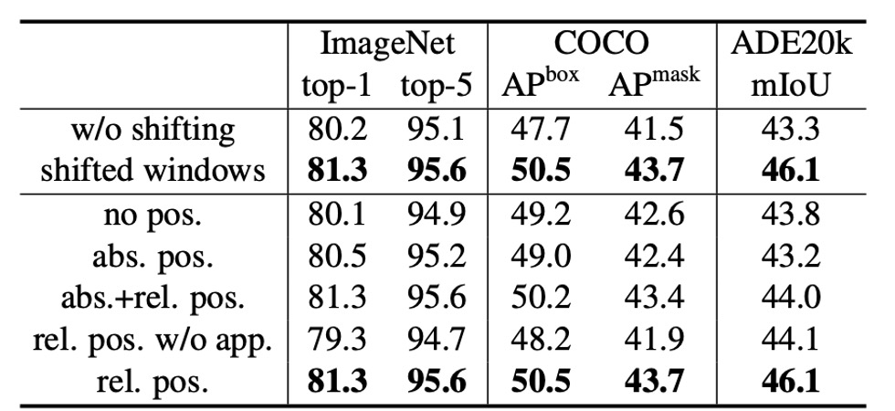

## 舞會開始

[**Swin Transformer: Hierarchical Vision Transformer using Shifted Windows**](https://arxiv.org/abs/2103.14030)

---

同一時期提出的 PVT，同樣是將卷積網路的層級式結構引入 Transformer 中。

- [**[21.02] PVT: 空間縮減注意力機制**](../2102-pvt/index.md)

PVT 使用 SRA 機制（Spatial Reduction Attention）來減少注意力機制的運算量，但這樣的做法並沒有真正解決問題，注意力機制的平方複雜度仍然存在。

## 定義問題

在本論文中，作者要對標的對象還是原始的 ViT 架構，主要存在幾個問題：

### 多尺度偵測能力

大家都知道 ViT 沒辦法用在偵測、分割等任務上，因為 ViT 通常是將輸入打成一堆 16x16 的 patch，然後每一層都是對這些 patch 做自注意力運算，從頭到尾都是在同一尺度上進行，相較於其他架構，ViT 的多尺度偵測能力較為欠缺。

### 平方複雜度

做物件偵測，肯定不會只用 224 x 224 的輸入圖像。

大圖像的輸入會導致注意力機制的計算量變得非常大，舉例來說，原本 224 x 224 的圖像得到的 patch 數量是 14 x 14 = 196；如果是 1536 x 1536 的圖像，patch 數量就會變成 96 x 96 = 9216。用這個數量進行 自注意力運算不是一般人能承受的。這也是為什麼 ViT 在大圖像上的應用受限的原因。

## 解決問題

### 模型架構

為了讓模型可以處理多尺度的問題，首先得採用一個層級式的架構，如上圖（Swin-T 架構）。

輸入一張 H x W x 3 的圖像，使用 4 x 4 的方式切割成 patch，然後將特徵維度投影到 C 維度，這樣就得到了一個 H/4 x W/4 x C 的特徵圖。上圖中的 48 指的是一個 patch 內有 4 x 4 x 3 個像素，然後轉換到 C 維度，這裡的 C 是 96。

:::tip
一般這裡在實作時用一個卷積操作就好了，這裡作者畫的比較詳細，讓我們可以知道更多細節。
:::

接著經過一組 Swin-Transformer blocks，這裡因為模塊存在一組一般的 Transformer blocks，緊接著是一組 Swin blocks，兩兩成對，所以上圖中看到的模塊數量為 2 的倍數。

降採樣的方式採用 patch merging，這裡的 patch merging 是將每個 patch 以 2 x 2 的方式拆成四個 patch，所以如果原本的尺寸是 H x W x C，經過 patch merging 之後就會變成 H/2 x W/2 x 4C。

來看個示意圖：

<figure style={{ "width": "70%"}}>

</figure>

為了控制通道數量，最後作者會在使用 1 x 1 的卷積將通道數量從 4C 調整回 2C。

看完基礎架構後，接著我們來看看 Swin blocks 的細節。

### 滑動視窗

根據論文內容：

- 每個 patch 的尺寸是 4 x 4 pixel，也就是上圖的灰側方形。
- 每個 7 x 7 個 patch 組成一個視窗，這個超參數叫做 M，這裡 M=7。

模型只會在每個視窗上進行自注意力計算，因此每個注意力序列的長度是 49，隨著影像尺寸增加，每個視窗序列長度不變，只有視窗數量增加，計算量最後變成 49 x N。如此一來，就可以將原本的平方複雜度降低為線性複雜度。

**但這樣的設計方式，就造成了視窗之間的訊息無法流通，那怎麼能發揮出 Transformer 的優勢呢？**

於是作者提出了一個 Shifted Window 的概念，如上圖右，每個視窗都「向右下角移動兩格」，組成一組新的視窗，每個視窗內的 patch 就可以在這個步驟中與其他視窗內的 patch 進行交互。

:::tip
這裡我們試著自己畫一張潦草的說明圖，讓大家更容易理解，到底論文中的圖是怎麼從左變成右的：

:::

### 新的問題

使用這個方法會帶來新的問題：

原本有 $N \times N$ 個視窗，在移動過後，變成 $(N+1) \times (N+1)$ 個視窗。另外，視窗大小不一致，計算的時候勢必得使用 padding 操作，這一來一回，豈不就又讓計算量增加了？

這顯然不能被作者接受。

為了解決這個問題，作者提出了一個特殊的遮罩方式。

### 循環移位（Cyclic Shift）

如上圖，這是一個經過移位視窗之後的新的視窗，作者首先將這些視窗進行 cyclic shift，然後再將這些視窗進行拼接，這樣就得到了一個新的視窗。

:::tip
我們完全可以理解你看但這段的困惑，這裡我們再畫一張圖，把九個視窗進行 A 至 I 的編號：

根據論文設定，這裡 shift size 距離為 3，也就是說每個視窗都會向右下角移動 3 格。

我們把它拆解為先向右移動 3 格：

<figure style={{ "width": "50%"}}>

</figure>

再向下移動 3 格，這樣就可以得到新的視窗。

<figure style={{ "width": "50%"}}>

</figure>

合起來一起看，就是論文的圖了：

<figure style={{ "width": "80%"}}>

</figure>

:::

經過了上述的移位方式，我們重新得到完整的 N x N 的視窗，這樣就不必承受多餘的計算量。

但移位之後，每個大視窗內由數個小視窗組成，作者不希望不同小視窗之間進行交互，因此作者在這裡使用了一個遮罩，讓不同小視窗之間無法進行交互。

### 特殊遮罩

:::tip
雖然這一段偏向工程實作，不是這篇論文的主要貢獻，但是我們看到這段時候覺得特別精彩！
:::

這一段的內容比較複雜，我們必須服用作者在 github 上的說明：

- [**Swin-Transformer/issues/38**](https://github.com/microsoft/Swin-Transformer/issues/38)

我們依序來看這個遮罩設計，由於我們在計算的過程中，必須把每個視窗內的 patch 拉直，進行一一對應：

1. 第一個是完整的視窗，因此我們不需要進行注意力遮罩。
2. 第二個視窗，我們參考上面的手繪圖，是 B, H 的區塊。

   :::tip
   這裡拉直後的排列像是 B, B, B,..., B, H, H, ...H，所以注意力遮罩圖會出現完整的遮罩區塊。
   :::

3. 第三個視窗，我們參考上面手繪圖，是 F, D 的區塊。

   :::tip
   這裡拉直後的排列像是 F, F, D, D, D, F, F, D, D, D, F, ...，F 和 D 區塊交錯排列，所以注意力圖會出現網格狀的遮罩區塊。
   :::

4. 第四個視窗，我們參考上面手繪圖，是 I, G, C, A 的區塊。

   :::tip
   這裡就綜合了前面的情況，所以注意力圖會出現網格狀的遮罩區塊和完整的遮罩區塊。
   :::

### 反向移位

經過循環移位和特殊遮罩的設計，作者成功地解決了視窗之間的訊息流通問題，並且保持了線性複雜度。在上述過程算完之後，要進行反向移位，把視窗移回原本的位置，這樣就可以得到完整的特徵圖。

如果沒有做這個步驟，那我們會得到一個不斷往右下角移動的特徵圖，這樣的特徵圖可能會對後續的任務造成困擾。

## 討論

### ImageNet-1K 上的表現

對於影像分類，作者在 ImageNet-1K 上對提出的 Swin Transformer 進行基準測試。

這個數據集包含來自 1,000 個類別的 128 萬張訓練影像和 5 萬張驗證影像，以下是訓練設定：

- **優化器**：AdamW
- **訓練週期**：300 個
- **學習率調度器**：餘弦衰減
- **線性預熱**：20 個週期
- **批量大小**：1024
- **初始學習率**：0.001
- **權重衰減**：0.05
- **增強和正則化策略**：包含大多數的策略，但不包括重複增強和 EMA，因為它們不會提高性能。

---

上表展示了與其他主幹網路的比較，包括使用常規 ImageNet-1K 訓練的基於 Transformer 和基於 ConvNet 的主幹網路。

與先前最先進的基於 Transformer 的架構（如 DeiT）相比，Swin Transformers 有明顯的性能提升。

- **Swin-T (81.3%)** 比 **DeiT-S (79.8%)** 提升了 1.5%。
- **Swin-B (83.3%/84.5%)** 比 **DeiT-B (81.8%/83.1%)** 分別提升了 1.5% 和 1.4%。

與最先進的 ConvNet 架構（如 RegNet 和 EfficientNet）相比，Swin Transformer 在速度與精度權衡方面也略勝一籌。雖然 RegNet 和 EfficientNet 是通過徹底的架構搜尋獲得的，但所提出的 Swin Transformer 是根據標準 Transformer 改編的，並且具有進一步改進的強大潛力。

### 物件偵測-設定

這個架構主要就是為了解決多尺度問題，因此在物件偵測任務上的表現反而更為重要。

物件偵測和實例分割實驗在 COCO 2017 數據集上進行，該數據集包含 118K 訓練影像、5K 驗證影像和 20K 測試開發影像。

對於消融研究，作者考慮了四種典型的物件偵測框架：

1. Cascade Mask R-CNN
2. ATSS
3. RepPoints v2
4. Sparse RCNN

這四個框架使用相同的訓練設定：

- **多尺度訓練**：調整輸入大小，使短邊在 480 到 800 之間，而長邊最多 1333。
- **優化器**：AdamW（初始學習率為 0.0001，權重衰減為 0.05，批量大小為 16）。
- **訓練週期**：3x 調度（36 個週期）。

對於系統層級比較，作者採用改進的 HTC（HTC++），具有以下特點：

- instaboost
- 更強的多尺度訓練
- 6x 調度（72 個週期）
- soft-NMS
- 使用 ImageNet-22K 預訓練模型進行初始化

作者將 Swin Transformer 與標準 ConvNet（如 ResNe(X)t）和先前的 Transformer 網路（如 DeiT）進行比較，透過僅更改主幹網路而其他設定不變來進行公平比較。由於 Swin Transformer 和 ResNe(X)t 具有分層特徵圖，能夠直接應用於上述所有框架，但 DeiT 只產生單一解析度的特徵圖，因此作者使用反卷積層來建構 DeiT 的分層特徵圖。

### Swin vs ResNe(X)t

<figure style={{ "width": "80%"}}>

</figure>

上表 (a) 列出了 Swin-T 和 ResNet-50 在四種物件偵測框架上的結果。

- Swin-T 比 ResNet-50 帶來一致的 +3.4∼4.2 box AP 增益
- 模型尺寸、FLOP 和延遲稍大。

上表 (b) 比較了使用 Cascade Mask RCNN 的不同模型容量下的 Swin Transformer 和 ResNe(X)t。

- Swin Transformer 實現了 51.9 box AP 和 45.0 mask AP 的高檢測精度，相比於具有相似模型大小、FLOPs 和延遲的 ResNeXt101-64x4d，分別提高了 +3.6 box AP 和 +3.3 mask AP。

在使用改進的 HTC 框架的較高基線上，Swin Transformer 取得了 52.3 box AP 和 46.0 mask AP 的結果，相比於先前的 ResNe(X)t 提升了 +4.1 box AP 和 +3.1 mask AP（參見上表 (c)）。

推理速度方面，雖然 ResNe(X)t 使用高度最佳化的 Cudnn 函數構建，而 Swin Transformer 使用的是未完全優化的內建 PyTorch 函數，但優化內核超出了本文的範圍，所以不討論。

### Swin vs DeiT

使用 Cascade Mask R-CNN 框架的 DeiT-S 的效能如上表 (b) 所示。

- Swin-T 的結果比 DeiT-S 高出 +2.5 box AP 和 +2.3 mask AP，模型大小相似（86M vs. 80M），且推理速度顯著更高（15.3 FPS vs. 10.4 FPS）。

DeiT 的推理速度較低主要是由於其輸入影像大小的二次複雜度。

### Swin vs SOTA

表 (c) 將最佳結果與先前最先進模型的結果進行了比較。

- Swin Transformer 在 COCO test-dev 上實現了 58.7 box AP 和 51.1 mask AP，超過了先前的最佳結果 +2.7 box AP（無外部資料）和 +2.6 mask AP（DetectoRS）。

通過這些比較和實驗結果，作者總結：

- Swin Transformer 在多個物件偵測框架中均顯示出顯著優於 ResNe(X)t 和 DeiT 的性能。
- Swin Transformer 在保持相似模型大小和延遲的情況下，顯著提高了物件偵測和實例分割的精度。
- 儘管目前推理速度受到 PyTorch 函數未完全優化的影響，但 Swin Transformer 仍展示了強大的性能潛力。

### 消融實驗

最後，作者詳細介紹了其在影像分類和物件偵測任務中針對 Swin Transformer 進行的消融研究，旨在驗證關鍵設計元素的有效性。

1. **移位視窗 (Shifted Windows)**

   

   作者首先探討了移位視窗的效果。

   實驗表明，使用移位視窗的 Swin-T 模型在各個任務中均優於使用單視窗分區的方法：

   - 在 ImageNet-1K 上，top-1 準確率提高了 1.1%。
   - 在 COCO 上，框 AP 提高了 2.8，掩模 AP 提高了 2.2。
   - 在 ADE20K 上，mIoU 提高了 2.8。

   這些結果顯示了移位視窗在早期圖層中有效建立視窗之間連接的能力。此外，移位視窗帶來的延遲開銷很小。

2. **相對位置偏差 (Relative Position Bias)**

   接下來，作者比較了不同位置嵌入方法的效果。
   結果顯示，具有相對位置偏差的 Swin-T 在各個任務中均顯著優於無位置編碼和絕對位置嵌入的方法：

   - 在 ImageNet-1K 上，top-1 準確率提高了 1.2% 和 0.8%。
   - 在 COCO 上，框 AP 提高了 1.3 和 1.5，掩模 AP 提高了 1.1 和 1.3。
   - 在 ADE20K 上，mIoU 提高了 2.3 和 2.9。

   這表明，相對位置偏差在影像分類、物件偵測和語義分割任務中均具有效性。

3. **不同的自注意力方法 (Different Self-Attention Methods)**

   

   最後，作者比較了不同自注意力計算方法的實際速度。

   結果顯示，循環實現的硬體效率更高，特別是對於更深的階段，為 Swin-T、Swin-S 和 Swin-B 分別帶來了 13%、18% 和 18% 的加速。此外，基於移位視窗構建的自注意力模組比滑動視窗效率高出數倍。

   

   作者還比較了基於移位視窗的 Swin Transformer 與 Performer 的性能，結果顯示 Swin Transformer 稍快，且在 ImageNet-1K 上的 top-1 準確率高出 2.3%。

## 結論

Swin Transformer 是一種創新的視覺 Transformer，其設計產生了分層特徵表示，並且計算複雜度相對於輸入影像大小呈線性增長。在 COCO 目標檢測和 ADE20K 語義分割任務中，Swin Transformer 展現了最先進的性能，顯著超越了先前的最佳方法。

最後，作者指出 Swin Transformer 的關鍵是移位視窗的操作，他期待這個設計也可以在後續的 NLP 領域中得到應用，成為一個通用的 Transformer 模型。

:::tip
這篇論文我們前後讀了約五次，既然我們不夠聰明，那就只能努力多讀幾次......

這篇論文非常精彩，我們建議大家可以找來原文，花時間仔細閱讀。
:::
