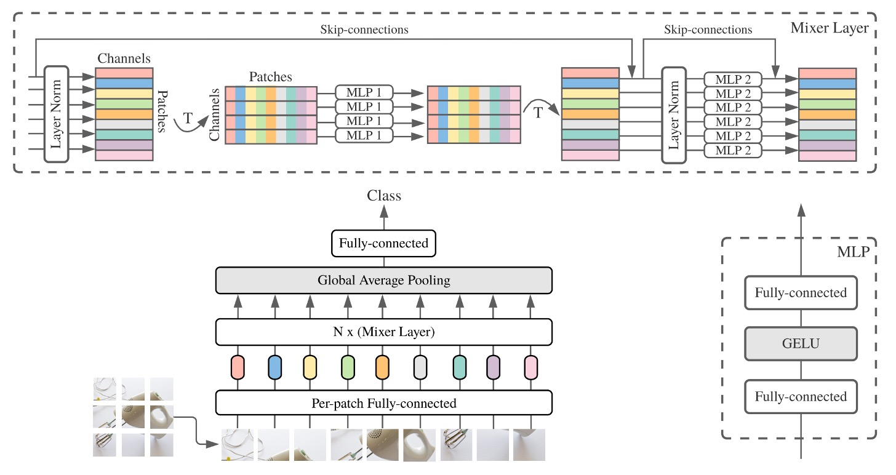
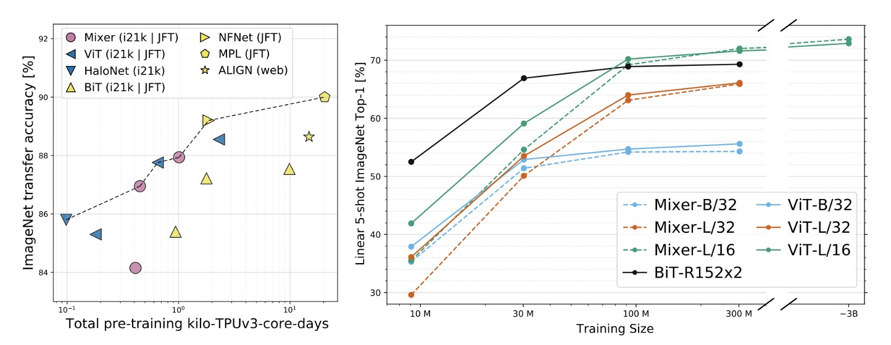

# [21.05] MLP-Mixer

## 少虧就是賺

[**MLP-Mixer: An all-MLP Architecture for Vision**](https://arxiv.org/abs/2105.01601)

---

在 Transformer 被引入電腦視覺的領域之後，許多研究開始探索如何讓每個 Patch 間的資訊交換更有效率。

為此，一個新的名詞應運而生：「Token-Mixer」。

顧名思義，Token-Mixer 的目的是將不同的 Patch 之間的資訊進行混合，以提升模型的性能。

傳統的自注意力機制，就是其中一種 Token-Mixer 的實現方式。

然而，在原始的注意力機制中，由於計算複雜度極高，因此學術界開始尋找替代方案。

MLP-Mixer 便是其中之一。

:::tip
Token-Mixer 是後來論文歸納出來的名詞，並非本篇論文提出的專有名詞。
:::

## 定義問題

作者認為：自注意力的複雜度太高了，不如我們把它整個敲掉吧！

至於敲掉之後要怎麼辦呢？

嘿！你看，路邊不是有個簡單的全連接層嗎？拿來用啊！

~然後這篇論文就講完了。~（並沒有！）

## 解決問題

### 模型架構



作者在本篇論文中提出使用兩個階段的全連接層，也就是 MLP（多層感知器），來進行資訊交換。

上面這張圖可能不好懂，沒關係，讓我們按步驟來：

1. 輸入一張 3 x 224 x 224 的影像，將其切割成 16 x 16 的 Patchs，維度我們假設用 512。

   - 尺寸變化：[B x 3 x 224 x 224] -> [B x 512 x 14 x 14]。

2. 轉換成 Transformer 輸入。

   - 尺寸變化：[B x 512 x 14 x 14] -> [B x 512 x 196]。

3. 第一階段：交換 Patch 之間的資訊。

   ```python
   import torch.nn as nn

   patch_mixer = nn.Linear(196, 196)

   # 輸入維度：x = [B x 512 x 196]
   x_mix_patch = patch_mixer(x)

   # skip connection
    x = x + x_mix_patch
   ```

4. 第二階段：交換 Channel 之間的資訊。

   ```python
   import torch.nn as nn

   channel_mixer = nn.Linear(512, 512)

   # 輸入維度：x = [B x 512 x 196]
   # 先 Reshape -> [B x 196 x 512]
   x_mix_channel = x.permute(0, 2, 1)
   x_mix_channel = channel_mixer(x_mix_channel)

   # Reshape 回來
   x_mix_channel = x_mix_channel.permute(0, 2, 1)

   # skip connection
   x = x + x_mix_channel
   ```

到這邊就完成了一次 MLP-Mixer 的運算。

你會發現在上面的流程中，第二階段和原本的自注意力機制是一樣的，原本的自注意力機制也會有一個 MLP 的運算。

不一樣的地方就是在第一階段，原本要算的是 Patch 自注意力圖，現在直接用全連接層來算。

### 討論

### ImageNet 上的性能




- 「ImNet」和「ReaL」欄位：分別代表原始 ImageNet 驗證集和清理後的 ReaL 標籤集的結果。

- Avg 5：表示五個下游任務（ImageNet、CIFAR-10、CIFAR-100、Pets、Flowers）的平均效能。

---

在 ImageNet-21k 上預訓練並進行額外正則化時，MLP-Mixer 在 ImageNet 上達到 84.15% 的 top-1 準確率，表現強勁但略遜於其他模型。沒有正則化時，Mixer 容易過度擬合，這與 ViT 的觀察結果一致。

當在 ImageNet 上從隨機初始化訓練 MLP-Mixer 時，Mixer-B/16 在解析度 224 下取得 76.4% 的分數，與普通 ResNet50 類似，但低於其他最先進的 CNN/混合模型，例如 84.7% 的 BotNet 和 86.5% 的 NFNet。

當上游資料集大小增加時，MLP-Mixer 的效能顯著提高。

Mixer-H/14 在 ImageNet 上實現了 87.94% 的 top-1 準確率，比 BiT-ResNet152x4 提高了 0.5%，僅比 ViT-H/14 低 0.5%。Mixer-H/14 的運行速度比 ViT-H/14 快 2.5 倍，幾乎是 BiT 的兩倍。

在精度計算權衡方面，Mixer 與更傳統的神經網路架構具有競爭力。跨架構類別的總預訓練成本與下游準確性之間存在明顯的相關性。

### 可視化分析


人們普遍觀察到，CNN 的第一層傾向於學習類似 Gabor 的偵測器，作用於影像局部區域的像素。

相較之下，MLP-Mixer 允許在 Token 資訊在 MLP 中進行全域資訊交換，這就引出了一個問題：

- 它是否以類似的方式處理資訊？

為了回答這個問題，作者將 MLP-Mixer 的不同層的特徵視覺化，可以看到不同層次的特徵提取。

在上圖中，從左到右分別是 MLP-Mixer 的第一層，第二層和第三層，我們可以看到：

- 一些學習到的特徵對整個圖像起作用，而另一些則對較小的區域起作用。
- 更深的層似乎沒有清晰可辨的結構。
- 與 CNN 類似，其中有許多對具有相反相位的特徵偵測器。

## 結論

少虧就是賺！

比起原本的自注意力機制，MLP-Mixer 降低了大量的計算，就算效果稍差，也是很有市場！
