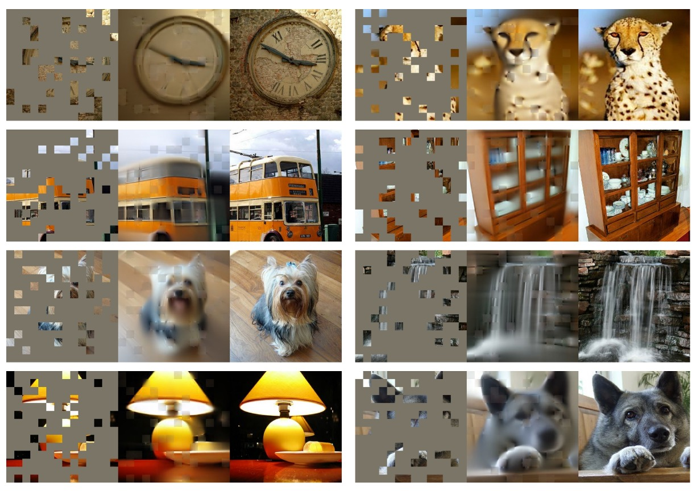
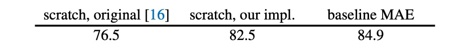
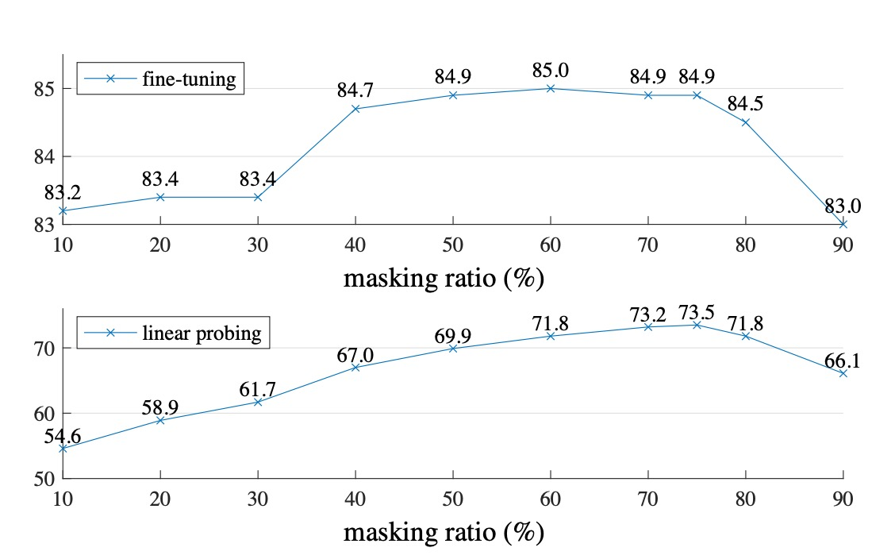

## 四分之一的線索

[**Masked Autoencoders Are Scalable Vision Learners**](https://arxiv.org/abs/2111.06377)

---

在 NLP 領域中，最有名的預訓練方式就是 Mask LM。簡單來說就是把輸入資料遮住 15% 的 token，然後讓模型去預測遮住的 token 內容。這個經典的學習範式造就了許多優秀的模型，例如 BERT、RoBERTa、ALBERT 等。

那麽影像呢？

為什麼視覺領域沒有類似的預訓練方式呢？

## 定義問題

ViT 在提出的時候就已經做過類似的實驗了。

- [**[20.10] ViT: 新世界拓荒者**](../2010-vit/index.md)

在論文中，作者仿造了 Mask LM 的方式，把圖像中的一部分遮住，然後讓模型去預測遮住的部分。此外，還額外探討了預測方式為像素或是區域的差異。

結論是：都不好。

不管是那一種自監督的訓練方式，都不如直接用監督的方式來得好。

---

本篇論文的作者認為主要幾個問題在於：**語言和視覺的訊息密度不同！**

語言是人類生成的訊號，具有高度語意和資訊密度。當訓練模型僅預測每個句子中的幾個缺失單字時，此任務似乎會引發複雜的語言理解。相反，影像是具有大量空間冗餘的自然訊號，模型可以從鄰近的 patch 中恢復遺失的資訊，而無需對零件、物件和場景進行高級理解。

對模型來說，它只需隨便從附近找一些 patch 進行插值，就能恢復大部分的資訊，完全沒有努力學習的動機。自然地，最後的效果就不如預期。

## 解決問題

為了克服這種差異，作者乾脆就直接封鎖大部分的 patch，也不多，就 75% 吧！

### 模型架構

和原本在 ViT 論文中所討論到的架構不同，這裡做了一些改變。

在一開始的時候和之前一樣，把圖片切分成一個個 patch，然後隨機遮住其中的一部分。為了避免中心偏差，遮住的 patch 由隨機抽樣的方式進行。

- **Encoder**

  從這裡開始不同。

  被遮住的 patch 在送入 Encoder 模型之後，不參與訓練，也不計算損失。模型只針對沒有被遮住的 patch 進行訓練。

  這種方式的優點是可以只消耗一小部分的計算資源，來計算很大的模型。當真正在推論的時候，移除所有遮罩，就可以得到完整的模型能力。

- **Decoder**

  這裡是額外引入輔助訓練的 Decoder 模型。這裡的輸入是「完整的」影像序列，包含被遮住的 patch。被遮住的 patch 內只有位置資訊，沒有其他任何內容。

  模型的目標就是預測被遮住的 patch，最後與原始影像進行比對，計算損失。

  在預訓練結束之後，這一整個模組都可以捨棄，只保留 Encoder 部分。

### 訓練方式

MAE 透過預測每個 mask patch 的像素值來重建輸入。Decoder 的最後一層是線性投影，其輸出通道的數量等於補丁中像素值的數量。

損失函數為計算像素空間中重建影像和原始影像之間的均方誤差（MSE）。這裡只針對被遮住的 patch 進行訓練，而不是整個影像。

論文的作者怕讀者不能理解，所以在論文中有放上大量的示意圖，我們擷取一張圖片如下：

最左邊是輸入帶有遮罩的影像，中間是 Decoder 的輸出，最右邊是原始影像。

## 討論

作者首先優化了 ViT 的訓練方式，從原本的 76.5% 的 top-1 accuracy 提升到 82.5%，作為模型的基準。

MAE 的操作讓模型在這個基準上，再進一步提升到 84.9%，其效果之好，簡直不可理喻。

### 要遮蓋多少才好？

作者針對兩種情境進行實驗，分別是 Fine-tuning 和 Linear-probing。

:::tip
差別在於 Fine-tuning 是直接在預訓練模型上進行微調，而 Linear-probing 則是凍結預訓練模型，只訓練最後的分類器。
:::

從上圖中可以看到，當遮蓋的比例高於 80% 時，效果就會開始下降。在 40% 到 80% 之間，效果最好。最後作者根據 Linear-probing 的實驗結果選擇了 75% 的遮罩比例。

特別要注意的是，如果在 Encoder 階段輸入遮罩的 patch，效果會變得非常差（降低 14%），這是因為這種方式會讓模型訓練與部署的方式不一致，而阻礙了模型的學習。

### Decoder 參數

作者進一步探討了 Decoder 的參數對最終效果的影響。

實驗結果顯示，Decoder 的深度為 8 時效果最好，而 Decoder 的寬度可以不用和 Encoder 一致（dim=1024），只需要 1/2 左右的寬度就可以了。

### 學習目標

這篇論文的結果都是基於重建原始像素，但作者也探討了其他的學習目標。例如預測 PCA 主成分、預測 dVAE 的潛在變數等。

這些結果都不如重建原始像素的效果好，但是也有一些有趣的發現，像是預測標準化的像素值，效果也不錯。

### 影像增強

作者嘗試在訓練過程中加入影像增強，例如隨機裁剪、隨機旋轉等。結果顯示根本不需要這些，模型在原始的影像上就能夠取得最好的效果。

這和對比學習的相關方法有非常明顯的差異，在對比學習中非常依賴影像增強，像是 BYOL 和 SimCLR，若沒有這些增強，效果會大幅下降。

- [**[20.02] A Simple Framework for Contrastive Learning of Visual Representations**](https://arxiv.org/abs/2002.05709)
- [**[20.06] Bootstrap your own latent: A new approach to self-supervised Learning**](https://arxiv.org/abs/2006.07733)

### 遮罩方式

除了論文中提出的遮罩方式，作者測試了幾種不同的遮罩方式。

- random: 隨機遮罩
- block: 以 block 的方式遮罩
- grid: 以 grid 的方式遮罩

差別如下圖：

實驗結果顯示，使用 block 的方式在 50% 的遮罩比例下效果良好，但是在 75% 的遮罩比例下效果就不如 random 的方式。而 random 的方式可以最大程度地進行遮罩，加入模型訓練，同時也提供最好的效果。

### 在 ImageNet 上的效果

1. **自監督方法的比較**：

   - 對於 ViT-B 模型，不同方法之間的表現差異不大。
   - 對於 ViT-L 模型，方法之間的差距更大，這顯示出在更大模型中，減少過度擬合是一個挑戰。
   - MAE 方法具有良好的可擴展性，能夠在更大的模型上穩定地提高準確度。
   - 使用 ViT-H 模型（224 尺寸），MAE 方法達到 86.9% 的準確率；在調整尺寸至 448 後，僅使用 IN1K 數據就能將準確率提升至 87.8%。

2. **與先進方法的比較**：

   - 在僅使用 IN1K 資料的所有方法中，MAE 方法的準確率超越了先前基於先進網路的最佳準確率（87.1%）。
   - MAE 相較於 BEiT 模型更準確，同時操作更簡單且訓練速度更快（每個 epoch 提速 3.5 倍），且不需要 dVAE 預訓練。

MAE 模型經過 1600 個 epoch 的預訓練來提升準確性，同時總預訓練時間仍少於其他方法。在與監督預訓練的比較中，MAE 方法幫助擴大了模型的規模，並顯示出比監督訓練更好的效果。

## 結論

在影像處理中，光信號並不像文字那樣具有明確的語義分解，而 MAE 能夠生成精細的圖像重建，這表明它已經捕捉到了許多重要的視覺概念。

這與 NLP 領域的成功經驗相似，我們可以看到視覺領域正在用不一樣的方式，走上類似的發展軌跡。

後續有許多研究都借鑒了這個思路，在訓練過程中加入 MAE 的方式，來提升模型的效果。之後有看到我們再來分享這些相關的研究。
