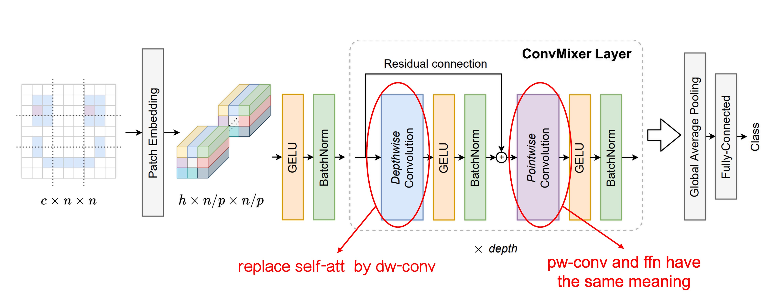
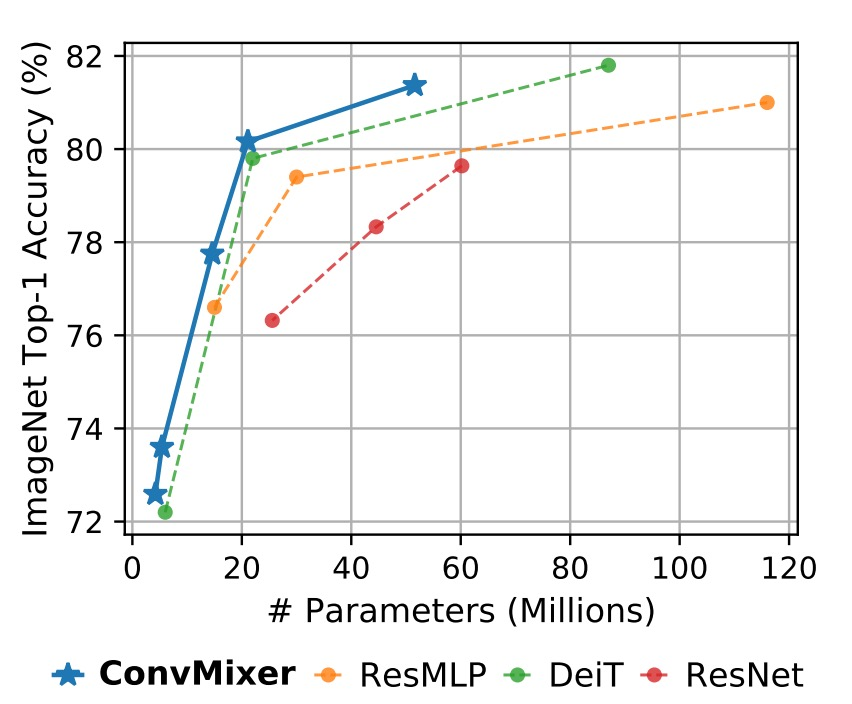

## 卷積混合器

[**Patches Are All You Need?**](https://arxiv.org/abs/2201.09792)

---

這幾年常看到 **「XXX is all you need」** 的標題。

看到這種標題，我們就忍不住想來看看，這次又怎麼了。

## 定義問題

在 ViT 提出後的近幾年，大家都想知道為什麼 Transformer 可以這麼厲害。到底是因為自注意力機制？還是因為 Token-Mixer 的機制？還是因為整個架構的設計？

在這篇論文中，作者想探討 ViT 的強大是否來自於 Patchify 的機制。於是，他們提出了 ConvMixer，目的在移除自注意力機制的影響，如果在這種的情況下，模型的性能仍然能夠保持，那麼就可以證明 Patchify 的機制「在某種程度上」是非常重要的。

## 解決問題

### 模型架構

這裡作者對原本的 ViT 架構進行改動，主要差異有兩個：

1. **將原本的 Self-Attention 模組替換成了 Convolution 模組。**

   如上圖，我們對改動的地方進行額外的標示。

   一開始的 Patchify 過程保持不變，但是在 Token-Mixer 的部分，作者將原本的 Self-Attention 模組替換成了 Depthwise Convolution。

   這樣的改動讓原本每個 Token 都可以看到其他所有的 Token，變成了每個 Token 只能看到自己「附近」的 Token（取決於卷積核的大小）。如此一來，自注意力機制就不見了，可以藉此來觀察 Patchify 的機制對於模型性能的影響。

2. **將原本的 MLP 替換成了 Pointwise Convolution。**

   這個改動其實沒改，因為 Pointwise Convolution 就是 MLP。

   會特別寫出來是因為這些操作都可以通過卷積來實現，在卷積上「針對影像通道」所做的全連接層的操作，在名稱上就叫做 Pointwise Convolution。

### 訓練策略

作者沒有引入額外的訓練資料，而是直接使用 ImageNet 進行訓練。

訓練配置和其他模型差不多，使用 RandomAug、MixUp 等方法進行訓練。優化器使用 AdamW，但 Epoch 數量比較少，這部分根據論文所描述，是因為算力不足。

### 模型參數設計

ConvMixer 模型的設計參數主要有以下四個：

1. **寬度（hidden dimension, h）**：即補丁嵌入的維度，也稱為模型的隱藏維度。

2. **深度（depth, d）**：ConvMixer 層的重複次數，表示模型的深度。

3. **補丁大小（patch size, p）**：控制模型內部解析度的參數。這個參數決定了輸入圖像在進行卷積時的初始劃分大小。

4. **內核大小（kernel size, k）**：深度卷積層的內核大小，影響卷積操作的範圍。

ConvMixer 模型通常依照其隱藏維度和深度來命名，例如 ConvMixer-h/d。此外，ConvMixer 支援可變大小的輸入，內部解析度則是由原始輸入大小 n 除以補丁大小 p 決定的。

## 討論

### 在 ImageNet 上的表現

:::tip
因為較小的 patch 尺寸，因此 ConvMixer 的推理速度明顯慢於其他競爭對手。
:::

ConvMixer-1536/20 的性能優於 ResNet-152，即使其參數數量少得多。ConvMixer-768/32 在僅使用 ResNet-152 三分之一參數的情況下，也能達到類似的準確性。

ConvMixer-1536/20 儘管其參數數量相對較少，但準確性超過了 ResMLP-B24，且與 DeiT-B 的性能相當，展示了在參數數量上的高效性。相比之下，DeiT 和 ResMLP 的結果涉及超參數調整，而 ConvMixer 的結果則未進行任何超參數調整。

## 結論

這篇文章中提出了 ConvMixer 來弱化自注意力機制的影響，用於探索 Patchify 的機制。

實驗結果顯示：把自注意力機制拔掉之後，模型性能仍然能夠保持，於是作者做了兩個總結：

1. Patchify 的機制確實是重要的。
2. ConvMixer 的操作簡單，性能優秀，也是個值得推薦的操作。

:::tip
根據實驗結果，我們比較認同：「自注意力機制非必要」的結論，至於「Patchify」的部分實在太過於簡單，無法再簡化了。

大家都知道所謂的 「Patchify」，不過就是一層 Linear 操作，這其實跟 NLP 任務中常用的 `nn.Embedding` 操作是一樣的。在 NLP 中，我們很少會看到有人說 `nn.Embedding` 是一個很厲害的操作，反而大部分的精力會放在如何設計 `Tokenizier`，是要用 BPE 還是 WordPiece 之類的方式，把語言切割成更「高效」的 Token。

所以以這篇論文的標題來看，我們會期待看到的是一個「神奇的 Patchify」操作，可以在基於同樣的 Transformer 架構下，大幅提升模型的性能。

這時候或許我就可以說：「A good patchify is all you need」。

但這時候就又會陷入另一個兩難：

我們為了捨棄卷積網路的歸納偏差，引入了 Transformer，但卻又回過頭去幫這個更「強大」的結構加上更多的操作，彷彿我們也不信任這個「強大」的結構能夠自己解決問題。

哎呀，這個題目還真是折磨人啊！
:::
