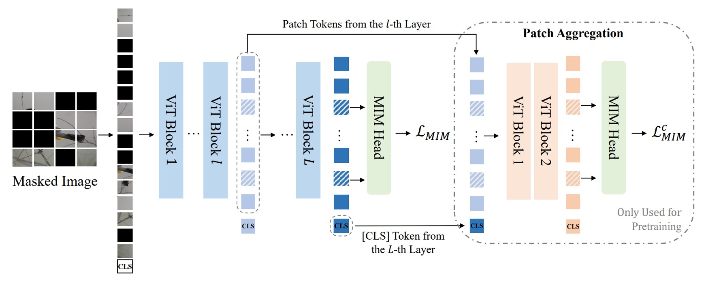
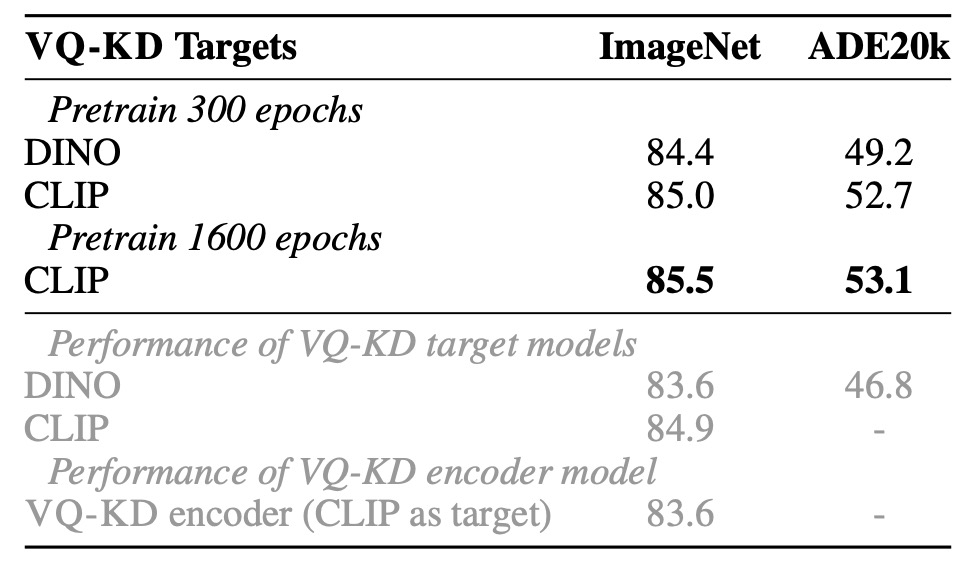

## 藏在高維度的密碼

[**BEiT v2: Masked Image Modeling with Vector-Quantized Visual Tokenizers**](https://arxiv.org/abs/2208.06366)

---

還記得 BEiT 嗎？

如果忘記了，我們趕快複習一下，不然這篇論文沒辦法看了：

<figure style={{"width": "80%"}}>

</figure>

BEiT 的核心概念是把影像轉成一組離散的視覺特徵（共有 8192 個），在這裡同時存在兩個架構，如上圖所示。

第一個架構是類似 VAE 的結構，在圖中的上半部，這部分是前人研究的結果，不參與訓練，只是用來將圖像轉換成一組離散的視覺特徵。整體概念比較像是訓練一個「圖像字典」，分別對應了圖像不同的抽象概念。

第二個架構就是下半部，也就是真正參與梯度更新的模型，這裡引入了 BERT 的 MLM 機制，對影像區塊進行遮罩重建，也因為是遮蓋影像區塊，所以又稱為 Masked Image Modeling（MIM）。

:::tip
如果你對 BEiT 的細節感興趣，可以參考我們之前的筆記：

- [**[21.06] BEiT: 離散編碼預訓練**](../2106-beit/index.md)
  :::

## 定義問題

說到 MIM，在最近這幾年最有名的大概就是 MAE 了。

MAE 認為影像資訊存在大量的冗餘，因此只有遮蔽一點區域是無法讓模型學到有用的資訊的。在 MAE 的方法中，採用遮蔽 50% ~ 75% 像素的圖像重建策略，以提升模型學習的難度。

實驗結果確實很好，蔚為風潮。

:::tip
如果你想多了解一點 MAE，可以看這篇：

- [**[21.11] MAE: 四分之一的線索**](../2111-mae/index.md)
  :::

但是 MAE 說到底也只是專注於「低層次」的像素重建，忽略了「高層次」的語義信息，導致表徵學習的語義能力不足。

那什麼是「高層次」的語義信息呢？

作者認為 BEiT 所提出的視覺單元（visual token）就是一個脫離像素的「更高層次」的抽象概念，所以基於 BEiT 的成果，這次就想點辦法來讓模型學習到更豐富的語意訊息。

## 解決問題

### 模型架構

這個架構作者稱為：向量量化知識蒸餾（Vector-Quantized Knowledge Distillation），簡稱 VQ-KD。

突然間噴出一堆名詞，讓人措手不及，我們跟著上圖一步一步來看看。

- **步驟 1：計算影像特徵**

  首先，將輸入影像 $x \in \mathbb{R}^{H \times W \times C}$ 分割為 $N = \frac{HW}{P^2}$ 個影像區塊（patch）。

  假設影像為 $224 \times 224$，且每個 patch 大小為 $16 \times 16$，則有 $14 \times 14 = 196$ 個 patch，即 $N=196$。每個 patch 攤平後透過 ViT 編碼器得到向量表示 $h_i$，其中 $i=1,2,\dots,N$。

  因此，我們有一組向量 $\{h_i\}_{i=1}^N$，每個 $h_i$ 對應一個影像區塊。

  到這裡，和 BEiT 的第一代沒有太大區別。

---

- **步驟 2：拿特徵去查詢代碼表**

  從這裡開始不一樣，在第一代 BEiT 中，作者直接採用 DALL-E 產出的視覺單元。

  第二代的架構則是直接設定一個代碼表（codebook） $V \in \mathbb{R}^{K \times D}$，其中包含 $K$ 個代碼向量 $\{v_j\}_{j=1}^K$，每個 $v_j$ 是 $D$ 維向量。

  要將 $h_i$ 對應到一個代碼 $v_{z_i}$，作者使用下式尋找最相似的代碼索引 $z_i$：

  $$
  z_i = \arg\min_j \| \ell_2(h_i) - \ell_2(v_j) \|^2,
  $$

  L2 正規化意思是把向量 $h_i$ 投影到單位球面上，找出和 $h_i$ 最相似的代碼 $v_j$，這個方式可以比較向量的方向而不是長度。

  這個步驟就是「向量量化」的過程，將連續的特徵向量轉換為離散的代碼。

---

- **步驟 3：對齊教師模型，進行知識蒸餾**

  選定代碼 $v_{z_i}$ 後，將其 L2 正規化的向量 $\ell_2(v_{z_i})$ 輸入至一個 decoder（也是 Transformer 架構）。

  decoder 的輸出為 $o_i$，希望透過對齊「教師模型」（例如 CLIP）給定的語意特徵 $t_i$ 來學習高階語意。

  訓練時，我們希望最大化 $o_i$ 與 $t_i$ 的 cosine 相似度，以此引導 decoder 產生有語意品質的表示。

  這個步驟就是「知識蒸餾」的過程，讓模型學習到更豐富的語意資訊。

---

簡單來說，decoder 接收代碼向量後，輸出 $o_i$，並嘗試讓 $\cos(o_i, t_i)$ 愈大愈好（表示 $o_i$ 與 $t_i$ 越相似）。

在量化過程（arg min 選取代碼）中，無法直接對 $z_i$ 微分。作者透過下述方法解決：

- 利用 stop-gradient（記為 $sg[\cdot]$）操作，停止梯度在特定路徑傳遞。
- 將 decoder 的輸入梯度「直通」（straight-through）回傳給 encoder，使得 encoder 和 codebook 都能更新。

VQ-KD 的整體訓練目標為：

$$
\max_{\{v_j\}} \sum_{x \in D} \sum_{i=1}^{N} \cos(o_i, t_i) - \| sg[\ell_2(h_i)] - \ell_2(v_{z_i}) \|_2^2 - \|\ell_2(h_i) - sg[\ell_2(v_{z_i})]\|_2^2,
$$

這個目標函數包含三個部分：

- $\cos(o_i, t_i)$：最大化 decoder 輸出與教師特徵的相似度，使代碼具有高語意資訊。
- $\| sg[\ell_2(h_i)] - \ell_2(v_{z_i}) \|_2^2$：讓 codebook 中選出的代碼 $v_{z_i}$ 靠近 encoder 輸出 $h_i$（但 $h_i$ 不回傳梯度給 $v_{z_i}$）。
- $\|\ell_2(h_i) - sg[\ell_2(v_{z_i})]\|_2^2$：讓 encoder 的輸出 $h_i$ 靠近選出的代碼 $v_{z_i}$（代碼不接收來自該項的梯度）。

藉由 stop-gradient，分別引導 encoder 和 codebook 往互相接近的方向調整，最終達到一個語意分佈良好的 codebook。

在訓練中，一個常見問題是 codebook 中只有少量代碼被頻繁使用，其他代碼則「閒置」。

為解決此問題，作者採用以下策略：

- 使用 L2 正規化計算距離，有助於平衡各代碼的使用率。
- 將 codebook 向量維度降低至 32 維，再映射回高維度空間，有助減少某些代碼被過度集中使用的問題。
- 使用指數移動平均（Exponential Moving Average, EMA）來更新代碼，使更新更平穩、多樣。

透過上述步驟與技巧，VQ-KD 讓視覺分詞器學會使用一組離散代碼來表示影像，在保留影像語意資訊的同時，實現了從連續特徵到高語意離散表徵的轉換。

### 預訓練方法

完成 VQ-KD 後，表示視覺分詞器已經學會使用離散代碼來表示影像，接下來就是要利用這些代碼進行 MIM 預訓練。

將輸入影像 $x$ 的約 40% patch 隨機遮蔽（masked）。遮蔽後，對被遮蔽位置 $M$ 使用相同的可學習嵌入向量 $e[M]$ 取代原本的 patch 嵌入 $e_{p_i}$。

在上圖中，藍色的部分其實就是第一代 BEiT 的 MIM 預訓練過程，連遮罩的比例都是一樣的。預測時使用一個簡單的全連接層（MIM head）預測視覺代碼，其中視覺代碼 $z_i$ 由前面訓練好的視覺分詞器提供，即 $z_i$ 是原圖中對應 patch 的離散代碼。

MIM 的訓練損失為：

$$
L_{\text{MIM}} = -\sum_{x \in D} \sum_{i \in M} \log p(z_i | x_i^M)
$$

此處 $D$ 為預訓練使用的影像資料集。

### 全域表徵預訓練

原文是 Global Representation Pretraining。

上圖中，`Path Aggregation` 的部分是這次 BEiT v2 的新設計。

為了能夠讓監督資訊可以深入到全域的視覺分詞器中，作者提出了一個新的設計，稱為「全域表徵預訓練」。

方法是在視覺分詞器的最後一層加入一個 Transformer 解碼器，將 [CLS] 與中間某層的 patch 特徵拼接，再輸入一個淺層 Transformer 解碼器，對被遮蔽的 patch 進行預測。

這裡的 decoder 與原本的 MIM head 參數共享，損失計算方式如同上式的 MIM 損失，記為 $L_{c}^{\text{MIM}}$，因此最終的預訓練損失為原本 MIM loss 與此淺層 decoder MIM loss 的和：

$$
L_{\text{total}} = L_{\text{MIM}} + L^{c}_{\text{MIM}}
$$

訓練完成後，該淺層 decoder 將被丟棄，只保留已具全域特徵能力的 [CLS] token。

### 模型配置

- **視覺分詞器 (Visual Tokenizer)**

  為了進行 BEIT V2 的 base- (B) 與 large- (L) 規模預訓練，視覺分詞器的架構採用 ViT-B/16。decoder 採用三層的 Transformer，與 tokenizer encoder 有相同維度與注意力頭數。

  教師模型為 OpenAI CLIP-B/16，並在 ImageNet-1K（解析度為 224×224）上訓練 VQ-KD。無論後續是預訓練 base-size 或 large-size 模型，都使用同一個 base-size 的教師來訓練分詞器。

  Codebook 大小 $K=8192$，代碼維度 $D=32$。

  :::tip
  其他細節可以翻閱論文附錄 D。
  :::

- **Masked Image Modeling 設定**

  與 BEiT 相同，作者在無標註的 ImageNet-1K 上進行自我監督式預訓練，輸入影像解析度為 $224 \times 224$。

  模型採用 ViT-B/16 與 ViT-L/16 為骨幹架構 ($16 \times 16$ patch)。在 patch aggregation 策略中，對 ViT-B/16 設置 $l=9$，對 ViT-L/16 設置 $l=21$，並以 2 層深度為預設值。遮蔽比例為 40%（約 75 個 patch），遮蔽策略為 block-wise masking。

  :::tip
  其他細節可以翻閱論文附錄 E。
  :::

## 討論

### 與其他方法的比較

<figure style={{"width": "80%"}}>

</figure>

首先是 fine-tuning 的結果，作者將 BEiT v2 與 BEiT、CAE、SplitMask、PeCo、MVP 進行比較，結果顯示 BEiT v2 在 ImageNet-1K 上的 top-1 精度遠高於其他方法。

如果增加預訓練週期，BEiT v2 的 top-1 精度可以進一步提升，達到 85.5%，這是自監督方法的新紀錄。對於 ViT-L/16，300 epochs 時達到 86.6%，並且更長的預訓練可提升至 87.3%。

上表中最後一個欄位是作者在 ADE20K (Zhou et al., 2019) 資料集上進行實驗，該資料集含有 25K 張影像與 150 個語意類別。使用 UperNet (Xiao et al., 2018) 作為任務層，並在 $512 \times 512$ 的輸入解析度下微調 160K iterations。

結果顯示，BEIT V2 在 ADE20K 上顯著超越先前自我監督方法，以 ViT-L/16 模型為例，可達到 mIoU 為 56.7，創下 MIM 方法的新紀錄。

### 消融實驗－codebook 大小

上表呈現 VQ-KD 在不同架構與 codebook 大小下的影響。

實驗以不含 patch aggregation 的 ViT-B/16（預訓練 300 epochs）為基準。

結果顯示：

- 較深的 decoder 雖然重建效果更好，但 codebook 使用率降低，下游任務表現也較差。
- 降低 codebook 查找時的維度有助提升 codebook 的利用率。

### 消融實驗－patch aggregation 策略

<figure style={{"width": "80%"}}>

</figure>

接著作者對 patch aggregation 策略的消融實驗，結果顯示：

- 使用較淺的 head（1 或 2 層）比使用較深的 head（3 層）表現更佳，表示淺層 head 更傾向於利用輸入的 [CLS] token。
- 有應用此策略的模型，表現優於無此策略的基準模型，特別在 linear probing 有較大提升，顯示其增強了影像層級表徵。
- 在此策略下共用 MIM head 有助於提升下游任務表現。

### 消融實驗－教師目標分析

<figure style={{"width": "80%"}}>

</figure>

作者比較在 DINO 與 CLIP 教師下訓練的 VQ-KD 效果：

- DINO 作為教師時，BEIT V2 在 ImageNet 上達 84.4%，ADE20K 上達 49.2%，皆遠優於原 DINO 模型。
- CLIP 作為教師時，BEIT V2 同樣持續提升，顯示 VQ-KD 的可擴展性。

上表中的灰字，代表的是直接在 ImageNet 上微調 VQ-KD encoder，可以發現其遷移能力不及教師模型。然而，在加入 MIM 預訓練後，模型可超越教師和 tokenizer encoder，證實此自我監督學習方法的優勢。

### Codebook 視覺化

最後，我們看一下 codebook 的視覺化結果。

作者使用 VQ-KD 計算 ImageNet-1k 驗證集的離散代碼，將擁有相同代碼的影像 patch 群集在一起。可以看到同一個代碼下的 patch 具有相似的語意特徵，例如代碼 7856 對應的 patch 都與「眼睛」相關，包括人、貓、狗、魚、蛇的眼睛。

## 結論

Codebook 是個非常吸引人的概念。

從目前的研究趨勢來看，Codebook 不僅可用於影像分詞，協助訓練更高品質的視覺分詞器與 MIM 預訓練，也被視為橋接多模態領域的有力方法之一。另外，以離散代碼作為中介，模型可直接從大量未標註的資料中萃取語意特徵，降低對大規模人工標註的依賴，那些缺乏標註資料的領域或許可以透過 Codebook 的方法來進行自我監督式學習。

整體而言，本文透過 VQ-KD 改善了 BEiT 的預訓練流程，成功將 MIM 推向更高階的語意理解範疇。同時，作者提出的 patch aggregation 機制讓模型更能聚合全域資訊，縮短預訓練目標與下游應用之間的差距。

下一步，就是要進軍多模態領域了，請看 BEiT v3。
