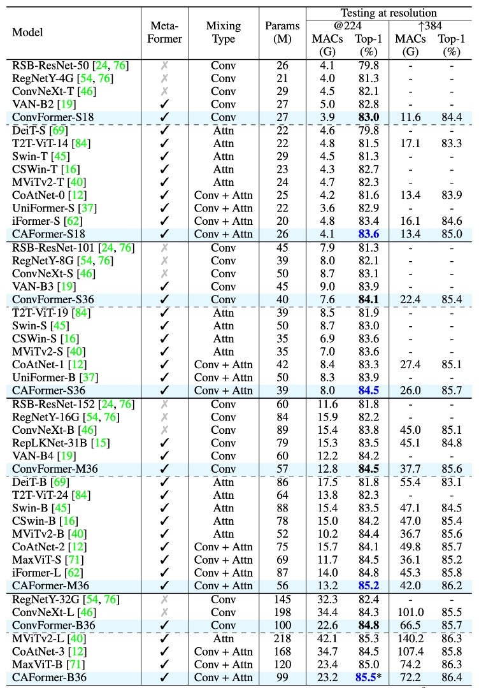

# [22.10] CAFormer

## MetaFormer 使用說明書

[**MetaFormer Baselines for Vision**](https://arxiv.org/abs/2210.13452v2)

---

作者發表了第一版的 MetaFormer 論文後，為了展示其效能，後續又再發了一篇論文。

- [**PoolFormer: 你需要的是框架！**](../2111-poolformer/index.md)

這篇論文沒有提出新的架構，而是基於上一篇論文提出的框架，向使用者展示該如何搭建模型。

我們看完以後，認為這篇論文就是 MetaFormer 的使用說明書。

## 定義問題

作者手把手的教你怎麼用 MetaFormer。

## 解決問題

### 模型架構

為了展示 MetaFormer 的效能，作者提出了四種 Token Mixer，用來檢視不同的 Token Mixer 對模型效能的影響。

1. **Identity Token Mixer**: 恆等映射，不做任何事情。
2. **Random Token Mixer**: 使用注意力機制，在初始化時隨機產生注意力圖，並凍結參數，不訓練。
3. **Conv Token Mixer**: 使用 MobileNetV2 的深度卷積來進行資訊交換。
4. **Self-Attention Token Mixer**: 使用 Self-Attention 來進行資訊交換，就是原始的 Transformer。

在模型的四個降採樣階段中，由上面四種 Token Mixer 組合出四個模型，分別是：

1. **IdentityFormer**: 全部使用 Identity Token Mixer。
2. **RandFormer**: 前兩層使用 Identity Token Mixer；後兩層使用 Random Token Mixer。
3. **ConvFormer**: 全部使用 Conv Token Mixer，這也是個「全卷積」的架構。
4. **CAFormer**: 前兩層使用 Conv Token Mixer；後兩層使用 Self-Attention Token Mixer。

### StarReLU

在本文中，作者介紹了一種名為 StarReLU 的新型激活函數。

此函數是從 Transformer 模型中常用的激活函數 ReLU 和 GELU 演變而來。

首先，傳統的 Transformer 模型中使用了 ReLU 作為激活函數，其數學表達式為：

$$
\mathrm {ReLU}(x) = \mathrm {max}(0, x)
$$

其中 $x$ 代表輸入的神經元單元，計算成本為每個單元 1 FLOP。

隨後，GPT 模型採用了 GELU 激活函數，並被許多後續的 Transformer 模型（如 BERT、GPT-3 和 ViT）廣泛採用，GELU 的近似表示為：

$$
\mathrm {GELU}(x) = x\Phi (x) \approx 0.5 \times x(1 + \mathrm {tanh}(\sqrt {2 / \pi }(x + 0.044715 \times x^{3})))
$$

其中 $\Phi(·)$ 是高斯分佈的累積分佈函數。

GELU 相比 ReLU 雖然表現更好，但其計算成本高達 14 FLOPs。

為了簡化 GELU，有研究提出用 Squared ReLU 來替代。

- [**Primer: Searching for Efficient Transformers for Language Modeling**](https://arxiv.org/abs/2109.08668)

定義如下：

$$
\mathrm {SquaredReLU}(x) = x\mathrm {ReLU}(x) = (\mathrm {ReLU}(x))^{2}
$$

Squared ReLU 的計算成本僅為每個輸入單元 2 FLOPs。

然而，研究發現 Squared ReLU 在某些圖像分類模型上的表現不如 GELU，這可能是由於輸出分佈的偏移所致。舉例來說，假設輸入 $x$ 服從均值為 0、方差為 1 的正態分佈，則

$$
\mathrm {E}\left ((\mathrm {ReLU}(x))^2\right ) = 0.5, \qquad \mathrm {Var}\left ((\mathrm {ReLU}(x))^2\right ) = 1.25
$$

為了解決這個問題，作者提出 StarReLU。

其定義為：

$$
\mathrm {StarReLU}(x) = \frac {\left (\mathrm {ReLU}(x)\right )^2 - \mathrm {E}\left ((\mathrm {ReLU}(x))^2\right )}{\sqrt {\mathrm {Var}\left ((\mathrm {ReLU}(x))^2\right )}}
$$

$$
= \frac {\left (\mathrm {ReLU}(x)\right )^2 - 0.5}{\sqrt {1.25}}
$$

$$
\approx 0.8944 \cdot \left (\mathrm {ReLU}(x)\right )^2 - 0.4472
$$

StarReLU 這種激活函數在計算中使用了較多的乘法，因此得名。

為了使其能適應不同的模型和初始化狀況，縮放因子$s$和偏移量$b$被設置為可學習的參數。

其統一表達式為

$$
\mathrm {StarReLU}(x) = s \cdot (\mathrm {ReLU}(x))^{2} + b
$$

其中 $s$ 和 $b$ 是縮放和偏移的標量，對所有通道共享。

這種形式的 StarReLU 計算成本僅為 4 FLOPs，比 GELU 的 14 FLOPs 要低得多，同時性能更好。

## 討論

### 使用基本的 Token Mixer

:::tip
在上表中的 PoolFormerV2 和 V1 比起來沒有差異。但為了和其他架構一起比較，作者應用了有別於 V1 的訓練技巧和方式，因此特別加了 V2 作為區別。
:::

1. **IdentityFormer 表現**

   - **小型模型**
     - IdentityFormer-S12: 效能優於 RSB-ResNet-18 4.0%
     - IdentityFormer-S24: 效能優於 RSB-ResNet-34 2.7%
   - **擴大模型尺寸**
     - IdentityFormer-M48: 73M 參數，12G MAC，達到 80.4% 準確率
     - 比較：RSB-ResNet-50 的準確率為 79.8%

2. **RandFormer 表現**

   - **使用隨機混合器替換前兩個階段的 Token Mixer**
     - RandFormer-S12: 準確率 76.6%，超過 IdentityFormer-S12 2.0%
     - RandFormer-M48: 準確率 81.4%，超過 IdentityFormer-M48 1.0%
   - **中型和大型模型**
     - RandFormer-M36: 準確率 81.2%，接近 RSB-ResNet-101 的 81.3%

MetaFormer 框架在性能方面展現了穩定的下限，當模型的參數數量和 MAC 與 IdentityFormer-M48 相似時，其準確率不會低於 80%。這顯示了即使在特定條件下，MetaFormer 仍能保證令人滿意的效能。

RandFormer 的測試結果顯示了 MetaFormer 與各種 Token Mixer 的良好兼容性。這表明，使用不同的 Token Mixer 時，MetaFormer 依然能夠保持出色的性能。然而，與具有池化基礎 Token Mixer 的 PoolFormerV2 相比，IdentityFormer 和 RandFormer 的性能仍有差距。

IdentityFormer 的效能較差是可以理解的，因為直接映射並不進行任何 Token 混合，導致其性能不如其他模型。而 RandFormer 和 PoolFormerV2 之間的性能差距則可能是由於池化的局部歸納偏差所引起的。這些差異進一步強調了 Token Mixer 在模型性能中的重要性。

### 使用常見的 Token Mixer

1. **ConvFormer 與 CAFormer 架構**

   - ConvFormer 使用 MobileNetV2 中的可分離卷積作為 Token Mixer。
   - CAFormer 在底部兩個階段使用可分離卷積，在頂部兩個階段使用普通自注意力構建。

2. **ConvFormer 表現**

   - **ConvFormer 明顯優於強大的 CNN 模型 ConvNeXt。**

     - 參考資料：[**ConvNeXt**](../../classic-cnns/2201-convnext/index.md)
     - ConvFormer-B36（100M 參數，22.6G MAC）在 224\*224 解析度下比 ConvNeXt-B（198M 參數，34.4G MAC）高出 0.5% 的 top-1 精度，且只需 51% 的參數和 66% 的 MAC。

   - **ConvFormer 的表現優於多種基於注意力的強模型或混合模型。**
     - ConvFormer-M36 的參數比 Swin-B/CoAtNet-2 更好 1.0%/0.4%，參數減少 35%/24%，MAC 減少 17%/18%。

3. **CAFormer 表現**

   - CAFormer 在 ImageNet-1K 上創下新紀錄，224\*224 解析度下的 top-1 準確率達到 85.5%。
   - 在 ImageNet-21K 上預訓練時，ConvFormer-B36 和 CAFormer-B36 的表現分別提高到 87.0% 和 87.4%，相比 ImageNet-1K 訓練的結果準確率提高了 2.2% 和 1.9%。
   - CAFormer 一直優於不同大小的其他模型，顯示出優異性能。

ConvFormer-B36 的參數比 ConvNeXt-L 優越 0.2%，同時參數減少 49%，MAC 減少 34%。這表明，MetaFormer 框架在效能和資源使用方面具有明顯優勢，即便僅配備「老式」的 Token Mixer，ConvFormer 和 CAFormer 已經取得了令人矚目的效能。

### 消融實驗

1. **激活函數的影響**

   - **使用 StarReLU 替換 ReLU**
     - ConvFormer-S18：效能從 83.0% 降至 82.1%。
     - CAFormer-S18：效能從 83.6% 降至 82.9%。
   - **使用 Squared ReLU 替換 ReLU**
     - 效能令人滿意，但不及 GELU。
   - **使用 StarReLU 替換 GELU**
     - ConvFormer-S18 和 CAFormer-S18 準確率分別提高 0.3% 和 0.2%。
     - 減少 71% 的激活 FLOP。

2. **StarReLU 變體的應用**

   - 預設使用具有可學習尺度和偏差的 StarReLU，適用於不同模型和初始化。

3. **其他技術的影響**

   - **ResScale**
     - 在分支輸出縮放技術中表現最佳。
   - **停用每個區塊的偏差**
     - 對 ConvFormer-S18 無影響。
     - 對 CAFormer-S18 提升 0.1% 的效能。

## 結論

作者在這篇論文中展示了 MetaFormer 的效能，並提供了幾個結論：

1. **MetaFormer 確保穩定性能**

   使用直接映射作為 Token Mixer 的 IdentityFormer 模型，在 ImageNet-1K 上的準確率超過 80%。表明即使在基本配置下，MetaFormer 仍能提供強大的性能。

2. **MetaFormer 與任意 Token Mixer 的良好搭配**

   使用隨機矩陣作為 Token Mixer 的 RandFormer 模型，準確率超過 81%，優於 IdentityFormer。表示在採用新 Token Mixer 時，MetaFormer 的結果仍然值得信賴。

3. **MetaFormer 輕鬆達到最先進結果**

   使用深度可分離卷積作為 Token Mixer 的 ConvFormer，表現優於強大的 CNN 模型 ConvNeXt。CAFormer 透過在底部階段使用深度可分離卷積，在頂部階段使用自注意力機制，在 ImageNet-1K 上創下新紀錄，224 × 224 解析度下，普通監督訓練的 top-1 準確率達到 85.5%。

4. **新激活函數 StarReLU**

   與常用的 GELU 相比，StarReLU 減少了 71% 的激活 FLOPs，且性能更佳。StarReLU 是 Squared ReLU 的變體，專注於減輕分佈偏移問題，預期在 MetaFormer 類模型和其他神經網絡中有很大的應用潛力。

MetaFormer 展現了實現最先進性能的巨大潛力，隨著先進的 Token Mixer 或訓練策略的引入，預期類似 MetaFormer 的模型性能將持續創下新紀錄。
