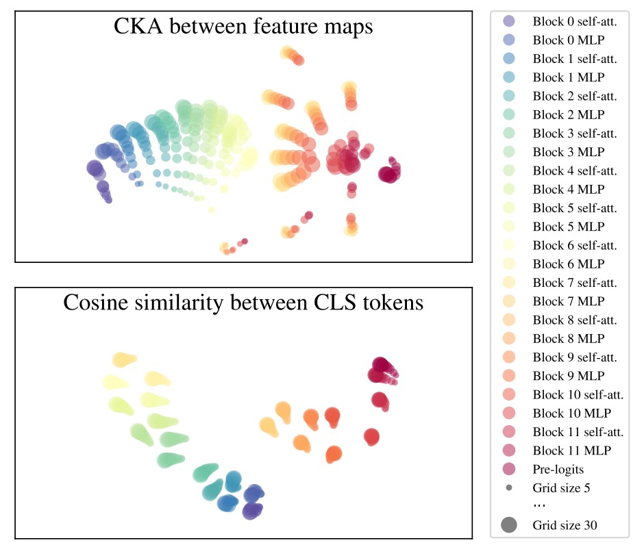
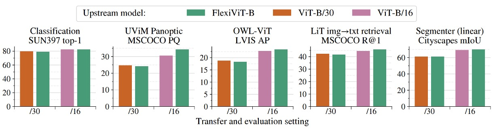
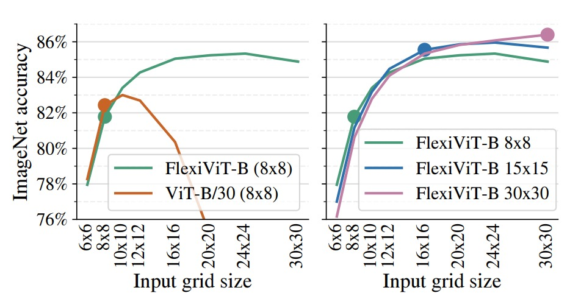

## 自由的 Patch Sizes

[**FlexiViT: One Model for All Patch Sizes**](https://arxiv.org/abs/2212.08013)

---

今天來看看 Google Research 的作品。

## 定義問題

<div align="center">
<figure style={{"width": "60%"}}>

</figure>
</div>

Vision Transformer（ViT）的興起，象徵一種視覺表示方式的典範轉移。

將影像切分為固定大小的 patch，再透過 self-attention 處理整體關係，而非依賴傳統 CNN 的卷積濾波器。

可是這場革命背後的一個關鍵設計 Patch Size 卻長期被視為固定的超參數：

> **為什麼沒有人挑戰 Patch Size 的設計呢？**

作者在這篇論文中指出了一個悖論：

- Patch size 可明顯改變模型的運算成本與分類性能。
- Patch size 卻無法在不重新訓練模型的情況下進行調整。

所以，為了給 ViT 帶來更高的資源適應能力與遷移潛力，我們是否有辦法：

> **以「同一組參數」支援「多種 patch size」呢？**

## 解決問題

<div align="center">
<figure style={{"width": "80%"}}>

</figure>
</div>

看完這份演算法實作，我們又看完一篇論文了！

我們逐行看看。

### 隨機 patch size

```python
1 model = ViT(...)
2 for batch in data:
3     ps = np.random.choice([8, 10, ..., 40, 48])
4     logits = model(batch["images"], (ps, ps))
5     # [...] backprop and optimize as usual
```

這五行，定義了 FlexiViT 最核心的訓練行為：

- 第 3 行：每個 batch 開始前，隨機選定一組 patch size `ps`
- 第 4 行：將這個尺寸傳入模型，進行前向傳播
- 第 5 行：標準反向傳播，不需額外改動

這種隨機 patch 訓練（patch-wise randomization）的策略，讓模型在訓練過程中暴露於多種 token 長度、多種位置編碼與不同運算負載的上下文，從而學會在跨尺寸條件下保持穩定預測能力。

### 模型內部動態重組

```python
7 class ViT(nn.Module):
8     def __call__(self, image, patchhw):
9         # Patchify, flexibly:
10        w = self.param("w_emb", (32, 32, 3, d))
11        b = self.param("b_emb", d)
12        w = resize(w, (*patchhw, 3, d))
13        x = conv(image, w, strides=patchhw) + b
```

這段程式碼處理的是 ViT 最初的 patch 嵌入部分，對應 ViT 原始架構中的 `Conv2d(patch_size, d)`：

- 第 10 行：預設建立一組 **32×32** 的 patch embedding 權重 `w`
- 第 12 行：根據當前的 patch size，對 `w` 進行動態重縮（resize）
- 第 13 行：使用重縮後的 `w`，以 stride 為 `patchhw` 的卷積方式 patchify 影像

換句話說，**patchify 的邏輯從靜態變成了動態**。

我們不再需要為每個尺寸訓練一套 embedding，現在只需一組核心參數，再透過重採樣（PI-resize 或雙線性）即可對應所有尺寸。

### 可縮放的位置編碼

```python
14        # Add flexible position embeddings:
15        pe = self.param("posemb", (7, 7, d))
16        pe = resize(pe, (*x.shape[1:3], d))
17        return TransformerEncoder(...)(x + pe)
```

位置編碼的處理方式完全類似 patch embedding：

- 預設一個 7×7 格式的 `posemb`
- 根據當前 token grid（由 `patchhw` 決定）即時縮放為相符大小
- 將其加到 `x` 上，再送入後續 Transformer encoder

這代表位置語意不再綁定特定尺寸，而是能 **隨 token 長度彈性對應空間結構**，同時保有原生 ViT 的 self-attention 設計與下游相容性。

### 如何正確調整的尺寸？

:::tip
這一段非常重要，不能跳過！
:::

**在支援多種 patch size 的過程中，最容易忽略的一點，是 patch embedding 權重與輸入 patch 間的內積關係如何隨尺寸變化而變形。**

假設我們的輸入 patch 為 $x \in \mathbb{R}^{p \times p}$，對應的 patch embedding 權重為 $\omega \in \mathbb{R}^{p \times p}$。

在標準 ViT 中，token 的生成來自於兩者的內積：

$$
e = \langle x, \omega \rangle
$$

但若我們將 $x$ 與 $\omega$ 都用雙線性插值放大成 $2p \times 2p$，則新的內積會變成：

$$
\langle \text{resize}^{2p}_{p}(x), \text{resize}^{2p}_{p}(\omega) \rangle \approx \tfrac{1}{4} \langle x, \omega \rangle
$$

也就是說，token 的範數會隨尺寸改變而縮放，導致語意不穩定。

這樣的 scale shift 不僅會干擾訓練，也會讓模型失去跨 patch size 的泛化能力。

如果想要一致，就得讓兩個 token 的內積結果相等，目標是：

- **即使 patch 與 embedding 都被 resize，仍能維持原來的 token 意義。**

$$
\langle x, \omega \rangle \overset{?}{=} \langle Bx, \hat{\omega} \rangle
$$

其中 $B$ 是 bilinear resize 可表示的線性映射矩陣：

$$
\text{resize}^{p^*}_{p}(o) = B^{p^*}_{p} \cdot \text{vec}(o)
$$

為了解決這個 mismatch，作者提出一種 **數學上更一致的權重變形方式**：

- **Pseudo-Inverse Resize（PI-resize）**。

公式如下：

$$
\hat{\omega} = \arg\min_{\hat{\omega}} \mathbb{E}_{x \sim X} [\left( \langle x, \omega \rangle - \langle Bx, \hat{\omega} \rangle \right)^2]
$$

當 $p^* \geq p$ 時，可以透過廣義反矩陣（pseudo-inverse）解出：

$$
\hat{\omega} = P \omega
$$

其中：

$$
P = (B^\top B)^{-1} = (B^\top)^+
$$

這樣一來，對於任何 $x$，都有：

$$
\langle x, \omega \rangle = \langle Bx, \hat{\omega} \rangle
$$

也就是說，**token embedding 內積完全一致。**

:::info
上述推導依賴於「無資訊損失」的 resize，適用於 upsample 的情境。

當是 downsample（$p^* < p$）時，則需根據 $x$ 的統計分布近似最小誤差解，例如 $x \sim \mathcal{N}(0, I)$ 時也能得到同樣解。
:::

在下圖中，作者以 ViT-B/8 為基準模型，將 patch embedding 與輸入圖像一同 resize，再觀察精度變化。

<div align="center">
<figure style={{"width": "80%"}}>

</figure>
</div>

幾種方法比較如下：

- **Vanilla resize**：直接雙線性插值
- **Norm heuristic**：token embedding 後進行固定範數正規化
- **Area heuristic**：依據面積縮放係數進行重標定
- **PI-resize**：透過數學推導進行內積等價調整

結果顯示 PI-resize 是唯一在 upscale 下幾乎不掉準確率的方法；在 downscale 情況下，PI-resize 的性能也最穩定、最不劇烈震盪。

### FlexiViT 的表徵世界

FlexiViT 的設計初衷，是希望在多種 patch size 下維持穩定預測能力。

但這其實還有一個更底層的問題值得追問：

> **模型在內部學到的表徵（representation），是否在不同 patch size 下仍保持一致？**

作者為了檢視 FlexiViT 的表徵穩定性，使用了常見的表示比較方法：

- **CKA（Centered Kernel Alignment）**：用來衡量神經網路中各層輸出的相似度
- **Arc-Cosine + t-SNE**：為了將相似度轉換為距離度量，再進行視覺化

透過這些技術，作者觀察了不同 patch size（例如 grid size = 5, 10, 30）下，FlexiViT 在各層所產生的 feature maps 是否具有一致性。

根據下圖，幾個關鍵發現如下：

<div align="center">
<figure style={{"width": "80%"}}>

</figure>
</div>

- **前段穩定**：從第 0 ~ 6 層的 MLP 之前，無論 patch size 為何，各層的表徵相當一致
- **中段震盪**：在第 6 層的 MLP，出現明顯的分歧，不同 grid size 產生的表示彼此分離
- **末段重聚**：最後幾層（特別是第 11 層）逐漸拉回一致
- **CLS token 穩定**：雖然 patch token 會根據 grid size 改變分布，但整體分類輸出的 CLS token 表徵，在不同尺寸下始終高度對齊

這項分析揭示了一個有趣現象：

FlexiViT 並非將不同尺寸的輸入「硬壓縮成一模一樣的表示」，而是讓中間層在不同解析度下**形成各自適應的處理路徑**，但**最終又能對齊分類輸出**

這也間接說明了為什麼它能成功支援多種 patch size 的原因：

> **模型學會了「怎麼走不同的路，最後回到相同的終點」。**

## 討論

受限於文章篇幅，我們不會把所有的實驗圖表通通放上來。

以下我們選一些精彩片段來看一下，如果讀者對其他實驗有興趣，請參閱原始論文。

### 跨任務總覽

<div align="center">
<figure style={{"width": "90%"}}>

</figure>
</div>

上圖展示了 FlexiViT 在多項下游任務中的轉移表現，涵蓋圖像分類、語意分割、圖文檢索與開放詞彙物件偵測等典型應用。

實驗中，作者將一顆預先訓練好的 FlexiViT‑B 分別以固定的 patch size（/16 與 /30）進行微調與推論，並與兩個對應 patch size 預訓的 ViT‑B 模型進行比較。

結果顯示，FlexiViT 的整體表現與個別訓練的 ViT 相當甚至略優，尤其在使用較小 patch size（/16）時，準確率略微領先；而在較大 patch size（/30）下，則僅有 0.2 至 0.4 個百分點的差距，可視為在誤差範圍內持平。

這代表 FlexiViT 並未因為多尺寸適應能力而犧牲預測品質。

更重要的是，這樣的表現是由一組單一權重完成的。

在傳統作法中，若要同時支援多種資源限制或任務場景，往往需要個別訓練多顆 ViT 模型。相比之下，FlexiViT 提供了一個更具實用性的方案：在不降低效能的前提下，顯著簡化了模型維護與部署成本。

換句話說，對於需要在「高效能」與「省資源」之間動態切換的應用場景，一顆 FlexiViT 就足以取代多顆 ViT，成為單一骨幹、統一部署的合理選擇。

### 快速轉移與推論彈性

<div align="center">
<figure style={{"width": "70%"}}>

</figure>
</div>

上圖呈現了 FlexiViT 在實務部署場景中一個極具價值的特性：

- **能夠在低運算成本下完成微調，並於推論階段使用更高解析度取得更佳效能。**

實驗中，作者將 FlexiViT‑B 與 ViT‑B/30 皆僅以 8×8 的 grid size 在 ImageNet‑1k 上進行微調，之後於不同 grid 下進行測試。

結果顯示，標準的 ViT‑B/30 一旦脫離原始訓練尺寸，準確率便迅速下滑；而 FlexiViT 則相反，從 8×8 提升至 24×24 時，Top‑1 準確率不減反升，整整提升了 3.5 個百分點（從 81.8% 增至 85.3%）。

右圖進一步比較了同一顆 FlexiViT‑B 模型，分別在 8×8、15×15 與 30×30 三種 grid size 下進行微調，再橫跨不同 grid 測試其表現。

結果顯示，無論最初訓練於哪個尺寸，該模型皆能在更高解析度下穩定獲益，呈現一致上升的效能曲線。

這項特性帶來一種全新的模型運用策略：**我們可以選擇在資源有限的場景中以粗粒度進行快速微調，而後在推論階段再動態切換至細粒度，換取更高的辨識精度。**

對於需支援多種計算資源、進行 A/B 測試或動態調參的系統而言，這種「訓練成本低、推論彈性高」的特性，無疑為部署提供了更大的操作空間與實務價值。

### 開放詞彙物件偵測

<div align="center">
<figure style={{"width": "50%"}}>

</figure>
</div>

作者將 FlexiViT 應用於開放詞彙物件偵測任務，具體做法是將其作為影像編碼器，接入 OWL‑ViT 偵測框架，並與固定 patch size 的 ViT‑B/16 與 ViT‑B/30 進行比較。

此處所採用的基準資料集為 LVIS，具備極高類別多樣性與長尾分布，特別適合作為 zero-shot 偵測任務的測試場景。

結果顯示，Flexi OWL‑ViT（使用具彈性的 B/flexi backbone）在所有評估 patch size 下的平均精度（AP）皆不低於固定骨幹版本。

在高解析度設定（如 /24 與 /30）時，甚至比對應的 ViT‑B/30 多出 2–3 個百分點，顯示出其在解析度提高時所具備的泛化潛力。而在低解析度（如 /12 或 /16）下，FlexiViT 的表現也毫無退化，維持穩定準確率。

這樣的特性，對於開放詞彙偵測任務而言特別重要。

由於不同場景中的物體大小差異極大，最佳的 patch size 並非固定不變；有時需要高解析精細定位，有時則偏好大範圍粗略感知。

FlexiViT 提供了彈性 patch 編碼的能力，使得模型能根據輸入圖像特性與運算資源，調整解析度而無需重新訓練，為 open-world 任務帶來更實用的適應性與部署效能。

### 時間就是算力

<div align="center">
<figure style={{"width": "50%"}}>

</figure>
</div>

最後，作者探討了一個額外但極具價值的方向：

- **使用彈性 patch 訓練機制來加速 ViT 的預訓過程。**

上圖中比較了兩種設定在 ImageNet‑21k 上的預訓練表現：一是傳統的 ViT‑B/16，以固定 patch size 持續訓練；另一則是 (Flexi)ViT‑B/16，透過不同的 patch size 組合，循序調整訓練策略。

從橫軸的 TPU core-hours 來看，在相同算力預算下，FlexiViT 系列在幾乎所有時段皆維持更高的精度；特別是在約 400 小時處，與標準模型相比，表現提升可達 1 個百分點。而若將訓練時間拉長，這種差距仍然存在，甚至略有擴大。

這種訓練法背後的邏輯近似一種動態課表設計：

**初期使用大 patch size（計算快、語意粗），幫助模型快速建立語義架構；後期逐步過渡到細 patch size，讓模型補上細節與辨識能力。**

結果不僅是模型學得快，也學得穩。

實務上，這種設計可視為對現有 ViT 預訓流程的即插式加速方案。即使最終模型目標仍是單一 patch size，也能透過多尺寸訓練課程縮短收斂時間、提升 early-stage 性能，讓 FlexiViT 的「彈性」價值不僅體現在推論階段，也進一步延伸到訓練效率與資源利用率的優化上。

## 結論

FlexiViT 展現了一種簡潔而有效的策略，讓我們得以用一顆模型，橫跨不同運算需求與解析度需求之間的取捨。

它並未引入額外的複雜架構，而是回到 ViT 的根本設計：**patchification**，從中挖掘出調節計算與語意表達的關鍵參數。

透過隨機 patch size 訓練、PI-resize 權重重組，以及知識蒸餾的精準引導，FlexiViT 在各種下游任務中皆表現穩定，無論是圖像分類、語意分割，還是開放詞彙偵測與多模態檢索，都能以單一骨幹支援多樣場景。

FlexiViT 邀請我們重新思考 patchification 的角色，或許之後我們可以看到更多的創意應用，從 token 編碼到結構壓縮，從多尺度融合到資料驅動調度，都是可能的方向。
